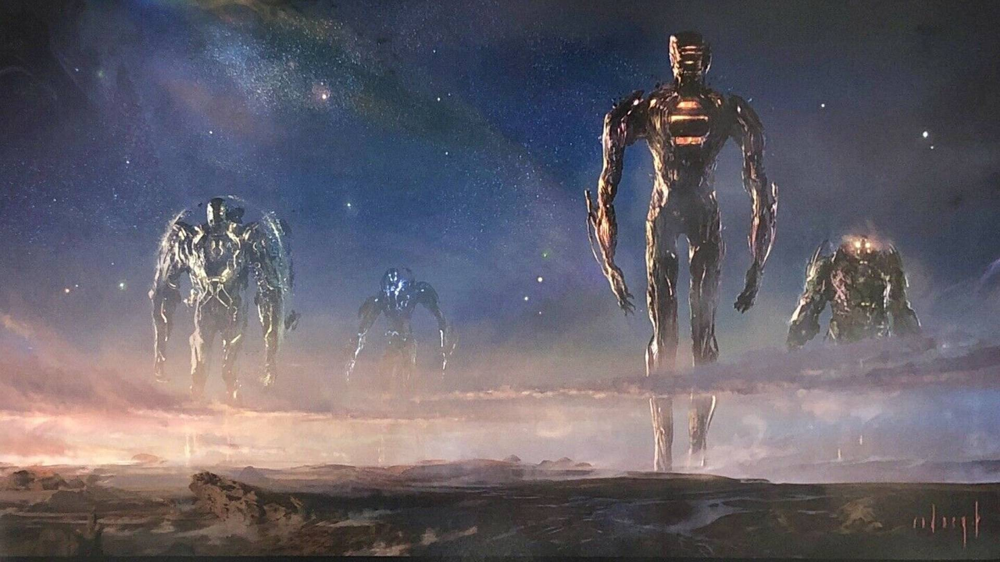

The following are my **three** favorite jokes ever.

I don't know the authors, but they must have been some godlike creatures.

### Number 3

A cop pulls over a car. The driver is quantum physicist **Werner Heisenberg**.

"Sir," the cop asks. "Do you know how fast you were going?"

"No, but I know exactly where I am!"

### Number 2

At the stadium during the World Cup's final, a man notices that the seat next to his neighbor is empty.

"Weird," he tells the neighbor. "Who buys a ticket to the World Cup's final and then does not show up?"

"Ah, that would be my **wife**. We planned this dream holiday to see the World Cup a few years back, but then she sadly passed away."

"I'm... I'm so sorry! This must be terrible! Are you ok? Shouldn't a friend or a relative be with you today?"

"I wish, but they are attending the funeral."

### Number 1

Two British **nuns** are riding their bicycles around Vatican City.

"Wow," says one. "I never came this way before."

"Yeah, I know. It's the cobblestones."
