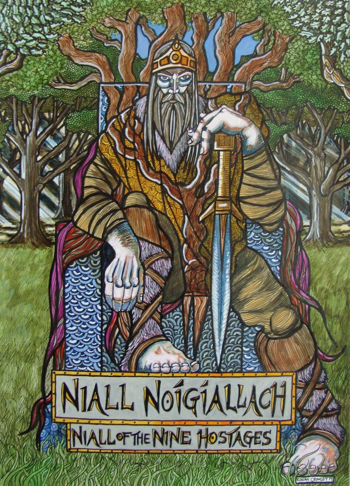

I have finally done the DNA test that is so hip these days and just got the results. This means that now all those podcast ads have no power over me. That is, unless I need to repeat the test every few years in case my DNA has changed, which kinda makes sense, actually.

Before discussing the results, in case you are interested in doing the same, please read the instructions carefully and understand that it’s only your saliva that they need. Don’t make the same mistake I made!

## The results

Turns out I’m almost entirely Sicilian, which was to be expected, but it’s still cool to put a percentage to my level of gangsta.

Then there are a few tablespoons of Africa, which makes sense, as my family used to live so close to the southern border that you just needed a well pointed gust of wind from the dunes to have your DNA altered. Of course, this on the assumption that the wind is carrying DNA, which is disgusting to think.

Sadly, I’m only 0.4% Ashkenazi Jew, so I watched all those Woody Allen movies for nothing.

My Viking percentage is exactly 0%, which means that my red hair has to be dyed.

Finally, I have 264 genetic variants that can be traced to the Neanderthals. This should explain the snoring.

## My extended family

My genetic relatives seem to be almost entirely located in the US, you'd think. Though, this is actually the result of bias in the data, as most of the people that did this test are Americans.

I like that I have 3 fifth cousins in Hawaii. Although, what even is a fifth cousin? Is Kevin Bacon everyone's fifth cousin?

## Is my mom a whore?

Looks like I have ancestry in common with Niall Noígíallach, also known as Niall of the Nine Hostages, an Irish king from the 4th century known for his fetish for hostages, I'm guessing. So I instantly called my mother, demanding explanations.

Speaking of which, my maternal haplogroup is X2, which is traced back to a woman who lived during the peak of the Ice Age approximately 19,000 years ago, somewhere in the Middle East or the Caucasus region of western Eurasia. As the climate warmed, and the massive continental glaciers covering much of the Northern Hemisphere began to retreat, people on the X2 branch joined a rapid northward expansion into the previously ice-covered zone.

My paternal haplogroup is R-P311, which is basically an Evangelion unit.

## Am I a whore?

Now some details on my health predisposition that, I’m sure, the ladies will appreciate.

I have a slightly increased chance of developing Celiac Disease, which shows that I come from a family of inbreads. (I am very sorry.)

I have a slightly increased chance of developing late-onset Alzheimer’s Disease.

I have a slightly increased chance of developing late-onset Alzheimer’s Disease.

I have no specific predisposition in developing cancer, which grants me a golden opportunity in the nuclear waste disposal sector.

Random trivia now. This is not going to be in the final exam. I can totally smell asparagus in my pee.

Coriander tastes like soap to me. Though, strangely enough, soap does not taste like coriander, it tastes like zucchini.

Of course, since my DNA is now in a database, this means I can hardly murder somebody and hope not to get caught. So that ship has sailed for me. Hum, unless I GDPR their asses. 😏
