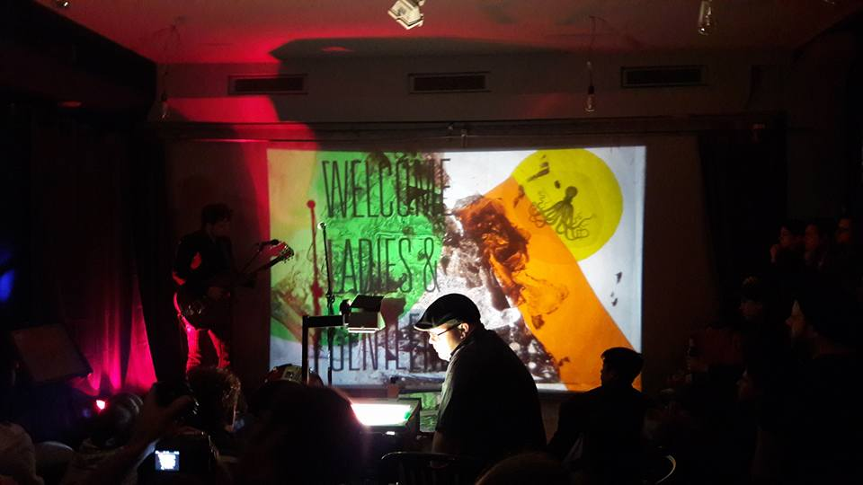

**800A** is a cool English comedy bar in Berlin. But what a peculiar name, right?

During the nineties in Palermo, Sicily, people used to spam the walls of the city with the tag **SUCA**, pronounced **SOOKA**, which means, well, **SUCK IT**.

To cover such an obscenity, god-fearing citizens took on the task of altering the word. The S turned into an 8 and the UC letters were closed to become OO. A was too difficult to change.

As a result, lots of **800A** tags could be found around the city. And of course, everybody knew what the underlying message was, so the cover became in itself the message. People started tagging 800A directly, t-shirts were made and children were named.

There you go, you are welcome for the idea of your next tattoo.

<a href="https://www.800aberlin.com" target="_blank">800aberlin.com</a>

