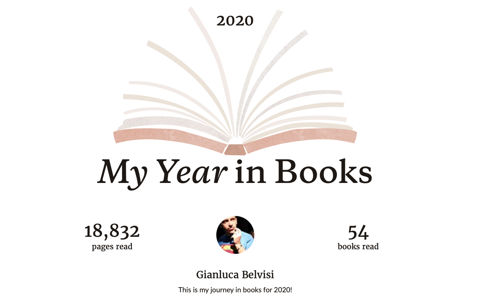
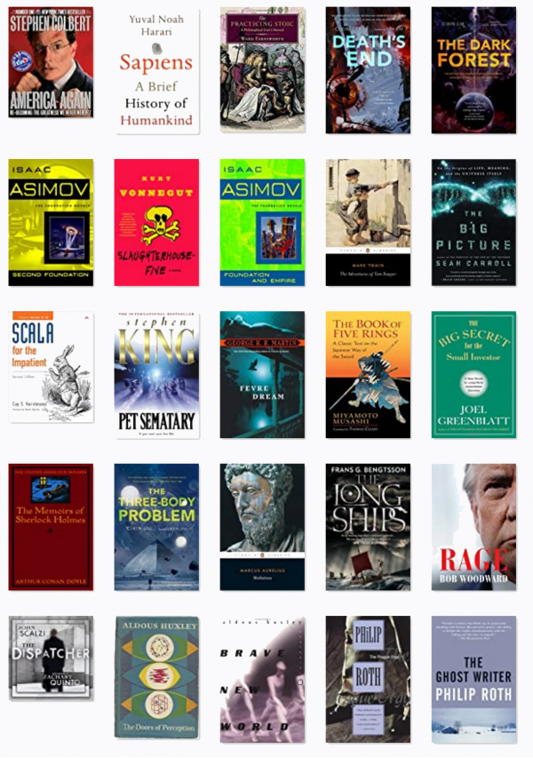
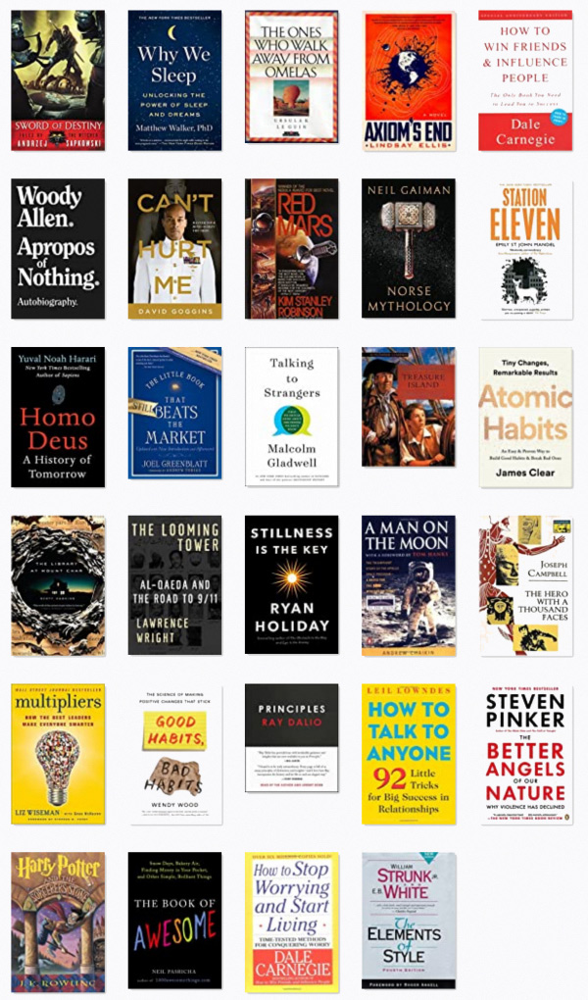
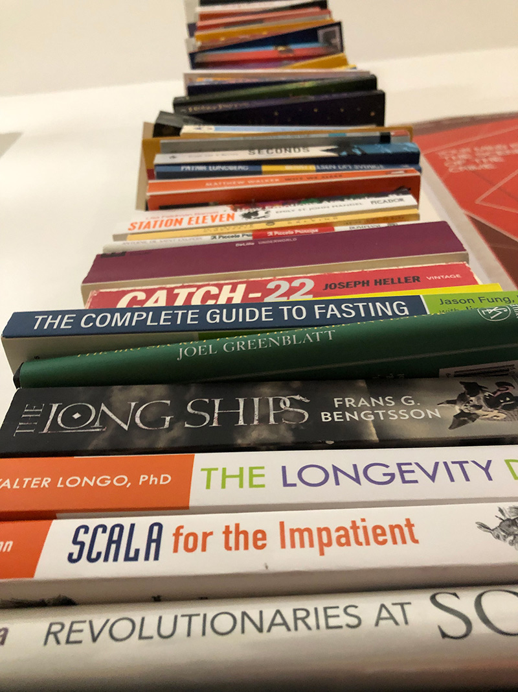
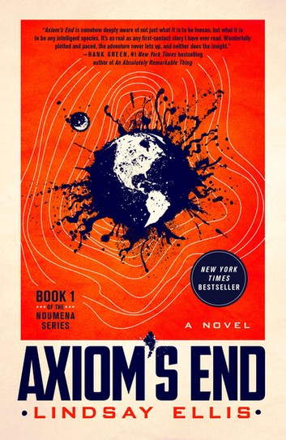
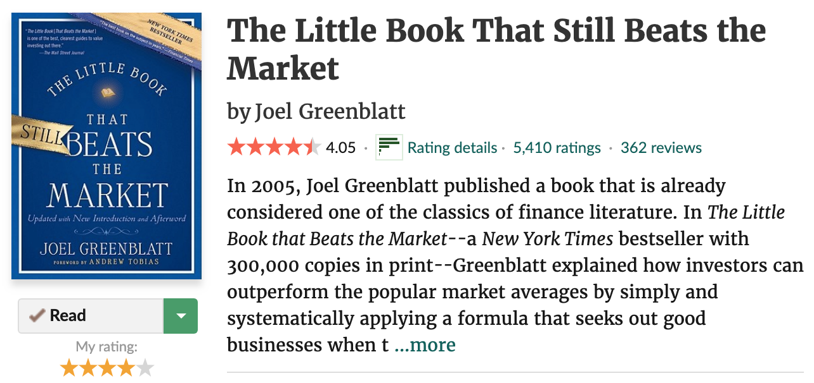
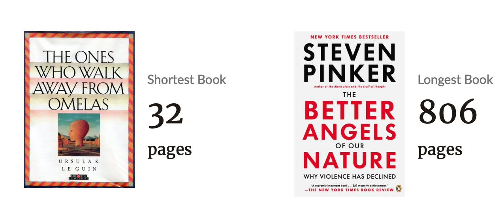

Twelve months ago on New Year's Eve I gave myself a steep milestone for 2020, to read at least one book per week, and I did it for a simple reason: I was drunk.

As it turns out, I exceeded the target with a few days left for a victory lap, and I have the pandemic to thank, so there's a silver lining!

[Here](https://www.goodreads.com/user_challenges/20994784) the complete list.

Now, at the tail end of this, am I a smarter person? I don't think so!

But am I possibly better at concealing my dumbness? I don't think so either!

Was it worth it, though? I'm not sure. I haven't checked, but I'm pretty confident that more than 54 books were released this year alone, so there is no chance of catching up, and we are all playing a losing game.

## What I didn't read

No, I didn't read **Ready Player Two** because I care for my dignity.

No poetry this year. I will make amends in 2021 because I want to understand how red are those roses and blue the violets.

I didn't list the comics I have read because comics are not real books.

*(quickly leave the room)*

*(hop on car)*

*(tires screetching)*

## What I did read

I really enjoyed **Axiom's End**, by Lindsay Ellis. It's a sort of Three-Body Problem, "For Her 💋"

By the by you should probably read the [Three-Body Problem](https://www.bookdepository.com/The-Three.../9781784971571) trilogy before it's ruined by the Game of Thrones guys.

Speaking of George RR Martin, I thought that [Fevre Dream](https://www.bookdepository.com/Fevre.../9780553577938) was excellent. It's about vampires on steamboats, which are words you never think of seeing accosted.

Some stock investing books are there because of my ongoing project to obtain *fuck you money*. At the moment I have *I kinda like you money*.

## Bottom line

It's incredible how the shortest book I've read is the one that's sticking with me the longest, and the longest one I've read is the one that can be more succinctly summarized in "things are better these days"
