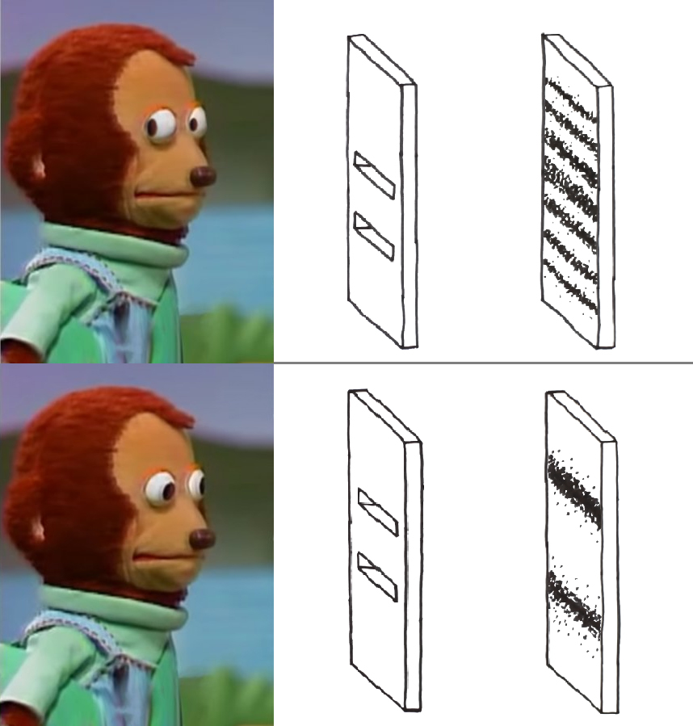
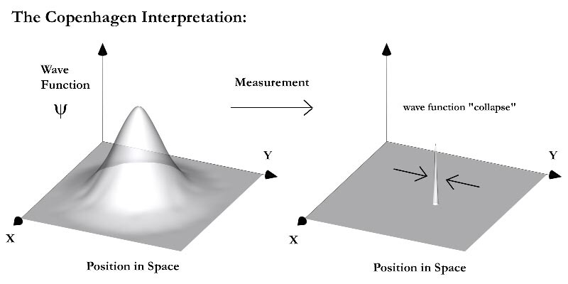
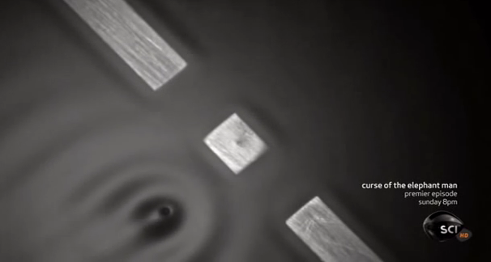
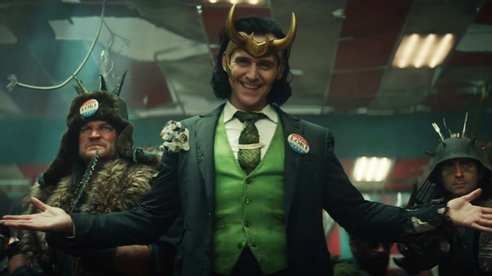
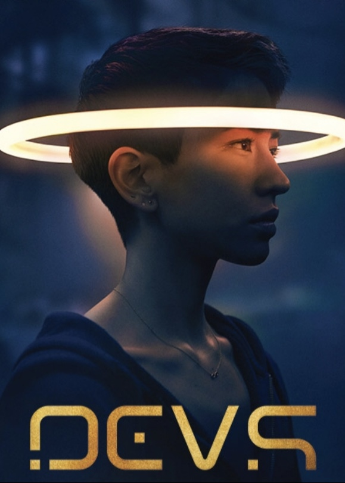

If you are anything like me, you are obsessing over quantum mechanics.

You are spending your social distancing days trying to solve the double-slit experiment, possibly in its 'delayed choice quantum erasure' variant, which trolls us by showing that Reality is broken, and I don't know why we as a Society are not investing all of our resources in solving the mystery.

So, what is the solution to the experiment?

Maybe we should follow the **Copenhagen Interpretation**, that simply says don't think about it. Are you still thinking about it? I told you do stop! By merely thinking about it, you are collapsing the wave function. It's like starting hot water in the sink while people are showering!

Or maybe we should all reconvene under the **Pilot Wave Theory**, which removes probability from the picture because probability is weird, and it makes our noses bleed. What remains is particles being carried by waves. Yes, exactly: surfer particles! 🌊🏄🏽‍♂️

Or should we go for the **Many Worlds Interpretation**, explaining that every time we experiment, we are splitting the universe in two, which is bonkers, but it also kind of makes sense as we are living in weird times, possibly the result of too many splits?

As Richard Feynman said: *"I cannot define the real problem, therefore I suspect there is no real problem, but I'm not sure that there is no real problem."*

If all this is not alien to you, you should watch **Devs**.

**Devs** is a mini-series airing on Hulu / HBO  / Torrent, written by Alex Garland, the guy that did Ex Machina, Annihilation, and more importantly The Beach.

It contains all the above, plus Nick Offerman, Jesus, Russians spies, and the truth about the Kennedy assassination (it was Oswald).

Ultimately, it answers the ultimate question: do we have free will or are we living in a deterministic world?

Or is it worlds?

The whole show plays out as a superb **Black Mirror** episode. It's elegant and well acted and shot. It also doesn't hold your hand, so if you are easily distracted by Pinterest, or you are not into quantum mechanics because you are more of a Newtonian, well at least you can appreciate the good score.

A final comment about the title: **Devs**.

It's kind of a shitty title, isn't it? Seems like yet another silicon valley sit-com. Why would a deeply philosophical show like this one choose such a generic name?

Turns out there is a pretty good reason, but maybe you want to discover it for yourself...

<Spoiler>

In one of the later episodes, the protagonist mentions that he gave the name Devs to the quantum computer that is the MacGuffin of the whole story as a sort of inside joke, as the letter v in the name has to be pronounced as if was in Latin.

And I'm like hum, so is it Defives? What does it even mean?!

Turns out he meant that the v is a u. Deus.

And I'm like ah ok that makes more sense and tbqf not a bad title. Sorry for not believing in Devs!

</Spoiler>

## References

I'll add some reference as if this was some research paper and shit...

### Quantum mechanics

If you want to know more about quantum mechanics, [this](https://www.bookdepository.com/Something-Deeply-Hidden-Sean-Carroll/9781786078360?ref=grid-view&qid=1635616429285&sr=1-2) is a great entry-level read.

### The double-slit experiment

<YouTube source="A9tKncAdlHQ"/>

### The delayed choice quantum erasure experiment

<YouTube source="8ORLN_KwAgs"/>

Now that you have watched these videos, your YouTube algorithm will suggest more quantum theory content and less Toss a coin to your Witcher covers, which was the ultimate goal.

### Correction

Hello this is Gianluca from the future. Turns out that quantum erasure experiment is kinda bullshit, as wonderfully put by Sean Carrol in his [blog](https://www.preposterousuniverse.com/blog/2019/09/21/the-notorious-delayed-choice-quantum-eraser/). This means that Reality is not broken. I repeat: Reality is not broken.

