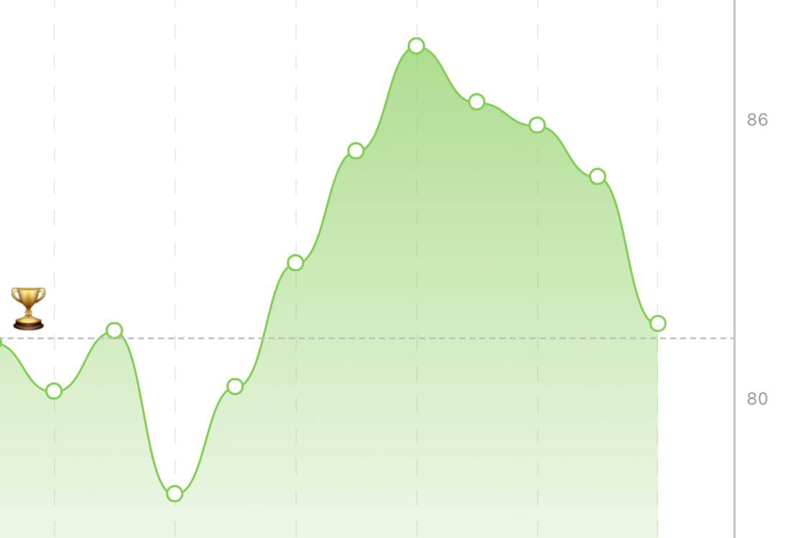

Since last March, I've gone through a training and eating program that has leveled me up to the rank of Semi-Moron.

As for many great things in life, the program will end this week, and I would like to share a few pearls of wisdom with you, here on this magical website, and all for free!

[paypal.me/gianlucabelvisi](paypal.me/gianlucabelvisi)

Ok, first and foremost, the best method for gaining or losing weight is...

*(wait for it)*

Ketogenic diet.

Nah, I'm messing with you; it's counting macros!

Look at the picture. By controlling the daily amounts of carb, fat, and protein intake, I quickly gained weight during the bulk phase, even though I didn't reach the optimal target of 91 kg because I could not stomach (pun intended) the upper limit of 4000 daily calories.

Then, during the cut phase, I did appreciate a steady weekly decline in weight basically on par with the program's expectations -- even when I was in Italy! 😮 -- as if this wasn't at all ruled by Chaos, which is incredible, I know.

<Question>Yeah, nice and all, but I don't want to diet!</Question>

Good for you! I think that 'diet' is a terrible word. Remove a t and you get **die**, which is German for **the**!

Seriously, **diet** implies 1) sacrifice for a 2) limited time. This is *not* ok. We should instead use **eating habits** and strive to find a way of putting food in our faces that doesn't jeopardize our health and won't make us feel freaking miserable.

<Question>But wait, what if I like pizza because I'm from Naples or something?</Question>

Count the macros, and you can eat pizza! And if you go over the daily amount of carbs (and you will), carry that exceeding amount over the next day's budget, or even balance it over the weekly allocation. Maybe don't eat pizza every day, or week.

<Question>Yeah, right. How do I even count macros? I am illiterate and innumerate!</Question>

There are apps for that, like [MyFitnessPal](https://www.myfitnesspal.com/).

<Question>So are you saying that I only need to do this to lose weight?</Question>

Nyes. If you want to lose weight, you are going to need to count macros toward an overall calorie deficit.

This will work extremely well at the beginning, but then you will hit a plateau, and not only you'll halt the loss, but you'll probably gain some and feel overall weaker because your body will be like "*hey there must be a drought, let's activate energy-saving mode!*"

To prevent this, you need to exercise. You don't have to run if you don't want or can't; just take long walks. You don't have to "pump iron" if you don't want or can't; just use bodyweight or rubber bands. Yoga is great, martial arts, jump rope, swimming, subtweeting, all very good.

<Question>How do I even find my macros targets?</Question>

Several training programs also have nutrition goals, like the one I'm about to complete, at [calimove.com](www.calimove.com).

Otherwise, you can calculate them on your own by filling the extensive questionnaire at [If it fits your macros](www.iifym.com). At some point, they want money, but at least they give you your target macros for free.

<Question>Should I care about Body Mass Index?</Question>

[No, BMI is bullshit.](https://www.medicalnewstoday.com/articles/265215)

<Question>What about fasting?</Question>

It's a completely different story, given its time-limited nature. The bottom line is that it's great to do every once in a while, but you don't have to. But if you do, [I wrote about this](/fasting).

<Question>What about intermittent fasting?</Question>

It's just plain awesome if you can build your habit toward that. I intermittently fast every non-workout day.

## Habits

Habits are a fascinating topic and something that can improve your life way more than, say, religion, the horoscope, fantasy football.

If you are interested in the science of habit formation, check the seminal book [The Power of Habit](ttps://www.bookdepository.com/Power-Habit.../9781847946249)

Or, if you are in a hurry, go for [Atomic Habits](https://www.bookdepository.com/Atomic.../9781847941831). It takes all the science from the other book, but it frames it in a self-help fashion that still doesn't read like Scientology.

