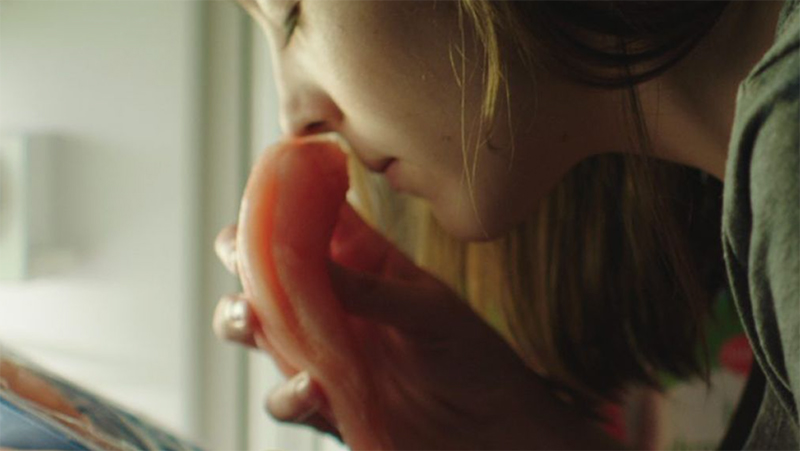
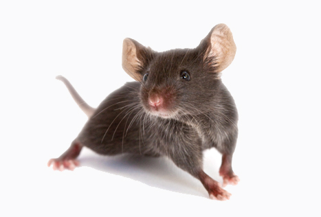
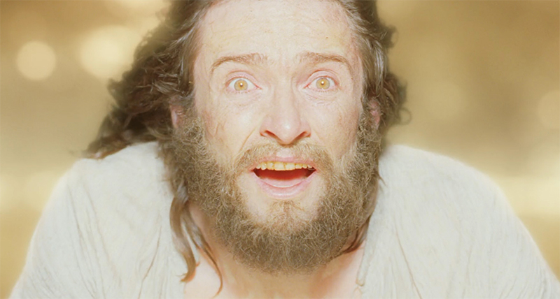
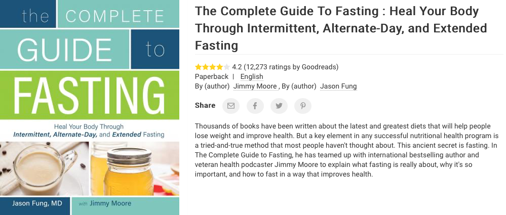

You know what Society needs in early 2020? Why, to stop eating for a bunch of days is what!

And no, I don't mean skipping second breakfast. I mean ingesting exactly 0 (zero, nil) calories for like 96 whole hours!

So, I will embark in this experiment and report back at the end of each day. If you notice that the entry is incomplete after a week or so, be a good sport and call an ambulance?

## Day 1 of 4 completed

When we don't feed ourselves for 24 hours, the glycogen we store in the liver gets depleted, and our body starts consuming fat to produce ketones, which are an alternative and better source of energy. In fact:

* They increase our antioxidants reserves
* They let the body run more on oxygen and less on CO2
* They are more efficient than glycogen, thus allowing the thyroid to take a well deserved time off
* They improve cognitive functions and overall mood

Additionally, inflammation drops significantly, the gut starts healing thanks to a boost of stem cells, and autophagy comes to town.

But wait, what does *autophagy* mean? Well it's greek for:
* Auto = Car
* Phagy = Eating

During autophagy, our body recycles old damaged cellular proteins, microbes, fungi, mold, and uses them as a nutrient. This explains why we don't really lose muscle mass during such an extended fasting period.

As a corollary, after one day of no eating, I would murder a small country with my own hands in exchange for a sandwich.

Which country? I should say the Vatican, but we all know it's Denmark.

## Day 2 of 4 completed

I've not been eating for 48 hours except for a few grains of Himalayan salt, and while I'd appreciate putting food in my face, I'm not necessarily hungry anymore, and more importantly I no longer want to murder humanity.

This is a sign that the ketones are now in full circle and are making me a better person than I deserve to be.

At this stage of fasting, stem cell production increases drastically, which is useful for cellular repair, anti-aging, creation of mitochondria.

Superpowers are also close to develop. I hope I don't get the power of invisibility as they are all sexual predators.

This is also where humans lose around 2% of their weight, which is cool and all, but it's nothing compared to mice. Subjected to the same fasting period, a mouse would lose 20%.

Mice, it is to be said, live significantly shittier lives than most humans, so they shouldn't gloat.

## Day 3 of 4 completed.

While I slept wonderfully, waking up was terrible. When not eating for a prolonged period, our body releases cortisol in the morning as a means of telling the landlord: "hey do we remember breakfast?"

This is temporary of course. After all, the extra lucidity granted by the ketosis was important to help our ancestors to be better at hunting at the moment they needed it the most: when they were hungry AF.

But the feeling was so bad that on my way to work I was like let's cut this short, and almost had a sandwich, a cake, a slice of pizza, a banana, a risotto.

Then I managed to resist by summoning my inner Rocky and now hunger is gone again. We tend to think that hunger increases exponentially until we eat, but in reality ghrelin, the hunger hormone, is only released during what the body recognizes as meal times.

By resisting what seemed like the final boss, not only I'm no longer starving, but I feel great. If this is how the guy from Into The Wild felt at the end, it's not a bad way to go. We should all try sometime.

I'm completely relaxed, at peace with humanity, and it's like I'm seeing Jesus, but I'm just looking at myself in the mirror, and I'm made of tiny lego bricks, and I'm 5 years old, and I have elf ears and a mullet, and I say things like chill bro it's all good, it's all good. All. Good.

I appreciate that this must be irritating for the people near me.

## Day 4 of 4 completed

The last fasting day has been quite frankly a walk in the park. I could have gone on for more days, but I wouldn't have had any more information to share here, so why bother?

By now, the concentration of growth hormone has gone off the charts, which is great for several reasons:

* Facilitates muscle growth
* Makes your skin look fresh and young
* Improves cognitive abilities such as learning and memory
* Reduces fatigue

But wait, aren't high quantities of GH also a risk of cancer development on damaged cells? They are, but remember how after day 1 we triggered autophagy, which has been using them for parts? Those fuckers are long gone, so you get all the pros of GH with none of the cons.

Also, as a side effect, I lost 2 kg and developed the superpower of listening to your inner thoughts. You are disgusting.

This blog will soon become less of a problematic german culture hot take generator and more of a let's postpone our date of death to next year by drinking pee or something.

If you want to know more, [get this book](https://www.bookdepository.com/Complete-Guide-Fasting-Jimmy-Moore/9781628600018).

