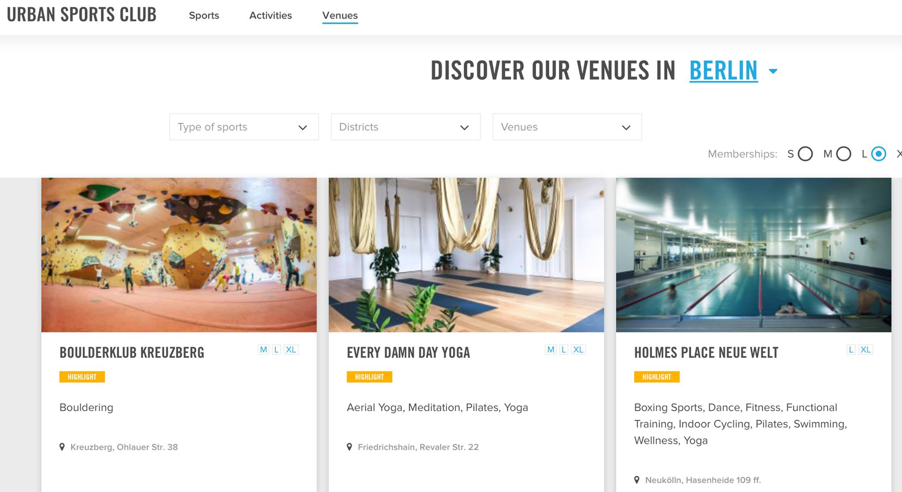

After three months, I leave Berlin to return to the cashless society.

Sweden, I mean. Not some hobo Shangri-La.

I'm having mixed feelings on this whole thing. On one side, I will miss all the people that I have met. On the other, I have not been playing videogames for three months, so I'm sure you can appreciate the bittersweetness here.

Nevertheless, I'm super happy with what we have achieved during this short stay. If you download Candy Crush Jelly Saga, there's a 50% chance that you will see the synchronous 👏🏼 online 👏🏼 multiplayer 👏🏼 game 👏🏼 mode, which also has my code and sweat inside.

If you are in the other 50%, you will think that I came here for nothing.

I feel like it's impossible to list all the experience I've made in this period, so here's a list...

### Spas

Spas are super popular in Germany. Search for "sauna clubs" on Google Maps and you will see a constellation of markers appear. Now go to the filter and refine the search by removing the brothels. The matches will significantly decrease, but you'll still find a plethora to choose from. Or you could just go to the best one: <a href="www.vabali.de" target="_blank">Vabali</a>

I think mixed textile free spas are just the best thing. It only makes sense if you think about it. Instead of splitting your budget to create two lousy spas, you spend all of your mana at once and build a single facility with all the perks.

Being around naked people is a real mind opener, too. It helps put things into perspective and not caring about physical appearances too much.

Additionally:
- You get a ton of motivation for not letting yourself go like that person there. I mean, what happened?
- You can brainstorm several terrible ideas for tattoos
- You also get to see a great many boobs, but at the same time you see as many penises, so the cancel each other

### Food

I think I can say that the best food that I've tried in Berlin is Pizza.

That said, it is a little known fact that Germany has a big sausage scene...

So I will now update my top list of favorite sausages:
1. Italian sausage
2. Swedish sausage
3. Vegan sausage
4. German sausage

### Booze

German beer is amazing if you prioritize quantity over quality, which I'm told you should.

Although to be fair, in Germany, not Italy, I found my favorite wine. It's a Spanish one.

Or you could cut to the chase and go directly for canned prosecco. We truly live in the best of the timelines. I look at canned prosecco and think that the rest of 2020 is going to be fine.

### Shopping

Germans are hard workers, and this comes at no surprise. After all, one does not get to invade Poland by leaving the office at 17:00.

That said, everything is closed on Sundays, so it's impossible to assess whether they are hard workers or not.

### Culture

Berlin has a whole island dedicated to Museums, which is super practical because, if the dark ages come back, they only have to sink that island.

### Comedy

Berlin has a huge comedy scene, with several clubs scattered through the map. There is at least one English comedy event every night of the week, plus there are plenty of comedy and improv groups in Italian, Spanish, French.

I asked people: "What about German comedy?"

They replied: "What do you mean?"

### Sports

The Urban Sports app allows you to do a Spotify-like subscription that grants you access to hundreds of sports facilities in the city. You can go to fancy gyms, swimming pools, spas, bouldering clubs, yoga, er, dojos?

And at 90 euros per month, you want to maximize your investment and workout every day, so that's a plus!

So I've been thinking about starting a company that sells a Spotify-like subscription to restaurants, but it would probably be a terrible idea because people are the worst.

### To summarize

Here is my final snapshot of the wonderful places I've been to.

If you are planning a trip and are interested in some advice, please do not hesitate to remember that I am not a tour operator, so I won't help you.
