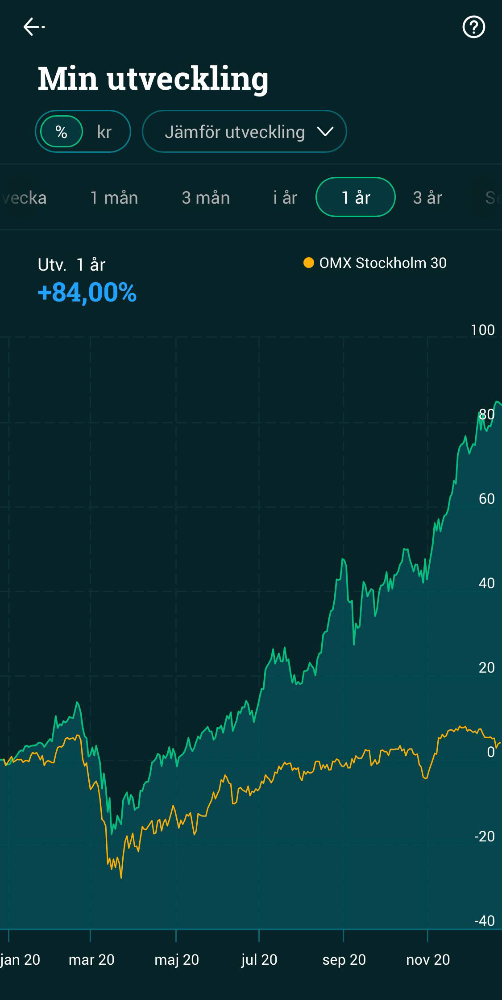
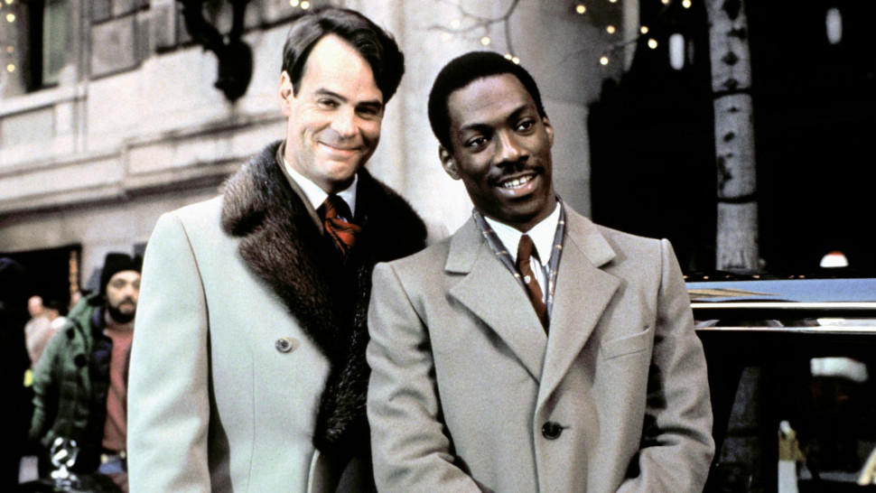
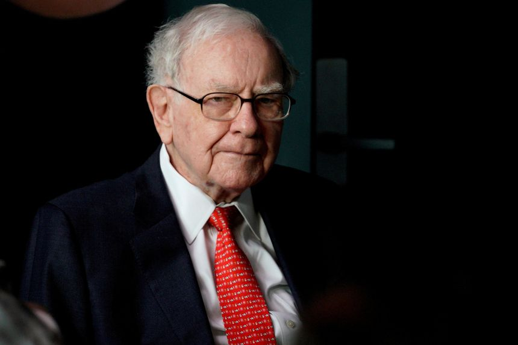
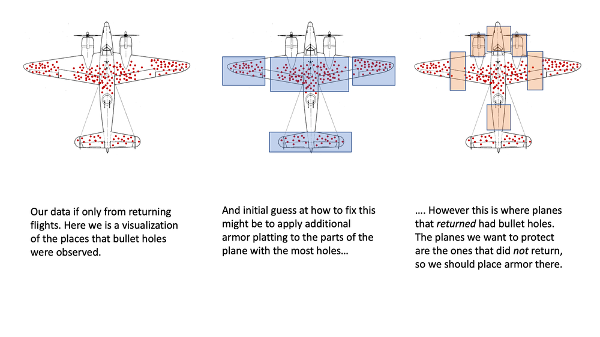
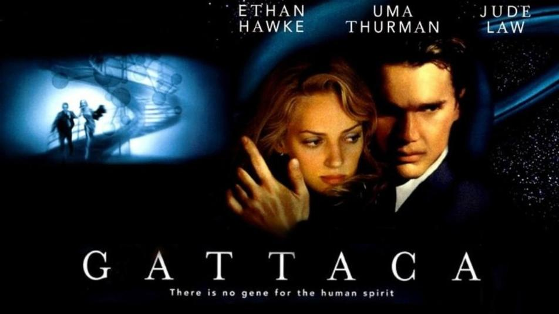

If my calculations are correct, we are reaching the end of 2020.

You will agree, this was a year full of disappointments, what with the whole pandemic thing, a contested American election, Brexit reaching a point of no return, and Tenet not being particularly good.

If I can find a silver lining, it's this one: my investments this year went up a mind-boggling 84%, which is 10 times better than the average return of the **S&P 500**, so there's a pat in the back right there!

Look in comparison at the **OMX Stockholm 30**. It's a no contest. I just humiliated them! It hardly seems fair!

This is something that I deeply care about. I'm not one that asks for much from life. I just want one million dollars. And once I have that kind of money, I will use it to strive towards what truly matters: getting two million dollars.

At that point, I'm not sure what I'm going to do. My imagination only goes so far.

Now, there are several ways to make one million, but let's limit ourselves to the legal ones.

You could of course work more, but you'll end up tired, stressed, with a skin disease, and worst of all uninteresting. And at the same time you will not increase your pay significantly.

I, for one, feel that it's better to make money while we sleep, for instance by selling some stupid thing that everybody wants. And if you don't have a good idea for the next fidget spinner, your next best chance is to latch on to other people's ideas. Enters the stock market.

Deciding to invest in the stock market means sitting on a porch with a glass of port wine thinking: "what's the future going to be like, and more importantly how can I profit from it?"

The Germans call it *entscheidenzukunftprofitieren*, which is super inspiring if you ask me, despite it not being true.

Investing requires a lot of reading, or as the young call it these days, **YouTube** watching, but it's also important to remember to forget to panic.

For instance, last February, when the market crashed and everybody was going crazy and selling their firstborn, I kept my inner calm and held on to my positions, remembering [a wise advice](https://www.investopedia.com/articles/financial-theory/08/contrarian-investing.asp) about never selling when there's blood in the streets. As it turned out, the market quickly recovered, so my decision not to lose my mind paid off big time.

Also, I was out snowboarding and wasn't exactly paying attention.

So, how can to get rich? There is no quick & easy way of teaching it and only a moron would say otherwise.

## How to get rich

As Warren Buffet says, *time in the market beats timing the market*. Do not wait for a crash to buy, and do not sell when you think a price is at its peak.

There is a name for people that claim to be able to time the market, and it's liars. And those that actually manage to do it as lucky liars. Wall Street is full of people whose day job is to find the best time to buy and sell, and yet 50% of them won't even be able to beat the S&P 500.

Sometimes you just need to sleep on your investments. Additionally, being a small, insignificant nobody answering to no one will open up more opportunities than professional day traders; who by the way use a lot of cocaine, and I'm sure this will impact their bottom line.

### EVs

Electric vehicles represent the most disruptive innovation in the near future. I own some Chinese manufacturers that more than tripled their value this year, but Tesla is by far my best investment. I bought it when the company was very close to running out of money, and now I'm up 1200%. I find **Elon Musk** to be extremely weird, unpredictable, and terrible at naming daughters; but he managed to land rockets, so what can you do.

That said, while EVs are the future, almost all manufacturers active today will probably fail. The same way that all those online retailers failed during the dot com bubble. We can see Amazon now as an example of survivorship bias.

### CRISPR

Two years ago I invested in companies that worked at [CRISPR](https://en.wikipedia.org/wiki/CRISPR) gene editing. This year, they started testing on humans, with promising results toward healing sickle cell disease and hereditary blindness. It was also cool that a few Nobel Prizes were assigned within the discipline in 2020. Always a good sign!

I just hope that no subject will grow a third ear on the forehead because it would kinda jeopardize my investments, but probably boost jewelry stocks.

### Recovery

My favorite strategic move this year was buying airlines, airports, and cruise companies before the American election because I thought that maybe a vaccine was going to be announced right after it. When this happened, my travel stocks went up 30% overnight.

That said, I forgot to invest in vaccine companies, so yeah, you can't cure dumb.

As the saying goes, the easiest way to becoming a millionaire is to invest a billion in airlines, so I'm gonna sell once they reach their pre-covid prices, which could mean an overall 3x of the initial sum.

Full disclosure: my worst investment so far is Boeing. It was one of the best, but then a couple of planes crashed, and that was not cool. Also, people died.

### Bottom line

The simplest possible advice is the following: buy companies you believe in, do it when they are cheap, then forget you did it until you are rich. Goto 10.