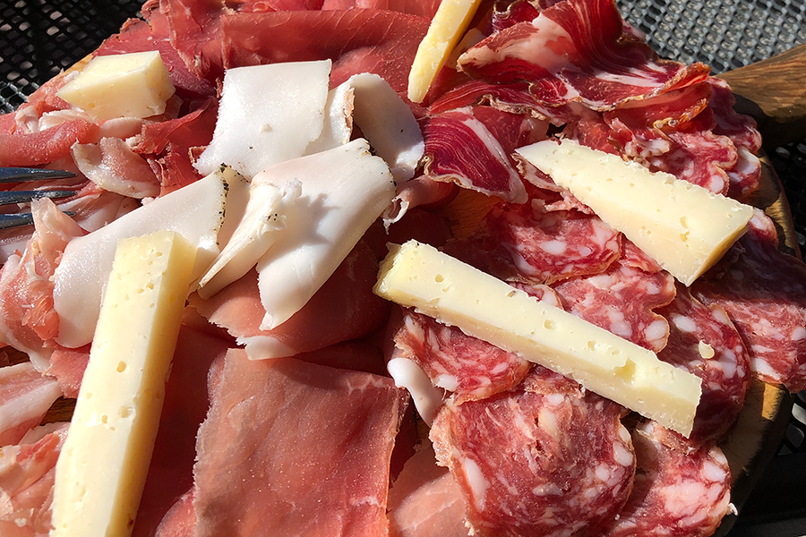
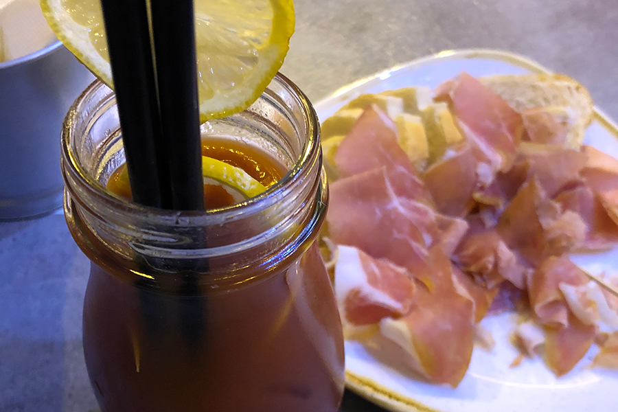
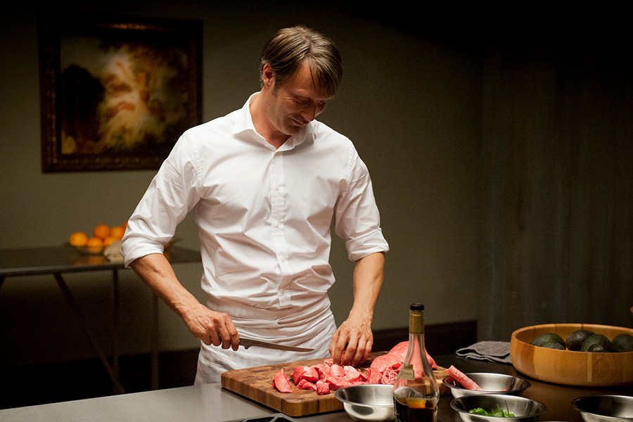

I have a funny relationship with meat.

In the past years, I've tried eating vegetarian as much as possible because of a conviction that eating meat should be, if not immoral, at least frowned upon.

There seems to be too much pain tied to the production and slaughter of such high volumes of animals, and I feel like not wanting in on the top of the pyramid.

Going vegan on the other hand is not an option for me because I couldn't live without eggs, cheese, or bloody marys.

But then, I do eat some meat,don't I? So what's up with that? Here's how I explain my hypocrisy.

If your animal species is a playful one, meaning that you enjoy fetching things, diving in the foliage, performing for charities, then I should probably not eat you because you have something going on in your life.

<YouTube source="Sx-CxuAeVPo"/>

If on the other hand all you do all day is eating and shitting, I'm ok with setting you on fire, putting you in my mouth, and wearing your skin.

This is of course true also for humans.

And while I do make exceptions based on how weak I am on a given day or how freaking delicious the meat in front of me is, I tend to stick to this rule, which means that, as with all things we suppress, I'm now obsessed with it. I often dream of meat, I go to butcher shops as if they were museums, and I watch the show Hannibal as a source of cooking advice.

This is why, in an attempt to exorcise my captivation and move on to greener pastures -- like, literally -- I'd like to dedicate the following song to meat. We love you, meat. We hope that you won't give us cancer!

The song follows the notes of Tender, by Blur. It's ok to sing it out loud, maybe on a balcony. It's 2020 after all.

<YouTube source="SaHrqKKFnSA"/>

## Tender

<Song>Tender is the loin</Song>
<Song>Coming from the cow</Song>
<Song>Blessed she is somehow</Song>
<Song>In every part except the groin!</Song>
<Break/>
<Song>Tender is the hare</Song>
<Song>With bacon from the swine</Song>
<Song>You cook it with red wine</Song>
<Song>And save some space for dessert!</Song>
<Break/>
<Song>Jamón, jamón, jamón</Song>
<Song>Prosciutto!</Song>
<Song>Jamón, jamón, jamón</Song>
<Song>Rump steak on the grill</Song>
<Song>Make it rare</Song>
<Song>I'm waiting for the fillet, waiting for the fillet to brine</Song>
<Break/>
<Song>Tender is the moose</Song>
<Song>Who died for this roast</Song>
<Song>The part I hate the most</Song>
<Song>Is arguing for the wine to choose</Song>
<Break/>
<Song>Tinder dates are gone</Song>
<Song>My foie gras was too much</Song>
<Song>The liver they won't touch</Song>
<Song>And they won't even chew the bone</Song>
<Break/>
<Song>Jamón jamón jamón (repeat)</Song>
<Break/>

I guess see you at Eurovision.
