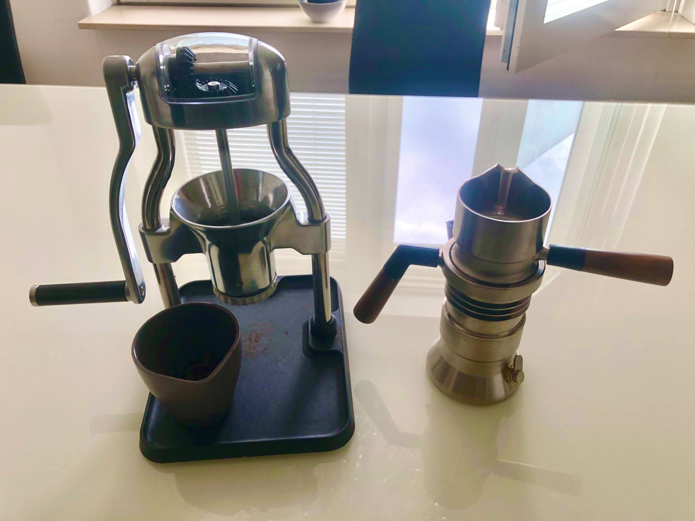
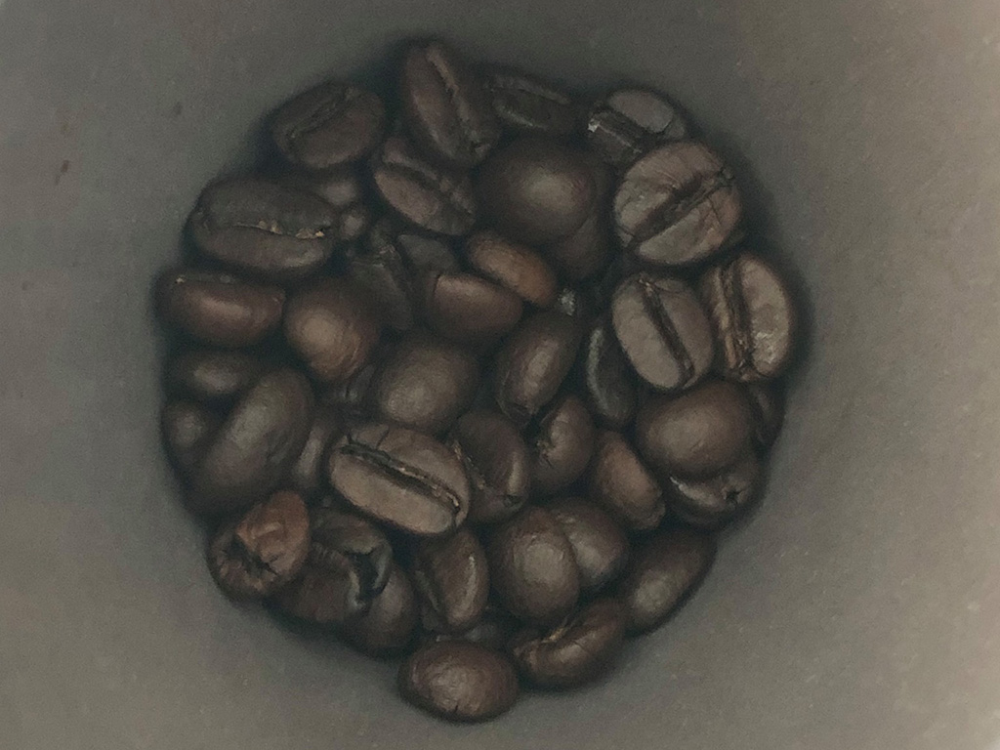
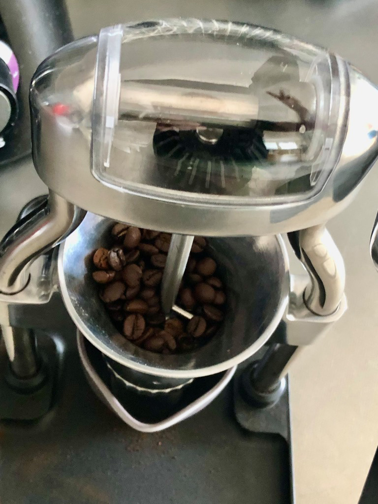
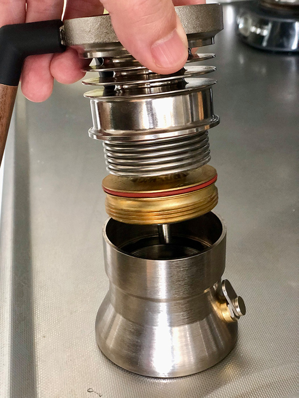
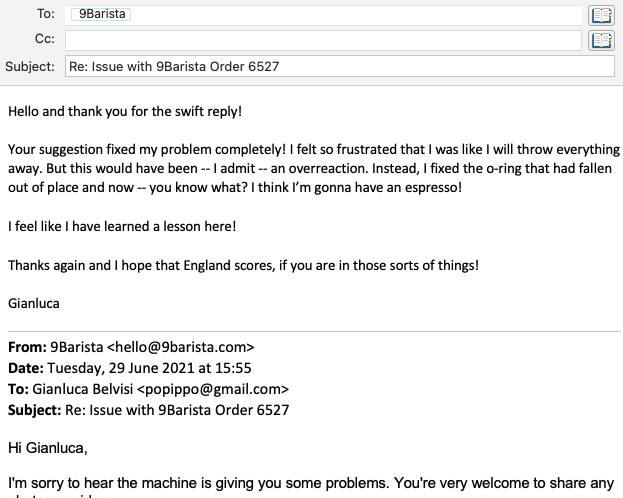
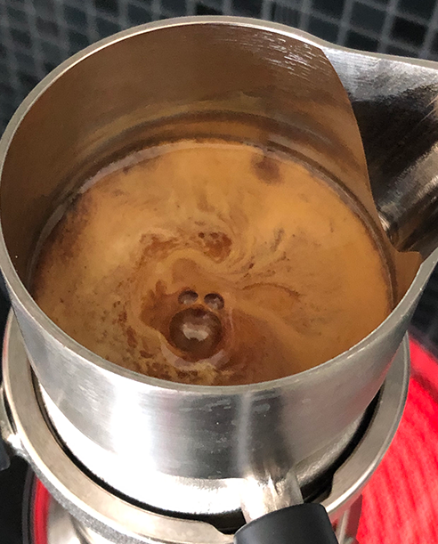

[In the past few weeks](/9barista), some of you have slid into my DMs and, to my disappointment, you haven't posted thirsty messages. Instead, you sent me harassment such as:

"𝙷𝚎𝚢, 𝚊𝚜𝚜𝚏𝚊𝚌𝚎. 𝙷𝚘𝚠 𝚌𝚘𝚖𝚎 𝚢𝚘𝚞 𝚑𝚊𝚟𝚎𝚗'𝚝 𝚠𝚛𝚒𝚝𝚝𝚎𝚗 𝚊𝚗 𝚞𝚙𝚍𝚊𝚝𝚎 𝚘𝚗 𝚢𝚘𝚞𝚛 𝚜𝚝𝚞𝚙𝚒𝚍 𝟹𝟶𝟶 𝚎𝚞𝚛𝚘𝚜 𝚎𝚜𝚙𝚛𝚎𝚜𝚜𝚘 𝚖𝚊𝚔𝚎𝚛? 𝙲𝚘𝚠𝚊𝚛𝚍 𝚖𝚞𝚌𝚑?"

Well, I'll have you know that, because of Brexit, I had to pay import taxes, so it was not €300, it was €387. I bet you feel utterly stupid right now!

But you do have a point, so find attached my experience in making home espresso with 9Barista. May this lead you to spend money in this economy!

<FigureLabel>The complete setup also includes the ROK coffee grinder, quite possibly the best thing I've ever seen.</FigureLabel>

To purchase this one, I initially Googled "ROK coffee grindr" and was welcomed by a barrage of dicks. Then I fixed the typo and the results improved significantly.

## The Ritual

So let's make some coffee, shall we?

You start with 18 grams of fine coffee beans. I am an engineer, so I always weigh them.

The whole grinding experience is so relaxing! [I tried mindfulness](/mindfulness) and quit because my brain feels like a golden retriever at a tennis match, but this gets me to a good place.

You need to find the correct level of grinding and pressing. The goal is to have the coffee extrude in 30 seconds. Then you load the lightsaber with 120ml of water.

## Intermission

Of course, I made friends with 9Barista's customer support because I feel lonely 😭

## On Fire

So let's put this thing on fire and see what happens! The objective is for the whole brewing to happen in no less than 3 minutes, no more than 6. So some fine-tuning was required. Here a failed attempt...

<YouTube source="Rp5-w5Mf4go"></YouTube>

Ok, here is the real deal. Sound on...

<YouTube source="BPLZWCESf3M"></YouTube>

For lack of a funnier word, the coffee ejaculated into the collector. The smell is incredible. Seems to be in Naples while being employed.

## The Taste Test

Ok, let's give it a try. Here goes nothing...

mmm

<iframe src="https://giphy.com/embed/ex5i3xPhozedq" width="100%" height="100%" style="position:absolute" frameBorder="0" class="giphy-embed" allowFullScreen></iframe>

<iframe src='https://gfycat.com/ifr/BruisedHighlevelIchneumonfly' frameborder='0' scrolling='no' width='100%' height='100%' style='position:absolute;top:0;left:0;' allowfullscreen></iframe>

 

Yeah, it was a'ight!

