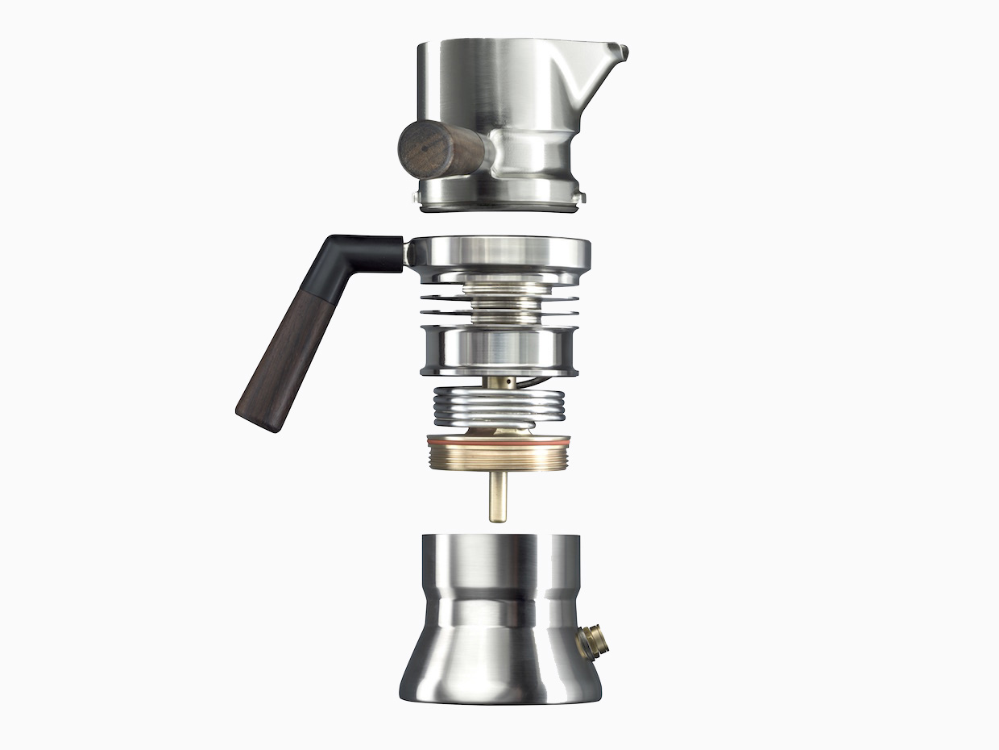
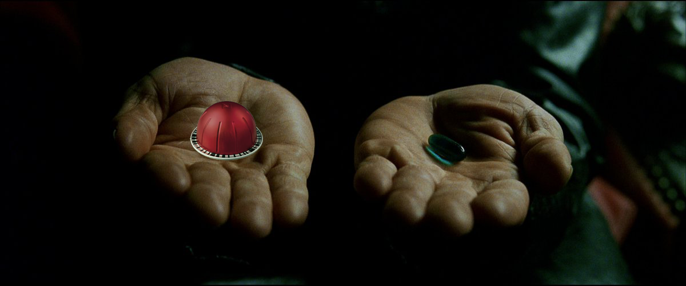
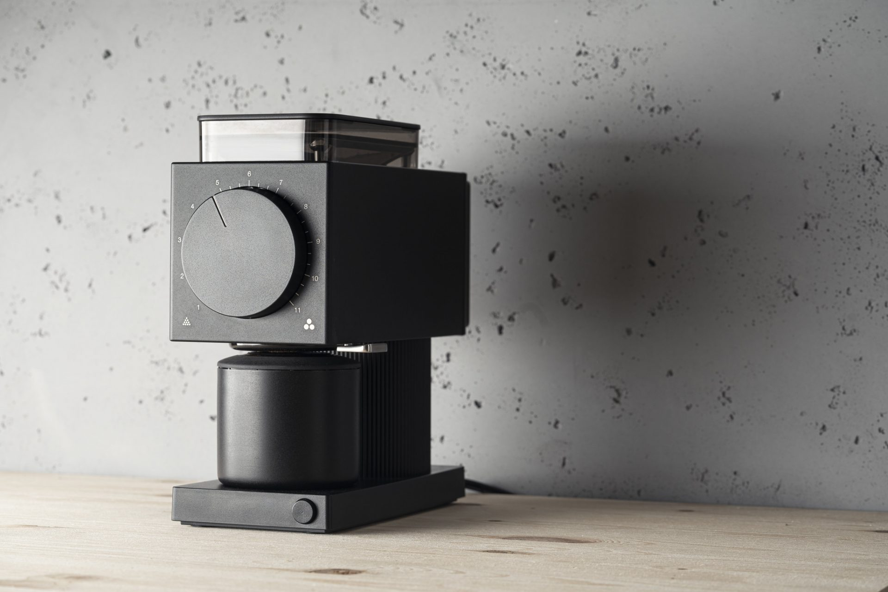
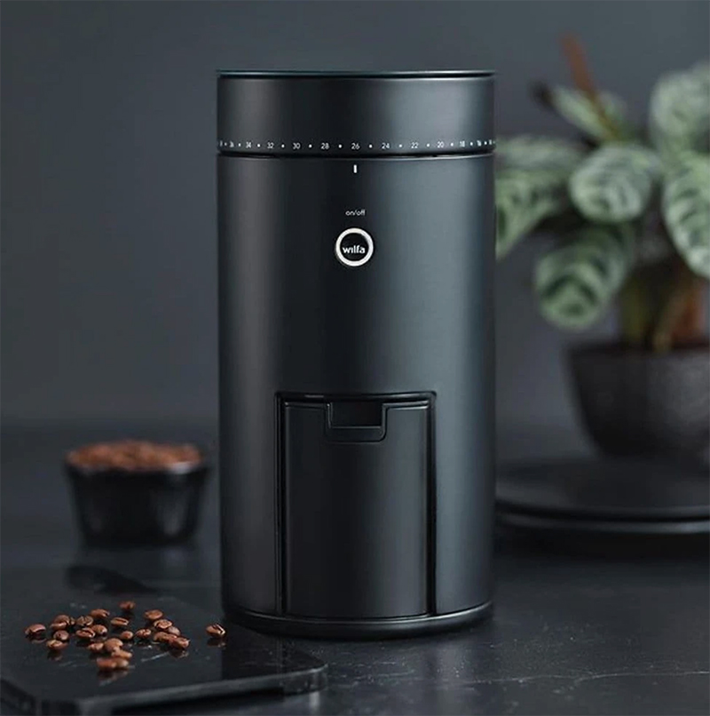
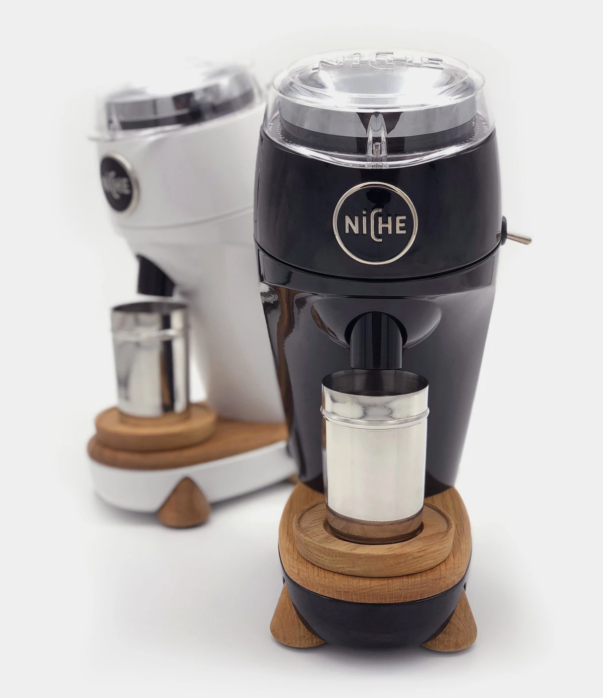
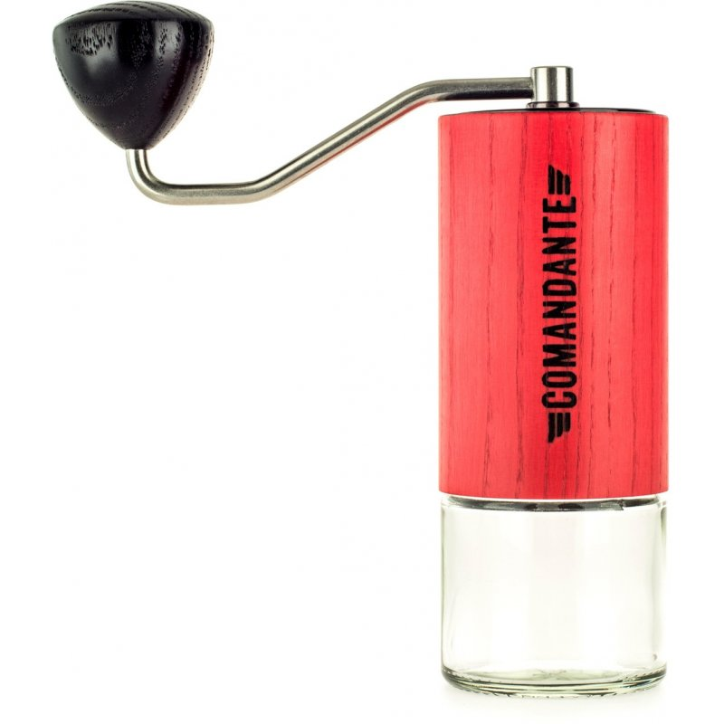
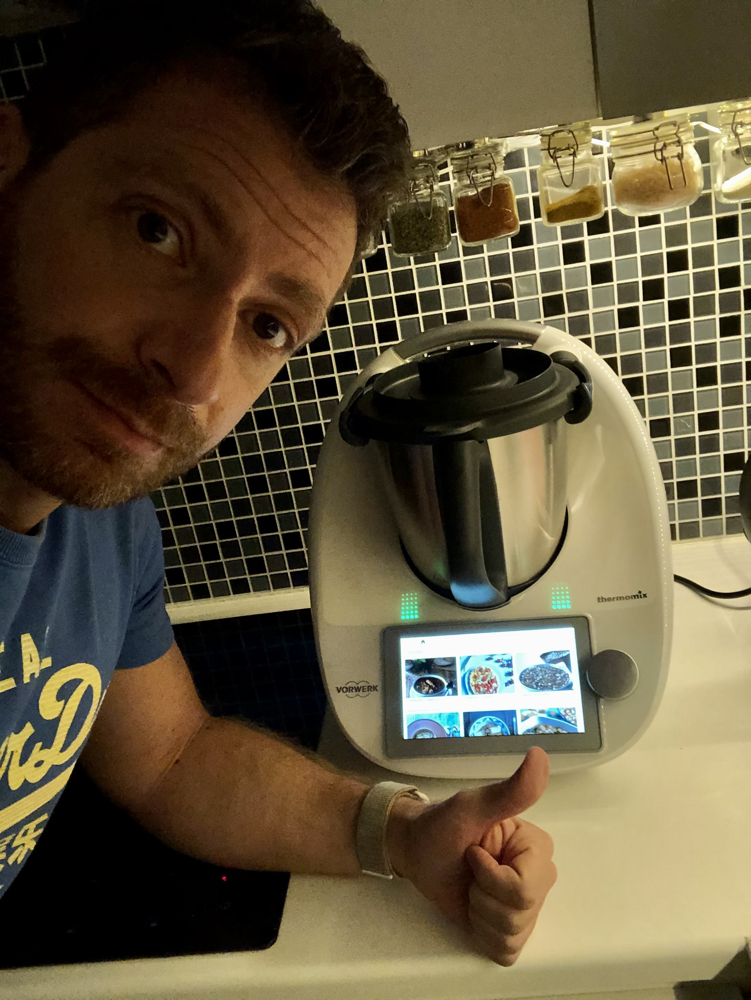

I purchased a €300 jet engineered espresso maker capable of reaching 9 bars of pressure and hence travel back in time.

<FigureLabel>The exploded components</FigureLabel>

As you can see from the picture, this thing is one *Kyber crystal* away from being a freaking lightsaber!

Mind you, I haven't received it yet. It will be shipped in May because [9Barista](https://9barista.com/) are a bunch of hipsters who spend too much time on their unfinished novel and their corduroy underwear to do any real work.

Nevertheless, this financial and emotional investment has sent me down the rabbit hole, and I'm now **red-pilled** on the dos and don'ts of coffee making.

## The grind for the grinder

For instance, did you know that if you use powdered coffee you are actually a piece of shit?

You have to grind those beans, which I'm pretty sure it's some *double entendre* and I will face the consequences in the form of targeted ads.

*(Incidentally, you are not supposed to keep powdered coffee in the fridge, which means that the Neapolitans are wrong, to the surprise of no one.)*

So now I'm searching for a coffee grinder that is capable of smashing beans as finely as it is required for making good espresso, which is sub-atomic levels of fine. Yes, we need to reduce coffee to quarks and bosons. Not leptons, as they are disgusting.

### The Fellow Ode

<FigureLabel>Behold, the huge ass dial!</FigureLabel>

The first option for a non-shitty coffee grinder is the [Fellow Ode](https://www.amazon.com/dp/B08V3VFXCN). It has a very slick design if you like big dials - which you should - but also two kinda big drawbacks:

* It costs $299, plus $199 for shipping and import fees
* It doesn't grind as finely grained as required for espresso

To which I say thee nay!

### The Wilfa Uniform

<FigureLabel>The Darth Vader of coffee grinding</FigureLabel>

The [Wilfa Uniform](https://www.baristashopen.se/kaffe/kvarnar-espressokvarn-bryggkvarn/wilfa-uniform-kaffekvarn-svart.php) is pricier than the previous piece of crap with a terrible dial, and yet not good enough for espresso.

Also, despite resembling an Amazon Alexa, this is really only a grinder, so it won't reply to "Hey Siri" questions.

### The Niche Zero

By all means, the [Niche Zero](https://www.nichecoffee.co.uk/) is a world-class grinder. It can split atoms, so it's great for espresso, and the design is the perfect mix of modern and retro.

<FigureLabel>It also has fake wooden elements!</FigureLabel>

That said, it costs €600, so I will never buy it. Jfc they can die for all I care.

Also, it's sold out. 😭😭😭

### The Comandante

I know what you're thinking. Why not looking into manual coffee grinding, thereby introducing a workout in the morning ritual of espresso brewing?

First, this is very patronizing. Second, I'm a step ahead of you. Introducing...

[The Comandante!](https://www.comandantegrinder.com/)

This is a manual coffee grinder made in Germany, which is a great indicator for precision and quality because come on it's the Germans we are talking about.

(Except maybe for wars and vaccine rollouts.)

Anyway, the Comandante can reach the quantum realm, and it's not awful to gaze at, except for some plastic here and there.

Naturally, it costs €300 because of course it does!

### The end?

But, in a final cliffhanger, with the Comandante already in the cart and one cvv code away from the purchase, I realized that my current best friend the Thermomix, [can grind coffee real good!](https://en.enlathermomix.com/.../moler-cafe-en-la-thermomix)

So I feel like I went on a journey to find the promised land of a sub $300 coffee grinder, only to realize that the promised land has always been in front of me, in a $1500 device ❤️

Is this the end? It never is. To be continued [here](/9barista-2).