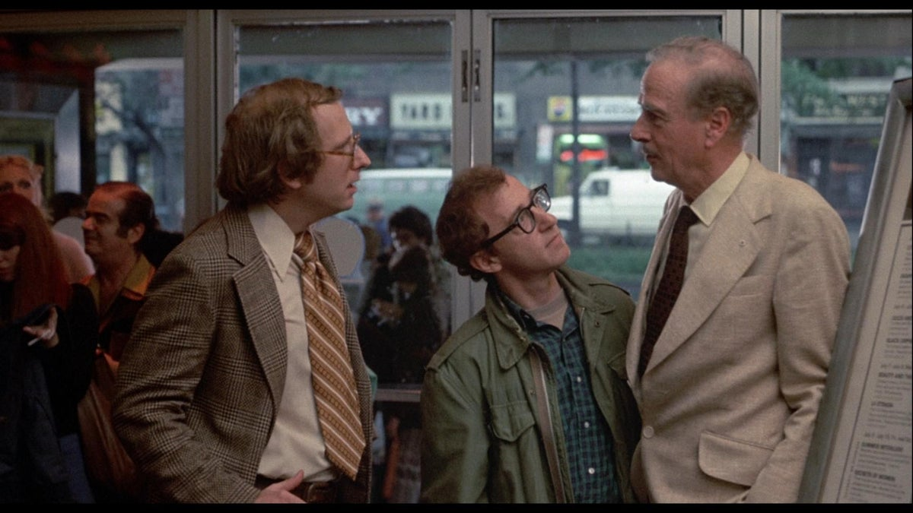

I have been advised occasionally to open a blog, and I remember thinking on every single occurrence: "What a stupid idea!"

Then I spent some time pondering about it and concluded that: "Yep, this is such a godawful idea that they had!"

But more recently, while staring at the emptiness of my existence, I realized that as far as ideas went, this one that I had was pretty good!

<iframe src="https://giphy.com/embed/WQs2ZtviUCVFBu3wK6" width="100%" height="100%" style="position:absolute" frameBorder="0" class="giphy-embed" allowFullScreen></iframe>

But, you'll ask, should one open a blog in 2021?

The answer is **no**. No one should open a blog in 2021. Nobody cares. People will be mad at you for even hinting at the possibility. No one will read it, not even your mom. Especially your mom, because she's tired of your dumb shit!

So why open a blog in 2021? Not to go too **Marshall McLuhan** on your butt, but the reason to open a blog in 2021 is to open a blog in 2021.

Where are we, as a society, when it comes to the technology available in ${CURRENT_YEAR} to open a website?

As a software engineer, I will never use the most automated tools that are on the market if instead I can implement everything from scratch. This is why I have purchased a few books about CSS, and I'm now spending the Friday reading them like a real [sigma male](https://www.forbes.com/sites/danidiplacido/2021/01/26/the-pseudoscience-behind-the-sigma-male-explained/?sh=7cf0efd0149c).

Essentially, I want to see how does one create a blog without using WordPress, which is, if you pardon my French, 𝓊𝓃𝑒 𝓅𝑒𝓉𝒾𝓉𝑒 𝓂𝑒𝓇𝒹𝑒.

Additionally, since I've been out of the game for such a long time that I feel like a defrosted Steve Rogers, I'm curious to find out about the following:

* Is 2021 Html literal shit, figuratively speaking?

* Are Java applets still a thing and, if not, why are we not celebrating the day of their demise as a public holiday?

* Are Ftp clients used to this day to upload websites? Seriously? Port 21?!

* Should I use the UI features from Unity to create a game that is actually just a blog and then package it as Html5 and put it on AWS something something Kubernetes?

* Same as above but with Unreal Engine 5. Yes, I'm trying to trigger some of you.

By the way, you might ask why did I even buy three CSS books. What's the use of having the same information repeated thrice?

First, it's not three books, it's four. One is on its way. Second of all, yeah, no, that was dumb.
