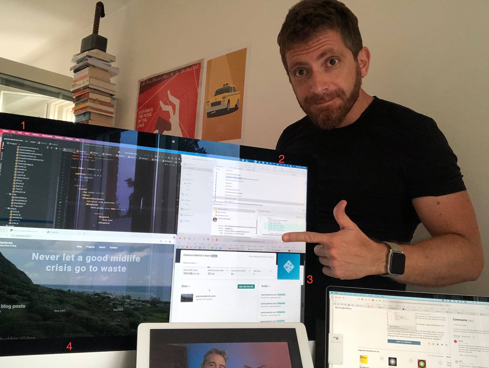

So how does one publish a blog in 2021? By doing eff all is how.

Behold, the cycle of web publishing!

### Quadrant 1

You type in your code extremely fast like in the movies. My IDE of choice is WebStorm. It costs 70 euros yearly, and it's my favorite recent purchase after all the coffee-related paraphernalia.

### Quadrant 2

You push the changes to your GitHub. Yes, I use SourceTree. Do I like it? Not particularly, as it's kinda buggy. Is it way better than using the terminal? Absofreakinglutely.

Warm take: people that do their git stuff via terminal are exactly like those that:
* Use vim to code
* Only take pictures using film
* Never listen to anything released after 1979
* Have Android phones
* Manually grind their coffee
* Oh, crap

### Quadrant 3

Netlify listens to changes in your GitHub repository as if it was East Germany and triggers a new build plus deployment of your website. More like Netlify and Chill!

The service works quite well in its free option. I will be charged if traffic surpasses a certain threshold, but it won't happen. Not on my watch.

Anyway, I managed to make the build crash by using images not web-friendly in size. Or maybe the problem was just the content of the images: myself.

### Quadrant 4

The blog is live in all its work in progressness. You shouldn't visit it in this state, or ever.

I ended up using React (1) with Gatsby (2). It makes a ridiculous usage of GraphQL (3), but it's extremely fast.

(1) Used by the website thefacebook.com (4)
(2) Also a character (7) in a famous F. Scott Fitzgerald novel
(3) I have no idea how it works, but I'll definitely put it in my CV
(4) Full disclosure I own Facebook shares (5)
(5) Yeah I said I was going to sell, but it keeps going up and my FOMO (6) is real
(6) Fear Of Making Out?
(7) Let's say that they both have a bit of baggage

Here's my [Trello Board](https://trello.com/b/i59sE2uK/gianlucabelvisicom). Still a lot to do, which is cool because I'll probably shut it down when it's done.
