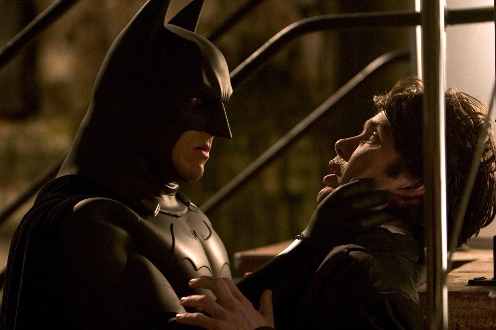
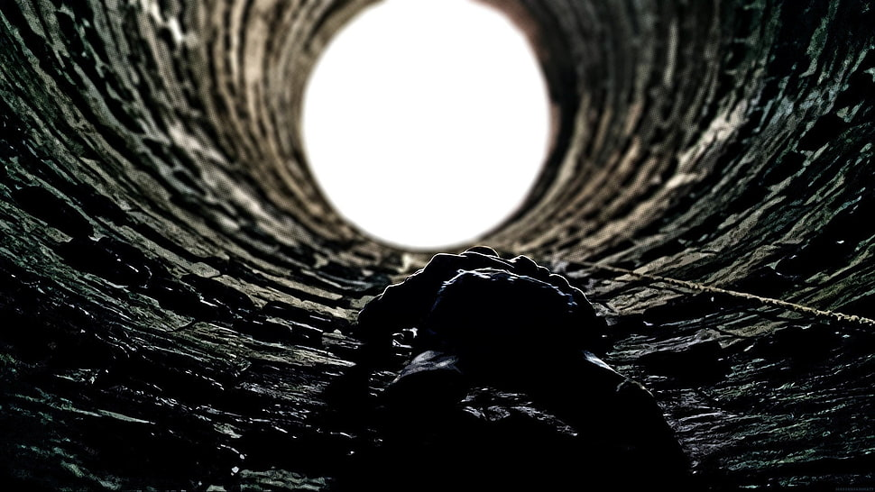

I have a little cautionary tale for you. It's free, but it cost me a lot.

About one year ago I thought about investing in GameStop. The reason was that I found out that **Michael Burry** -- the guy that predicted the 2008 financial crisis, portrayed by **Christian Bale** in the film The Big Short -- was heavily invested in the company, and I was like what does Batman know that I don't?

I went so far as to fill in the order details, but then I changed my mind before pressing **Buy**.

This is stupid, I thought. I should invest in companies that I believe in, and only after doing some research. If Christian Bale jumps in a well, do I also jump?

Well, if I had purchased the stock that time, I would have now made more than 100000 dollars in capital gains.

It would have been for the wrong reason since it was somebody else's idea. Actually, double the wrong reason, as this someone's idea is not even why the stock gained so much, and this is all the result of a feud between Reddit and Wall Street, seeded in resentment against the institutions, something something, Pepe the frog. But I would now have 100 extra grand nonetheless, and I could have adopted a dog.

So the teaching from all this is that sometimes it pays to be a freaking moron.