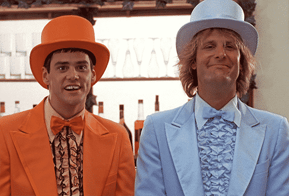
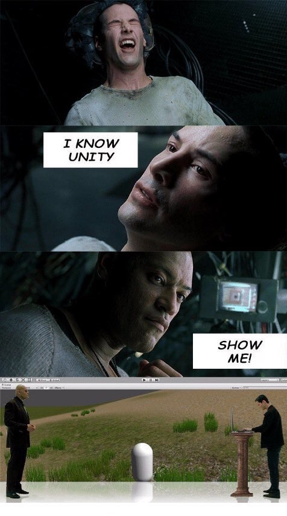

import {Pony} from "../../../components/blog/Text";

Welcome. You have unlocked a blog entry that is unlisted from the main site, so there are only **two ways** you could have reached it:

1. You regularly visit my blog, or even better subscribe to my [newsletter](https://eepurl.com/hM9Vi5), and endured my imaginary Little Pony [abusing me](/impostor-syndrome)

2. You googled "overcoming impostor syndrome" and weren't satisfied with the results on the first page, or the second, or the third, ...

In either case, there is something deeply wrong with you, so let me try make you feel better, and let me try doing that without being too much of a **self-help** evangelist because, repeat with me:

<Pony>Self-help is bullshit.</Pony>

## Let's start healing (*)

    <small>(*) Have I already failed at avoiding self-help?</small>

So, your life is facing **significant changes**, either triggered by you or some external force, and as a result you feel inadequate, a freeloader of clout, an **Andrew Garfield** Spider-Man is a world of more successful Spider-Persons.

The first advice people tend to give in these circumstances is to...

## Fake it till you make it

Whatever it is that you feel that you are **missing**, you should act as if you already had it. As a result, you'll end up believing that you have it, and this will eventually lead you to having it for real. 🤩

If you think that this is valuable advice, congratulations, you are a **moron**!

What exactly were you thinking of faking it till you are making it? Are you going to fake competence? Are you going to fake experience, wisdom, knowing the combination of the beer fridge?

There is another way to call faking this kind of stuff: **delusion**.

The only thing that you can responsibly fake is courage. But then again, isn't all courage fake?

## What is courage, anyway?

Courage is the confidence that **Future You** will be able to handle the situation just fine.

Future You might be you 60 seconds from now if you are jumping out of a plane. Or it might be you 15 years from now if you are leaving a career on Wall Street to join a **Christian Rock** band with your high-school sweetheart.

Where does this confidence come from?

I've thought about this for a long time, and despite not having any peer review studies to back me up, I strongly believe that it's due to...

<Pony>Too many compliments as a kid.</Pony>

    

        <iframe src="https://gifer.com/embed/Pqp3" width="100%" height="100%" style='position:absolute;top:0;left:0;'
                frameBorder="0" allowFullScreen></iframe>
    

Some kids just had it too good.

They were praised every time they **pooped** into the toilet, which is something no other mammal would ever do to their cubs.

All of their **shitty drawings** were put on the fridge door with no criticism over the botched perspective or the fact that that car has four wheels all on one side.

Their **stories**, so full of plot holes and uninteresting digressions, always received stellar reviews.

"Honey! Come hear what happened to little Timmy in kindergarten today. Spoiler, he saw a squirrel! I know he's been talking about this for 15 minutes, so you're wondering whether there is more to it, but you can rest assured that there is not!"

In short, we are producing **fearless monsters**.

If instead you weren't complimented enough, or you were straight up diminished, you are probably scared all the time, and I just want to hug you tight.

But rejoice, because people that were complimented exactly the correct amount are now 1) riddled with Impostor Syndrome and 2) boring AF.

So, it seems like we need a pinch of courage in our life, but we need to cultivate real, homegrown courage, and not the **GMO shit** that those asshole kids got imprinted.

<Quote title={"inspiring quote"} from={"Anais Nin"}>
    Life shrinks or extends in proportion to one's courage
</Quote>

The way you can grow courage is definitely not by seeking validation from your friends, because they are **liars**, and they will just **lie** about how amazing you are.

You need to do it via **introspection**. You need to adopt radical honesty and ask yourself the tough questions...

## Am I dumb?

Ok, wow, we seem to be in a dark place.

The mere fact that you are asking if you are dumb shows that you are not.

An actual dumb person would suffer from [Dunning-Kruger Effect](https://www.psychologytoday.com/us/basics/dunning-kruger-effect#:~:text=The%20Dunning%2DKruger%20effect%20is,accurately%20assessing%20their%20own%20skills.), which says that dumb people don't have the toolset required to understand their stupidity.

So, if you were dumb, you wouldn't be here reading about **Impostor Syndrome**. You would be thinking that you are smart, actually, and you would be looking into becoming a vaccine expert via the **University of YouTube**.

<Quote title={"elitist quote"} from={"Charles Bukowski"}>
    The problem with the world is that the intelligent people are full of doubts while the stupid ones are full of confidence.
</Quote>

What you can definitely be is **the dumbest person** in the room, because of the relativity of it all.

I would argue that you should do whatever is in your power to be the dumbest person in the room, as it gives you the best opportunity to grow.

Plus, the other room dwellers will probably feel relieved, as they are not the **stupidest** for a change!

They will invite you to parties, introducing you as their moronic friend. You can do some great networking this way. Get laid, even. Everyone wants to have sex with somebody dumber!

## Am I ready?

The mere fact that you are asking if you are ready shows that you are not.

And that's ok! When we finally feel ready, it's already too late. We need to do things when we are **not ready**, otherwise we will never be.

When he parkours over the roofs of Florence escaping the police 🐷, **Ezio** always knows when he can jump into the void and land in a conveniently placed haystack. Motherfucker doesn't even have to look! How does he do that?

Well, the **game designers** have placed markers on the roof edges in proximity of hay. These markers are, well, **pigeon poop**. So if you step on the poop while jumping, you know you'll be ok.

<FigureLabel>Now that I think of it, I could have easily jumped out of my balcony in Pisa.</FigureLabel>

So I feel like our role is to search for the signs that will help us understand that we are ready, **before we are ready**. We need to ignore the hay and look for the poop.

<small>(This might be the wisest thing I've ever written.)</small>

**Or not!**

We can do none of that and continue focusing on what we are familiar with, instead. Isn't it reassuring? Don't you feel better already? And if we argue hard about our limitations, we get to keep them! ❤️

## Am I good enough?

Look at the people that are currently doing the thing that you are so scared of doing.

Are they by any chance some eight-packed, blonde-haired, blue-eyed, hammer-wielding gods?

No, they are not Jesus.

    <small>(This is funny because Jesus was a carpenter, so the misdirection works. Also, he was white.)</small>

These people are just a bunch of randos that fart under the bed linen, pee in the shower, and try to make ends meet exactly like you.

And if you still think that Life's rules are tougher for you than anyone else, stop a minute to consider if this feeling isn't coming from a position of **narcissism**.

<TextBox title={"A moment of your time!"}>
    

        Did you know that I have a <strong>mailing list</strong> that you can subscribe to get updates on new posts so that you don't have to continuously refresh my blog, which costs me money?
    

    

        Subscribers will read my posts at least <strong>24 hours</strong> in advance compared to the rest of the world!
    

    

        To join it, there is a link at the end of each post, or you could go <a target="_blank" href="https://eepurl.com/hM9Vi5">here</a>.
    

    

        The first five subscribers will receive a belated <strong>Christmas gift</strong>! That's how <s>desperate</s> resolute I am to get this mailing list going!
    

</TextBox>

## What if I make a mistake?

I actually hope that you do make a mistake. There, I said it!

Your brain, the gross thing that you carry in your skull almost all the time, is a piece of wet biology that has evolved with the purpose of **prediction** and **error correction**.

Human thought is really just error correction. Consciousness is error correction with added anxiety.

So you are just using these things the way they were designed to be used. By Jesus!

<FigureLabel>Jesus.</FigureLabel>

And if you still need to cut yourself some slack, remember that **Albert Einstein** carried his luggage. **Marie Curie** carried her luggage. **Max Planck** had carried his luggage for so long that he probably died because of it.

These cunts have figured out the inner workings of Reality, but still they couldn't think about putting wheels on their luggage.

The **wheeled suitcase** was invented only in 1972 by some dude that, to be fair, knew very little about quantum mechanics.
