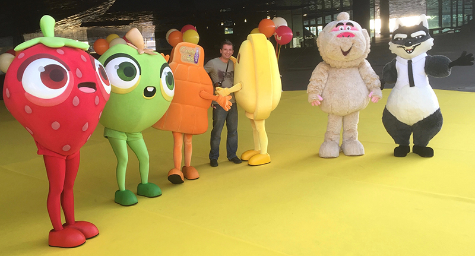

This might be too personal for your taste, but after seven-plus years, I have now left [King](https://www.king.com/).

I think of myself as someone that has zero feelings, like one of those emotionless dishwashers. Is this just a form of dumb self-protection? Absolutely!

Still, I'm currently finding it hard to keep up the pantomime and hold in the **waterworks**. So this makes me more like one of those malfunctioning dishwashers in the show Westworld.

In these past **seven years**, I feel like I have grown exponentially, and this was only possible thanks to:

1. A group of world-class talented people I had the privilege to share air with
2. The high availability of protein bar snacks in the office

The number of amazing moments I have experienced at **King**  is literally uncountable and hence impossible to list.

Here is a list...

## Travel

A few weeks into the job, when I was still spending most of my days memorizing the computer's password, I was sent to **Lisbon** with the whole company to celebrate Halloween, which coincidentally was my password.

A few drinks into the party, I approached then CEO **Riccardo Zacconi** (on the right) and elevator-pitched him my idea for a game called **Squishy Fishy Saga**, in which you squish fish. This was as far as my design document went.

I still remember his kind words of encouragement: "Don't talk to me."

<TextBox title={"Now that I mention it"}>
    The next day, I woke up in my hotel room, not clearly remembering how I got there. I had a rough map to the hotel sketched on my left hand. A map that was not drawn by me. But this is a story for another time.
</TextBox>

## Game jams

A couple of weeks later, with my password well memorized, I was involved in a game jam despite having zero game programming experience. In these circumstances, you just have to [lean in](https://www.merriam-webster.com/words-at-play/words-were-watching-lean-in) and enjoy the free food.

I teamed up with expert artists and coders and worked at a game about cyclopic earless rabbits. In the end, the whole project compiled thanks to me. Or was it *despite*?

## Charities

Every December 13th, Sweden culturally appropriates the story of **Lucia**, a sicilian saint (oxymoron) that had some stuff happen to her. I wouldn't know what. I'm more of a Renaissance enthusiast.

For the occasion, King hires a bunch of homeless kids, dresses them like the KKK, and sets their heads on fire while they are begging to be let go with the promised bag of heroin.

Great, now I miss Sicily.

## Deeply rooted secrets

I have sat on this for years, waiting for the right moment to tell the world. Well, here goes nothing...

This is a picture of Principal QA Specialist **Johan Hoberg** after he fell backward because he thought he was sitting on a chair, instead of a cube.

I don't know if he'll ever recover from this exposé.

## Decadence

In an attempt to increase engagement during after-works and let everyone play, we had this infinite foosball table...

It was a colossal failure. Matches were excruciatingly tedious, and they all finished Nil-Nil.

Exactly like real soccer.

## Events

The following is popular local comedian **Al Pitcher**, hired to utter jokes and remarks at the expense of the Swedes.

Everyone thought he was funny. But then again, I'm seeing a lot of empty bottles on the table. Let's be honest: this is not the toughest crowd to please.

And that's Comedy in a nutshell.

## Team building

<FigureLabel>This is <strong>Camp Nou</strong> in Barcelona, Catalonia. Quite possibly the most popular basketball court.</FigureLabel>

<FigureLabel>Here instead we invaded a small country as a team building activity. <Break/> Was it the Vatican? I recall dead priests.</FigureLabel>

## Intellectual Properties

A few of the mascots I have worked with. From the left, you can see the characters in **Fruit Ninja** then, near me, the suppositories from **Dr. Mario**, and finally the two pedophiles.

I now realize that this picture must be coming from that period where I used to wear black shoes.

I'm not proud.

## Cake

So we had these contests where everyone baked cakes and then played the game of thrones to win the electronic vote.

I checked with my lawyers if I can sue **King** for the extra percentages of body fat that all of this gave me. They mostly woofed in reply. My lawyers are dogs.

<FigureLabel>This cake was baby shaped. I know what you are thinking and I can confirm. It was delicious.</FigureLabel>

## Acquisitions

This picture is from that time when King was purchased by **Activision Blizzard**.

All in all, I think that this union has been extremely successf--- *puts finger to ear.* Oh... did he now? Okay. Well... let's move on!

## Actual work

These are all the games I've been involved with. Now, can you squint your eyes and spot the fake one?

## Recognition

Probably my best accomplishment is winning as best storyteller in 2021. In your face, **JK Rowling**!
## Disappointments

This is the wall where all employees have their portrait, wonderfully depicted as feral animals by cartoonist **Jimmy Wallin**.

They are all spot on except mine. The Pug. Absolutely terrible. 😡

<FigureLabel>Zero resemblance whatsoever</FigureLabel>

Anyway, now that I'm unemployed, if I could borrow 100 SEK I'll be able to have dinner tonight. 😭

**[paypal.me/gianlucabelvisi](https://paypal.me/gianlucabelvisi)**