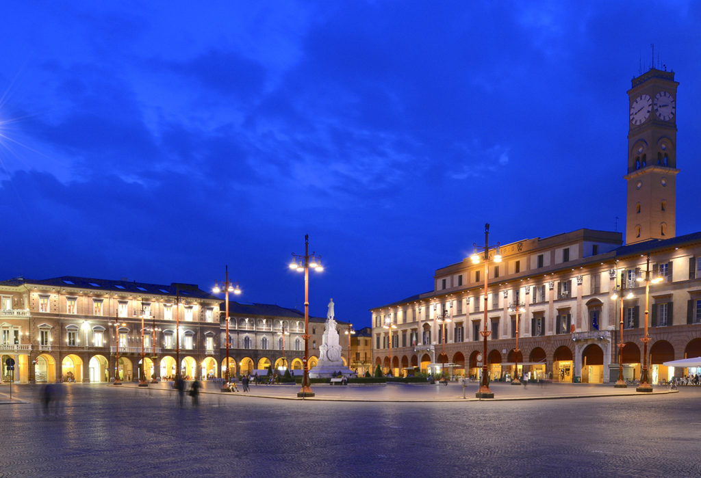
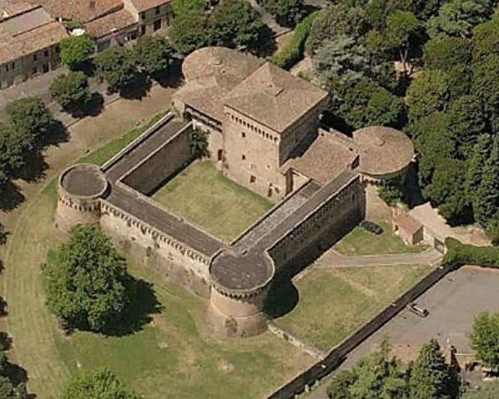
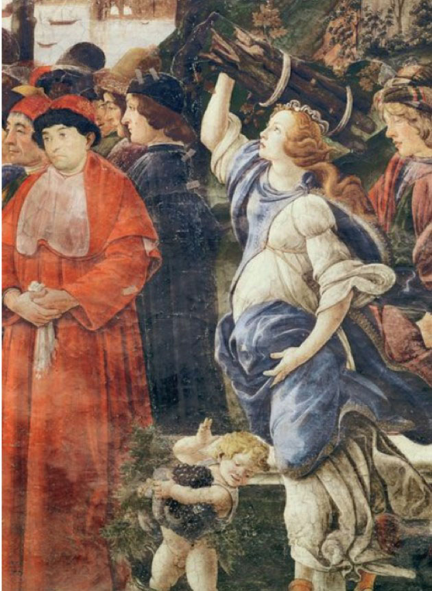
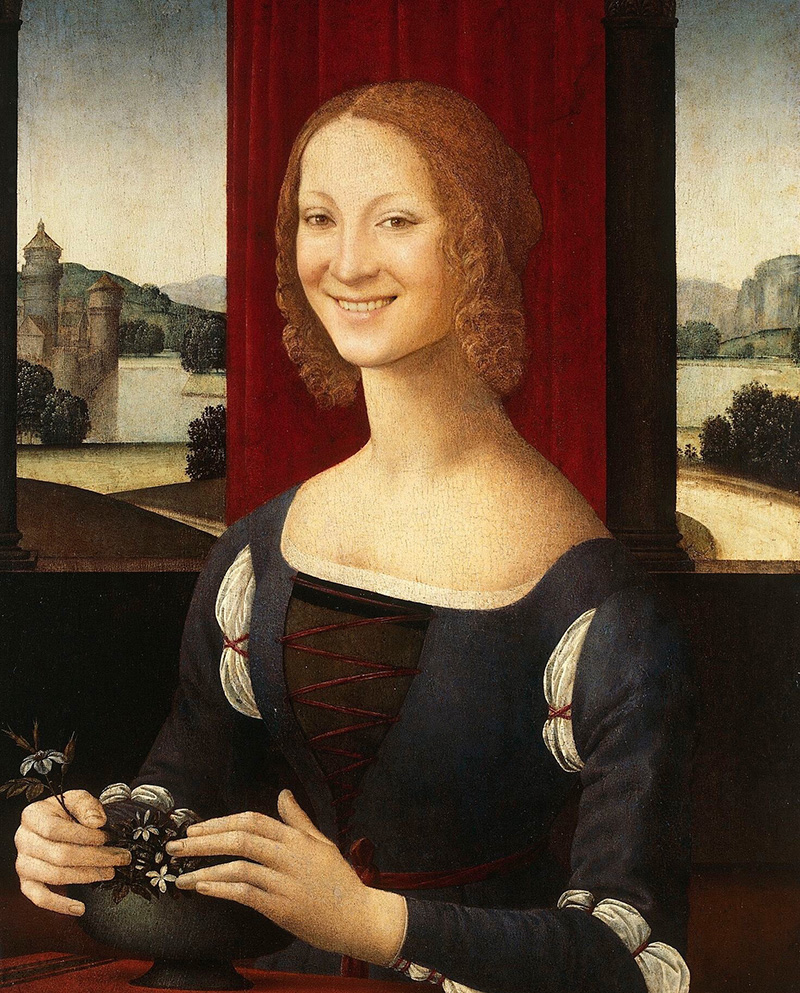

import {Machiavelli} from "../../../components/blog/Grids";

In [Part 1](/caterina-sforza-1), we left Caterina and Girolamo in Forlì, taking over the lordship of the city. Go read it if you haven't already, as we will have callbacks and inside jokes.

## A new Girolamo

**Girolamo Riario** had been deprived of his strongest and only virtue: being the Pope's nephew.

We can't begin to imagine what was going on in his mind, but I like to think that he approached this whole situation as a chance to press **reset**, to reinvent himself, maybe read a self-help book, bake bread, do yoga.

He did seem to have learned the lesson that being hated is not so cool. In order to gain the love of the **Forlivesi**, he promised that he was not going to raise taxes. The Forlivesi appreciated the gesture and gave a loving chance to this renewed Girolamo.

<FigureLabel>
    I've actually never been to Forlì. Compared to where my family is from and the principal connecting routes of Italy, it's a bit "in culo". Also, a bunch of Caterina related landmarks and works of art have been destroyed during WWII. Thank you, Hitler.😡
</FigureLabel>

Now, Girolamo enjoyed a lavish, decadent lifestyle as much as the next aristocrat, and he thought he could still afford it thanks to the 8000 ducats that his wife **Caterina Sforza** managed to squeeze out of the Church during her Mexican standoff in Rome.

Unfortunately, the newly elected Pope **Innocent VIII**, when he heard about this monetary commitment to Girolamo Riario, was like: *"I ain't giving him shiiieeet!"*

Suddenly light of 8000 ducats, Girolamo turned his life around and became a **mindful spender**, easing on parties, unnecessary ornaments, high maintenance mistresses.

Nah, I'm just messing with you. He raised taxes!

## Comeuppance

We can safely say that the Forlivesi didn't like it one bit. On top of the hate wave was the **Orsi** family, who ended up bearing a significant debt to Girolamo. They figured, if Girolamo is dead, maybe we don't owe him anymore? 🤔

During a lazy Sunday afternoon, the Orsi visited Girolamo at his palace by the main piazza, but instead of giving the guy a bear hug, they went all stabby-stabby on him.

<FigureLabel>
    The Orsi family. You see, this is very funny because Orsi means bears. Incidentally, that's why I wrote "bear hug" and other amenities. When the writing is that good, you can find hidden gems anywhere!
</FigureLabel>

So we say goodbye to our friend **Girolamo**. 😢 Hopefully the city of Forlì will avenge him.

Actually, scrap that. Once the Forlivesi got wind that Girolamo was a goner, they thought that this was a chance like another to ransack the palace. Wait, are they also dragging his corpse to the main piazza and **dismembering** it? Not cool, Forlì.

In the meantime, Caterina and her children were dining in another wing of the palace. The Orsi took them prisoners, but didn't harm them. Time was of the essence. If you want to conquer Forlì, what you really need to do is lay your hands on the heavily fortified castle of **Ravaldino**.

The keeper of castle Ravaldino was one **Tommaso Feo**, installed there by Caterina herself.

With her kids under **menace**, the Orsi escorted Caterina to the castle entrance. Her role was to convince Tommaso to open up the gate to the Orsi, or bear (😆) the consequences.

From the ramparts, **Tommaso** thought about it a bit, then concluded that what he needed was a bunch of money and a recommendation letter for his next employer, and that Caterina was to hand out all this to him alone, as he couldn't bear to trust the Orsi, what with the whole Girolamo killing and all.

The Orsi didn't have much time to think. In **Milan**, the Sforza family would only take a few days to raise an army and stroll to Forlì. They accepted the conditions.

<iframe src="https://gifer.com/embed/8vPc" width="100%" height="100%" style='position:absolute;top:0;left:0;' frameBorder="0" allowFullScreen></iframe>

<FigureLabel>
    Tommaso Feo in a rare gif from that period.
</FigureLabel>

Tommaso lowered the **drawbridge**. Caterina crossed the gap and reached the castle entrance. While the bridge was lifting, she turned to her captors, raised a fist and straightened the index and ring fingers.

Yes, Caterina told the Orsi to go fuck themselves.

<FigureLabel>
    Caterina Sforza, here portrayed by Botticelli as someone that, despite being uber-pregnant, gets shit done.
</FigureLabel>

## On the ramparts

The Orsi shouted against the thick walls, demanding for Caterina to get back and **surrender** the castle. Tommaso leaned out of a window and said: "Yeah... we are not gonna do any of that."

From the north, the Sforza army was drawing closer to Forlì. From the south, the Papal army was also approaching in defense of the Orsi 🐻.

To try and break the stalemate, Ludovico Orsi wrote to Lorenzo de Medici in the nearby **Florence**: "Dude, we killed Girolamo. Aren't we like best buddies now?"

Lorenzo decided not to reply. He already got what he wanted.

Mad as an antelope, Ludovico went to the cells and grabbed **Ottaviano** and **Livio**, 9 and 4 respectively. He dragged them to the edge of the moat and promised Caterina that, had she not opened the gate pronto, he would slit her childrens' throats.

This is when Caterina reached the ramparts and **bellowed back**: "Do it then, you fools!" then she raised her skirt. "I have the means to make more!"

The Orsi couldn't bear to kill the children. The stalemate lasted for months and was finally decided by the two armies' unwillingness to fight for a tiny inconsequential place like Forlì. As a result, the Orsi were forced to escape with no honeypot.

<Question>Ok, so this is really cool, but isn't it a bit too cool? Did it really happen is what I'm asking.</Question>

Since everything occurred outdoors in front of the whole town, we have several **first-hand** accounts, including two reliable chroniclers of the time.

The only detail that almost certainly never took place was the **pussy** comment. We suspect that it was circulated, if not straight up invented, by none other than...

<TextBox title={"Niccolò Machiavelli: the incel strategist"}>
    <ThreeColumns>
        <Machiavelli/>
        <Col23>
            
You see, Machiavelli <strong>hated</strong> Caterina big time. Once, he was sent by Lorenzo the Magnificent to close a deal with her, and he thought that this was going to be a walk in the park for him because, and I quote:

            
"Caterina is a woman, and women are only good horizontally or in the kitchen, lmao!"

        </Col23>
    </ThreeColumns>
    
Well, Caterina played with him. She let him wait for days, metaphorically juggled his <strong>testicles</strong>, and then sent him back to Florence with no brexit deal.

    
So this was Machiavelli's way of depicting Caterina as <strong>unladylike</strong>. Instead, he cemented her as a badass for centuries to come.

    
We definitely need a post about Machiavelli. Find the link here. (No link means it's not done yet.)

</TextBox>

After such hardships, Caterina was free again. She was installed as *Countess of Forlì* and adored by her citizens.

But let's not forget that she had just lost a husband whom she loved so much and will mourn for yea-- no wait a second she's already found another man.

**End of Part 2.**

Now, quick, go to [Part 3](/caterina-sforza-3) of Caterina's story. Will she and her new husband enjoy their reign in Forlì and be happy ever after?
<Spoiler>
    Nope.
</Spoiler>