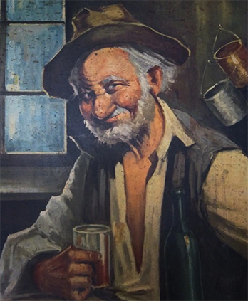
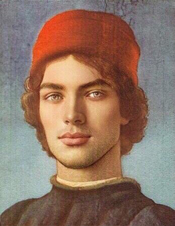
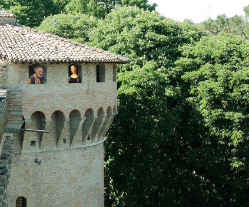
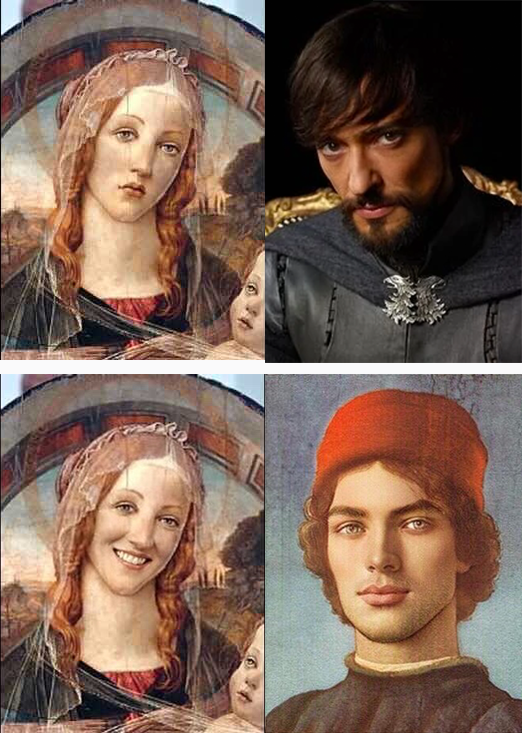
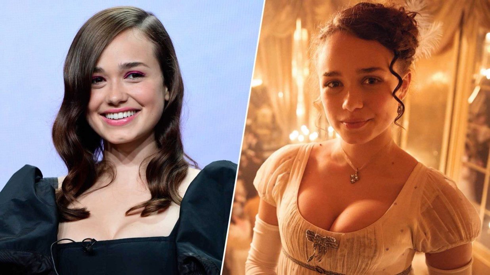

In [Part 2](/caterina-sforza-2), we left **Caterina Sforza** as Countess of Forlì. 🧛🏼‍♂️

Word on what she had pulled off traveled fast around Europe, making her both famous and infamous.

On the plus side, she was a widow now, having her late husband **Girolamo Riario** suffered multiple wounds from the **Orsi** family, in an assault here depicted by an Academy awarded biopic...

<YouTube source="LoebZZ8K5N0?start=45"/>

<FigureLabel>I'm so sorry. It's just never not funny to me!</FigureLabel>

## A new love

Caterina was a **middle-aged** woman of 26. She had been with Girolamo since age 13. Some even say the real age was 10. 😰

It was time for Caterina to do some rebound dating, and who could have been a better choice than castellan **Tommaso Feo**? After all, it was his heroic initiative and integrity that allowed Caterina to resist the **Bears**.

Caterina took a long look at Tommaso Feo...

<FigureLabel>Tommaso Feo</FigureLabel>

...then quickly diverted her gaze toward **Giacomo Feo**, Tommaso's 20 years old brother, employed at Ravaldino as a stable boy.

Very much unlike Tommaso, Giacomo was **hawt**!!!

<FigureLabel>Giacomo Feo
    <NewLine/>
    Full disclosure: I faceapped his portrait a tiny bit to make him look hotter than he was.
    <NewLine/>
    I did it to better convey how hot he was.
</FigureLabel>

Caterina was definitely into Giacomo. Especially since Girolamo was never a looker, and lately got obese due to all the **decadence** he exposed himself to.

The two enjoyed a secret **tryst** that turned out to be much more. Giacomo and Caterina loved each other and ended up marrying in secret.

It was now time for Caterina to find a better job for Giacomo. Like, wouldn't it be cool if he took his brother's role as **castellan**?

Yeah, as if Tommaso Feo would ever leave the position!

Then Caterina looked at **herself** reflected in the mirror: "Mmm, I do have the means to make him leave!"

## The castellan cancellation

On a warm afternoon in August, Caterina went to **Castle Ravaldino** for a visit. She was wearing a dress that left very little to one's imagination.

She and **Tommaso Feo** enjoyed an amiable conversation over wine, then caterina lamented how hot the room was in those pre-AC times.

"I shall lay a bit under the shadows in the **orchard**," she casually said. "Care to join, messer Feo?"

You need to understand that under **no circumstances** can a castellan leave the castle that he is guarding.

"My lady, I can't. Under no circumstances can a castellan leave the castle that he is guarding," replied Feo, ignoring that there was a **narrator** that had just provided the necessary exposition.

"Yeah, no, sure. But the orchard is just right there," said Caterina pointing outside the window. "Oh well, then I and my beautiful rack shall go alone..."

Tommaso Feo's gaze indulged on Caterina's figure for several mississipis, then he capitulated. "Maybe just for a **few minutes**."

<FigureLabel>Tommaso and Caterina looking at the orchard outside castle Ravaldino.<NewLine/>I'm not sorry for this.</FigureLabel>

Under a **fig tree**, Caterina delivered some very well crafted flirting lines.

When she felt the time was ripe, Caterina stood up, her golden hair glittering, and said: "Well, it is the late hour and I must retire to my chambers. Alone. A sad widow. If only there were a man willing to fill my **emptiness**."

At that point, Tommaso Feo became extremely **horny**.

All **giggly**, he followed Caterina into her apartment, but while he was trying to untie his breeches, a big hand pulled him back.

"What is the meaning of this?" said Caterina's **personal guard**.

"Oh, thank you, sir!" cried Caterina. "This **creep** has been following me all day. Couldn't take no for an answer!"

"But, my Countess, you have all but invited me in!"

"Ok, wow, are you gaslighting me right now? Classic entitled **white** male!" shouted Caterina. "And also, I wouldn't know this because I'm a woman, but aren't you, like, supposed to be inside the castle all the time?"

"She's right," said the guard. "That's the one rule you guys have!"

"My... My Lady, please!"

"Not a good look, **chief**. Not a good look at all!" concluded Caterina, while poor Tommaso Feo was being brought away.

<FigureLabel>I'm probably the first in the world to say this, but Caterina memes are all 10/10 memes.</FigureLabel>

With **Giacomo** installed as the new castellan, Caterina enjoyed the happiest years of her life. Maybe, just maybe, we can have nice things, after all.

## We can't have nice things

Caterina's union with Giacomo didn't stay secret for long. Servants started suspecting something when they noticed how much time the two spent together in bed **naked**.

This angered a lot of important people. You see, as [Sapiens](https://www.bookdepository.com/Sapiens-Yuval-Noah-Harari/9780099590088) explains, in the Middle Ages wealth was a **zero-sum** game. You could not create wealth from the absence of wealth. There simply wasn't the technology.

Back then, wealth was strictly tied to land, that you could only take away from someone else, and you could do it either by **war**, which was messy, or by **marriage**, which had its moments.

For aristocrats, marriage was the preferable way of increasing wealth by merging assets with powerful families.

So, by marrying a stable boy, Caterina made her assets unavailable. Adding to that, Caterina was probably the most popular woman in Europe, and she was incredibly **beautiful**. As a result, many nobles wanted to merge assets with her. Merge those assets real good.

<FigureLabel>To portrait Caterina in season 3 of the show Medici: Masters of Florence, the producers thought well to clone Emilia Clarke.</FigureLabel>

Which meant that Giacomo had to die.

On the way back from a hunt, Caterina was on a carriage with her entourage. They were attacked by **ninjas**.

Giacomo was a bit far behind following on horseback. At the time, he was no longer a castellan, so he was allowed outside. This is not a **plot hole**.

Once they spotted Giacomo, the assassins focused on him. After a short chase, they reached the former stable boy and went all stabby-stabby on him.

Heartbroken for the death of her true love, Caterina went quickly through the seven stages of grief. Then, somewhat unsatisfied with the outcome, she introduced an eighth stage, the **Quentin Tarantino**.

**End of Part 3.**

After a bathroom break, go to [Part 4](/caterina-sforza-4) , where Caterina will unleash a vendetta so gruesome that **Kill Bill** in comparison is a Saturday afternoon cartoon.
