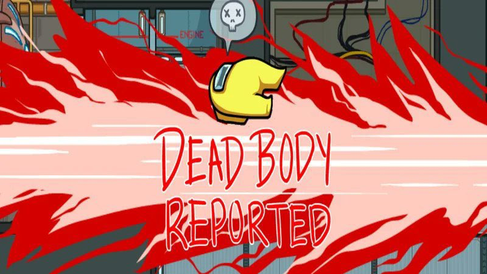
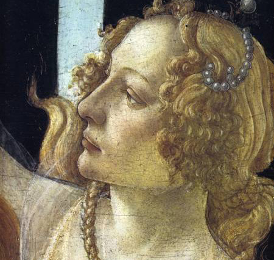
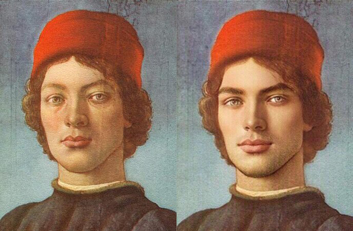
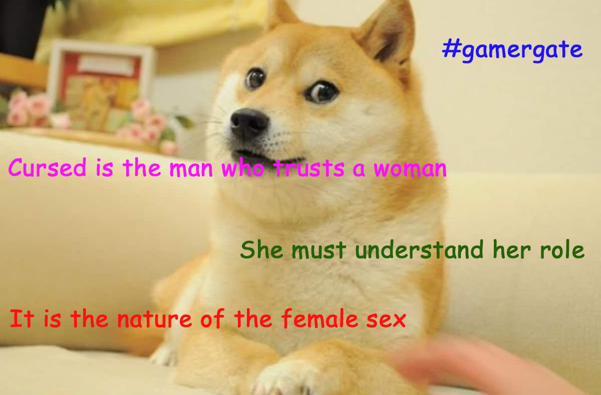

In [Part 3](/caterina-sforza-3), we left Caterina grieving her lost love and toying with the idea of delivering a bit of the old ultra-violence. We'll get there, but first let's talk about Giacomo for a minute or so.

## Let's talk about Giacomo for a minute or so

For a former stable boy, Giacomo Feo proved to be completely unstable.

We like to blame aristocrats for their orgies, their shitty McMansions, their tweets about cryptocurrencies. And we come up with solutions to fix aristocracy, like tax them, cancel them, something something, communism! The thing is, given the wrong incentives, all people are dicks. All of them. Giacomo included. We tend to forgive **hot people** because they inspire us sexually. But should we?

As Giacomo's power increased, his cruelty and insolence went off the charts. He enjoyed the whole gathering of riches a little too much and couldn't get enough of it. As a result, he incurred the hatred of many, including the Sforza children.

In one occasion, Giacomo Feo became extremely mad at **Ottaviano Riario**, Caterina's firstborn whom we met in [Part 2](/caterina-sforza-2), held at knife-point by the **Orsi**. 🐼️

In front of several Forlivesi, Giacomo violently slapped Ottaviano.

<iframe src="https://giphy.com/embed/xT1XGZ1NVqijIqFUTS" width="100%" height="100%" style="position:absolute" frameBorder="0" class="giphy-embed" allowFullScreen></iframe>

Now that we have **deconstructed** Giacomo Feo from a Brad Pitt type to a, well, Brad Pitt type, what do we know about the men that plotted his murder?

They were incredibly close to Caterina. The closest of them all we will call **Mr. X**. We are going to reveal his identity later, for effect.

Now let's discuss what you're here for, the **Quentin Tarantinian** retribution.

## The angel of death

Caterina sent a raven to former castellan **Tommaso Feo**, now exiled in Imola...

<Indented>
    Dear Tommaso,
    <Break/>
    I don't love how we left things, but I'm ready to <strong>forgive you</strong>. Your little brother has been killed. Help me murder the people responsible.
    <Break/>
    xxx
    <NewLine/>
    Caterina Sforza
</Indented>

It was time to go **medieval** on a bunch of asses.

What follows is the gruesome account of the acts that **Caterina Sforza** and **Tommaso Feo** committed to avenge Giacomo. It's a bit much to take in, so I suggest that you read the paragraph by listening to this song. It should help.

<YouTubeAudio url="https://www.youtube.com/watch?v=mML2fPec7xU"/>
<Break/>

The investigation was swift, as the conspirators, right after killing Giacomo, thought well to reach the main piazza and boast what they just did to anyone. Italians.

Let's start with the person that materially went stabby-stabby on Giacomo. This was non-other than **Giovanni Antonio Ghetti**, whom we briefly met in [Part 3](/caterina-sforza-3). He was the guard who arrested horny Tommaso Feo. 🤯

Ghetti was chased down to a **cemetery**. When he got caught, all his extremities - head, fingers, toes, other stuff - were separated from the body in the most entertaining order.

Ghetti's wife **Rosa** was Caterina's best friend. She and her children were thrown in a well and left to die.

Their younger kid, five years old, survived a few days more hiding with friends of the family. He was later found and taken care of, together with the friends of the family, of course.

<iframe src="https://gifer.com/embed/GROG" width="100%" height="100%" style='position:absolute;top:0;left:0;' frameBorder="0" allowFullScreen></iframe>

The other Ghetti brothers and their loved ones met a similar fate.

Then, Caterina targeted all the families that somewhat **resented** Giacomo: the Marcobelli, the Delle Selle, the Orcioli. Yes, even the Orcioli. They were all thrown into the dungeons of Ravaldino. Their houses and estates burned to the ground.

**Domenico da Bagnacavallo** was tortured until he revealed that a priest was also involved. Plus, he confessed the name of the head conspirator: one **Mr. X** whom we will reveal later, for effect.

The aforementioned priest was brought to the main piazza, stripped naked, tied to a horse and dragged around town until there was very little priest left.

**Antonio Pavagliotta**, who joined the conspiracy because he needed money, as he had a very expensive mistress, was hung together with his expensive mistress and, for completion, their three expensive children.

All the conspirators' heads were then cut and affixed to the **bell tower**, where they stayed for over a year, and were ultimately brought down by a windy day.

So it goes.

## Well, that happened

Even if this occurred, like, decades ago, it seems a bit distasteful to be here celebrating Caterina Sforza as if she was **Sailor Moon**. So I feel the need to clarify.

Do I think that Caterina went way over the line with these acts? **Yes**.

With that in mind, if I was the one that got murdered, would I want my wife to kill 38 people in reprisal? **Also yes**.

<FigureLabel>
    Maybe I overreacted a tiny bit
</FigureLabel>

## Mr. X

We have left out the identity of Mr. X, for effect. This means that it must be some **unbearably** explosive revelation. I can confirm that this is the case. The name of Mr. X has been mentioned a few times in these pages. Can you guess it?

Take a few minutes to think about it.

* Was it incel **Niccolo' Machiavelli**, still mad for not getting that brexit deal he wanted so badly?

* Or was it maybe **Ludovico Orsi**, bearing tainted feelings against Caterina?

* Or could it have been **Tommaso Feo**, begrudging the way Caterina #metoo'd him?

The identity of Mr. X is...

<Spoiler>
    <h3>Ottaviano Riario!</h3>
    

        Yes, Caterina's oldest son of 16, legitimate heir of Forlì, who had been hostage of the Orsi 🧸, then publicly slapped by the late Giacomo Feo, was like "I ain't taking any more bullshit from any grownup!" 😭😭😭
    

    

        <strong>OMG</strong>, right? Caterina was destroyed by the news and for a long time avoided any confrontation with the child. When she finally found the resolve to meet him, everyone feared the worst possible outcome.
    

    

        In the end, Ottaviano was sent to his room. I'm not joking.
    

</Spoiler>

So, did you guess it? I gave you all the clues! I also posted a gif of that cunty little **Lannister** being slapped! Maybe you were suspecting the Orsi due to the 🐻 references. That's good old misdirection!

## Third love is the charm

It was the year **1497**. Caterina Sforza was depressed for the loss of Giacomo and felt bad for murdering perhaps too many people.

Luckily, the year 1500 was approaching. A **Jubilee** year during which you can pay a bag of money to the Church and get a blank slate pardon for your sins. So that was nice!

In nearby Tuscany, Lorenzo the Magnificent had passed away in 1492. He was succeeded by **Piero de Medici**, also known as the *Not exactly as magnificent, to be quite honest*.

His kids were collectively nicknamed *The Diminishing Returns*, and from that point it was turtles all the way down.

On the other hand, one of his nephews was a smart, well-read, kind man: **Giovanni de Medici**.

Giovanni was tasked to go to Forlì and beg Caterina for help to fight against **Pisa**, which reminds me...

Long story short, Giovanni and Caterina really clicked, he reached second base real fast, one thing led to another, they got married. ❤️

## Full disclosure

Look, I effed up. In [Part 3](/caterina-sforza-3), I posted a hot picture of **Giacomo Feo**, which turned out to be incorrect. That man was in reality **Giovanni de Medici**, who also was easy in the eyes. I blame my poor Google skills for this.

Fortunately, I had faceapped Giacomo's picture for comedic reasons, so they look different enough and I don't think I have to go back and fix the post. We can just say that Caterina had a type.

<FigureLabel>Giovanni de Medici               Giacomo Feo</FigureLabel>

Giovanni and Caterina enjoyed a few amazing years together. They had a child also named Giovanni, and we need to put a pin here <AiTwotonePushpin/> because **Giovanni Jr.** is going to become an awesome character, well deserving a chapter of his own.

Incidentally, do you know who didn't love House Sforza and House Medici merging assets? Why, nearby **Venice** and its leader the Doge.

The Doge didn't mince words about Caterina. He was a bit of a boomer. Let's report a few of them in form of a meme...

Venice decided to attack Forlì and Florence. Caterina Sforza put on her **battle armor** +10 and prepared to meet Venice in battle.

But... wait a second... did... did Giovanni de Medici just die?

Already?!

## Yep 😢

You see, like any Medici, Giovanni suffered from the gout. Fellow kids, I hope this is a cautionary tale for you to stay clear from the temptations of **inbreeding**!

At least, Giovanni died the same way I also want to go, inside a spa in **Tuscany**, with Caterina Sforza as the big spoon. ❤️

<TextBox title={"Top 5 causes of death in Renaissance Italy"}>
    

        <ol>
            <li>People going all stabby-stabby on you</li>
            <li>A series of illnesses that originate from the drinking of poop</li>
            <li>Sudden death in the cradle (like one of those Windows blue screens)</li>
            <li>The gout</li>
            <li>Old age (around 38)</li>
        </ol>
    

</TextBox>

In retrospect, **Venice's** attack was probably good for Caterina. At least she felt compelled to take care of that, instead of being all sad, avoiding the shower, studying CSS, reading about Caterina Sforza, and watching Parks & Recreation all day in her sweatpants under the effect of mushrooms.

"If I must lose because I am a woman," she wrote to her uncle, "I want to lose like a man."

No, Caterina, don't talk like the Patriarchy!

As much as I would like to close the chapter here with a cliffhanger on the eve of battle, let's just spoil it instead. Caterina won big time against Venice. Florence and Forlì were saved. The **Doge** had to withdraw with the tale between his legs. Yadda yadda yadda.

We really need to close and mop the floor a bit because...

**End of Part 4.**

...in [Part 5](/caterina-sforza-5), a new player joins the fight: **Cesare Fucking Borgia**. And for Caterina, things will go for the worse. The much, much worse.

The blog will be now taking a pause of five weeks, for effect.