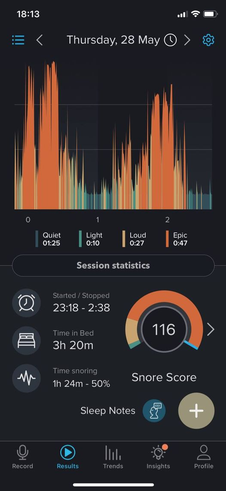
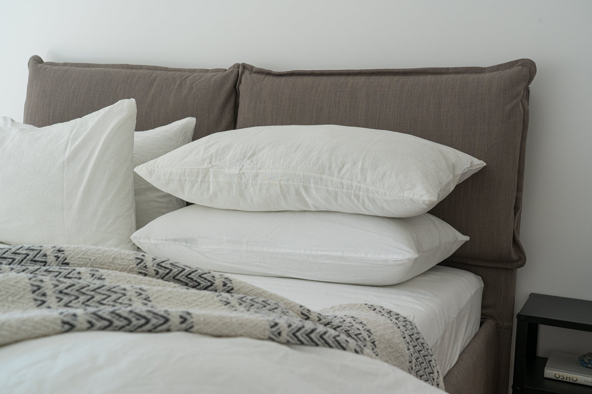
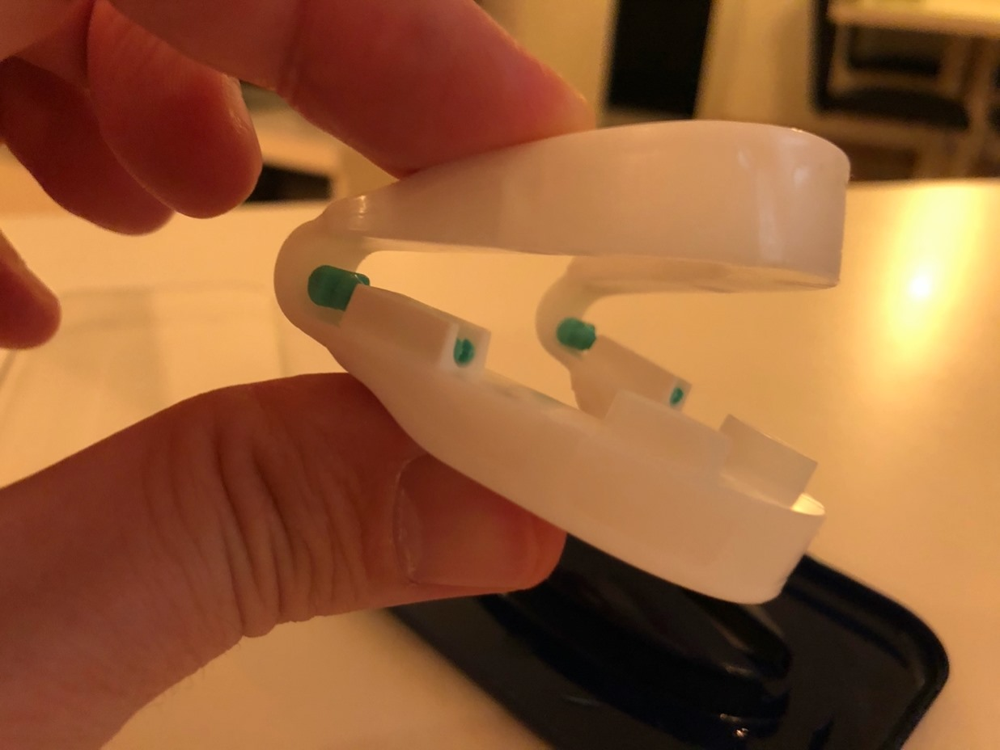
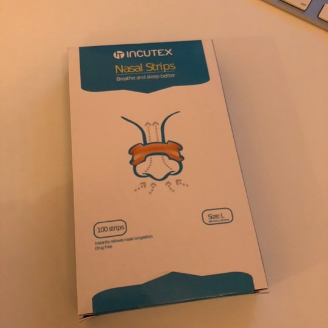
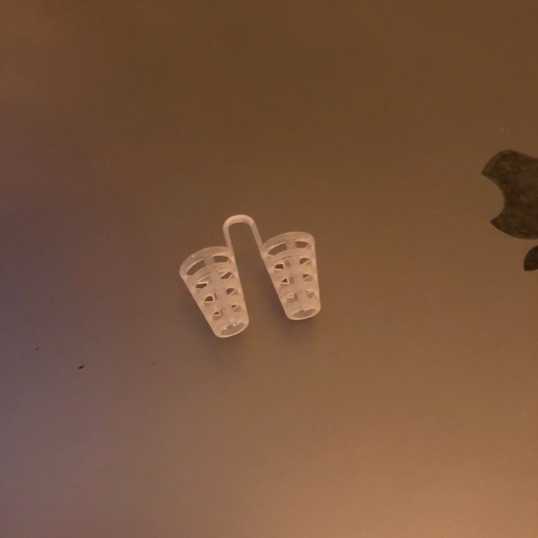
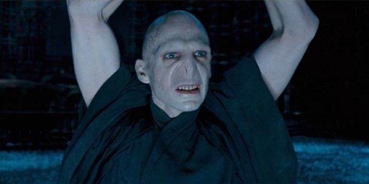
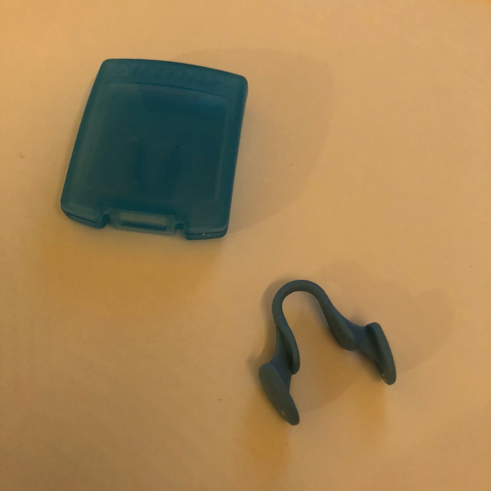
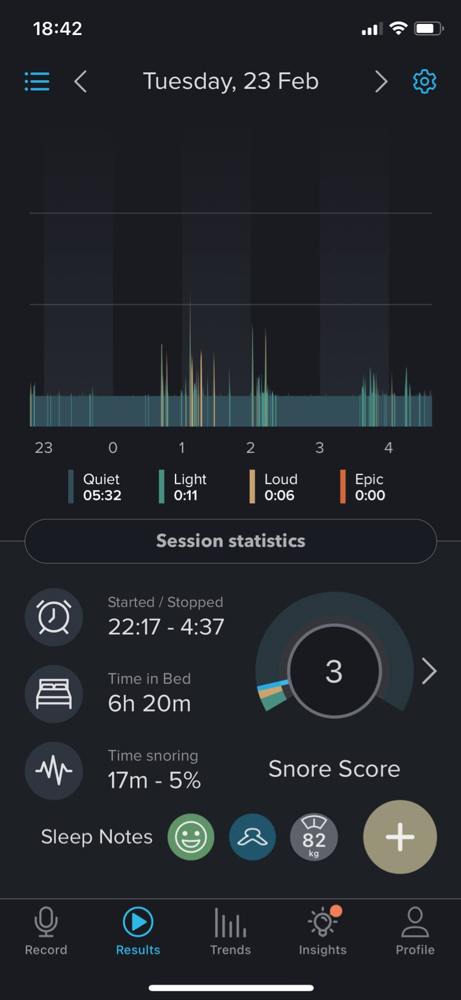

Do you snore or know somebody that does? Continue reading, and you might save a marriage!

Hello, my name is Gianluca, and I'm a **snorer**. In the past, my snoring was essentially due to being overweight. More recently, despite pushing toward 13% body fat, I was still louder than 2.3 Pavarotti. Why? Let's just say that something happened in 2019 that made things go tits up.

And how up did those tits go? We can measure it by using an app for that. The solution for any problem of the modern world! In the past several months, I have been monitoring my sleep via [SnoreLab](https://www.snorelab.com). As you can see in exhibit A, my snoring levels are akin to a Harley-Davidson cruising the EuroTunnel with a broken exhaust.

<FigureLabel>Exhibit A</FigureLabel>

On that baseline, I AB tested several strategies to reduce snoring.

### Sleeping position

So, how does one reduce their snoring, anyway?

First, the sleeping position. I've tried so many sleeping positions that I could write a book, which I would name *Sleepasutra*, so I better purchase the web domain before some of you dumbfucks steal it.

Bottom line, you probably want to sleep on your side, also because it carries other benefits like not dying ahead of schedule.

<YouTube source="O8UoAASCUsQ"></YouTube>

Did it work for me? In part, but sleeping on the side makes my shoulder sore and wakes me up several times per night, which is not great. According to [this book](https://www.bookdepository.com/Why-We-Sleep.../9780141983769), a night of uninterrupted sleep carries as many benefits as, say, quitting smoking.

### Pillows

Then let's talk pillows. I have purchased and tested different kinds and shapes of pillows, stacking them in all the possible permutations. Did it help? Almost as much as doing eff all!

Months passed with inconsistent and diminishing returns, and my Facebook feed is now basically a series of ads for pillows and nan-bread-shaped blankets.

### Mouth goobers

Then, Joe Rogan told me -- he called, it was strange -- that he fixed his sleep apnea with a mouthpiece, so I ordered one. It didn't work. Turns out that my snoring is more of a nose thing.

But if you are a mouth snorer, definitely get a mouthpiece because you risk damaging your hearth, among other things. Only, talk to your mouth doctor and get a custom one; because the generic stuff I bought will make you drool more than Pavlov's dog at Sunday mass.

So I moved my focus elsewhere. I had to open my nostrils as if they were giving birth.

### Nasal strips

I first tried with bands that you stick to the nose as *Rocky Balboa*. So now I know all about band brands: their size, stickiness, rigidity.

Did they work? Not exactly. The main issue is that I tend to have oily skin, which is cool because it keeps me younger, but it gets more slippery than a floor filled with banana peels. A waxed floor, I mean. Banana peels are not that slippery because cartoons lie to you.

### Nose goobers

Then I figured if the exoskeleton solution didn't work, I should try the endoskeleton one.

*(But a skeleton is already endogenous, so I wrote a stupid thing, and you didn't correct me.)*

I purchased these goobers that you put in your nostrils to keep them all widened up. I had excellent results the first few nights. I built hope and then was crushed when they stopped working.

The main problem is that I started losing them during the night. Not only did I lose them: I found them at my feet. Adding to the mystery, during that period my neighbors asked me if I was popping champagne bottles at 3 am.

I guess we will never know what happened.

### Third act crisis

At some point, I was so frustrated by the lack of progress that I considered cutting my nose entirely. But then I would have sported a Voldemort look, thereby endorsing **J.K. Rowling** and her anti-transgender agenda. So I was like how about no.

### Final boss

Then [Amazon](www.amazon.se) opened shop in Sweden. I logged in, and **Jeff Bezos** said hi and advised me to buy these nostril openers. He knows me so well!

I ordered them with no hope left in my hope bucket. But then I tried them, and I felt like Cinderella when she got her snoring fixed!

Here the astonishing results...

## The astonishing results

And those peaks you still see? They are not even snoring sounds! It's just me whispering in the sleep:

𝕿𝖍𝖊 𝖆𝖌𝖊 𝖔𝖋 𝕸𝖆𝖓 𝖎𝖘 𝖆𝖙 𝖆𝖓 𝖊𝖓𝖉. 𝕾𝖔𝖔𝖓 𝖙𝖍𝖊 𝕬𝖓𝖈𝖎𝖊𝖓𝖙 𝕺𝖓𝖊𝖘 𝖜𝖎𝖑𝖑 𝖋𝖊𝖆𝖘𝖙 𝖚𝖕𝖔𝖓 𝖔𝖚𝖗 𝖋𝖑𝖊𝖘𝖍. 𝕱𝖊𝖆𝖗 𝖙𝖍𝖊 𝖔𝖑𝖉 𝖇𝖑𝖔𝖔𝖉.

No, seriously. I promise that those aren't farts!