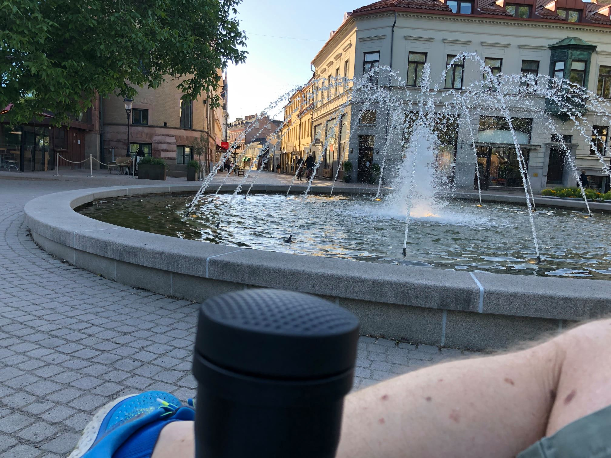
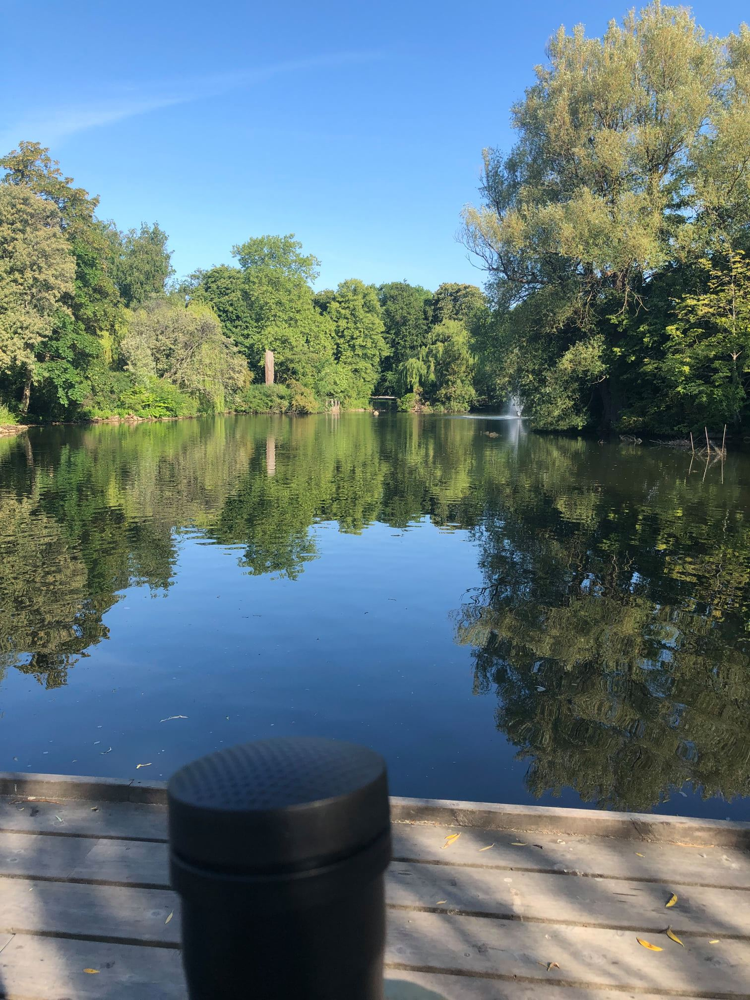
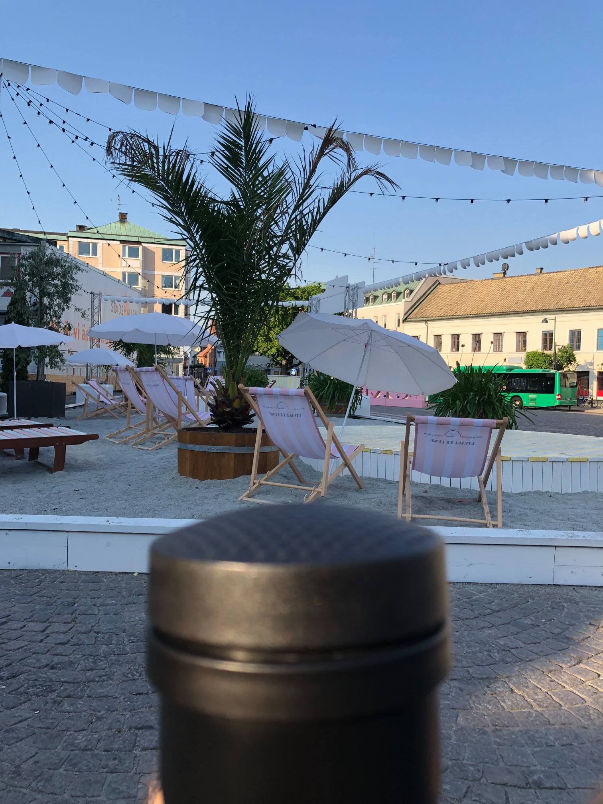
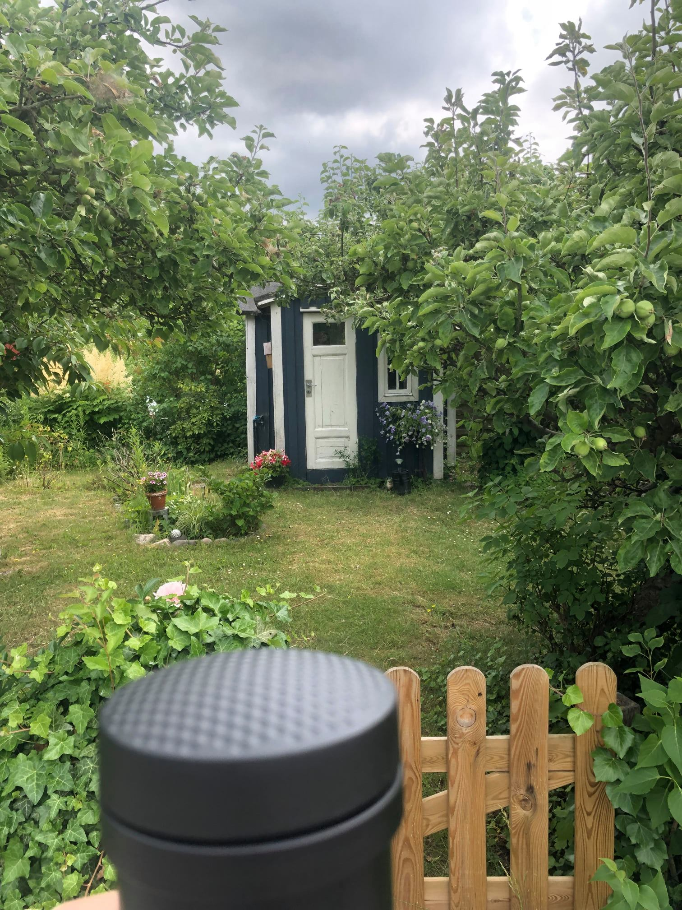
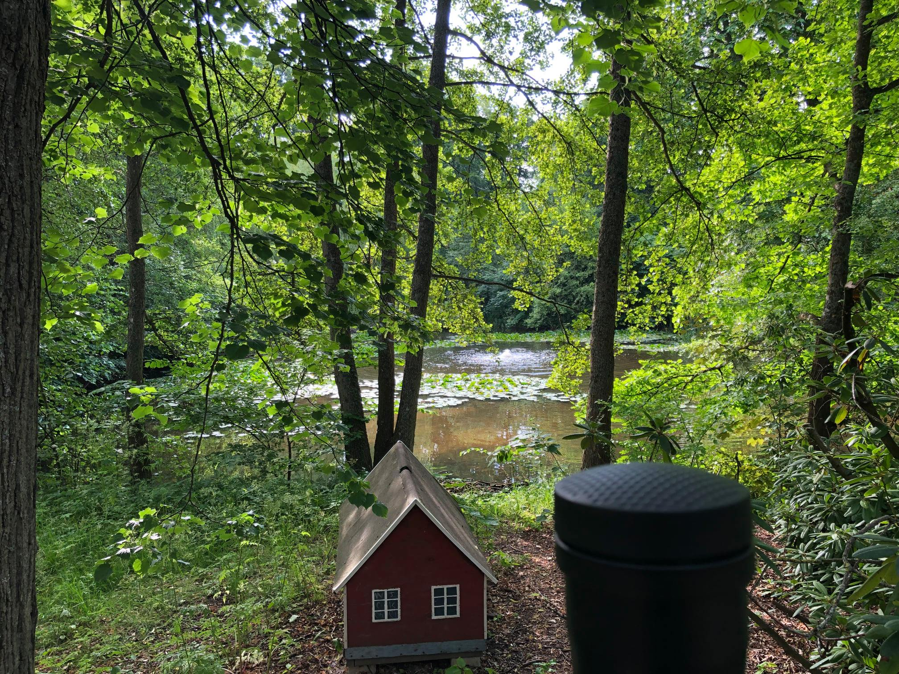

In the past ten days, I've challenged myself to walk at least 20 thousand steps per day.

To achieve this, I had to add walking sessions to my daily routine. For instance, at 6:00 am I used to brew coffee and drink it while sitting on a chair like an asshole. Well, now I drink it while taking a long walk like an asshole.

(Why walking and not running? Running tires me and disrupts other workouts. Plus, it shocks the joints and ends up eating muscle together with fat. Running is so 2006.)

After ten days of this regime, I have shaved two centimeters out of my waistline. Although to be fair that could have been gas.

Anyway, this has also allowed me to see the town with different eyes. The eyes of a pilgrim, one might say. The following are my conclusions:

* Frisbee golf is huge here, and people act as if it's nothing
* Crows are disgusting with the way they scatter around stuff from the trash cans. They are just dirty pigeons in their emo phase
* Nothing better than a morning walk to be alone with your thoughts. I'm farming a lot of ideas during these sessions. Don't waste it by listening to a podcast. Please consider subscribing to NordVPN by clicking the referral link [gianlucabelvisi](nordvpn.com/gianlucabelvisi)
* Dog owners touch their dog's poop while still lukewarm every single day. If this is not love, I don't know what love is...

s

