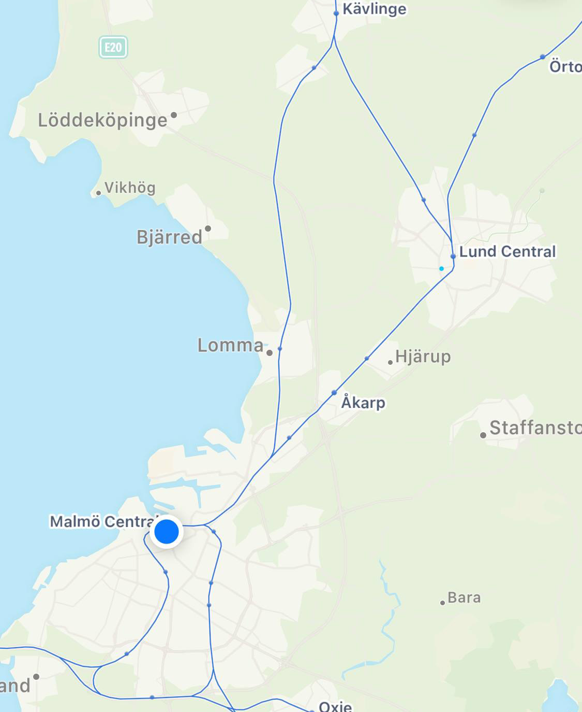

So, I live in Lund and work in Malmö. This is my first week of Working From the Office. It's a new thing we are trying.

Yesterday at 18:00 I headed to the train station to go home, which turned out to be a mistake.

Usually, it's a ten minutes ride: not even enough to open a book and remember the chapter or which side is up. But this time all trains are canceled because there is a dead pigeon on the tracks outside Åkarp.

People are forming an Italian queue on the spot where replacement busses naturally show up in these circumstances, but I remember that I'm smart, so I wait instead for bus 139 to Lomma, because it then keeps on going to Lund for some reason. Already inside the bus, I realize that I forgot my keys in the office, so I beg the driver to eject me from the vehicle.

I fetch the keys and head back to the replacement bus area; my only alternative now. There are still a lot of mildly annoyed people waiting, but I manage to skip the queue and jump on a bus by saying a little white lie: "No, this one goes to Helsinborg."

The bus ride is crammed with human people and a pungent touch of armpit smell. Upon further inspection, I realize it was me. I got home at 20:00.

God, I missed this so much!

