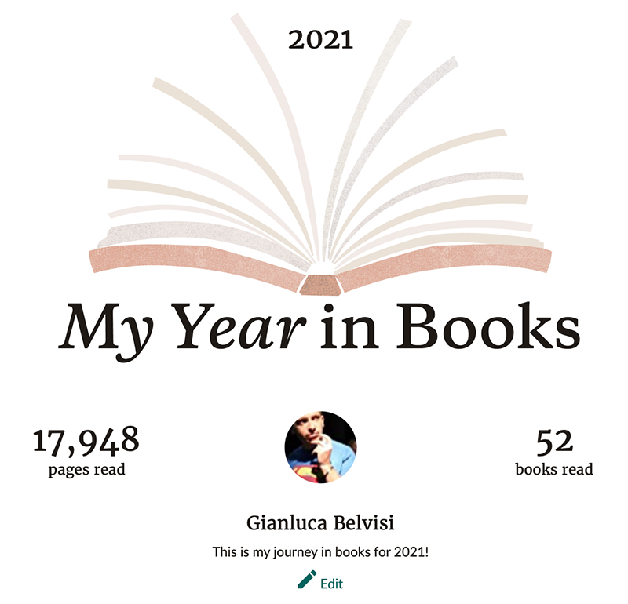
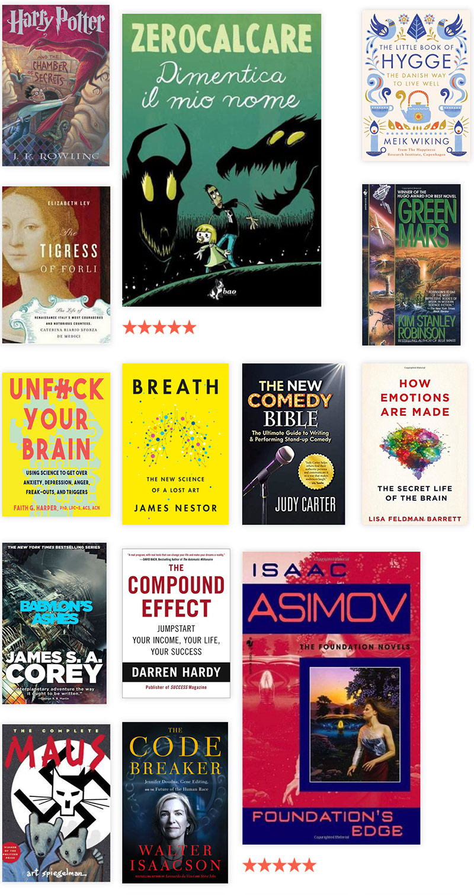
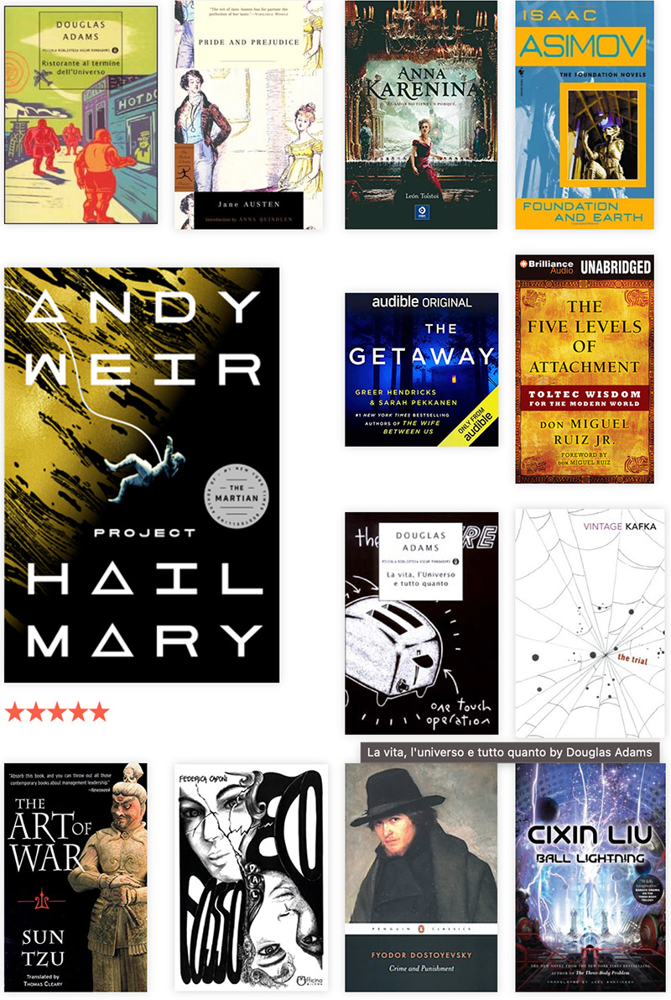
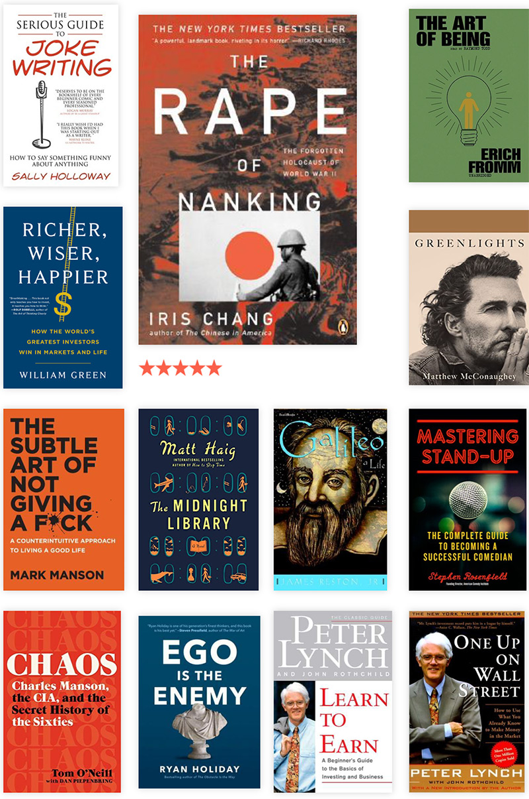
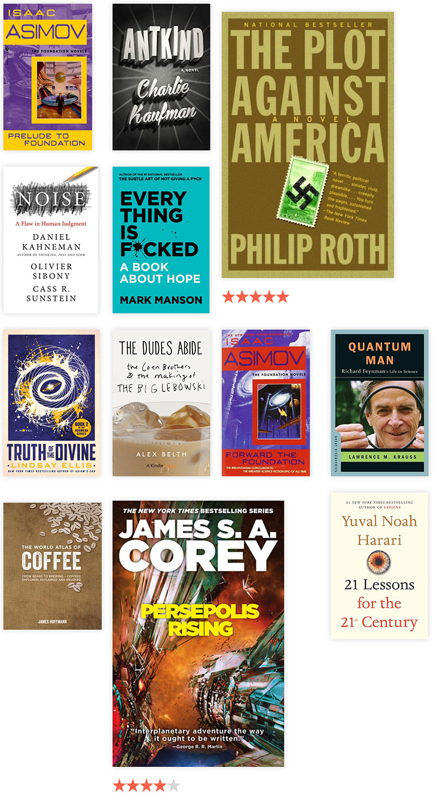
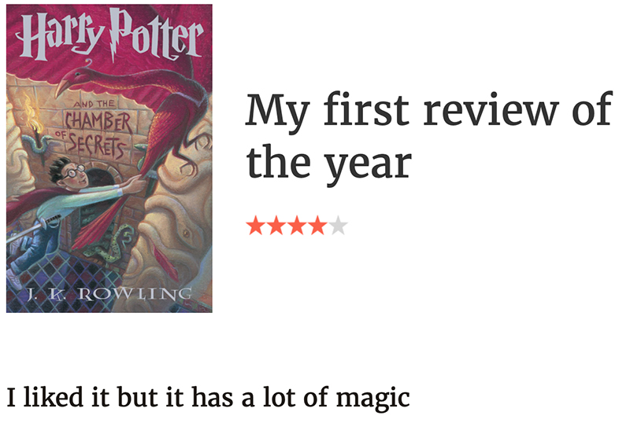
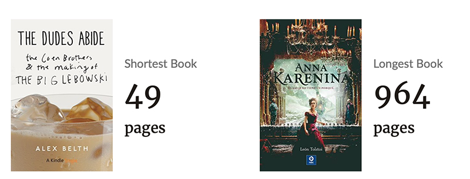
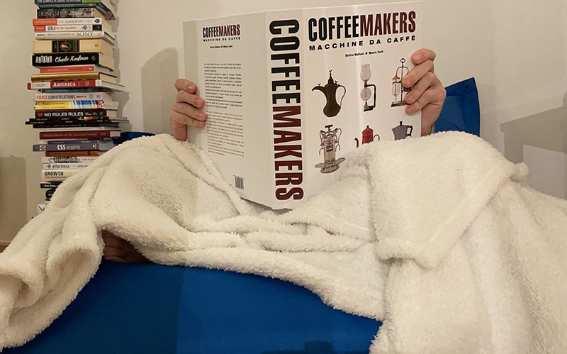
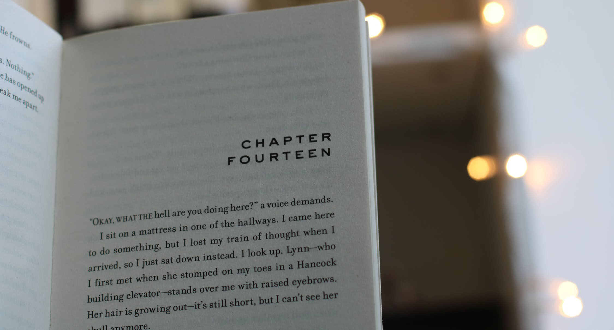
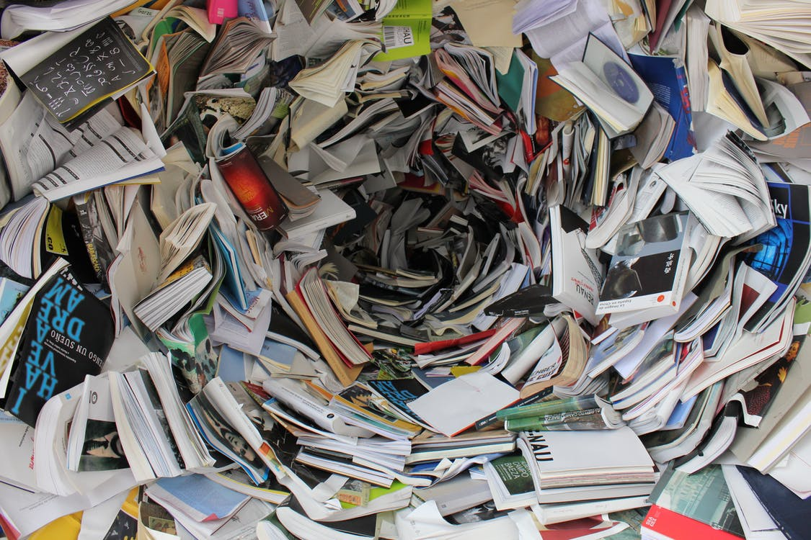

import {Richer, Crime, Hailmary, Pride, Greenlights, Truth} from "../../../components/blog/Grids";
import {Pony} from "../../../components/blog/Text";

Not to brag but -- proceeds to brag -- after the success in [2020](/books-2020), I'm happy to say that in 2021 I have met my target of reading **52 books!**

Which means that I have **read** a book per week, but I prefer to say that I have **lived** a week per book.

(This sentence might seem inspiring, but as with all things inspiring, if subject to a greater scrutiny, it's exposed for being actually dumb, so let's quickly move to the next paragraph!)

Now, reading 52 books is a result I'm extremely proud of, but also a **lie**. It was more like 56. I have held on completing the final four so that I could account them in 2022.

It's like a tax thing, but for **culture**.

And since I was ahead of schedule, in the final weeks of 2021 I got to spend some well deserved time with the **PS5**, and I thought it was really fun!

Here is my **unlocked achievement**...

And here is the **logorrhoeic** list in biographical order. Follow me downstairs, as we will spend some time talking about a few of them.

While I'm happy with the selection, I feel like this list is in aggregate **weaker** than the one from [2020](books-2020). So, if the trend continues, probably I won't have any interesting books to read by the year 2045, which I think it's really cool because I want to spend time outside.

Now, let's talk about reviews.

## Let's talk about reviews

Repeat with me:

<Pony>Reviews are dumb. Stars are dumb.</Pony>

I'm phasing out of starring and reviewing books. This is not **Tripadvisor**. These are not restaurants. Books don't give you diarrhea. Except for that one. You know which one.

<FigureLabel>
    It did have too much magic. It was a whole thing.
</FigureLabel>

Instead of reviewing my favorite book of the year [The Tigress of Forlì](https://www.bookdepository.com/Tigress-Forlì-Elizabeth-Lev/9780547844169), I'd rather just write a series of five [blog posts](/caterina-sforza-1) about it that clock at around **10000 words**. It seems more respectful than tapping on a bunch of stars and writing a tweet sized impression from the pooper.

You should do the same.

## Longest VS shortest book

How do you write about the making of **The Big Lebowski** and stop at 49 pages instead of, say, the 1049 it well deserved?

For symmetry's sake, I would like to be equally salty on **Anna Karenina**, but unfortunately this is quite possibly the best novel ever written. The chapter where she poisons her mind with self-inflicted toxicity is going to stick with me for a long time.

These **Russians** are not really phoning it in, are they?

## What else I loved

### Richer Wiser Happier

<ThreeColumns>
    <Richer/>
    <Col23>
        

            Probably a quirk of mine, but I really care about becoming <strong>rich</strong>.
        

        

            Does money buy happiness? Of course not. But it buys you <strong>experiences</strong>, which you can translate into happiness, provided that you are not a dumbfuck and use the money for heroin instead.
        

        

            This book tells the story of some of the greatest investors of all time. What is their background and approach to investing? What makes them tick? One of the best books of the year.
        

    </Col23>
</ThreeColumns>

### Greenlights

<ThreeColumns>
    <Greenlights/>
    <Col23>
        

            Look, I'm not gay, but listening to <strong>Matthew McConaughey</strong> talking about his life? Oh Em Gee!
        

        

            Maybe <strong>Louis CK</strong> is right. We are all gay for the best...
            <YouTubeAudio url="https://youtu.be/EdffVf678as?start=100"/>
        

    </Col23>
</ThreeColumns>

### Project Hail Mary

<ThreeColumns>
    <Hailmary/>
    <Col23>
        

            Andy Weir's books are a celebration of what humanity can achieve through science. His first book <strong>The Martian</strong> is one of my favorite sci-fi novels ever.
        

        

            This one is up there, and it's one of those stories where you don't want to know anything. You shouldn't even read those pesky summaries on the back of the cover.
        

    </Col23>
</ThreeColumns>

### Pride and Prejudice

<ThreeColumns>
    <Pride/>
    <Col23>
        

            On paper, this is a story about rich white people and their mating rituals.
        

        

            But it's so much more. There is such a modernity in its telling, and the dialogues are incredible.
        

    </Col23>
</ThreeColumns>

### Crime and Punishment

<ThreeColumns>
    <Crime/>
    <Col23>
        

            Russians, again. What's up with them? How can they produce so many masterpieces? Is it a combination of vodka and shitty weather?
        

    </Col23>
</ThreeColumns>

<FigureLabel>
    In the interest of full disclosure, I should say that I'm completely naked behind that blanket and book. I'm pivoting to steamy pictures to drive up engagement. Speaking of steam...
</FigureLabel>

## Steaming hot takes

<Pony>
    Reading Franz Kafka is like climbing a ladder while having a cat attached to your testicles. 🦄
</Pony>

<Pony>
    Douglas Adams is less fun than you remember. 🦄
</Pony>

<Pony>
    Charlie Kaufman's novel is worse than bad. It's mildly disappointing. 🦄
</Pony>

<TextBox title={"Truth of the Divine"}>
    <ThreeColumns>
        <Truth/>
        <Col23>
            

                Lindsay Ellis' <strong>Truth of the Divine</strong> is the second part of a sci-fi saga mostly told inside military bases, with an obnoxious brunette falling for a three meters tall alien robot that looks like a rooster.
            

            

                At some point, the word <strong>bestiality</strong> is spoken... by the alien rooster 🤭
            

            

                I adore everything <a href="https://www.youtube.com/channel/UCG1h-Wqjtwz7uUANw6gazRw>Lindsay" target="_blank">Lindsay</a> does. Not this one. I had to quit halfway through.
            

            

                Which brings me to...
            

        </Col23>
    </ThreeColumns>
</TextBox>

## Three rules on reading

### 1 - Audiobooks are books

There are people that, when they hear that you listen to **audiobooks**, will scoff at you and say things like:

<Pony>Oh, I would never be able to do that. I love the feeling of paper too much!</Pony>

Now, these people are **pieces of shit**, and it's important to remind them at every occasion.

Actually, let's find a term that is both more and less derogatory... 🤔💭 ... **SERF**.

Sound Exclusionary Radical Fetishists. Let's make **SERF** happen!

### 2 - You don't have to read all chapters

This mostly applies to non-fiction, but it has some uses on fiction, too. For instance on chapters that describe **dream sequences**. You can, should, must, and will skip dream sequences.

More generally, you shouldn't feel compelled to read all chapters in the book. Not all chapters are the same. Most books make their point across in a hundred pages or so, then they have to add meat to justify the cover price.

And many concepts are simply redundant or repeated across many books. If I have to read again about [survivorship bias](https://en.wikipedia.org/wiki/Survivorship_bias), or [Dr. Gazzaniga's](https://www.nature.com/articles/483260a) work on patients with split brains, I will set myself on fire.

### 3 - You don't have to finish a book

I can immediately tell when a **tv show** is not for me, and I'm very eager to stop watching it, probably around the seventh season.

Same for **movies**. I find it desirable to not finish a film that I don't enjoy, and hence regain a bit of life. And while I would not storm out of a cinema before the end credits out of respect for the people in the theater, I'll just stop paying attention and use the time to mentally undress those very same people.

And I have stopped playing **videogames** while they were still installing. Hello Final Fantasy VII Remake!

But for **books** it feels wrong to quit them before reaching the last page. Why?

* Do we consider books as the dumbest puppy in the litter, requiring more attention than the other smarter siblings?

* Or is it just because we feel bad for not reading enough in the first place?

The solution to both is to read more. By reading more, we will give books their due **respect**, and the ultimate form of respect is to be able to stop reading a book that you don't love and toss it into the recycling bin.

And not even the bin for paper. No, no, the one for glass. In spite.

## Outro

I leave you with **Umberto Eco** looking for a book in his haystack apartment. May this be an inspiration for going full digital!

<YouTube source="UoEuvgT1wBs"/>

