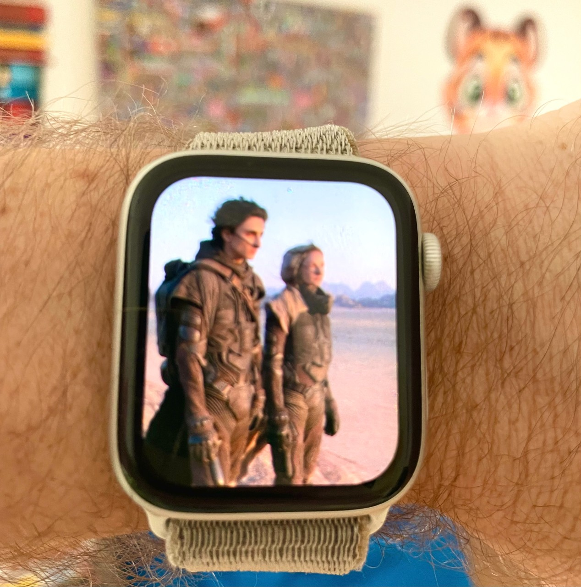

import Poll from "../../../components/blog/Poll";
import TextBox from "../../../components/blog/Boxes";
import {Batman} from "../../../components/blog/Grids";
import {FigureLabel} from "../../../components/blog/Text";
import YouTube from "../../../components/blog/YouTube";
import FilmCard from "../../../components/blog/FilmCard";

Movies. Am I right?

These last 12 months must have been the worst for the motion picture industry, what with us still shaking off a pandemic, most of the greatest directors being dead for at least two decades with no sign of recovery, and **Will Smith** punching his way through an otherwise forgetful Oscar night.

We seem to not care about going to the movie theater anymore, and when we do, it has to be **worth it**. For instance, to watch masked action figures beating each other up in the groin, or sexy people dealing with enlarged worms and beating each other up in the groin.

Can you imagine watching an **art film** in a theater in 2022?

Picture yourself being at home, naked, and then getting the idea that, yes, I should put on clothes to go outside, take the car, queue in traffic, park the car, wait in line, buy pop-corns, sit in a crowded space, smell armpits, endure ads of local shops, and finally get to watch a film about people sitting at home talking.

If you are trying to impress a date, there are less dishonest ways, like staging a robbery.

And people prefer **binging** series at home anyway.

Now, I like series as much as the next lazy person, but I do appreciate the value of a story with a beginning, a middle, and an end, that effs off in **two hours** instead of taking me hostage for eight seasons to build a complex tapestry of characters in a mild fantasy setting, and then have the main protagonist go and burn a town in **Croatia** in accordance to a character growth study based on *bitches be crazy*.

This is why I want to contribute to Society with this list of the **best 10 films** I have watched in the past year. May my quirky taste in movies shine a light!

<FigureLabel>Watching <strong>Dune</strong> the way director Denis Villeneuve intended it</FigureLabel>

**Note**: I'm not including any blockbusters because you have already watched them anyway, and my goal is to help you find the hidden gems. Plus, I plan to use this blog post to impress my dates.

## 10. Promising Young Woman

<YouTube source={"7i5kiFDunk8"}/>
<FilmCard country={"USA"} director={"Emerald Fennell"} starring={"Carey Mulligan, Bo Burnham"} emoji={"🍸"} seenOn={"iTunes"}/>

I had great expectations for this one. I thought that the trailer was excellent, I like the cast, and the director has worked on **Killing Eve**.

<YouTube source={"Kk0PyD-XNZA"}/>

Unfortunately, I don't think that **Promising Young Woman** is particularly well made.

My main issue is that the characters that are supposed to be bad are so bad, or lame, or both, that they don't even seem human, and if they are not human, then their behavior comes across as **alien** to us, not to be concerned with.

But the film's thesis is that their behavior **is** real, and it's very opinionated on how we are supposed to feel.

I believe that the best art forms require the consumers of said art to do some of the work. **Promising Young Woman** disagrees because it cares too much, and a film that completes all the sentences for you is like a video game that plays itself.

But, but, but, if this is such a failure, why including it at all in this listicle? Two reasons.

1. The film fails in an interesting way, and as a result I have been thinking about it way more than some other entries mentioned downstairs

2. This year I have watched, like, 12 films. What do you want from me?

## 9. Titane

Julia Ducournau is the insane mind behind [Raw](https://www.imdb.com/title/tt4954522/?ref_=nm_knf_i2), my favorite film for when I'm fasting.

<FigureLabel>Fun fact, I eat eight chicken breasts per week</FigureLabel>

So I was super eager to see her latest work **Titane**, which by the way won the Palme d'or. The trailer is... well... I'm not sure?

<YouTube source={"Q5_w2W5G9OM"}/>
<FilmCard country={"France"} director={"Julia Ducournau"} starring={"Vincent Lindon, Agathe Rousselle"} emoji={"😵‍💫"} seenOn={"MUBI"}/>

I guess I'll watch it and get back to you.

Ok, I'm sorry, what just happened?

The trailer **lied** to me! I was expecting weird people vibing off each other, and instead I get serial killing, steroid injecting, toxic relations, and car sex -- as in sex with cars, not sex in cars.

I loved it!

What actor **Agathe Rousselle** is doing with her body is incredible and upsetting.

## 8. Nightmare Alley

<YouTube source={"Q81Yf46Oj3s?start=11"}/>
<FilmCard country={"USA"} director={"Guillermo del Toro"} starring={"So many"} emoji={"🎪"} seenOn={"Disney+"}/>

I watched this film knowing that it **bombed** hard at the box office, and for the whole duration I had a strong feeling of: *this is the last one*.

I don't think we will be seeing anytime soon another **big production** with a wide, talented cast and expensive sets, while at the same time not being about super-heroes or big sci-fi tent poles.

Or at least, not in movie theaters.

If anything, this genre will be saved by streaming services, since they have the money to finance them, the ability to generate social media buzz, and the **algorithms** required to put these films in front of millions of eyeballs.

So, Streaming is going to save Cinema.

<iframe src='https://gfycat.com/ifr/SleepyDimCoyote' frameborder='0' scrolling='no' width='100%' height='100%' style='position:absolute;top:0;left:0;' allowfullscreen></iframe>

## 7. The Hand of God
<YouTube source={"i_1VW_0i6vo"}/>
<FilmCard country={"Naples"} director={"Paolo Sorrentino"} starring={"Neapolitan actors"} emoji={"🍕"} seenOn={"Netflix"}/>

For reasons that I'm not particularly proud of, I was once in **Naples**.

This was in winter, on a December 30th, but it was a sunny 15 degrees day outside, so I and my girlfriend at the time strolled around town wearing **t-shirts**.

Well, the **locals**, in their heavy coats, scarves, and gloves, looked at us, shook their heads, and commented along the lines of: "But... don't they feel the cold?"

I'm sharing my **trauma** with you today to properly convey the fact that Neapolitans are not good people, and I'm tired to pretend that they are.

<FigureLabel>Mannaggia ‘o suricillo e pezza ‘nfosa!</FigureLabel>

Which is why I was in hype for this film. You see, Paolo Sorrentino's previous movie **The Great Beauty** helped me justify my contempt for the Romans. So I was thinking maybe he could repeat the magic with Naples, too?

Turns out he did the opposite. He **humanized** them. And while this is not my preferred outcome, I can't help but admire the accomplishment.

## 6. West Side Story

<YouTube source={"A5GJLwWiYSg"}/>
<FilmCard country={"USA"} director={"Steven Spielberg"} starring={"Ansel Elgort, Rachel Zegler"} emoji={"🎹"} seenOn={"Disney+"}/>

Listen, I don't care about **West Side Story**. Never have. The only musicals that I'm into are those with fart jokes, like **Book of Mormon**, or those that mash up a setting with a left of field music genre, like **Hamilton** for hip hop and **Hadestown** for blues.

So I wasn't eager to watch this iteration of gangs fighting and singing, and star crossed lovers kissing and singing.

But then I did and, wow, this film is a monument to great unparalleled **craft**. There are scenes where you struggle to figure out how they were even able to shoot them.

I feel like we will hear more from this director -- *checks notes* -- Steven Spielberg.

*Bathroom break*

<TextBox title={"Interlude: The Batman"}>
    <ThreeColumns>
        <Batman/>
        <Col23>
            

                By the way, I watched <strong>The Batman</strong> and I thought that this movie was very long!
            

            

                You can blame the complexity of the story, the multiple villains, the chase sequences, but I believe the main reason for a 3 hours runtime is that the titular Batman moves really <strong>slowly</strong>!
            

        </Col23>
    </ThreeColumns>
    

        He will enter a room, lethargically look around, and then walk toward center stage completely unhurried, while I'm like, motherfucker, can we <strong>chop chop</strong>? Tomorrow I have to commute to another country!
    

    

        Also, it's very interesting how Batman has a car, but it's just a car? Like, there is nothing special to this car, except some extra swagger, but only a pinch. Kinda like a <strong>Mexican Batman</strong>, but not as much as a Sicilian Batman as one would expect.
    

</TextBox>

<Poll id="newsletter"
      question="By the way did you know that I have a newsletter that you can subscribe to (at the bottom of this article) in order to get new posts ahead of everyone else, plus exclusive content, easter eggs, and more in the future?"
      answers={["Yes, I'm already subscribed", "Yes, but I won't subscribe", "No, but I will right now", "No, go away!"]}
      labels={["Subbed", "I'm a 🦄", "Will sub", "I'm Hitler"]}
/>

*/Bathroom break*

## 5. Swan Song

<FilmCard country={"USA"} director={"Benjamin Cleary"} starring={"Mahershala Ali"} emoji={"👩🏿‍🦲👩🏿‍🦲"} seenOn={"Apple TV+"}/>

Little known fact: **Apple** not only makes phones, computers, and doctors repellent fruit, but also movies.

For instance, there's one with Tom Hanks on a warship doing computer graphics war, and one with post apocalyptic Tom Hanks building a robot to walk his dog for when he dies. But there's also good films!

**Swan Song** plays like a long episode of **Black mirror**, and by that, I mean an excellent episode, not the boring, the toothless, or the sex with pigs ones.

Because of this, you are going to best enjoy it if you know **nothing** about the story, which is why I'm not embedding a trailer. I just don't trust you not to watch it.

## 4. The French Dispatch

<YouTube source={"TcPk2p0Zaw4"}/>
<FilmCard country={"USA"} director={"Wes Anderson"} starring={"His usual crew"} emoji={"🥐"} seenOn={"Disney+"}/>

What are **Wes Anderson**'s movies about?

Let's go on a tangent.

As a kid, I was awestruck by model trains, lego architectures, and even nativity recreations. For miniature enthusiasts like me, there's a best place on earth, and it's in **Hamburg**...

<YouTube source={"ACkmg3Y64_s"}/>

So, what are **Wes Anderson**'s movies about?

They are mostly about themselves building their miniature wunderland and opening a window for you to peek inside this deeply **affectated** world, where everything is symmetric, colorful, cozy. Even the traumatic story elements end up being delightful, because it's all a freaking diorama anyway.

**The French Dispatch** is the latest entry in this genre, and a great one at that.

<small>Plus, Léa Seydoux is naked for most of the time.</small>

## 3. The Green Knight

<YouTube source={"sS6ksY8xWCY"}/>
<FilmCard country={"USA"} director={"David Lowery"} starring={"Dev Patel, Alicia Vikander"} emoji={"‍🥦"} seenOn={"Amazon Prime"}/>

When [A24](https://a24films.com/) releases a film, you just have to watch it, or you risk missing out on some of the best gems out there, like Under the Skin, Locke, Ex Machina, The Lobster, The Witch, Swiss Army Man.

**The Green Knight** is yet another of those.

Based on a poem within the Arthurian Literary Universe, the film closely follows Gawain's quest, but takes a sharp turn towards the end.

While the poem delivers the classic hero's journey at the end of which all is revealed to be a prank by **Morgan Le Fay** haha funny, the film tells the same story without naming names, delivers a form of hero's journey, but also comments on the fact that heroes' journeys are kind of silly.

This **retroactively** improves the story told and makes the whole operation stick the landing. The final line from the titular Knight is chef kiss. Also, every shot is absolutely gorgeous.

## 2. The Worst Person in the World

<YouTube source={"mwPR9UeRy4Q"}/>
<FilmCard country={"Norway"} director={"Joachim Trier"} starring={"Norwegian actors"} emoji={"🇳🇴"} seenOn={"iTunes"}/>

(I know what you are thinking. Is director Joachim Trier related in any way to Lars Von? Turns out that not only they aren't related, but they also have different last names. 🙈)

What are we expecting from **Life**? We get one shot at it, so we best have a plan, right? Graduated by when? Married by when? Children much?

Can no expectation be a legit expectation? Couldn't one just cruise life in a confused state like it's actually fine, bro?

And when we establish relationships with other confused people, how much are we blaming the other for our own lack of clarity? Are we manipulating them instead of communicating with them? When do the things we like in them become the things we hate? What exactly flipped the switch?

Seems like Life is a mess for **chaotic** entities. You might find islands of happiness within the maelstrom, but they are only local minimums that you can easily bounce off of with the right gust of wind, and you will feel the worst person in the world for that.

But is **Julie**, the protagonist of this film, the worst person in the world? I would maintain that Hitler was worse, and probably a bunch of other people. Possibly all.

Suffice to say, I adored this film. I loved every character and despised them at the same time, which I liked.

I also have to admit that I enjoy the **Norwegian** language. To my untrained ears, it seems like happy Swedish, whereas Danish is definitely drunk Swedish.

Easily the best film of the year, if not for...

## 1. Pig

Nicolas Cage does two kind of movies:

* Wet farts he can pay up debt with

* Absolute masterpieces he can pay up debt with

So, which one is it with Pig? Let's give it a watch...

<YouTube source={"VSJTPbAm-SM?start=3"}/>
<FilmCard country={"USA"} director={"Michael Sarnoski"} starring={"Nicolas Cage"} emoji={"🐷"} seenOn={"Torrent"}/>

Well, it's the latter.

You could compare this film about a hermit former chef searching for his kidnapped truffle pig to **John Wick**, but only if the outcome of the comparison is that the two films are polar opposites.

I would have expected the **Venn diagram** between me and Nic Cage's character to be cuff-links, instead it's the Mastercard symbol, as I suspect is with many of you.

Something has happened to him, and we don't get to know what. We only see the effect. There is **deep** seeded pain that has been cast out for pure survival instinct, but this meant cutting out a whole life that took years to build. All gone as if it was a leg with gangrene.

Losing the pig, the one last thing he had in life that was good, triggers a spike in resolve in the protagonist, who goes searching for the kidnappers.

<FigureLabel>I mean, I understand 🥰</FigureLabel>

There's hope for the success of the task, or it's maybe delusion? His reaction when the search reaches a conclusion is going to stick with me for a long time.

## Oh, well

So this concludes my list of the **best 10 films** of the year past. I hope that you found something that stimulated your curiosity and that you'll watch these works of art through legal channels. Just kidding I don't care.

If you are a date that I linked this article to in an **awkward** seduction attempt, how about Thursday night? (call me 🤙🏽)

Finally, I'm well aware that in the past I have written that top 10 lists are **dumb**, so there is no need to underline the hypocrisy. It's actually kinda rude.
