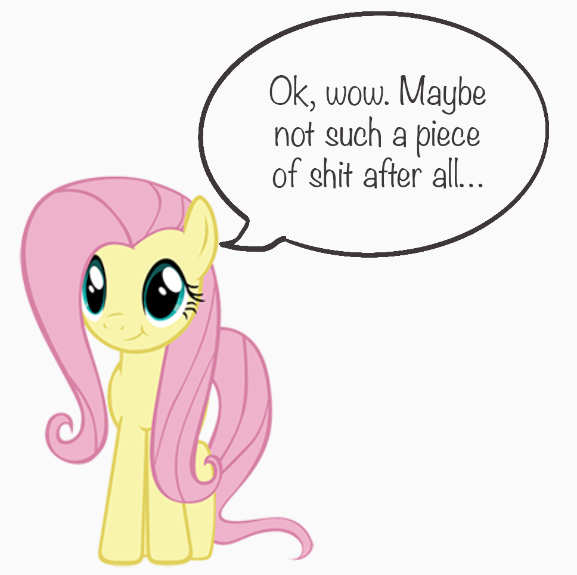
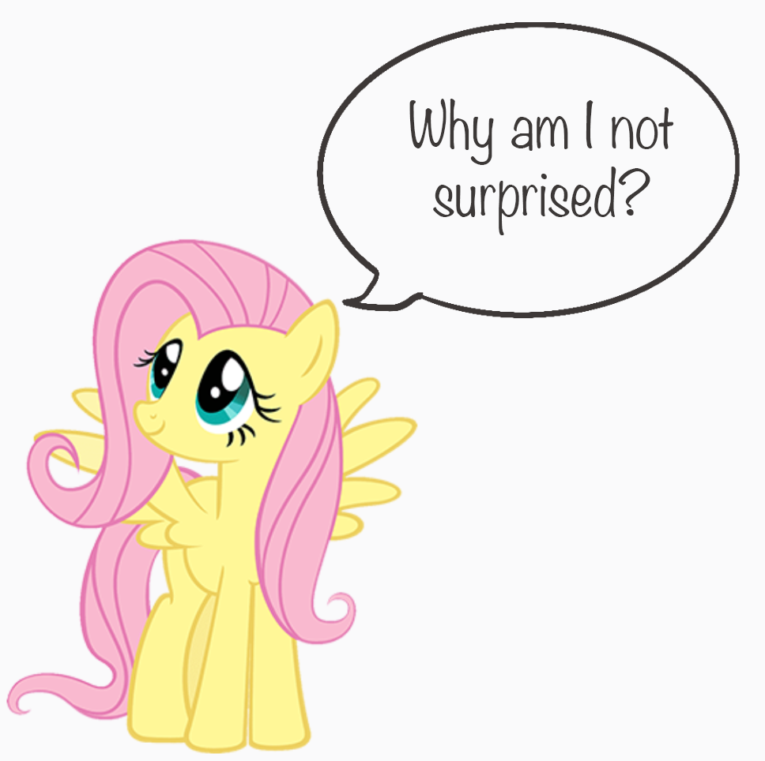
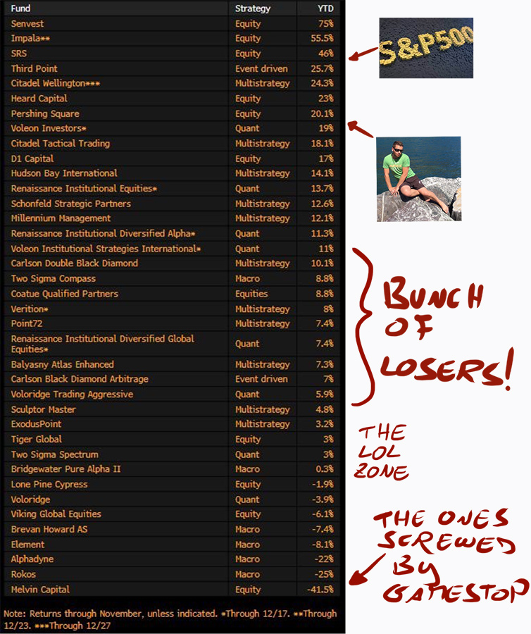
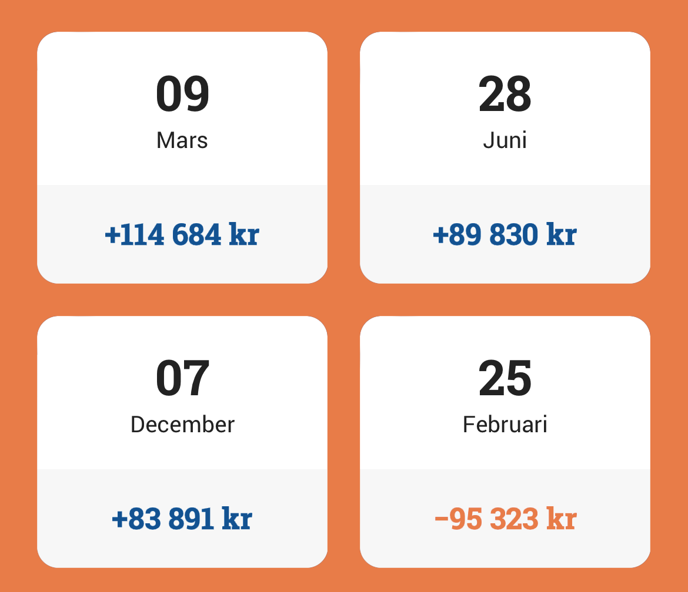
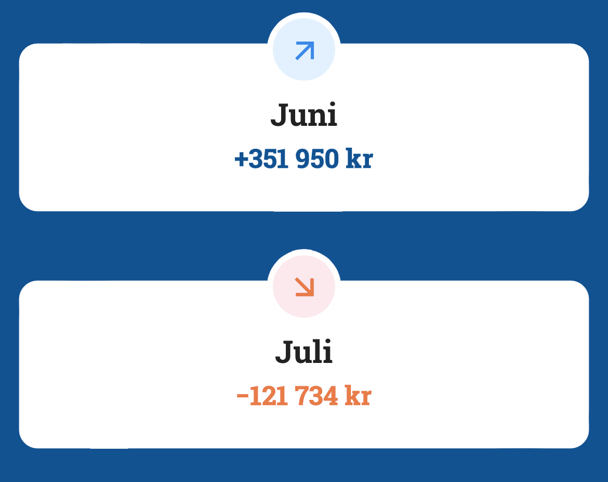
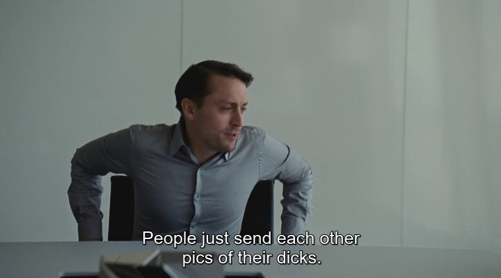
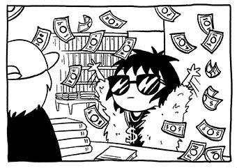
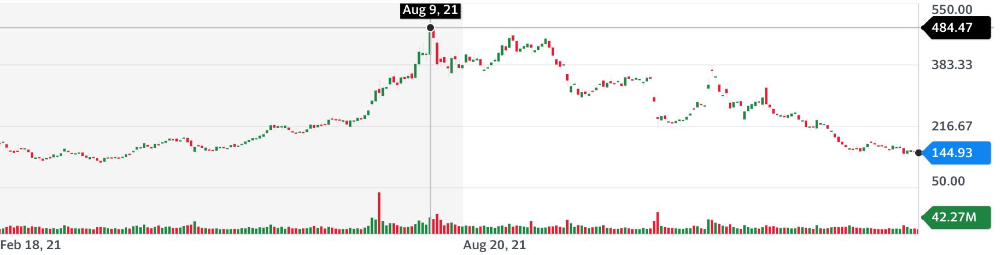
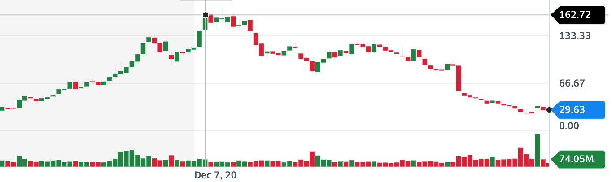

import Poll from "../../../components/blog/Poll";
import {ProfitBox} from "../../../components/blog/Boxes";
import {FigureLabel, Pony} from "../../../components/blog/Text";
import Quote from "../../../components/blog/Quote";
import YouTube from "../../../components/blog/YouTube";

Before we get into the meat of the matter, would you kindly answer the following **poll**? It will inform the rest of the post...

<Poll id="investing-2021"
      question="Do you invest your savings in the stock market?"
      answers={["Yes, of course", "No, actually", "Lol, what savings?"]}
      labels={["Yes", "No, I'm dumb", "I'm broke 🙈"]}
/>

Interesting results, don't you think?

Well, I wouldn't know. I'm writing from the past and the **poll** has not been published yet. I didn't really think this through.

Anyway, if you have savings and are not investing them, congratulations, you are slowly eroding your money to **inflation**. If you live in the US, only in 2021 you have lost 7% of that pile of cash. It's kinda like having a mistress, with none of the perks.

My **main quest** is simple: I want to make money so that I can afford to buy the apartment next to mine. Once I have said apartment, I will get a dog and have him live there.

<FigureLabel>
    But he will have to pay for utilities
</FigureLabel>

My **sub-quest** is more challenging: I want to beat every year the average gains of the **S&P 500**.

## What's the S&P 500, again?

The S&P 500 is a weighted index that collects the 500 best companies in the United States. These are the Apples, the Amazons, the Chipotles, and I feel like there's 497 more. The complete list is [here](https://blogmedia.avanza.se/uploads/2020/08/spx-tr-ytd-2020-v2.png).

Not to Boromir-meme you too hard, but one does not simply enter the S&P 500. It's like a trendy club where you have to be **super-hot** to be let in. As a result, this index gains, on average, around 10% per year, which is a lot.

So, if you want your money to grow instead of shrink, but you are too lazy or uneducated, you should consider investing in this index.

<small>
    (But why not a European index, instead? Because Europe is economically dead. Great to live in, though.)
</small>

## Well, how did I do?

Before I get to this year's results, I want to remind you that [last year](/investing-2020) I ended up with a mind-bending **+84%**, which is frankly the result of ~~luck~~ carefully pondered investing strategies.

While you losers wasted the pandemic baking bread, I studied ~~the blade~~ the stock market and read books from a bunch of white gentlemen like [Ray Dalio](https://www.bookdepository.com/Principles-Ray-Dalio/9781501124020), [Peter Lynch](https://www.bookdepository.com/One-Up-On-Wall-Street-Peter-Lynch/9780743200400), [Joel Greenblatt](https://www.bookdepository.com/Little-Book-That-Still-Beats-Market-Joel-Greenblatt/9780470624159).

Also, I baked really terrible bread. Just plain **disgusting**. Yeast simply doesn't work in a way that I can understand.

Anyway, in 2021 my profits amounted to:

<ProfitBox subject={"Yours Truly"} percentage={19}/>

Thank you! I'm really happy with the results. They're not as incredible as last year's, but **doubling** the average returns of the S&P 500 is no small feat!

Out of **pure curiosity**, how much did they do this year?

<ProfitBox subject={"The S&P 500"} percentage={29}/>

Well, fuck me.

## Hindsight 2021

If last year I had invested all my money in the S&P 500 and just chilled, I would have done so much better. Or I could have gone all-in with **Microsoft** and brought home a **+51%**.

Do you know what they say about crying over **spilled milk**? That it's a manly, righteous lifestyle choice! 🥛👀💦

But, in search for a silver lining, how do I compare to the major **hedge funds**, which employ hundreds of day traders, with their high consumptions of champagne, hookers, and cocaine, while I hardly do any of those?

Turns out, not too shabby...

This is what I love about the stock market: the **little guy** can easily outpace huge firms.

Here are statistics of some relevance, like my best and worst days...

<FigureLabel>
    Can we all appreciate that my worst day was right after my birthday? I recall being at a spa. I checked my phone and thought: "Cool, I'm poor now!"
</FigureLabel>

<FigureLabel>
    These are my best and worst months. June was wild. I thought about leaving my day job! July I didn't love. I was like let's stick with that day job.
</FigureLabel>

<Poll id="more-investing"
      question="Would you like me to write some posts that will help you start investing in the stock market?"
      answers={["Yes", "Yes, please", "No, please", "Lol, no!"]}
      labels={["Yes", "Yes, please", "No, please", "Lol, no!"]}
/>

Now, let's analyze a couple of new sectors I have started investing in. For the other sectors, check my [post](/investing-2020) from last year.

## Streaming Services

I'm increasing my position in streaming services because I feel like this is how people are mostly going to seek entertainment in the future.

### Netflix

Too expensive. Netflix is just a shit company with tons of boring shows.

**Update**: I bought stocks in early 2022 because the price fell 40% 🤑. So happy. Netflix is such a great company with tons of exciting shows!

### Disney

The company has struggled due to the parks closures during Covid, so I jumped at the opportunity and significantly invested.

I feel like **Disney+** is the best service for parents to park their kids in front of for hours, watching Frozen 2 on repeat. I do the same. No, I don't have kids.

Also, this little guy is probably worth **billions** already.

<iframe src="https://giphy.com/embed/U4q2Ej2UEdq5mzpUCB" width="100%" height="100%" style="position:absolute" frameBorder="0" class="giphy-embed" allowFullScreen></iframe>

### HBO Max

This is by far the streaming service with the best content. I'm heavily invested. You should all watch **Succession**.

<FigureLabel>
    Truth.
</FigureLabel>

### Amazon Prime

Since they cancelled **The Expanse** after six seasons, they will never have my money. Well, except for books, occasional movie rentals, all of their store, really. Ah, and the web services.

<YouTube source="YQD9HaX8AoA"/>

## Vaccine companies

There was a moment in early 2021 when we all thought the whole pandemic had jumped the shark. As a result, vaccine companies like **Moderna** and **Pfizer** went through a selloff. I took the opportunity to load on both. Then a bunch of variants hit, and we were all like oh no, we need vaccines!

Which meant that they both went up significantly. Moderna **tripled**. I thought it was too much, too quickly, and I sold, getting some well-deserved gains.

Now, selling **Moderna** was a great choice, as it quickly shrank back to a shit price.

I haven't sold **Pfizer** though. In my view, this is not a one trick pony. They are developing a pill that you get when you feel Covid symptoms, which will mean the nail in the coffin for the pandemic.

But they also have the rights to [rapamycin](https://en.wikipedia.org/wiki/Sirolimus), a compound that seems to be tied to longevity, as it mimics the benefits that you get from [fasting](/fasting).

Plus, they have the **dick pills**.

## The decisions not taken

**Steve Jobs** used to say that he feels as proud of the things he chose not to do, as much as those he chose to do.

When everyone went crazy for **Peloton**, I decided not to invest due to the following conviction:

<Pony>
    Working out at home is shit 🦄
</Pony>

Well, computer, show me Peloton...

🥳

## Finally, the elephant in the room

Yes, **2022** has started with a significant loss in the stock market. There are a few reasons for this:

1. High inflation is moving investors away from companies that are promising gains in the **future**, because that money is going to be worth less than present money, exactly due to inflation

2. Covid has helped many people realize that it's not worth working **crappy jobs** for little money, which means that companies now need to pay more to find employees, which inflates prices, which increases inflation

3. There is an overall supply shortage of goods like **microchips**, which means fewer products on sale, which inflates prices. Inflation again

4. There is a freaking **war** looming! Something something inflation

In light of all this, should we sell everything, cancel the mortgage, divorce spouses, unsubscribe from Prime, and hoard toilet paper? In short, is this the time for **panic**?

<iframe src="https://giphy.com/embed/l0MYKnSyyXom5PPrO" width="100%" height="100%" style="position:absolute" frameBorder="0" class="giphy-embed" allowFullScreen></iframe>

Sure, you could do that. But consider this:

<Poll id="iphone"
      question="If Apple put out a shiny new iPhone at half the price, what would you do?"
      answers={[
          "I would totally buy it. More than one, actually.",
          "You know what, the iPhone market is weird now. I will not purchase until the prices are back up. Plus, I'll sell my own iPhone at a terrible price and with those little gains I will hoard toilet paper. This is the way."
      ]}
      labels={["Not Moron", "Moron"]}
/>

Maybe we should all behave as if we weren't a bunch of idiots.

<Quote title={"Goodbye Quote"} from={"@naval"}>
    Pessimists tend to be right. Optimists tend to be rich.
</Quote>
