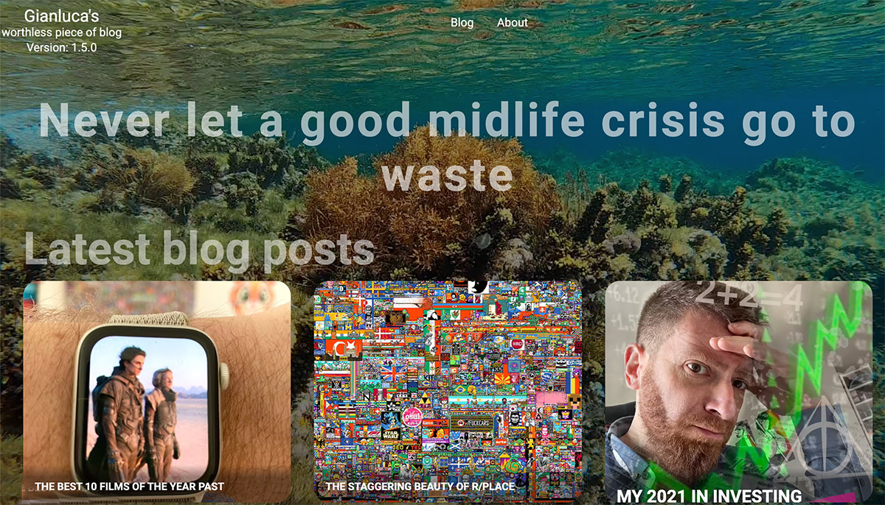
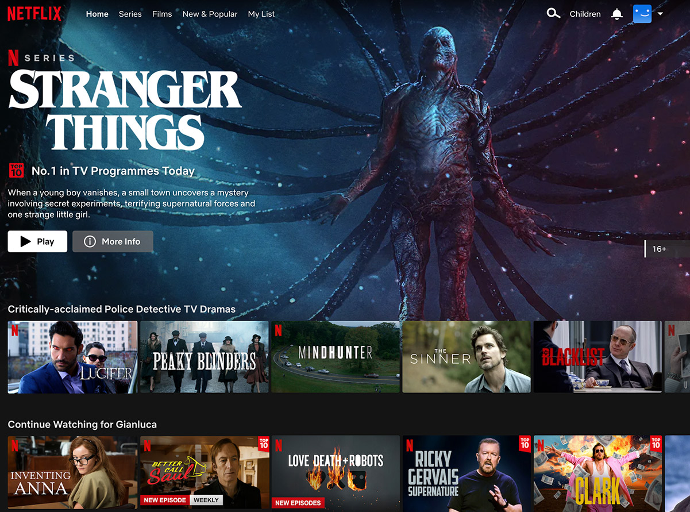
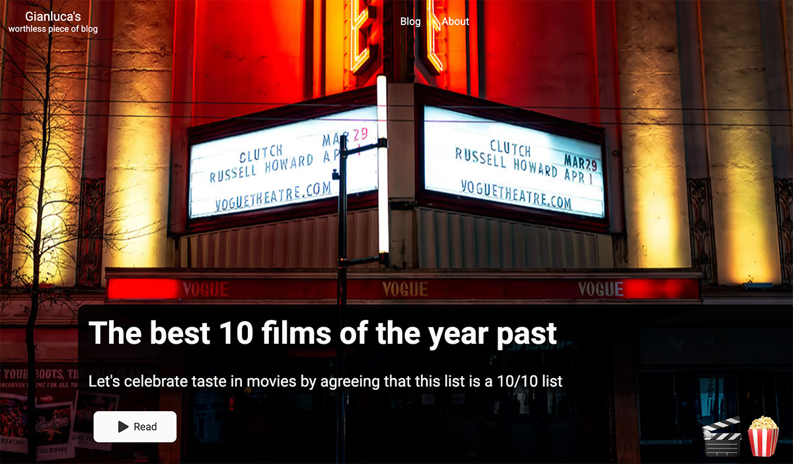
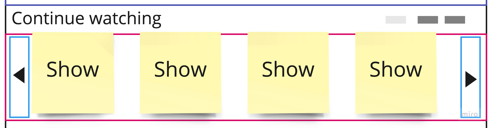
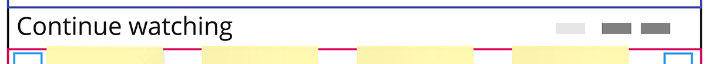
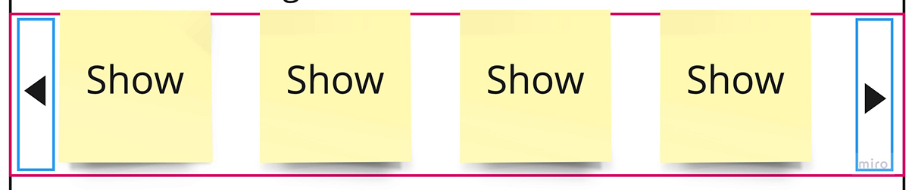

import YouTube from "../../../components/blog/YouTube";
import LinkButton from "../../../components/Button";
import Poll from "../../../components/blog/Poll";
import {FigureLabel, Pony} from "../../../components/blog/Text";

I've been let know that my blog is -- and I quote -- esthetically challenging, unpleasant to look at, and uncanny valley-y. Don't get me wrong, it's ok for an **amateurish** work, but it's kinda frustrating, because it could have been good with just a little more effort.

Now, in front of such **harsh** but well worded feedback -- so rare these days! -- my only thought was:

<Pony>I need to cut ties with this person. 🦄</Pony>

Then, I took a long look at my homepage...



<Pony>Oh my god, she's right! 🙀</Pony>

So, after cutting ties with her, I set myself to work at a **radical** design overhaul, wielding a glass of wine and unafraid of using it. 🍷

## First Things First

When **change** is warranted, one must understand why that is, otherwise stuff will be transformed, and still retain the same issues.

What is *not* working with my homepage?

For starters, it seems to be coming directly from **2003**, what with that huge six seconds holiday video on repeat that doesn't even work on mobile, I suspect for battery reasons.

It has cool micro-animations, and it does the job of giving you a glimpse on the most recent content, but are you feeling **compelled** to read a post?

...

It's not a rhetorical question. Please answer...

<Poll id="netflix"
      question="Are you feeling compelled to read a post?"
      answers={["Lmao, no!", "To be honest, not really", "Yes, actually", "You cut ties with me, why should I answer?"]}
      labels={["No 🦄", "No 🙈", "Liar", "Hitler"]}
/>

With this in mind, what should the focus be? Why do people come here? Why would they choose this website instead of literally anything else? Why, the **content** of course!

The witty posts uncovering stories from [remote internet corners](/r/place), the accounts of (in)famous [Renaissance heroes](/caterina-sforza-1), the invaluable [investing advice](https://www.youtube.com/watch?v=dQw4w9WgXcQ). All well curated and written, with a self-deprecating sense of humor that comes across as cute, albeit tiresome at times.

And I'm not saying this, I'm just **quoting** your dms, or at least the parts that I can repeating without blushing, you silly pervs. 🙈

Ok, cool. Content. Looking at online venues where content is king 👑, my conclusion is that I need to turn my blog into **Netflix**. Only, you know, with good content!

So let's take a peek at the streaming service...



<FigureLabel>Hot take: I think that <strong>Stranger Things</strong> is pickled garbage.</FigureLabel>

I feel like this is exactly what I need! I want you to **experience** my blog the same way I interact with Netflix, which is to scroll the lists of shows and films for a solid 5 minutes, find nothing of interest, and then resolve to watch for the umpteenth time an illegally downloaded version of **In Bruges**.

<div style="padding-top:47.000%;position:relative;"><iframe src="https://gifer.com/embed/NRVv" width="100%" height="100%" style='position:absolute;top:0;left:0;' frameBorder="0" allowFullScreen></iframe></div><p></p>

## The Project

Let's start with a **blueprint**. Please click on the Miro board...

<ResponsiveEmbed
    src={"https://miro.com/app/live-embed/uXjVOxQ3ODY=/?moveToViewport=-788,-625,874,1221"}
    ratio={'9:16'}
/>

<p></p>

This is what needs be done:

* A simple way of fetching posts, together with all their metadata, so that I can easily create groups for the content rich homepage

* The most recent post must become the featured one 👀, occupying a big chunk of the screen

* Several rows of sliders will display posts grouped by different criteria. Hovering on each thumbnail is going to show more information and a button to reach the post

Cool, let's tackle these **milestones** one by one.

## Fetching Content

This is incredibly easy, as **Gatsby**, the framework I'm using on top of **React**, allows for content querying via GraphQL, which is a bit weird to look at -- and that's why I won't show it to you -- but oh so effective!

<div style="padding-top:42.400%;position:relative;"><iframe src="https://gifer.com/embed/p5" width="100%" height="100%" style='position:absolute;top:0;left:0;' frameBorder="0" allowFullScreen></iframe></div><p></p>

Long story short, in my code all I need is:

```js
const posts = data.allMdx.edges
```

And, boom, I have all the posts on my thumb, ready to be **grouped** as I please. Let's do some of that:

```js
const featured          = posts[0]
const latest               = [...posts].slice(1, 14)
const caterina           = [...posts].filter(post => containsHashtags(post, 'caterina sforza')).reverse()
const food                 = [...posts].filter(post => containsHashtags(post, 'food', 'coffee', 'diet')).reverse()
const mindfulness   = [...posts].filter(post => containsHashtags(post, 'mindfulness')).reverse()
const randomized    = [...posts].sort(() => Math.random() - 0.5).slice(0, 15)
const chronological = [...posts].reverse()
```

This only took me a glass of wine to complete, but that's because when I created my blog I was forward-looking enough to implement **hashtag** support even if not needed at the time. Amateurish my ass.

Now that we have the **CoNtEnT**, let's put it to use on an actual page. Based on the blueprint above, this is all there is to be...

```jsx
<Layout isDark={true}>
    <FeaturedPost post={featured}/>
    <Sliders>
        <NetflixSlider
            title="Latest posts"
            subtitle="The more recent they are, the better written"
            posts={latest}
        />
        <NetflixSlider
            title="On Caterina Sforza"
            subtitle="This pentalogy is quite possibly the piece of writing I'm the most proud of"
            posts={caterina}
        />
        // other sliders omitted...
    </Sliders>
</Layout>
```

It's not much, but it's honest work. You can see the featured post and then a list of sliders rendering the previously collected posts. This concludes the whole Netfl- wait a second I forgot to implement the components! 🙈

## The Featured Post

Let's start with the *pièce de résistance*, the most recent post displayed at the top of the screen for maximum consumption. Here's where's at:

```jsx

<Wrapper data-aos="fade-up" data-aos-duration="1000">
    <Background image={getImage(content.featureImage)} alt="background" />
    <Overlay>
        <Title>{content.title}</Title>
        <SubTitle>{content.subTitle}</SubTitle>
        <Button to={content.path} big={true}>Read</Button>
    </Overlay>
    <Emoji>
        {content.onHover}
    </Emoji>
</Wrapper>
```

The wrapper is a *position: relative*, while the overlay is a *position: absolute* that tries to be on the bottom half of the image, based on screen size.

I used to have **emojis** that appear when you rest the cursor over a button. I want to move away from that, but retain the emojis, so I put them to the bottom right. They really tie the room together.

Speaking of which, we need to talk about the button.

### We need to talk about the button

The button I created for version 1.0 simply won't do with the new style. It's too noisy, too unnecessary in the way it expands when hovering it. What was I thinking? Why didn't you say anything? And why did I cut ties with those that did?

<p></p>

<LinkButton to={""} onHover={"💩💩💩💩💩💩💩"}>Shitty Button</LinkButton>

<p></p>

I had to take it down a notch. Here is the final layout of the featured post...



But that was **easy mode**. The real challenge is the slider.

## The Slider

Each row of content is an instance of the slider component. There, we want to **paginate** posts so that only a subset is visible. To access the others, you will scroll via aptly placed buttons.



When you hover or tap on a post, more information will be displayed, so that you have no other choice but **read it**, unless you want ties to be cut.

Here's the final layout. It's a bit of a **doozy**, but trust me, it's gonna be fine. You are going to be fine. Despite what your mother, your fiancé, and Society are telling you, you are not dumb. Now please commit the following code to memory...

```jsx copy
<Container>

    <Header>
        <TitleWrapper>
            <Title data-tip={subtitle} data-place="top">
                {title}
            </Title>
        </TitleWrapper>
        <ProgressBar data-aos="fade-left" data-aos-duration="1000" data-aos-delay="100">
            {Array.from(Array(calculatePages()).keys()).map((elem, index) => {
                return (
                    <ProgressElement key={index} highlighted={elem === sliderIndex}/>
                )
            })}
        </ProgressBar>
    </Header>

    <SliderWrapper>

        <LeftHandle
            disabled={sliderIndex <= 0}
            onClick={e => setSliderIndex(sliderIndex - 1)}>
            <Arrow>
                <BsChevronCompactLeft/>
            </Arrow>
        </LeftHandle>

        <Slider index={sliderIndex}>
            {posts.map((post, index) => {
                const fm = post.node.frontmatter
                let itemsPerScreen = calculateItemsPerScreen(width);
                let isLast = index + 1 === itemsPerScreen
                return (
                    <CardContainer key={fm.path} itemsPerScreen={itemsPerScreen} isLast={isLast}>
                        <NetflixCard
                            cardImage={fm.cardImage}
                            title={fm.title}
                            subTitle={fm.subTitle}
                            date={fm.date}
                            path={fm.path}
                            onHover={fm.onHover}
                            index={index}
                        />
                    </CardContainer>
                )
            })}
        </Slider>

        <RightHandle
            disabled={sliderIndex >= calculatePages() - 1}
            onClick={e => setSliderIndex(sliderIndex + 1)}>
            <Arrow>
                <BsChevronCompactRight/>
            </Arrow>
        </RightHandle>

    </SliderWrapper>

</Container>
```

Was it exciting to read as much as it was for me to write? Yes!

Let's tackle it bit by bit.

### The Slider Header



I have a title on the left, and a subtitle that I choose to render as **tooltip** in order to reduce visual overload. On the right, a progress bar reports the number of pages and the one you are currently sitting on.

In order to render the progress bar, I need to know the number of pages. How to calculate it? **Easy-peasy**:

```js
Math.ceil(posts.length / itemsPerScreen(width))
```

But how many items should I display on screen? Well, it depends on how large it is. Let's say 5 items for a width of 1200 pixels and above, then progressively fewer as the size shrinks, with a minimum of 2 if you are in the bathroom looking at your phone, as you most certainly are.

But this cannot be a static assignment, because you **assholes** continuously change the screen shape, which means that I have to subscribe to the window resize event and update my number of items every time you mess with my layout.

### The Slider Body

This is the meat of the matter. The posts are all *display: flex*, where the ones that don't fit on screen will stack up to the right, conveniently invisible, except on bugged **Safari**, because we can't have nice things after all.



When you press either ◀ or ▶ the content will be shifted for ±100% of the screen width. Some easing is applied, as we are not savages.

Now, if you try this on **Netflix**, you will notice that when the end of content is reached, you loop around to the beginning.

If you have ever implemented a 2D side-scrolling game, you know that the way to do this is to lay down the train tracks while on the train, meaning that once a piece of **background** reaches the left side of the screen, and it's no longer visible, you can move it to the right side, ready to enter the screen again. Rinse repeat.

<div style='position:relative; padding-bottom:calc(56.25% + 44px)'><iframe src='https://gfycat.com/ifr/BelovedReasonableIcefish' frameborder='0' scrolling='no' width='100%' height='100%' style='position:absolute;top:0;left:0;' allowfullscreen></iframe></div><p></p>


So, I have to implement something similar for my slider, except I'm not gonna do any of that! I have no idea how to do it in CSS, and I'm running out of wine! So, in this house, once we reach the end of content, we stop scrolling!

Here is the **final result**. Notice how smooth is the sliding effect! Notice how the items get bigger when you hover on them!

<YouTube source="KpkUzVVvosk"/>

For the whole experience, you can visit the [new index page](/), unless you are coming from there, in which case you got the ending spoiled, and I feel sorry for you. 😞

I'm sure different browsers and devices will experience bugs. Please report them in the comments, and I will **Paypal** you a reward. <small>(Might be a bold faced lie.)</small>

In case you prefer the old page, it's still there at [index-cringe](/index-cringe), but know that I'll be monitoring ip-addresses and cut ties with whoever visits it.
