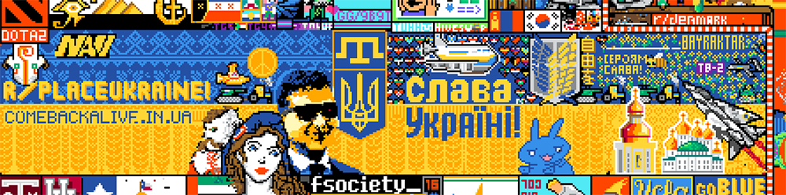
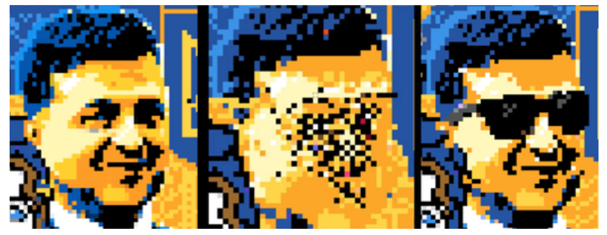
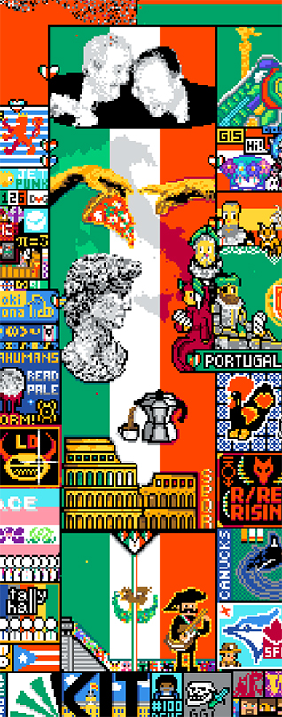
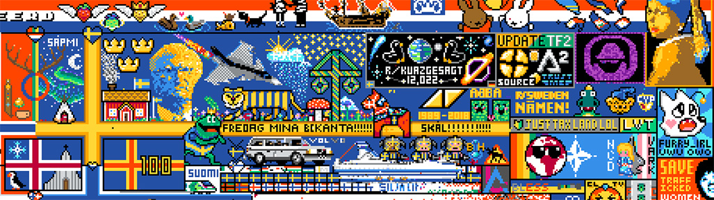
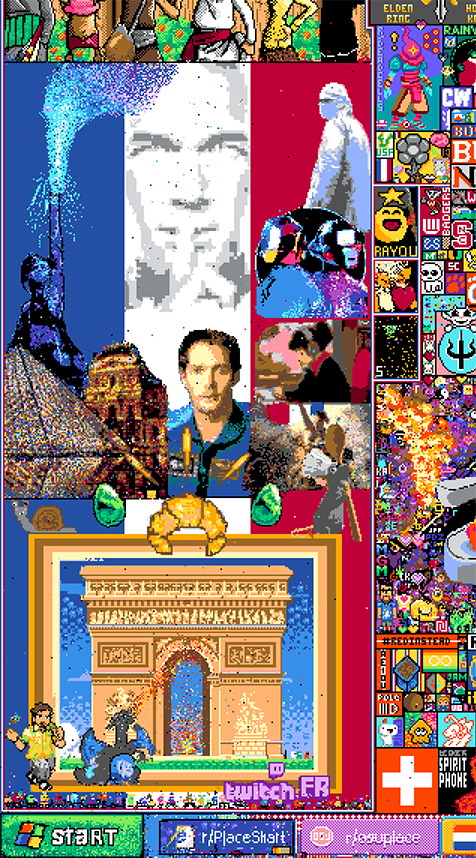
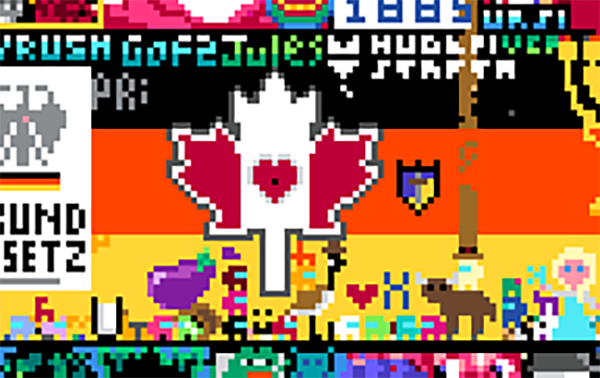
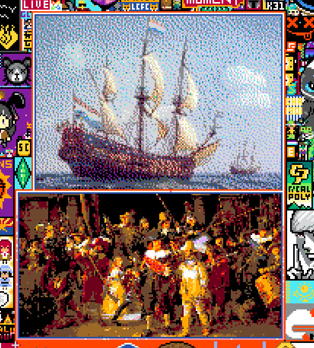
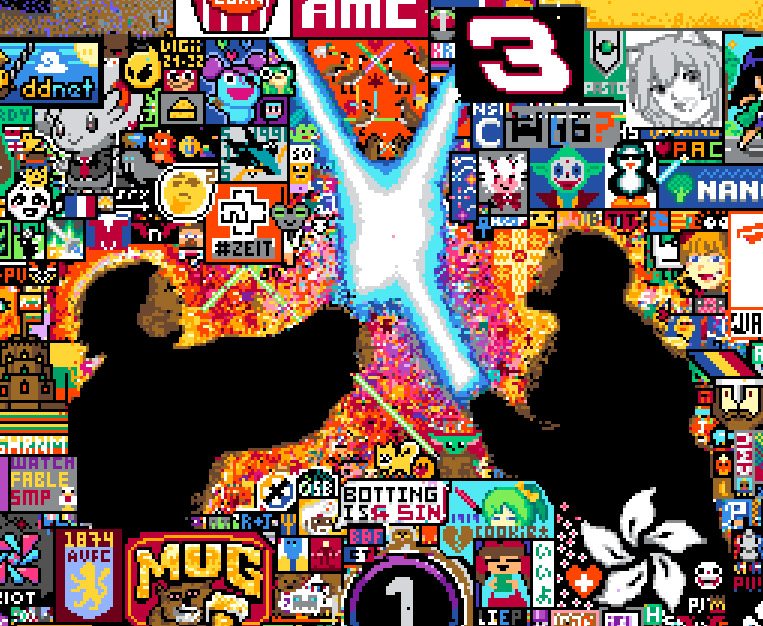
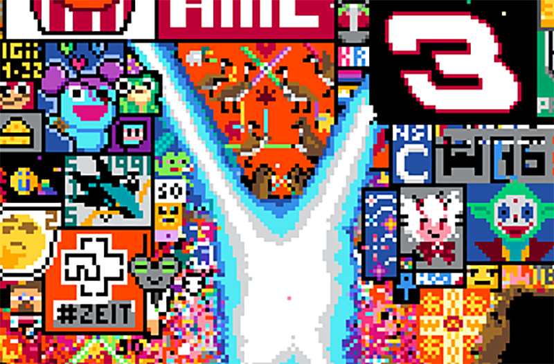

import Reddit from "../../../components/blog/Reddit";
import Poll from "../../../components/blog/Poll";

Imagine an empty canvas.

Everyone is allowed to paint colored **dots** on this surface, but each one can only add a dot every five minutes.

Given enough time, and provided that you don't have a life, you can manage to complete a simple but satisfying **drawing**, but here's the catch:

* The canvas is only going to be available for four days

* Other people can paint their dots over your own 🦄

So, what do you do?

Probably effing nothing! I don't have to do anything! The only winning move is not to play! I'll just hop onto the next thing, like that dress that seems to be blue or gold.

## Red, by the way

But there's something about **humans** that you can't find in other species, and which has granted us top evolution marks, while cats and cauliflowers are stuck on square one. We form communities.

People seem excellent at finding patterns, identify ideas in common with their peers and gather around those abstract concepts to become **Legion**.

<iframe src="https://gifer.com/embed/5krj" width="100%" height="100%" style='position:absolute;top:0;left:0;' frameBorder="0" allowFullScreen></iframe>

What these communities share is often **preposterous**, like being born inside a certain geo-fenced radius otherwise called Country. Other times, we feel a sense of belonging thanks to a mutual interest, like sports 🏂, cooking 🥘, hentai porn 🐙.

Together, humans can achieve the impossible and even paint on a shared canvas one dot at a time. Or can they? This is the experiment carried out by the sub-reddit [r/place](https://www.reddit.com/r/place/), which just concluded.

Having been one of the **four million** people that contributed to it, I feel a bizarre sense of pride in showing you the results...

<Reddit source={"https://www.redditmedia.com/r/place/comments/twhrwx/full_10000x10000_resolution_image_of_rplace_right/?ref_source=embed&amp;ref=share&amp;embed=true"} label={"Click the image for the details. Can you find Wally?"} title={"r/place"}></Reddit>

Even though it's the end result that is going on my wall as a 80x80cm metal print, this is not what matters. What matters is the **frenemies** we made along the way.

Here is a timelapse of the four days of community painting. Can you detect any of the high-stakes **drama** that occurred?

<Reddit source={"https://www.redditmedia.com/r/place/comments/twspid/full_timelapse_of_the_whole_thing/?ref_source=embed&amp;ref=share&amp;embed=true"} title={"Time flies"}></Reddit>

Did you notice Americans and Turks destroying each other's **flags** several times until the US decided to move to the opposite side of the canvas?

Or the haunting Void monster?

Or the Germans tracing a horizontal iron curtain with their flag? Imagine how much **real estate** they had to conquer from other groups, and how hard they had to fight to keep it. Germans.

Speaking of which...

## Ukraine

As you can image, **Ukraine** has received strong support from many allies and a prominent position on the top left quadrant.

Though at some point, President **Zelensky**'s face was ruined. I wonder who did it? 🧐

But the community brought it back with added coolness.

<FigureLabel>Deal with it</FigureLabel>

## Italy

Much respect for the **Italians** uniting (for a change) and working (for a change) at some of the best national representations. I helped with the coffee, because of course I did.

I think that **Dante Alighieri** sitting over the Portugal sign is really cute, and it's hilarious how Mexico is stealing our thunder. Although it's sad not to see my hometown **Pisa**.

Ah no, wait. It is there...

It's just a bit far from the rest of Italy, right next to **Nelson Mandela** and **Mass Effect**.

Are we trying to say that Pisa doesn't exist, and it's just a [Mandela Effect](https://www.verywellmind.com/what-is-the-mandela-effect-4589394)? 🤔

## Sweden

I have to say that, after seven years, **Sweden** remains a mystery to me. I have so many questions but not enough interest in asking them.

## France

Excellent work from France. They fought one the most gruesome battles when their painstakingly built **Tour Eiffel** was torn down and replaced by a giant butt hole, symbolizing I believe the puppet government of **Vichy**.

But they rebuilt, and while they had to cede land when people got the idea of adding the **Windows 7** bar at the bottom of the Canvas, they lost so that we all could win.

Admittedly, I know very little of French culture. Who's the shush guy? What's going on with Hermione? Is the lo-fi hip-hop girl French? Why Pokemons? Is that arch building a famous one?

Ah no, that's a croissant.

## Joke countries

Poor **Canada**. While France and Ireland were painting and drinking, Canadians struggled to draw their own leaf...

<Reddit source={"https://www.redditmedia.com/r/place/comments/tw9xn9/timelapse_of_canada_struggling_to_make_a_leaf_for/?ref_source=embed&amp;ref=share&amp;embed=true"} title={"Oh, Canada"}></Reddit>

Although to be fair, foreign agents were probably sabotaging them. Now that I think of it, I was one of the folks that wanted to replace the leaf with a **banana**.

Of course the Germans, with their superior organizational skills, had to rub it in...

<Poll id="to-write-next"
      question="What would you like me to write next?"
      answers={[
          "Philosophy",
          "Developing habits",
          "How to talk to people",
          "Writing",
          "What is Comedy?"
      ]}
      labels={[
          "Philosophy",
          "Developing habits",
          "How to talk to people",
          "Writing",
          "What is Comedy?"
      ]}
/>

## Feuds

This is political streamer **Hasan** ordering an assault on political streamer **Destiny**.

Destiny reacted by sending his army against Hasan's dead dog. 🐶

<Reddit source={"https://www.redditmedia.com/r/Destiny/comments/twl0zo/hasan_sowing_vs_hasan_reaping/?ref_source=embed&amp;ref=share&amp;embed=true"} title={"Poor boy"}></Reddit>

## Kinda sus

The **Among Us** characters are hidden everywhere, like literally.

<FigureLabel>For instance, look at the pill, the bicycles, Spike's hair, the smoke/cloud, Z-event-- And this is but a tiny piece of the whole estate</FigureLabel>

## Art

Some incredible work that makes you wonder whether bots were used. Like here...

...here...

...and finally here...

...and I'm really talking about the Jedi ducks.

## Then poof

At the end of the fourth day, r/place just fizzled away in a sea of void, while people were still placing their dots, refusing to wake up, holding on the final seconds of a good dream...

<Reddit source={"https://www.redditmedia.com/r/place/comments/twnvqq/my_world_is_ending/?ref_source=embed&amp;ref=share&amp;embed=true"} title={"Bye"}></Reddit>

If you go to [r/place](https://www.reddit.com/r/place/) now, you will only find a blank canvas and the echoes of the people that were there for the fight. One pixel at a time.

They'll tell you their stories of broken friendships, great expansions, dead dogs, genitalia, meme stocks, obscure references, poorly drawn leaves. But deep down they know that you **normies** won't fully understand.

You just had to be there.

<Reddit source={"https://www.redditmedia.com/r/place/comments/twhoe8/thank_you/?ref_source=embed&amp;ref=share&amp;embed=true"} title={"Thank you"}></Reddit>

