import {Lucrezia, TigressBook} from "../../../components/blog/Grids";

Welcome to the extended finale of this series on **Caterina Sforza**, which I converted from a half-baked Facebook post [here](/caterina-sforza-1), found enjoyment and continued it [here](/caterina-sforza-2), was supposed to end [here](/caterina-sforza-3), but then it took a life of its own [here](/caterina-sforza-4), and it's going full **Avengers Endgame** here.

As it often happens in stories that overstay their welcome, I also end up talking about **myself**.

At any rate, this is the biggest **project** I've ever worked at, and I once had Mexican food.

So, find a seat and pour some wine. Will our heroine survive the threat posed by the **Borgia** family? Well, no. She's been dead for **500 years**. But you know what I mean.

Before we get to the meaty parts, allow me to confess that the woman on the cover is not Caterina. I ran out of portraits of her, so I used Leonardo da Vinci's **Lady with an Ermine**, a.k.a. [Cecilia Gallerani](https://en.wikipedia.org/wiki/Cecilia_Gallerani).

I counted on the fact that you wouldn't notice because you are **ignorant**. Incidentally, this was the cover I was initially going for...

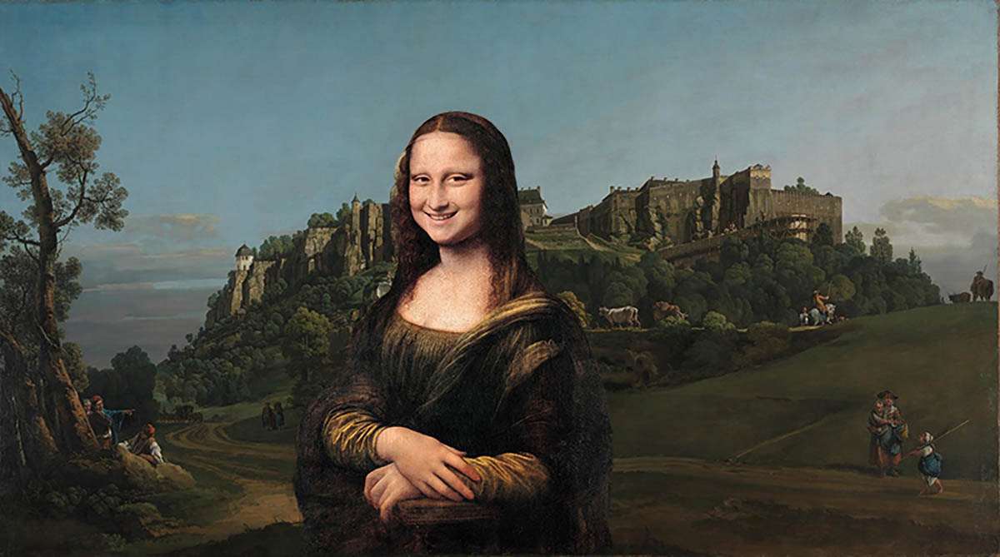

<FigureLabel>Caterina Sforza.</FigureLabel>

## Ok let's talk about the Borgia because holy shit

Originally from Valencia, the *Borja* family set foot in the boot when Alfons became Pope **Callixtus III**. This was before Caterina's time.

Uncle Pope helped his nephew **Rodrigo** become cardinal at age 27, inventing the term *nepotism*, which is Italian for nephew.

Rodrigo was instrumental in the whole spanish inquisition affair. Among other things, he put to trial 13000 jews even though they had converted to Christianity, which was particularly cunty.

Plus, he was the final boss in **Assassin's Creed 2**. An easy one at that. The parry window was obscenely wide.

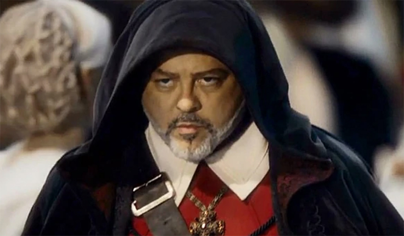

<FigureLabel>Rodrigo Borgia and his bitch resting face.</FigureLabel>

When Pope **Innocent XIII** died in 1492, can you guess who replaced him? Why, Rodrigo of course!

So if my math is correct, **House Borgia** has had two Popes in their ranks, which is kinda neat. I mean, how many Popes does your family have?

Naturally, to achieve this they used bribes, intimidation, and blackmail. On the other hand, **God** operates in mysterious ways, so maybe corruption is one of them?

As Pope **Alexander VI**, Rodrigo hanged all the mob bosses in Rome, which is easy to do if you ignore fundamental human rights.

But he was also a fun guy. He frequently held parties that involved hiring legions of **prostitutes**. Prizes were given to whoever managed to have sex with the most women.

Kinda reminds me of someone. 🤔

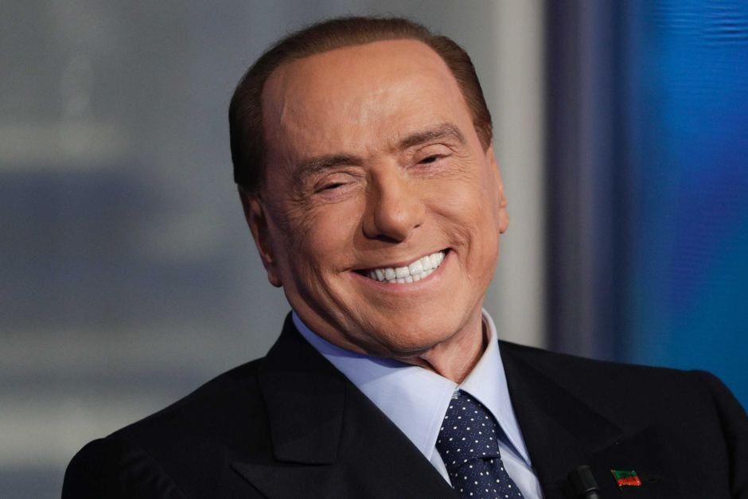

<FigureLabel>Italy's best statesman.</FigureLabel>

Like any decent Pope, Rodrigo had several kids from his main wife **Vannozza**:

1. Giovanni
2. Cesare
3. Lucrezia
4. A fourth one nobody cared about

In 1497, Giovanni was murdered. Rodrigo didn't love hearing about the death of his **firstborn**, as he had many plans for him.

Cesare was forced to abandon his career as cardinal and take his dead brother's role as commander of the army for **House Borgia**.

An investigation on Giovanni's death was started and then quickly **withdrawn** once all evidence pointed to... Cesare. 🙀

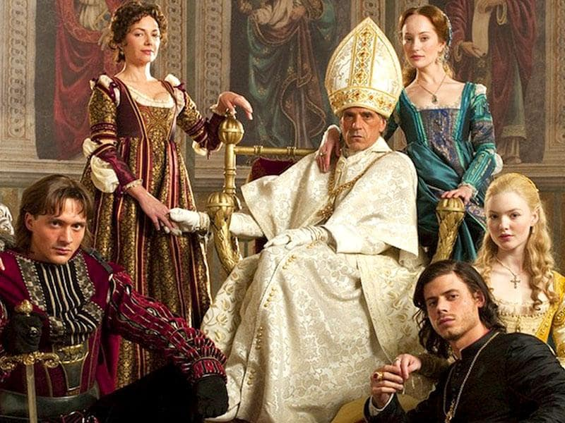

<FigureLabel>A Borgia never pays his debts.</FigureLabel>

## Eyes on Forlì

With the Borgia safely settled in the north of Italy and now also in the center because of the whole **Pope thing**, Rodrigo thought that it would be nice to conquer all the smaller reigns in between. Or, to use his own words, **pacify them**.

This of course included **Forlì**. The Pope proposed a marriage between his daughter Lucrezia and Caterina Sforza's older son Ottaviano, who was no longer grounded for having murdered his mother's husband Giacomo Feo.

    <small>(This seems very soap-opera-y, but if you have read the previous chapters, it all makes sense.)</small>

Caterina thought that the union idea was **super cringe**, since Lucrezia had already been married to her cousin Giovanni Sforza.

And by the way Giovanni chose to forfeit the marriage and reported that Lucrezia was very close to her brother Cesare. Like, **extremely** close.

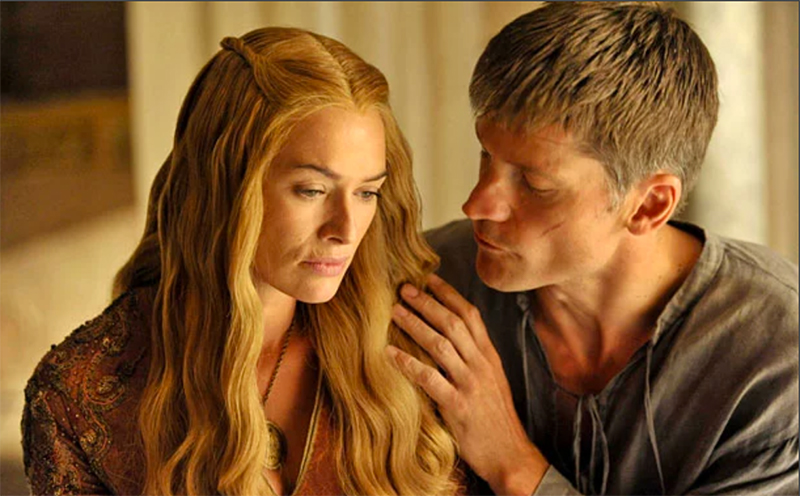

<FigureLabel>You see, even the Borgia siblings do it. It's actually not weird at all!</FigureLabel>

Refusing the marriage probably saved Ottaviano's life, as there was a pattern in Lucrezia's love affairs.

<TextBox title={"The Borgia's way to riches"}>
    <ThreeColumns>
        <Lucrezia/>
        <Col23>
            <ol>
                <li>Let a nobleman marry Lucrezia, who was hot</li>
                <li>Merge assets between families</li>
                <li>Have Lucrezia kill the husband by poison or - far worse - divorce him with the accusation of being impotent</li>
                <li>Profit</li>
            </ol>
        </Col23>
    </ThreeColumns>
</TextBox>

On a more negative note, since the Pope couldn't take Forlì by the means of wedding, he felt compelled to move to **plan B**.

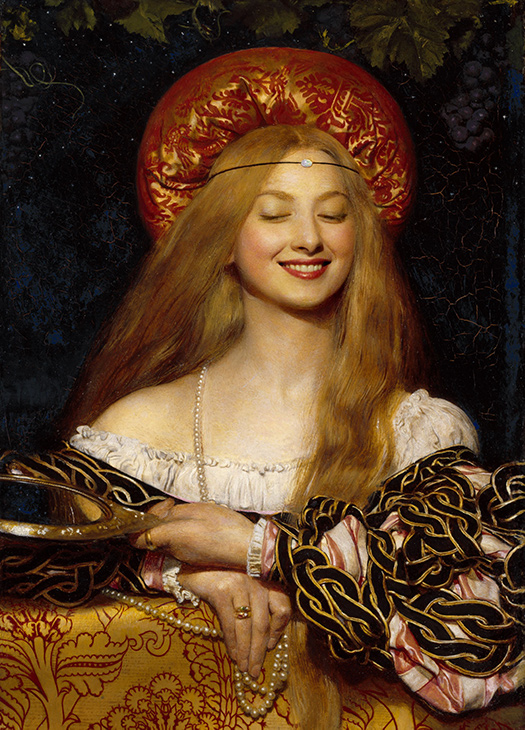

<FigureLabel>Lucrezia Borgia. It's hard to tell how much of her story is true and what is the result of malignant gossip. We are choosing whatever is more entertaining because these people suck anyway.</FigureLabel>

## War

The Pope secured an alliance with France and received an army of 12000 mercenaries, led by **Cesare Borgia**.

In exchange, the French King **Louis XII** would get safe passage to **Naples**, which he really wanted to conquer for reasons that are unfathomable to me.

The army descended to the center of Italy, and let's ignore all the other cities because we have no emotional attachment to them. I mean, who gives a shit about Pesaro? No, our next scene opens with Cesare's army entering Forlì.

Caterina Sforza was waiting on the walls of **Ravaldino**, as one does.

Cesare approached the castle on his horse, followed by the French. As many before him, he thought that he could **seduce** Caterina into submission.

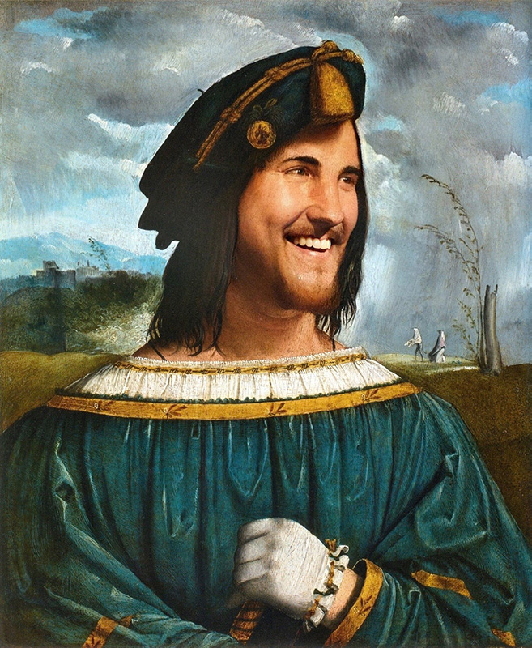

<FigureLabel><strong>Fun Fact:</strong> Cesare Borgia was the inspiration for Niccolò Machiavelli's <strong> The Prince.</strong> To this day, we are not sure whether the book was written as real advice for regents, or as a cautionary tale. Good job, Niccolò.</FigureLabel>

The Borgia commander illustrated how it would be cool for everyone if Caterina **surrendered** just like that. From the ramparts, Caterina was like ok let me come down, so we can talk.

The **drawbridge** was lowered. Caterina reached the outer edge of the moat alone. Cesare dismounted his horse.

"It seems like you have a powerful ally in the French," said Caterina. Then she turned her back to the foe. "Come inside. We shall discuss the terms of my **surrender**."

Cesare was elated by the quick turnaround. He followed Caterina on the drawbridge like Homer Simpson in the *Land of Chocolate*...

<iframe src="https://i.kym-cdn.com/photos/images/original/001/318/447/ff3.gif" width="100%" height="100%" style="position:absolute" frameBorder="0" class="giphy-embed" allowFullScreen></iframe>

A few steps onto the bridge, he realized: "Wait a second, this is really dumb!"

He stopped and walked back quickly. In the meantime, Caterina's men started raising the bridge, and Cesare had to jump his last steps to safety, **ruinously** falling on the ground and humiliating himself in front of the French.

From the closing gate, Caterina had the time to raise two middle fingers and say: "I almost got you, sisterfucker."

Cesare was so pissed that he started shouting the **c-word**, then he promised a thousand Ducats to whoever captured her.

## The siege of Ravaldino

Castle Ravaldino was considered to be impenetrable, and Caterina had food enough for 4 months of siege, which was more than Cesare could afford in mercenary/months.

That said, Borgia had the newest prototypes in cannon technology, which could shoot projectiles as large as soccer balls.

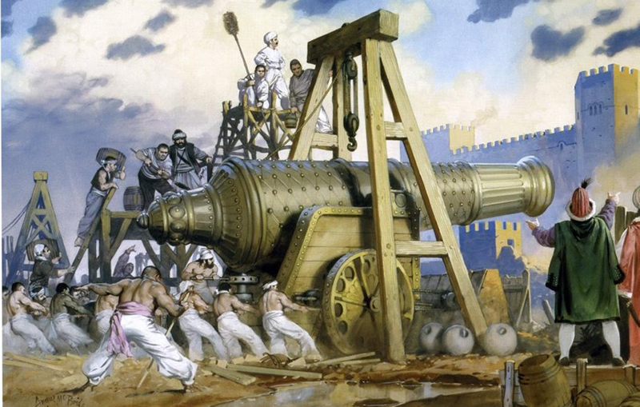

Caterina had cannons, too, albeit smaller ones. With a lucky shot, she killed **Costantino Da Bologna**, who was the **Elon Musk** of military technology. The French were devastated by the loss. Caterina's ransom increased to ten thousand ducats, which could buy you many Tesla.

The siege continued for the whole **Christmas** break of 1499. During daytime, Cesare's cannonballs carved holes in the thick walls. During nighttime, Caterina's men filled the cracks with sand bags.

It's during this period that Caterina wrote a letter to the Pope, pleading for clemency. Legend says that she added to the parchment a piece of cloth that belonged to a man sick with the **plague**. If true, Caterina was the first person to have sent a mail with a virus in attachment.

On New Year's Day, 42 hooded **pilgrims** stopped by and asked Cesare for safe passage south, as they were headed to Rome. Cesare was like sure, say hi to dad!

When the pilgrims walked by the castle, Caterina quickly lowered the bridge to let them in. They removed their hoods and revealed to be soldiers in support of Sforza, and probably sent by **Florence**.

Cesare must have shouted some very loud **porco dios**.

Things started to shift when the French realized that the south wall was the weakest link. Focusing their fire on that side, not only did they create a widening crack, but the fallen bricks filled up the moat, opening a passage.

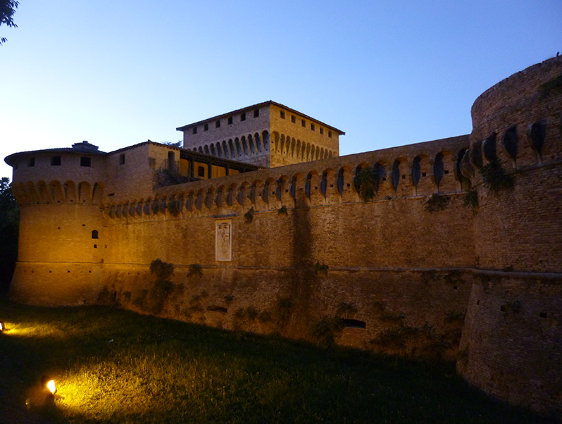

<FigureLabel>
    The southern wall of Ravaldino. We can still see the darker scar where the breach was made. Or at least it looks that way.
</FigureLabel>

On the eve of the enemy's final push, Caterina ordered all cannons to be positioned by the crack. Come morning, the French started crossing the moat, but the cannons did not fire. Many of her men abandoned their posts to try and save their lives. Caterina and a few **true believers** fought their way to the keep.

There, she opened a window and shouted: "You **frog eaters** can suck my c--" That's when a hand grabbed her by the shoulder.

"Mademoiselle, you are captured now."

Someone betrayed her and opened the backdoor to the keep. 😠

Cesare Borgia was a bit too happy for the capture, to the point that French captain **Yves D'Allegre** informed him that Caterina was to be considered a prisoner of Louis XII, and not to be harmed.

But D'Allegre had to continue his march to **Naples**, and was left with no choice but leave Caterina in Borgia's hands.

So if you are wondering what Cesare did to her, the answer is, unfortunately, yes.

## Captivity

Cesare held Caterina as his personal pet for months. She endured all that Cesare did to her with dignity, trying to find the right moment to flip things over.

When he finally brought her to Rome, she was thrown in a jail in **Castel Sant'Angelo**, the same fort she occupied [years back](/caterina-sforza-1).

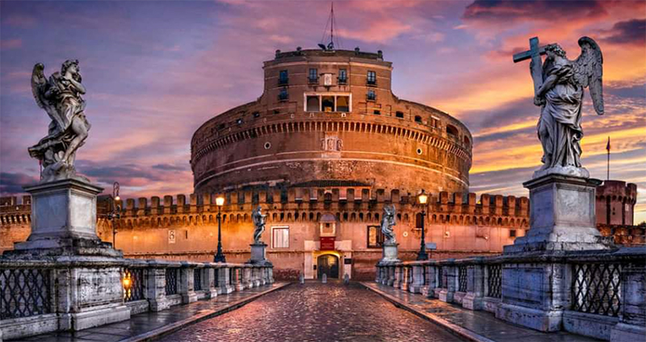

The Pope promised to release Caterina the moment she and her kids renounced the lordship of Forlì. Her children though were safe in **Florence**, as she had secretly smuggled them there during the siege.

Since she had married a **Medici**, Florence was eager to help out, also because they hated:
1. The Pope
2. The Borgia
3. The French.

They still do.

Caterina knew that the moment she abdicated Forlì was also the moment she was no longer useful. She would have been one poisoned meal away from dying. Such was the Borgia way.

After more than a year, **Yves D'Allegre** returned from his expedition to the south, also called **Terronia** at the time.

He had heard of Caterina's poor conditions and urgently headed to Rome. D'Allegre and the whole French army admired Caterina Sforza a great deal. They also named a cannon after her!

The captain protested with the Pope in regard to Caterina's treatment, and reminded him that she was under the protection of the **French king**. The Pope replied: "Yo, convince her to give up Forlì, and she's all yours."

D'Allegre and Caterina had a long conversation at the end of which she accepted the conditions. The French captain ensured that her final meals in Rome were low-carb and low-poison, then he personally escorted his crush to **Florence**, where she spent her exile.

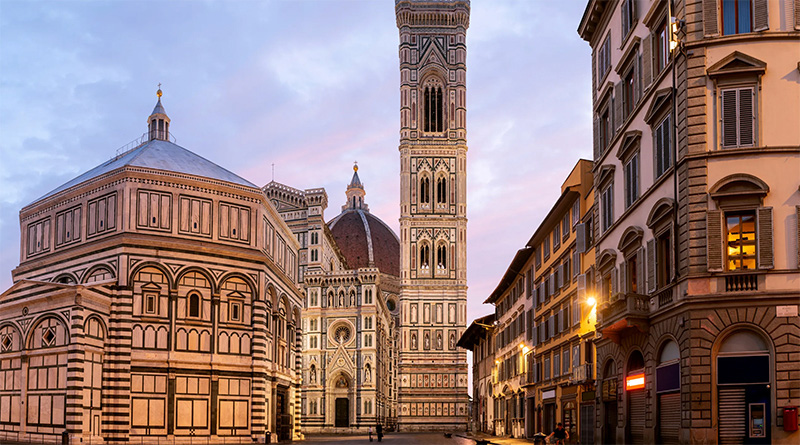

<FigureLabel>Florence is beautiful, but I would never live there.</FigureLabel>

## Final years

This ordeal **broke** Caterina in many ways, and she never sought to regain Forlì, even when a new Pope more friendly toward her could have maybe allowed it.

She spent the following decade raising her youngest son **Giovanni Jr.** <AiTwotonePushpin/> as a Medici and a Sforza.

She finally passed away in 1509 at age 46, for complications related to tuberculosis and generally for having burned the candle from all kinds of sides.

<TextBox title={"Bibliography"}>
    <ThreeColumns>
        <TigressBook/>
        <Col23>
            

                Almost the entirety of the events narrated in this series is taken from Elizabeth Lev's excellent book <a target="_blank" href={"https://www.bookdepository.com/Tigress-Forlì-Elizabeth-Lev/9780547844169"}>The Tigress of Forlì</a>.
            

            

                If you are fascinated by the period and the characters, I suggest that you read it, as there is so much I left out.
            

            

                Of course, the mistakes are all mine.
            

        </Col23>
    </ThreeColumns>
</TextBox>

## Post credits

So we say goodbye to our friend **Caterina Sforza**.

We met her a young girl eager to learn about alchemy and fencing. We saw her grow into a badass warrior, an angel of vengeance and a victim to powers nobody could withstand.

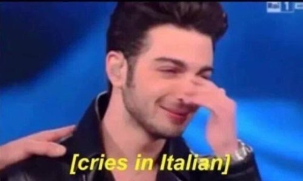

But what happened to all the other characters mentioned in these pages? What is her **legacy**, and why even talk about Caterina Sforza in <s>2021</s> 2022?

I'd like to cover all the above, but let's not do it in this post, as we have gone for too long already. Let's move to a private room [at this link](/the-legacy-of-caterina-sforza) for a smaller audience, as I'll also go personal.
