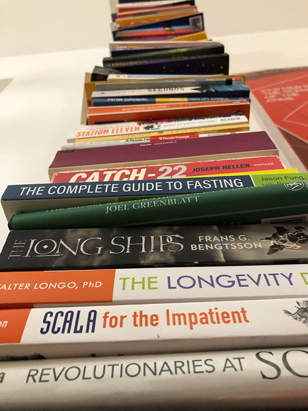

import YouTubeAudio from "../../../components/blog/YouTubeAudio";
import {Bianca} from "../../../components/blog/Grids";

Welcome. You have unlocked an exclusive room where we discuss the legacy of **Caterina Sforza**.

There are only two ways you could have reached this entry:

1. You have followed Caterina's tale from its [inception](/caterina-sforza-1) to the sad [ending](/caterina-sforza-5)

2. You have googled **clown porn** and are deeply dissatisfied with the results

In either case, you need to calm down and breathe. Let's have some closure by looking at what happened to the **supporting cast** in Caterina's story.

## Rodrigo Borgia

In 1503, two years after Caterina's release, Cesare and Rodrigo attended a dinner party at **Cardinal Cornetto's**, whom it was rumored they wanted dead, because of course they did.

After the party, they both fell ill. Did the Borgia poison themselves by mistake? We don't know, but it would be a **fitting end**, so why not let's say they did! 🥳

Younger Cesare struggled but recovered. Rodrigo not so much. Doctors did all they could to save him, and by *all they could* I mean that they applied **leeches** to his body.

Since the bleeding surprisingly didn't help, they moved to plan B. **Prayer**.

Let's all pray.

<YouTubeAudio url="https://www.youtube.com/watch?v=ohFtQIPqGSo"/>

Prayer turned out to be as effective as **Ivermectin**, and Rodrigo couldn't help but die. With his corpse still lukewarm, servants and cardinals alike looted the papal chamber of the gold and the clown porn.

Rodrigo's body could not even be exposed, as it became grossly swollen and black. The following Pope, Pius III, forbade any prayer for his predecessor, whom he thought was a **Shit Pope**.

    <iframe src="https://giphy.com/embed/gtakVlnStZUbe" width="100%" height="100%" style="position:absolute"
            frameBorder="0" class="giphy-embed" allowFullScreen></iframe>

## Cesare Borgia

Even though he escaped the death that took his father, Cesare spent months recovering in **Castel Sant'Angelo**.

What he couldn't escape was no longer having a Pope as a daddy. If you think about it, it really helps your career!

The new Pope **Pius III** was a nice guy and favorable to Cesare, but he only reigned for 26 days because this is what happens to nice Popes.

The newer Pope **Julius II** didn't like Cesare one bit, and neither did a whole other bunch of people, including **Ferdinand II** from Naples, because of the whole alliance with the French. Out of friends, Cesare accrued a great many betrayals and lost almost all of his **Monopoly** tiles.

In an attempt to regain the land in Spain that he lost, Cesare was assaulted, pinched with a spear, stripped naked and left to die. His enemies also removed the **leather mask** that covered half of his face, which was disfigured by syphilis.

This all happened in 1507, which means that Caterina was still alive to receive the news, so that was nice!

## Lucrezia Borgia

After her third husband died, surely of **natural causes**, Lucrezia attempted an unsuccessful career in clown porn.

She had a few occasional partners and wrote several love letters. The poet **Lord Byron** managed to read them centuries later and thought that they were **chef kiss**.

She passed away in 1519 for complications during her 10th pregnancy, as was customary at the time.

<FigureLabel>Lucrezia and her boob incident.</FigureLabel>

## Niccolò Machiavelli

Throughout his whole life, Machiavelli has had intense **Little Finger** vibes.

He famously distrusted mercenaries because he felt they didn't have enough **skin in the game**. With an army of farmers at his command, he successfully defeated Pisa, which reminds me...

What he couldn't defeat was dumb employers.

Following a series of terrible decisions taken by the Medici in their *Diminishing Returns* phase, he was selected as a scapegoat and accused of **betrayal**, then imprisoned and tortured.

Not finding any real proof of wrongdoings, the Medici couldn't admit their bad, and decided to **exile** him. He died at the age of 58, which was actually pretty good.

## Yves D'Allegre

The French captain with a huge crush on Caterina had a role in the sack of [Lucca](https://upload.wikimedia.org/wikipedia/commons/thumb/4/4c/Dumpster-non.JPG/220px-Dumpster-non.JPG), for which we must be grateful.

He carried more successful assaults to Italian cities but, during the siege of **Ravenna**, he saw his own son die and, boiling with rage like a proper south european, he charged into battle too soon and was killed in 1512.

## Forlì

Little known fact, Forlì is one of the oldest settlements in history, dating to the **paleolithic**, or 800 thousand years ago. Although, nothing really happened until Renaissance.

After Caterina lost the city, the Pope returned it to the previous owners the **Ordelaffi**, who did a terrible job in classic Ordelaffi style. Then a bunch of stuff happened, everyone got distracted for a hot minute, and it's suddenly 2022.

I'm planning to visit the city. Walk the main square where Girolamo's body was torn to pieces. See the tower where the heads of Giacomo's killers where affixed. Rest in the orchard where Tommaso Feo became extremely horny. Pee from the ramparts of **Ravaldino**.

But when I google **best pizza in Forli**, I get this horrific response...

So I really don't know.

## Caterina's kids

Caterina had many kids. What happened to them? Didn't I say that one was awesome? Let's parse them...

### From Girolamo Riario

### Ottaviano

Caterina's firstborn murdered his stepfather, which was frowned upon even at the time. He was a mildly successful, albeit underpaid, army captain, employed by Florence to defeat Pisa, again.

As he grew older, he became morbidly obese and thought that clergy life was best for him. He pressured his mom for help to become a cardinal, but never made it.

### Cesare

Cesare was as terrible as his older brother, but he didn't kill any stepdads, so he had that going for him.

As Ottaviano, he sought employment in the Church and became bishop of Pisa, the same city that his brother and so many other people defeated. And no we are not posting that image of Pisa again because we have already reached the hard limit on the comedic **rule of three**.

### Bianca

<ThreeColumns>
    <Bianca/>
    <Col23>
        

            Bianca was actually cool.
        

        

            The day her father was killed by the <strong>Orsi</strong> 🧸, as she was being taken hostage, one of the captors groped her. She reacted by kicking the groin of her molester. The guy was later nicknamed "lo spallato". The unballed.
        

        

            During Caterina's captivity, Bianca acted as a surrogate mother for her little brother Giovanni
            Jr. <AiTwotonePushpin/>
        

        

            Because of this, she married very late at 22, but she found a good nobleman from Parma that loved her, and who definitely had a weird pronunciation of the letter R, as all people from PaRRGHma have to this day.
        

    </Col23>
</ThreeColumns>

### Sforzino

His nickname literally meant "little Sforza", and at least 50% of it turned out to be true. As his brothers, he chose a career in God, and became the bishop of Lucca. **Ouch**.

## From Giacomo Feo

I wil go out on a limb here and say that they didn't have kids of any consequence.

## From Giovanni de Medici

### Giovanni di Giovanni de Medici <AiTwotonePushpin/>

Ok, this is the awesome son we put a pin on long ago. Let's talk about him.

Back from her imprisonment, Caterina had raised Giovanni both in the arts of the **pen** and the **sword**. He proved to be more interested in the latter.

The newly nominated Pope **Pius III** was a Medici -- and wow these families really took turns, didn't they?

The Pope admired Giovanni's spirit and made him captain of a platoon of a few hundred men.

<FigureLabel>
    Giovanni. Now, I faceapped a smile on him like I have done with the other portraits because I find it funny. What I haven't faceapped is the erection. This is coming from the original painting and I only noticed it a few minutes before going to print! 😂
</FigureLabel>

After Caterina's death, Giovanni was adopted by the Medici family. He fell in love and married his stepsister **Maria Salviati**, whose grandad was the late *Lorenzo the Magnificent*. So this was sweet, but also cringe for the whole inbreeding thing. Anyway, they had a son, Cosimo.

**Giovanni** was a captain like no others. Usually, captains stay away from the center of battle and dress differently from the other soldiers. They do this to stand out, as there is an incentive in capturing captains alive and then ransom them.

Giovanni thought himself no superior to his men. He dressed the same and was always the first to charge. For **Frodo**.

    <iframe src="https://giphy.com/embed/VqleJG2rBop7W" width="100%" height="100%" style="position:absolute"
            frameBorder="0" class="giphy-embed" allowFullScreen></iframe>

He gained many victories and was beloved by his men. Allies and foes called him by the decoration on his shield: **Giovanni dalle Bande Nere**, or John of the Black Bands, as he was internationally known.

As mentioned, **Pius III** died after only 26 days into his papacy because of the gout. He was a Medici after all.

His successor **Julius II** was also a Medici because, come on, 26 days is nothing. We need one more Pope!

Julius II descended from **Giuliano de Medici**, the brother of Lorenzo the Magnificent that died when killers went all stabby-stabby on him, courtesy of the Pazzi and Girolamo Riario. [Do you remember?](/caterina-sforza-1)

<FigureLabel>
    The Pazzi conspiracy.
</FigureLabel>

In the meantime, the city state of Florence had disintegrated and, in that vacuum, there was an interest in creating a **Duchy of Tuscany**, so that all these cities would unite and stop shitting on poor Pisa.

Now, who could have been selected as Duke? Why, a Medici! But which one? Well, there were three legit candidates:

1. Some guy whose name I can't remember. Let's call him **Mimmo**

2. **Giovanni dalle Bande Nere**, Stormborn, First of His Name, son of Giovanni the Gout Ridden, son of Caterina Sforza the Tigress of Forlì, Father of Cosimo, Husband to the Grand-kid of The Magnificent, the Biggus Dickus, Great unifier of the two Medici branches, Kinda Cute

3. **Alexander de Medici**, son of the Pope

Now, can you guess which one **Julius II** preferred?

To increase the odds for his son, Daddy Pope had to get rid of the other two candidates. Mimmo was easy. The Pope told him: "Mimmo, you are a cardinal now."

"Oh, am I?"

"Yes. The cardinal of... let's say Hungary. You leave tomorrow!"

"Wait, is Hungary even a real place?"

"Only one way to find out!"

<FigureLabel>
    The statue of Giovanni dalle Bande Nere in Florence, guarding the church of San Lorenzo, where the Medici are buried.
</FigureLabel>

Eliminating Giovanni was more complex, as he was extremely popular.

Actually, scrap that. It was **a walk in the park**. The Pope simply gave Giovanni's army assignment after assignment, until the inevitable was bound to happen. Giovanni was shot in the leg.

He himself held the candle to the surgeon that **cut** the leg out, but it didn't help, and Giovanni passed away at 28.

Alexander was then chosen as Duke, but he did such a terrible job that people went all **stabby-stabby** on him like 15 minutes later.

As a result, since Mimmo was nowhere to be found because Hungary is not a real place, **Cosimo**, Giovanni's son and Caterina Sforza's **legacy**, became the first beloved Duke of Tuscany.

<FigureLabel>
    Cosimo I de Medici.
</FigureLabel>

Here is the national anthem of the newly formed **Grand Duchy of Tuscany**, to which I still pledge allegiance every day:

<YouTubeAudio url="https://www.youtube.com/embed/dtqnNCqpKYQ?start=17"/>

## Now the ultimate question

So, this was definitely a story with a beginning, a middle, and an end. It even had a third act crisis, which usually doesn't happen in real life!

But a question arises: why talk about **Caterina Sforza** at all? What is it in her life that makes it relevant today?

As for many, 2021 has been a difficult year for me. Still, I feel like 2021 was way better than 2020, which was a significant improvement from 2019. Fuck 2019!

What helped me during these last two years was **books**, and clown porn.

I gave myself the steep goal of reading 52 books per year both in [2020](/books-2020) and [2021](/books-2021).

Among these 103 works of art and the first **Harry Potter** novel, **Elizabeth Lev's** amazing biography of Caterina Sforza is what stuck with me the most.

I feel like I have learned a lot from this woman who just doesn't give a shit. That occupies a castle while pregnant and threatens to blow people up. That yells "I have the means to make more!" in front of her children under menace. That brushes off seeing all her loved ones go. That receives the hardships with a straight back and still wakes up to fight another day. That pokes fun at her enemies in front of impossible odds. That murders 38 people on a whim.

Ok, maybe not the last bit.

And if I can add to that and go a little meta, this series of posts has taught me how valuable it is to find and work at **The Project**.

The Project can be a blog, a novel, a workout routine, a wooden furniture, or even simply organizing and printing the vacation photos. It's **Your Project**. Yours to focus on, to lose yourself into, and carry to conclusion.

I have been postponing this blog entry for some time because I knew it was going to be a big endeavor. But **Fratini** was asking for it, so yesterday, a Friday night of all nights, I decided to dedicate myself to it and not stop until it was done.

I started at 9 pm after a long, demanding day at work, **wielding** a glass of wine and unafraid of using it.

<FigureLabel>Hygge.</FigureLabel>

Then, space-time collapsed. A few beats where skipped, and when Reality rolled back to normal, I raised my head from the laptop and said: "Oh, I'm done". Then I also said: "Oh, it's 4 am," and added: "Oh, I have 65 files to commit," and finally: "Oh, I'm drunk."

I wish for all of you in 2022 to find **The Project** that will absorb you and bend the laws of physics in a similar fashion. Or even better The Projects, or The Half Project, The Something!

I have three very different **The Projects** in mind, but this is a story for another time.

Happy new year.
