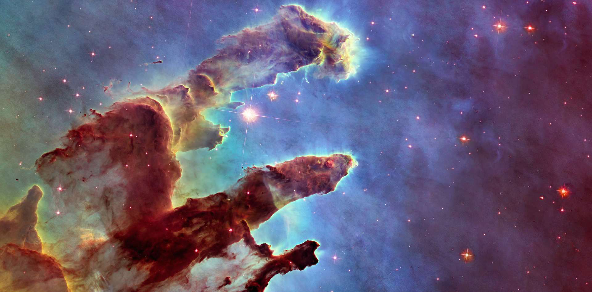
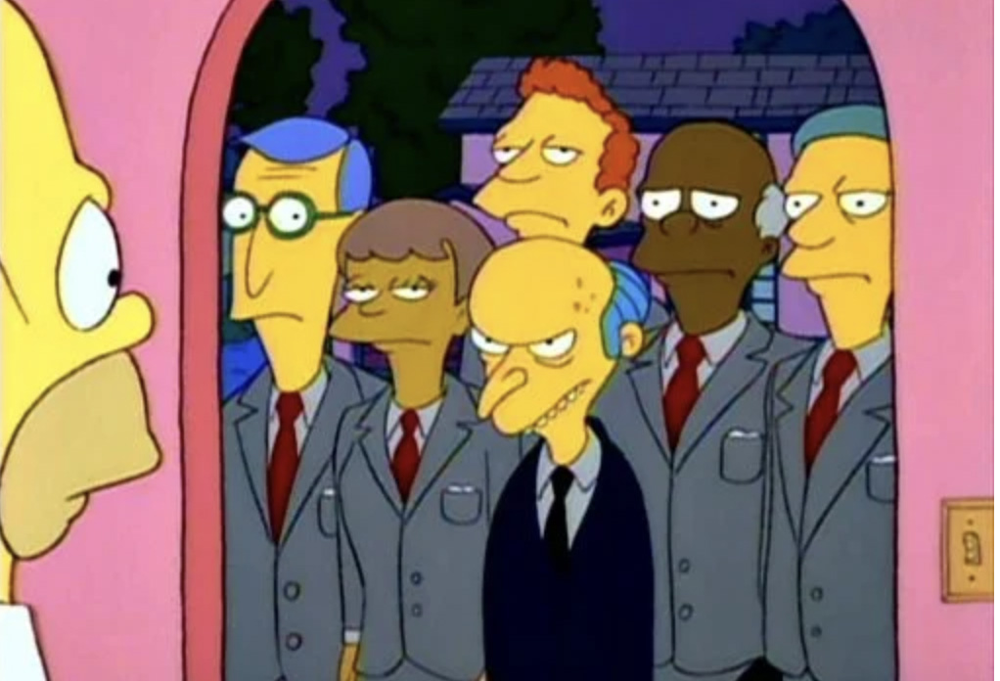
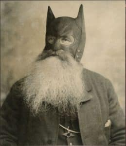
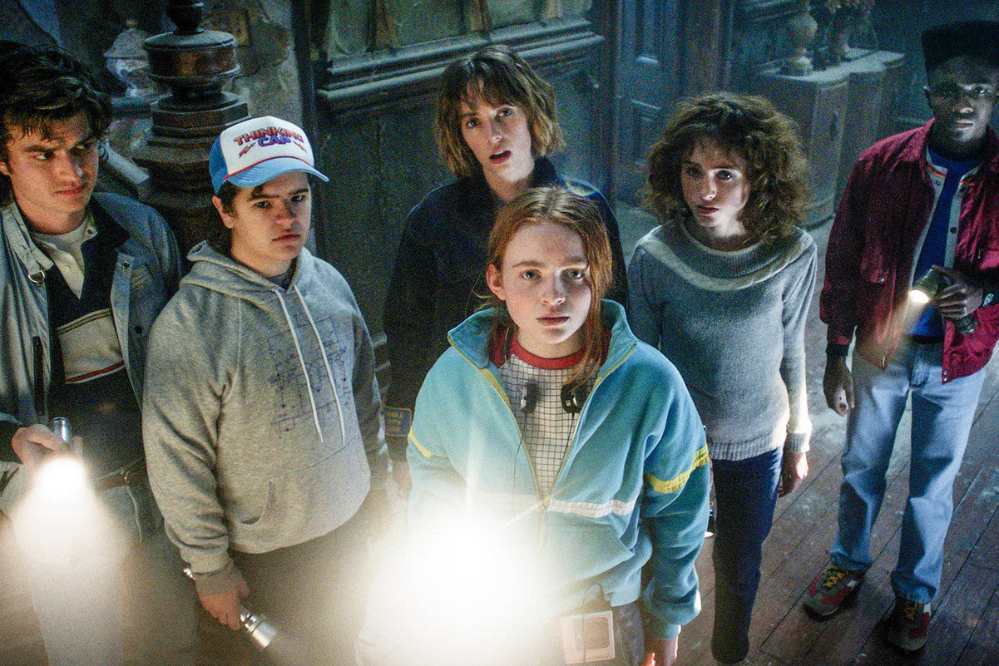
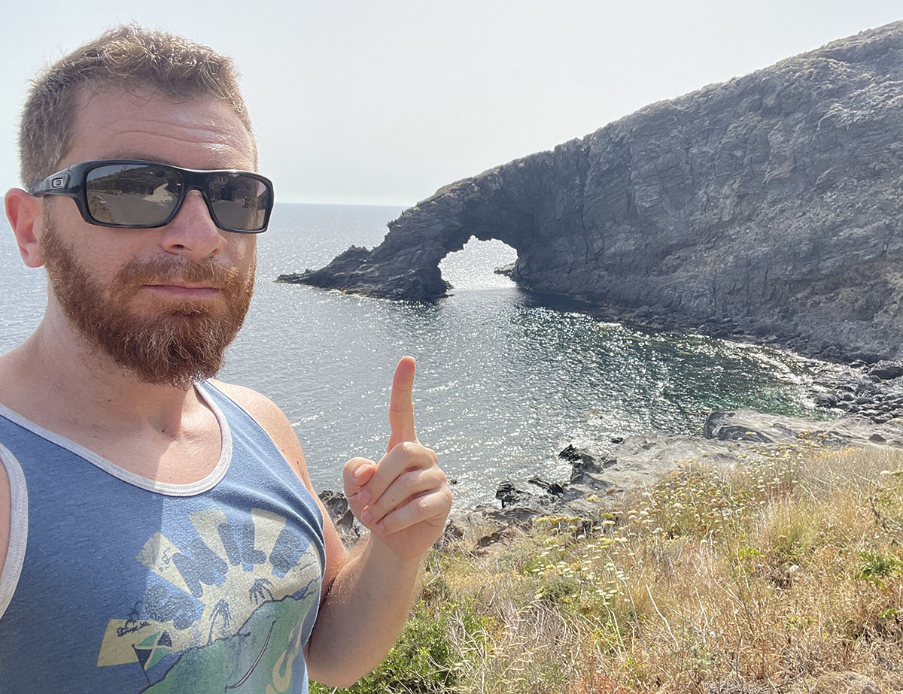
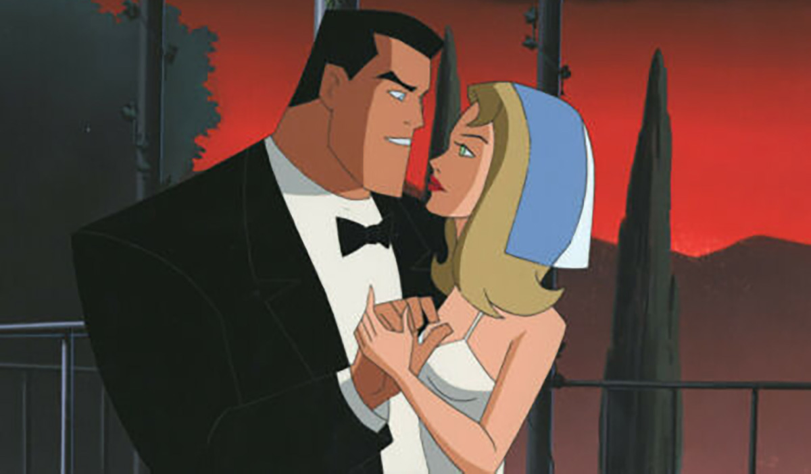
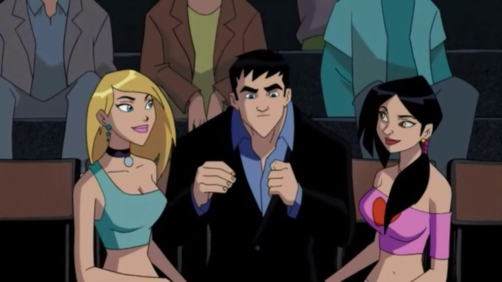
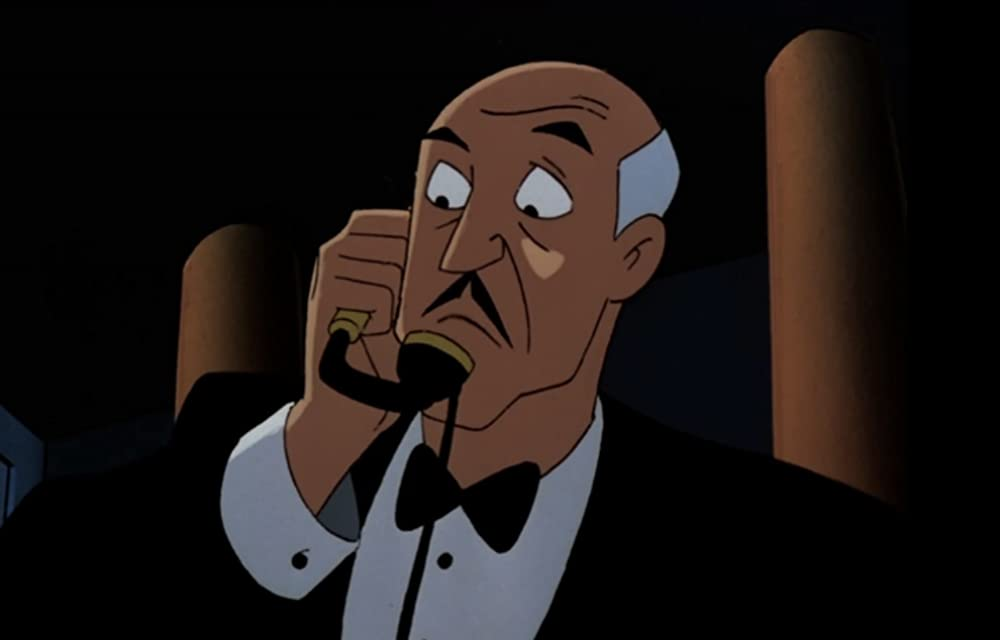

import {FigureLabel} from "../../../components/blog/Text";
import {Listen} from "../../../components/blog/YouTubeAudio";
import Quote from "../../../components/blog/Quote";
import Nsfw from "../../../components/blog/Nsfw";

I love taking showers.

First, they keep you clean, which is important now more than ever. Plus, they allow you to spend **quality time** with the person that likes you the most, yourself!

I use showers as an opportunity to **ease** on the reins of the day-to-day grind, and get lost in thoughts I would otherwise never have. Hands down the best 45 minutes of my day.

Sometimes, these ideas are the inception for a bigger project. Other times, they are collected back into the drain where they belong. I'd like to share some that are in the limbo between those two states.

<Indented>
    

        <strong>Warning</strong>: this post contains an <strong>NSFW</strong> picture of myself. It's hidden behind a spoiler tag, so this technically makes it SFW if you resist the urge of revealing the content, which I'm not sure you can.
        

            <iframe src="https://giphy.com/embed/6ra84Uso2hoir3YCgb" width="100%" height="100%"
                    style="position:absolute" frameBorder="0" class="giphy-embed" allowFullScreen></iframe>
        

        

    

</Indented>

Let's start small and build from it...

## The Universe

The Universe is 13.8 billion years old. Let me repeat it for effect. **13.8 billion** years. And that's last time I checked, so it's probably 14 by now.

It's fair to say that the Universe is quite big, but have you ever stopped considering how much **stuff** is in it?

<FigureLabel>A detail of the Universe, you silly pervs</FigureLabel>

Well, the number of **atoms** in the Universe is 1082, or a hundred billion billion billion billion billion billion billion billion billion, give or take.

This might seem like a lot, but do we need more is what I'm asking.

We always think that we have **enough**. Enough wine, enough cheese, enough energy, enough time, enough love. Until we don't.

In 1981, **Bill Gates** said that 640 kilobytes of RAM are more than anyone will ever need. Today, my 32 gigabytes beg to disagree, being all sweaty-spaghetti while editing a holiday video.

I hope that we can make do with 1082 atoms, because that's all we get. It's not like we can open up the **Universe** and add more as we do with RAM.

Seems like the Universe is an **Apple** product.

<FigureLabel>
    Stupid sexy Gates. By the way, he denies ever commenting about 640KB being enough, but how can we trust a guy that
    is putting vaccines in our 5G?
</FigureLabel>

## There are too many songs

According to **Spotify**, Humanity as a whole has released 82 million songs.

I feel like I'm not alone in thinking that that's too much. We are already **struggling** with the ones we have, and 62 thousand more come out every day. This is untenable, also considering that we don't need this many.

Let me be clear, I **love** music. I believe that pop songs are the soundtrack of our **existence**. Some of them instantly translate into specific feelings in our minds, and this might be the key to limit their proliferation.

Suppose that you are a woman that kisses a girl and ends up liking it, I'm sure that there is a song that perfectly **conveys** this emotion.

<FigureLabel>Probably from Shakira</FigureLabel>

Do we feel like we need more than one? No, exactly!

So, the solution is to make a list of all emotions and decide which song, if any, best represents them. When and if we find it, we close the entry, thereby **forbidding** the release of any new song on the topic.

Given enough time, all the human emotional range will be assigned to a work of **pop music**, which ultimately means no more new songs and a sigh of relief for humanity!

I guess covers are still ok, but super frowned upon.

I know what you are thinking. This is genius! And knowing what you were thinking, I have already started the mapping...

<table>
    <thead>
    <tr>
        <th>Emotion</th>
        <th>Song</th>
    </tr>
    </thead>
    <tbody>
    <tr>
        <td>I love you, can you hurry up and feel the same?</td>
        <td>Beatles - Love me do<Listen url={"https://www.youtube.com/watch?v=0pGOFX1D_jg"}/></td>
    </tr>
    <tr>
        <td>I love you, and when you run out of options, maybe we can date!</td>
        <td>Pulp - Disco 2000<Listen url={"https://www.youtube.com/watch?v=qJS3xnD7Mus"}/></td>
    </tr>
    <tr>
        <td>Holy crap, we are finally in love!</td>
        <td>Etta James - At Last<Listen url={"https://www.youtube.com/watch?v=DtR0HLpH-pw"}/></td>
    </tr>
    <tr>
        <td>Wait, you're breaking up with me, aren't you?</td>
        <td>The Righteous Brothers - Unchained Melody<Listen url={"https://www.youtube.com/watch?v=RXARHZmpgvw"}/></td>
    </tr>
    <tr>
        <td>We are both dickheads, so we kinda deserve each other</td>
        <td>Rupert Holmes - Escape (The Piña Colada Song)<Listen url={"https://www.youtube.com/watch?v=TazHNpt6OTo"}/>
        </td>
    </tr>
    <tr>
        <td>War is bad because I'm in it</td>
        <td>Alice in Chains - Rooster<Listen url={"https://youtu.be/uAE6Il6OTcs?t=47"}/></td>
    </tr>
    <tr>
        <td>War is cool because I'm not in it</td>
        <td>Elvis Costello - Oliver's Army<Listen url={"https://www.youtube.com/watch?v=LrjHz5hrupA"}/></td>
    </tr>
    <tr>
        <td>Seriously, war is bad</td>
        <td>Pink Floyd - Us and Them<Listen url={"https://www.youtube.com/watch?v=nDbeqj-1XOo"}/></td>
    </tr>
    <tr>
        <td>I'm not particularly good at anything, and I'm not ok with this</td>
        <td>Radiohead - Creep <Listen url={"https://www.youtube.com/watch?v=XFkzRNyygfk"}/></td>
    </tr>
    <tr>
        <td>I'm not particularly good at anything, and I'm ok with this</td>
        <td>Beck - Loser <Listen url={"https://www.youtube.com/watch?v=YgSPaXgAdzE"}/></td>
    </tr>
    <tr>
        <td>I have got the feeling that tonight is going to be a good night</td>
        <td> -- No song found yet --</td>
    </tr>
    </tbody>
</table>

You'll notice that the list is largely **incomplete**. That's because humans are complex creatures, more than we care to admit, and I need more showers to think about it. (My armpits are nodding.)

But you can also contribute to the project by submitting a pull request <a href={"https://github.com/gianlucabelvisi/gianlucabelvisi.com/blob/master/src/posts/2022/shower-thoughts/post.mdx"} target="_blank">here</a>.

One welcome side effect is that we are, in fact, mapping the human **mind**.

So, if you suddenly have a funny thought in your head, and you can't put your finger on what it is, do check this list. If it's not present, you should immediately **cease and desist** from feeling that feeling.

We don't want any more songs, thank you very much.

<FigureLabel>"We have received a report of a new unsolicited feeling"</FigureLabel>

## Bruce Wayne

I was today years old when I realized that **Bruce Wayne** cannot grow a beard.

Because the moment he does, well then **Batman** will also have the same beard, and people will be like “wait a minute!”

<FigureLabel>That's too bad because it was really growing on him.</FigureLabel>

## I don't have to put up with any of this

Since I was a kid, I've always had a high number of moles scattered throughout my body. Around 1082 to be precise. What us gingers lack in **soul**, we compensate with moles.

This has been a **psychological** issue for me. Was I ever bullied because of it? Not even once. Did I as a kid pre-bully myself into avoiding activities that required me to be in shared changing rooms in anticipation of a bullying that never took place? Yep!

That was, in retrospect, a mistake that made me miss out on so many formative experiences. 🙈

<FigureLabel>
    Like, I have never teamed up with my friends solving mysteries on our bicycles in a shameful nostalgia-ridden
    eighties setting. Nor, for that matter, did I ever take part in anything similar to the ending of the <strong>IT
    novel</strong> in the sewers. 😳
</FigureLabel>

With time, wisdom prevailed. I just stopped making it such a big deal. I was also **blessed** with partners that never seemed to mind, so that helped significantly.

Then, at the end of last year, I recall taking a shower, looking at my body and thinking wow, I have certainly come a long way since I was young. I have developed the **knowledge** that these things don't matter.

But here's the deal with knowledge...

<Quote title={"Quote"} from={"Yuval Noah Harari"}>
    Knowledge that does not change behaviour is useless. But knowledge that changes behaviour quickly loses its
    relevance.
</Quote>

Now that the lesson is **learned**, I don't have to put up with any of this! This shit can be fixed!

With this **epiphany**, I select five moles I like the least: James, Matthew, Susan, Ralph, and Bruno (yes, I have named them. You don't?), then I book an appointment for a laser surgery.

The receptionist welcomes me in. I'm about to tell her about James, Matthew, Susan, Ralph, and Bruno, when I have another **revelation**. I don't have to put up with any of this! Like, anything at all!

"You know what?" I tell the receptionist. "Let's take a more **radical** approach. Let's nuke from orbit. It's the only way to be sure."

She doesn't understand the reference, so she's not the one. I clarify.

"Let's get rid of all of them. At least those on the front torso. Next winter, we take out the ones from the back, then we do legs and arms, and if at the tail end of this I won't be getting a **complimentary** anal bleaching, I'm gonna be real pissed!"

"Ok, we can do this," she replies. "But it's going to be expensive and excruciatingly painful."

"Coincidentally, my middle name is Expensive and Excruciatingly Painful." My mom could not be persuaded with any other option.

I enter the room where the laser operator shoots up people for money. She does not speak the language of the colonizer. It's time for me to look less like a **dalmatian** and more like Fist of the North Star meets rapper 50 Cent.

Wanna see?

<Nsfw>
    

        <FigureLabel>Wait, NSFW means Not Sexy For Women, right?</FigureLabel>
    

</Nsfw>

This is the result after a few weeks. With time, the markings will go away.

Around April, during the last session before taking a summer pause, the laser operator tells me: "It's important that you don't expose the affected area to the sun." She says this in Swedish, which I understand. 🥳

I'm like "Sure thing. But, hum, what about in August? Can I suntan by then?" I say this in Swedish, which she understands. 🎊

In response, she laughs at me in Swedish, which I understand. 😭 "More like August next year, lmao!"

So here I am, surrounded by naked people and sporting an SPF protection of plus infinity, also called cloth.

<FigureLabel>Next to a rock formation that looks like a giraffe</FigureLabel>

In the end, if I were to add a corollary to the moral prescription "You don't have to put up with any of this," it would be something like: "But **maybe** check the consequences first, you piece of sh🦄."

## Post credits

To complete the anecdote, a couple of weeks into the procedure, I share a moment of **hygge** with a person. She notices the markings and asks me about them.

"Oh, these?" I reply. "I pay a **dominatrix** to visit me twice a month and apply cigarette burns to my body. It's the only time I feel alive."

This instantly ends the hygge. Let's just say that my sense of humor is more of an acquired taste.

## Bruce Wayne (reprise)

Something about **Bruce Wayne** has been bugging me for a long time, and I think I can now put a finger on what it is. Have you noticed how Bruce Wayne always shows up to charities and galas with a different date, but he’s never in a relationship?

And we are talking about stunningly attractive women. But Bruce does not seem to be interested, and I get it, because this is all a pantomime. Bruce Wayne is the **mask**. He plays a character who acts like a less problematic version of **Leonardo di Caprio** in order to protect his real identity of a utility belt wearing vigilante.

But then, does he lie to them?

Does he ask them out, being all **flirty-flirty**, have them fall in love, and then ghost them? This seems extremely out of character, which is why I have developed the theory that, for these events, Bruce Wayne hires prostitutes.

Granted, this goes way **deeper**, because any decent journalist would run a background check and reach the conclusion that **Roxy** there is not exactly a *debutante*.

No, there must be a carefully executed operation behind, where said prostitutes are hired years in advance. They are paid laser surgeries to remove their **tattoos**, possibly from the same place I go for my moles.

Then, they are sent to **college**. Fake documents are forged. Exotic accents are crafted, and strings are pulled for them to have a career as actors, models, or nuclear scientists.

This is something that must take time and resources to accomplish, and I can imagine that the whole initiative is led by **Alfred**.

<FigureLabel>"Chop chop, we are three prostitutes behind schedule!"</FigureLabel>

So, when a subject is ready, she is activated, and gets to date **Bruce Wayne** for a few nights while the paparazzi take pictures. Then, she is freed from the contract and sent back to the streets, while a new one is alerted.

I don’t even think that **Bruce** has sex with them. He doesn't strike me as that kind of guy.

Though, I’m not sure about Alfred.

## Solving Chess

When a game is down to the last **7 pieces**, chess is a solved problem.

The way chess is solved is that we have calculated all the possible move sequences with any 7 pieces left in any position on the board. So this is not an **AI** thing. We just know the moves.

Sometimes, the sequences are weird and unintuitive, but it doesn't matter because they will lead you to victory, provided that you have downloaded and committed to memory the **140 terabytes** archive that lists them all.

<FigureLabel>She did</FigureLabel>

So, what if we add a piece? Can we solve chess when it's down to **8 pieces**?

We can, or rather, we will once the project to list all moves will be completed. But to save all the permutations, we will need to pay **5 million dollars** per year in cloud storage.

With this in mind, can we **solve chess**? Can we map all the possible winning strategies for 32 pieces in any board setup, and so be done with this sport and leave a bunch of Russians out of job?

Unfortunately, this is **not possible**. We cannot store all the moves because we cannot build the flash drive to contain them. And we cannot build it because there aren't enough atoms in the Universe.

I told you we were going to run out of them!
