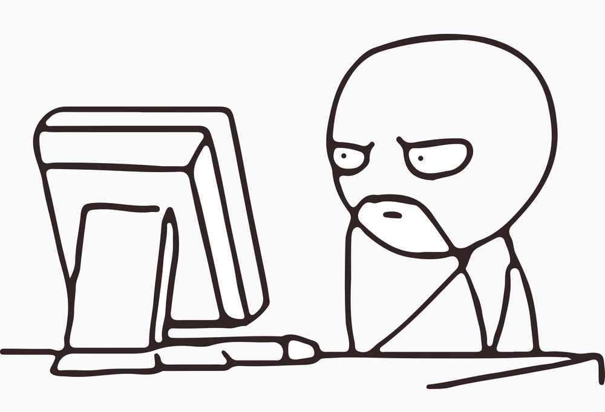
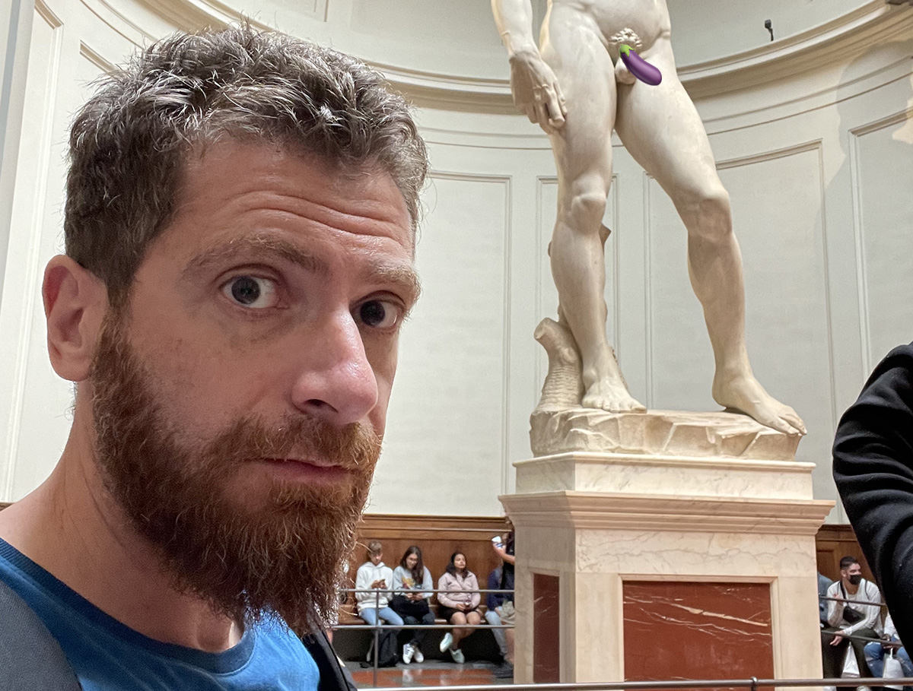
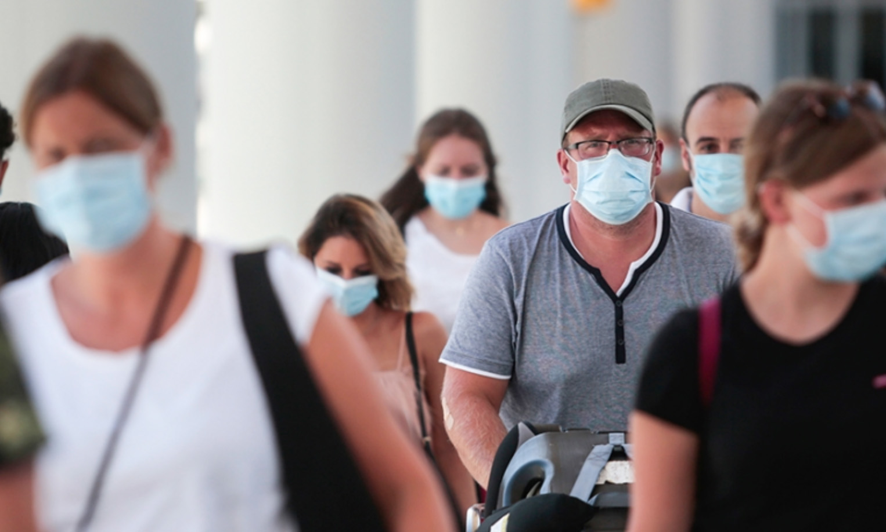
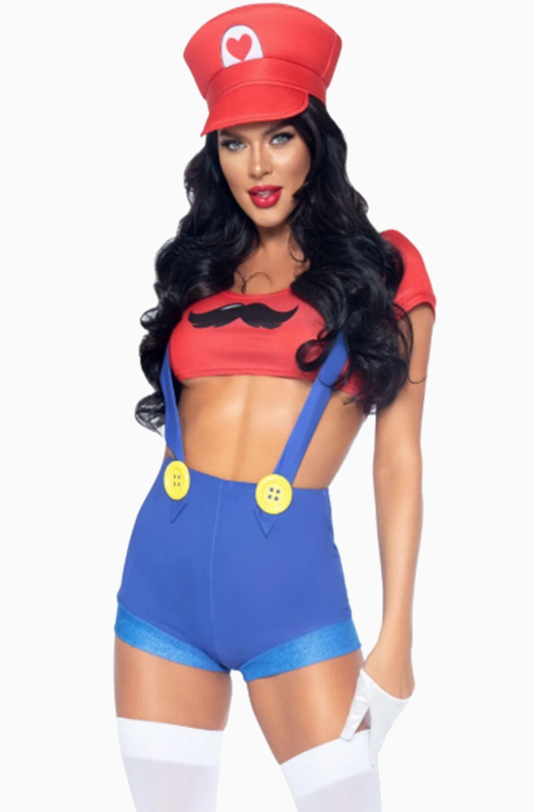
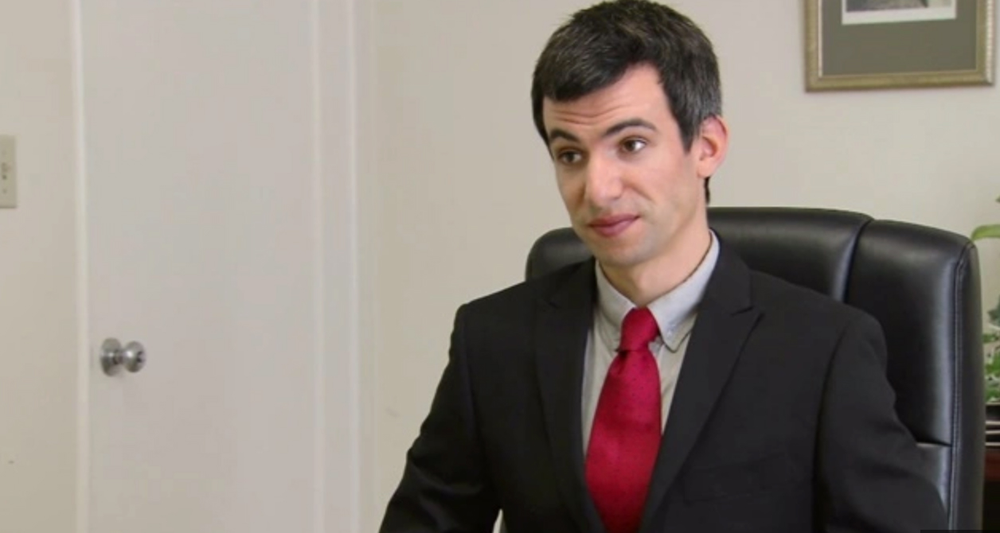
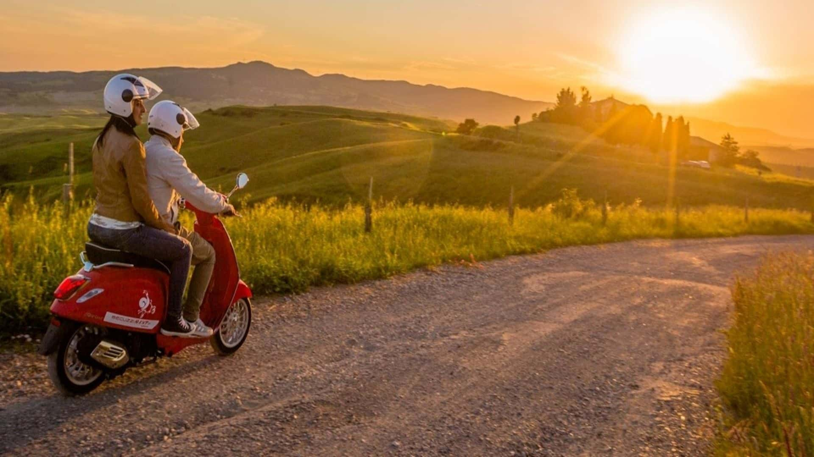
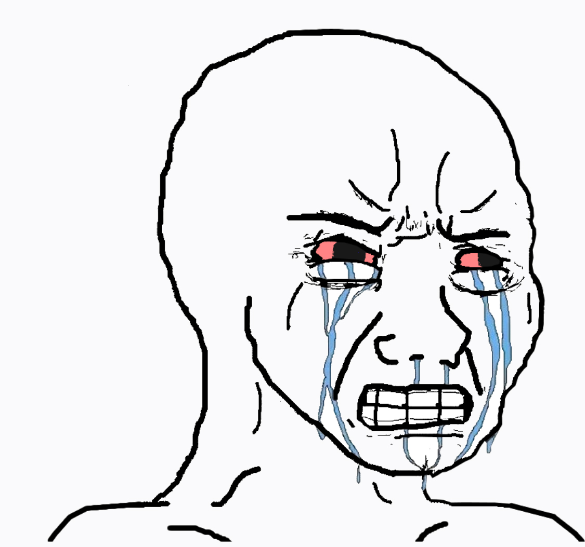
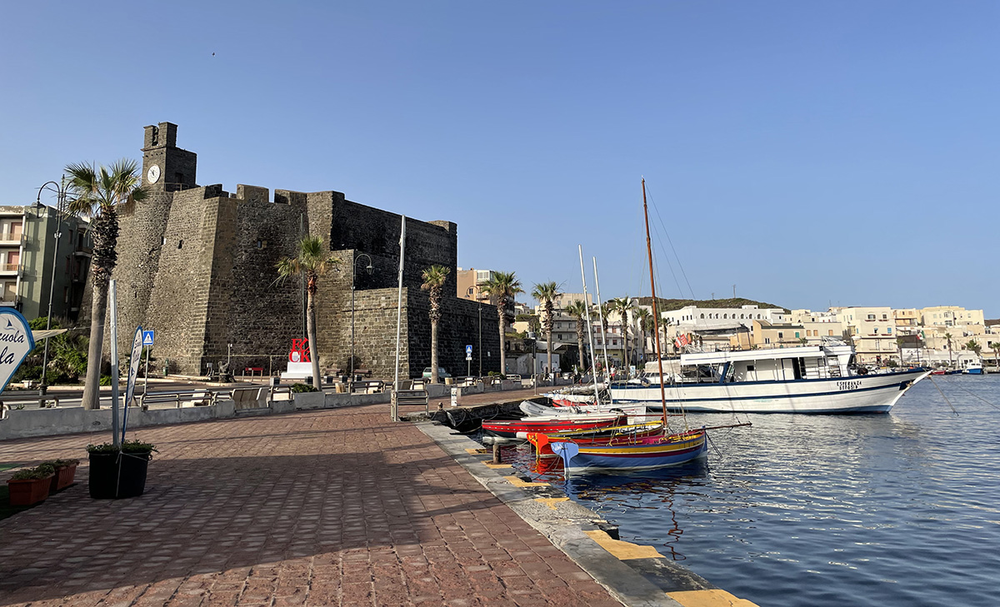

import {ResponsiveEmbed} from "../../../components/blog/ResponsiveEmbed";
import {Dialogue, FigureLabel} from "../../../components/blog/Text";
import BlogImage from "../../../components/blog/BlogImage";
import Poll from "../../../components/blog/Poll";
import TextBox from "../../../components/blog/Boxes";

<TextBox title="Disclaimer" closeable={true}>
    

        The following is the <strong>real</strong> account of something that has happened to me in the Summer of 2020.
    

    

        As with all <strong>accurate</strong>, verifiable stories, what you are about to read is ballpark 64% true.
    

    

         I'm sorry, but I don't feel that I owe you <strong>radical honesty</strong>. It's not like this is my blog or anything. I will happily deviate from Truth if this leads to a more compelling story, helps me make my point, or creates an opportunity for comedy.
    

    

        And you know what, you do the same.
    

    

        You rewrite past experiences so that you come across as the hero, the victim, or both. You hold grudges based on biased interpretations. You take me <strong>hostage</strong> with your retelling of events and then get mad at me when I call your ex to ask for his version of the story.
    

    

        At least I am sincere about my insincerity.
    

    <BlogImage imageName={"worst-person"}/>
    <FigureLabel>Heartbreaking: the worst person in the world etc. etc.</FigureLabel>
</TextBox>

So, I was thinking.

It seems like enough water has flown under the bridge, we are several booster shots past the pandemic, and it's maybe time to ask...

<Dialogue>Are we tired of all those jokes about how terrible 2020 was?</Dialogue>

...

Again, this is not **rhetorical**. Rhetorical questions are a waste of time. Please answer, so we can move on.

<Poll id="wink"
      question="Are we tired of all those jokes about how terrible 2020 was?"
      answers={["Oh my god, yes!", "Nope, keep 'em coming"]}
      labels={["Tired", "Not tired"]}
/>

Exactl-- wait, we are?! 😳

Ok, I did not expect that. I thought that 2020 jokes were going to be fine for at least a **decade**!

But *no problemo*, I’ll **improvise** something. We don't need to talk about no pandemics. Let me think...

So... what’s the deal with the **post office**, am I right? They ask you to lick the stamps, and I’m like, really? In all these centuries have we developed no better **technology** than the spit in our tongue? And worst of all, am I supposed to use my saliva in public during a pandem— FUCK!

Fine, let's discuss the **plague** for one last time and use this as an opportunity to **heal**, like literally.

First of all, I have to say that **2020** was not the worst year for me. Not by a long shot. That would be 2019.

In early 2019, my grandmother died and— you know, it’s ok, she was 94.

<TextBox title={"By the way"}>
    

        Something that I like to do when people tell me that their grandparent died is to react in a shocked and <strong>sorrowful</strong> way. This triggers in them a quintessentially human response. They will minimize the loss of their loved one to make me feel better.
    

    

        "Oh, well, she's lived a long life."
    

    

        And I'm counting on this, because I can then reply:
    

    

        "Then I guess <strong>good riddance!</strong> Why did you even tell me? I'm happy the bitch is gone. I hope she died in pain!”
    

    

        Which is very funny to me!
    

    

        Now that I'm <strong>older</strong>, I know that I can't do this anymore. I simply cannot troll friends that are mourning their grandparents. I'm gonna have to do it with their parents.
    

    <BlogImage imageName={"worst-person"}/>
</TextBox>

Anyway, in **hindsight**, and considering what was about to unfold, dying in 2019? Excellent choice, Anna!

Then, a few months later I was **assaulted**.

Let me picture the scene for you. Exterior/Night. I’m walking home from a party and somebody punches me in the head from behind. I don't see the assaulter, so I'm guessing a gang of 16 **sumo wrestlers** whose grandparents recently passed.

As a result, I lose consciousness and smash my face on the ground, breaking my nose, cutting my face, and looking **super clumsy** in the process.

<FigureLabel>Fun fact, this is not my original face. It comes from a donor. Yeah, I know, it's not like you can pick and choose.</FigureLabel>

And the worst part is that the aggression was completely **unprovoked**. Although when it occurred I was listening to the **Joe Rogan** podcast, so I’m not saying that I’m blameless.

What else happened in 2019? Ah yeah, my **laptop** got stolen. It happened at nighttime, after I was punched by strangers from behind and— oh, there’s your motive right there! 🙈

<iframe src='https://gfycat.com/ifr/DazzlingOrdinaryBubblefish' frameborder='0' scrolling='no' width='100%' height='100%' style='position:absolute;top:0;left:0;' allowfullscreen></iframe>

<FigureLabel>A few weeks after the incident, I asked the police if they had made any progress in the <strong>investigation</strong> because I wanted to recreate this scene from my favorite movie. Instead, they were super sweet and told me that they had arrested kids responsible for similar acts at night in the nearby park. And while they couldn't tie my own assault to their doing, I could rest assured that the people responsible were in custody. And I thought: how could they not recreate that scene for me? Pigs.</FigureLabel>

Last not least, in that very same year I broke up with my long time **relationship**. Or rather you should say that she broke up with me if you are a glass half empty kind of person.

So, you can agree that 2019 has been for me a continuous series of **punches**, some of which literal, and by that I don't mean that my ex beat me. I'm still talking about the assault.

Still, I’ve tried my best to keep an **upward** facing chin. I recall that at the end of 2019, on New Year's Eve, I patted myself on the back saying hang in there, buddy! 2020 is going to be your year!

And don’t get me wrong, it was!

## Grief

One thing that I like to do every time I **break up** with someone is to go through a grief phase.

Since break ups make me conclude that I’m a worthless piece of **pickled garbage**, I take the chance to behave like one. I think it really helps!

<ResponsiveEmbed ratio={"4:3"} src={"https://baldereschi.it/sr/thedude3.gif"}/>

In this period I completely isolate from the **outside world**, spending entire stretches of time indoors, always wearing sweatpants, always working from home.

And the rare times I venture outside for groceries, since I don’t want people to have their day **ruined** by looking at my face, I cover it with a mask.

So that was 2020 in a nutshell for me, and I have to say I was **relieved** to see that I was not the only one going through such a phase!

## Escape

Then, one day I decided that my apartment got too dirty, and I was ready to **move on** to a new apartment.

I was also like what the hell, let’s take some time off to allow workers inside with napalm, so I went on a vacation to **Sicily**, where my family is from.

That’s where I met her.

Let me picture the scene for you. Exterior/Day. I’m driving a **Vespa** like a *cliché* when I notice a woman working at the gas station, her skin blessed by the sun, long dark curly hair, almond brown eyes.

She is wearing work overalls like **Super Mario**, but underneath you could notice a thin red swimsuit bra much unlike the Nintendo character.

<FigureLabel>Full disclosure, this might not be her. I have already established that parts of this story are less than factual.</FigureLabel>

Not only is she hot, but more importantly, given her **profession**, I'm pretty sure that if I play my cards right I can get a 10% discount on fuel.

So there I am thinking *if only I had an excuse to talk to her!*

Which is when I realize that I’m sitting on a **motor vehicle** that drinks more than a French.

So, I drive a circle around town and approach the gas station again. Only, there are now three cars queuing at the pump. And maybe I **overreact** a tiny bit, but I become convinced that I cannot wait in line, because any of these three assholes — if not all of them! — have the opportunity of scoring a date ahead of me.

## The Plan

I have to win her heart through non-conventional **guerrilla** warfare, as all hearts are won, and I think I know what needs be done.

The plan? I would jump the queue with my **roaring** Vespa, drive past the woman, look at her in the eyes, and when she looks back at me, I would wink at her.

...

That’s it. That’s the plan. Were you waiting for more?

(I know what you are thinking, but you need to **understand** that, in Sicily, winking at women is a perfectly acceptable form of communication. It’s not sexual assault.)

In my mind, after the wink she would be so **infatuated** that she would tear down her overalls and jump on my Vespa. We would then drive toward the sunset, her hands holding my **love** handles, her breasts pinching my back. Ouch.

## Spoiler

That’s not how things went, so let’s **rewind** time to me jumping the queue, driving toward her, locking gaze, and winking with my left eye because when I use my right one it looks like I'm having a stroke, which I’m told is not sexy.

After I winked — and I need to remind myself that the past of wink is **winked** and not **wank**. I'm not making that mistake again.

I was saying, after I winked, in response she stares at me driving by, then she **shrugs** and carries on with filling the tank.

And this utterly destroys me.

I would have understood if she had reacted with **disgust**, because then I’d know that she’s not into men, what can you do?

But no reaction? That’s the worst reaction! It means that I make **zero impact** on this planet. I am but a worthless filament of manure, an anti-person that’s not supposed to walk the earth winking at strangers. I should be home instead, wearing sweatpants, playing video games, writing on my blog!

And when I come to this conclusion, I’m starting to feel **relieved**. Like a weight is suddenly off my chest. I determine once and for all that I don't give a shit!

No longer do I have to exchange words with humans in order to procure happiness. No longer must I feel **ashamed** for being alone and dirty. No longer do I need to match socks.

I’m finally **free**, and this is worth celebrating by getting fucked up drunk!

High on **insight**, I direct my Vespa toward the bars district, park in front of the shadier enterprise and go inside. I reach the counter and proceed to order every entry in the menu.

While I wait, I notice that the wall behind the counter is a sweeping mirror that makes the bar look bigger than it is, and I’m like great, now I have to endure my **ugly ass** face. Thank you, bar people!

But wait! It’s actually **fine**, because I don’t give a shit anymore!

So I close my hands to make fists and find in my body the resolve that is already in my mind. I take a deep breath, then look at myself **reflected** in the mirror.

And that’s when I realize that I’m wearing **sunglasses**.
