import {Dialogue, FigureLabel} from "../../../components/blog/Text";
import Spoiler from "../../../components/blog/Spoiler";
import Poll from "../../../components/blog/Poll";
import {Books2022} from "../../../components/blog/PhotoStack";
import YouTube from "../../../components/blog/YouTube";
import {ResponsiveEmbed} from "../../../components/blog/ResponsiveEmbed";

Due to misinterpreting a passage in the Bible, I ended up reading 52 books in [2020](/books-2020). Then expectations were formed for [2021](/books-2021), and I had to repeat the deed, although with different books.

At that point, I thought I might as well stick with it and read a book per week in the year [2022](/books-2022) from the birth of the default divinity.

So let's rejoice and take a few seconds of **mindfulness** to visualize them books, and more importantly, would you look at the freaking awesome **CSS animation** I painstakingly made...

<Books2022 background={"desk4"}/>

Don't you find it **impressive**? The animation, I mean

And now that the component is written (click [here](https://github.com/gianlucabelvisi/gianlucabelvisi.com/blob/master/src/components/blog/PhotoStack.js) for some code porn), I can reuse it on so many occasions. This blog will turn into **spinning** images so abruptly that you won't even remember that there was a static dark age.

The nineties are back!

<iframe src="https://giphy.com/embed/fJKG1UTK7k64w" width="100%" height="100%" style="position:absolute" frameBorder="0" class="giphy-embed" allowFullScreen></iframe>

Ok, this is mildly **annoying**. What was I thinking? I have wasted eight hours of coding that I could have used to stare at the ceiling.

Let's go with the analog view...

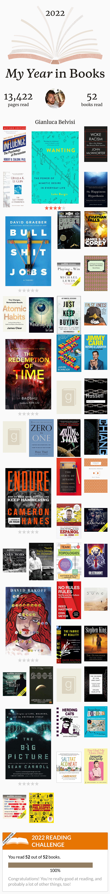

<FigureLabel>Nope, common mistake.</FigureLabel>

You will ask, are we done?

Are there any more books to read, or can we move on to something else like maybe buy a **sports car** and join those illegal street races, but also solve crimes because the car talks?

<small>(Note to self: reserve the rights to <strong>Car Gpt</strong>.)</small>

Well, according to my calculations, if no more books come out in **2023**, we are almost there. Or at least I hope. I don't want to spend another year like this.

## Why, how did it go?

Not very well to be quite honest!

For the whole year, I have constantly been at least **five** books behind schedule. Logging into [Goodreads](https://www.goodreads.com/user/show/12362887-gianluca-belvisi) gave me intense vibes of being pickled garbage.

<small>(If you are a regular reader of this blog, you might have noticed that I'm trying to make <strong>pickled garbage</strong> happen. I owe it to a dear friend.)</small> 

In early December, I had to **break up** 💔 from a relationship so that I could find the time to read. There were also other problems.

I finally closed the circle on **New Year's Eve**, with the midnight approaching like the guy from **It Follows** and while on the flu, which meant that I had no time to make a bucket list. So that was nice!

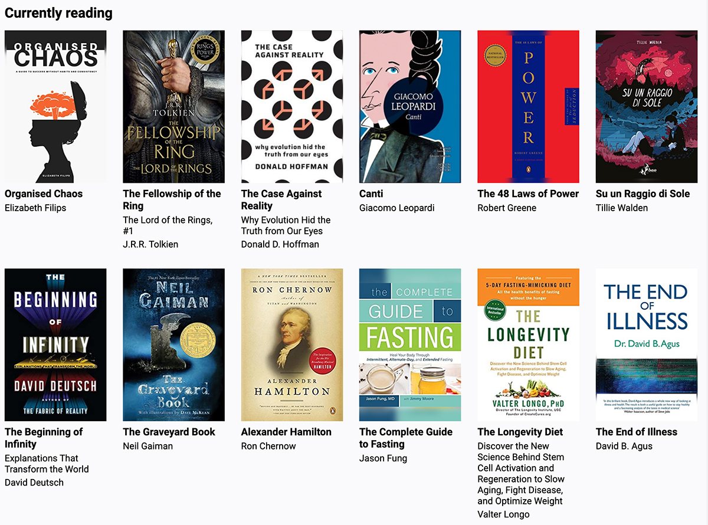

<FigureLabel>By the way, you can now monitor <a href={"https://gianlucabelvisi.com/books/"}>my shelf</a> directly from this blog (top menu), which is quite convenient if you are of the <strong>stalker</strong> kind, and you should thank me by <strong>not</strong> nailing a dead cat to my door</FigureLabel>

<Poll id="books-2022"
      question="How many books did you read in 2022?"
      answers={["Less than 5", "Less than 10", "Less than 30", "Less than 52", "52 or above"]}
      labels={["Cringe", "Not cool", "Based", "Noice", "Liar"]}
/>

Still, to reach the objective, I felt compelled to read:
* 👨🏼‍🎤  Poetry
* 🧑🏽‍🍳  Cooking books
* 👨🏽‍🎨  Art books
* 🦸🏾‍♂️  Comics

Also known as **fake** books.

    <iframe src="https://giphy.com/embed/gtakVlnStZUbe" width="100%" height="100%" style="position:absolute" frameBorder="0" class="giphy-embed" allowFullScreen/>

<FigureLabel>That'll teach them!</FigureLabel>

There are a few reasons for this **lackluster** performance. First, not being in a **pandemic** limits the possibilities to read, which is unfortunate.

Also, work was a thing, I increased my gym time, I tried and failed at meditation because it was the **boringest** thing ever, I once saw a cute dog, and it was generally nice outside. People were naked.

Speaking of, at the beginning of last year I have been involved in some **mad** dating habits that sucked out all of my free time. Not to brag. While now my dating is way more normalized in its *lack-thereofness*. Again, not to brag. 🥲

Based on the above, it's very easy to blame **myself** for almost messing up my goal, but it's **significantly** easier to blame...

## Elden Ring

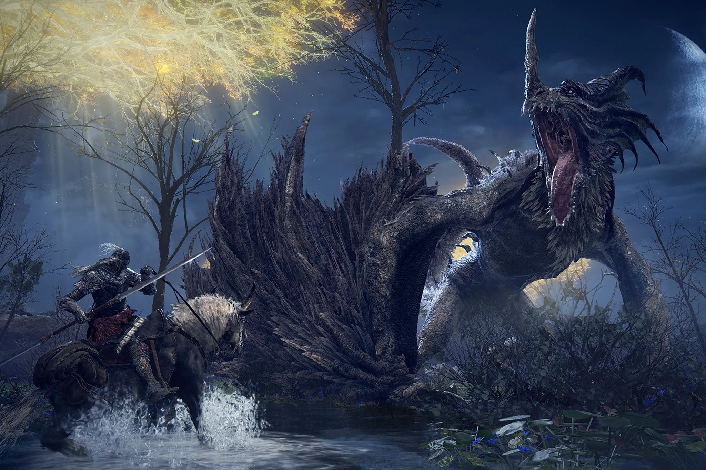

The seminal work of **From Software**, notorious for making extremely difficult games whose stories require hours of [YouTube videos](https://www.youtube.com/@VaatiVidya) to make sense of them, was released last March, and is responsible for the loss of at least one percentage point in **GDP**.

Written by George RR Martin, who would rather pen the menu of a family restaurant than finish **The Winds of Winter**, Elden Ring has stolen 130 hours of my life. Or should I say enriched? No, stolen.

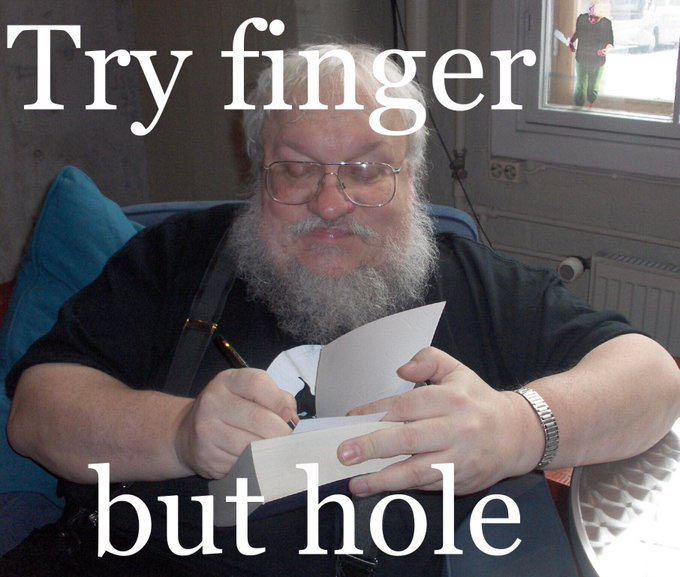

<FigureLabel>If you have played the game, this is very funny!</FigureLabel>

This is my character. Her name is Paola, she has a 🐩 resting face, she's strong in **magic**, and can't take yes for an answer.

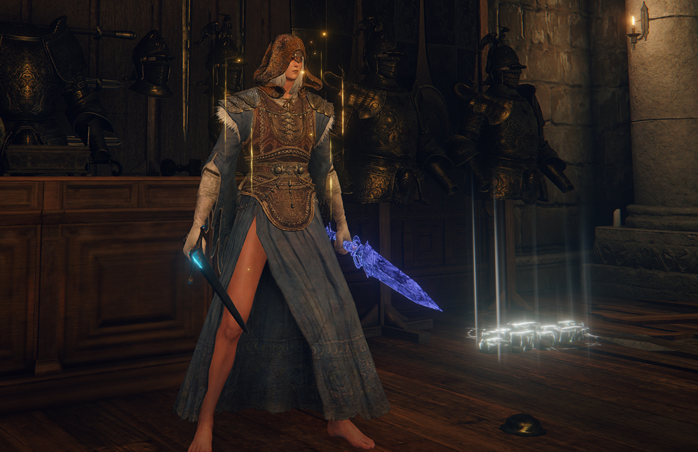

<FigureLabel>Drip check. Yep, she's not wearing any pants. It does penalize her defense, but I'm a legs enthusiast. 🤷🏽 </FigureLabel>

Halfway through the game, I realized that spells are **op**. (For the normies, op means over-powered.) Plus, magic is not cool these days, what with **JKR** going about posting cringe on the twitter. So she turned into a blood lusty c-word warrior. I mean Paola.

But I digress. Let's go back to books.

## Short vs Long

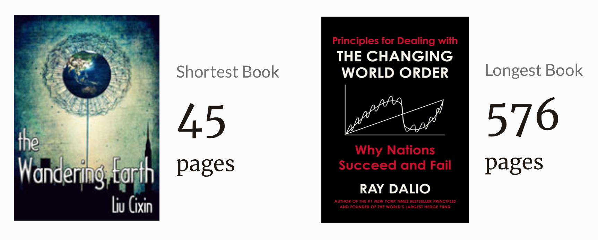

The shortest book I read is a novella about our sun fading like a cigarette into the toilet. This compels Humanity to build gigantic rockets, attach them to Earth, and propel the planet toward **Proxima Centauri**.

Basically, they had a **problem**, they solved it, and all it took was 45 pages, which is kinda efficient!

The longest one is about scary intelligent homie **Ray Dalio** reading the tea leaves of History and concluding that Western society is at the end of its cycle, and that we are going to have a **reset**.

Maybe the solution is to build rockets and attach them to the planet. This will become my answer for **everything**.

## Left hand of darkness

My favorite book of the year and quite possibly *years* is a sci-fi novel by **Ursula K. Le Guin**.

The story takes place on the planet of **Winter**, where the inhabitants are human-like beings known as *Gethenians*, who are unique in that they are ambisexual, meaning they have no fixed gender and are able to change between males and females depending on their social needs.

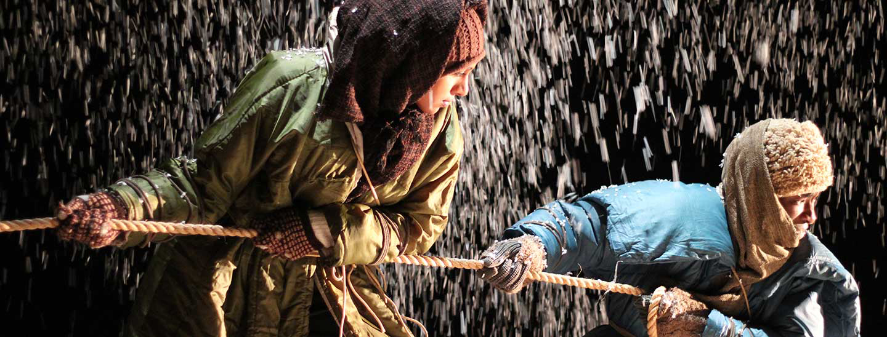

<FigureLabel>A photo of the theater adaptation. Fun fact. I had initially asked Dall-e to paint an illustration of the novel, but it kept drawing severed hands in the snow. With seven fingers. 🤦🏽‍♀️</FigureLabel>

The novel follows the journey of a human envoy, **Genly Ai**, who is sent to Winter to persuade its inhabitants to join a federation of planets. Throughout his journey, Genly struggles to understand and communicate with the Gethenians, and ultimately faces a crisis of identity as he grapples with the nature of humanity. But he also experiences one of the most beautiful **friendships** ever committed to paper.

<small>Before you go all <strong>JKR</strong> on yours truly, the novel was written in 1969 (nice). So, it's not exactly another of those dangers to Society that scare you so much, something, something, woke culture, would someone think of the children.</small> 

What this novel is, is **splendidly written**. You read a sentence, and you are like omg this is wonderful. Let me read it again. Oh, and this other sentence, and this whole page, and this one, too. Am I crying because I will never be this good?! 😭

I wish I had brain damage to read it again with an **oblivious** mind, and maybe I know a way...

## Rendezvous with Rama

It's going to be **Denis Villeneuve**'s next film -- not sure if in between dunes -- so I was curious to read the original novel from **Arthur C Clarke**, which I enjoyed.

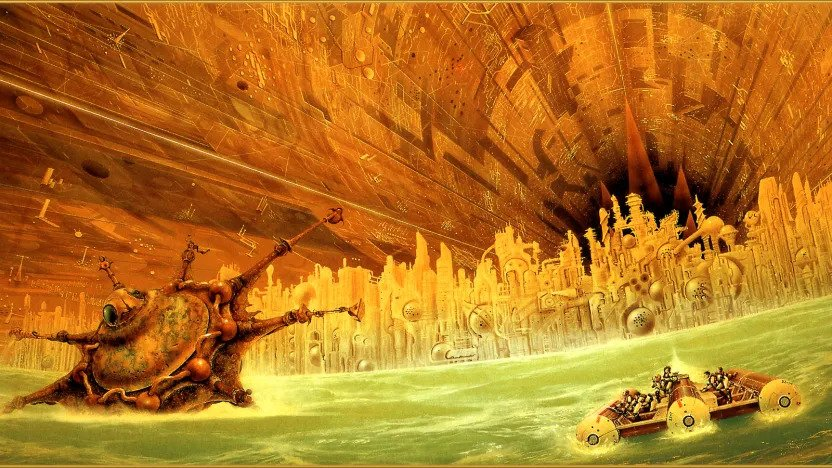

Stories about encounters with aliens are of two kinds.

Either they are **friendly** creatures who want to learn the language, play music, ride with you on a bicycle, or they are **cunty** xenomorphs that want to murder you, eat you, inseminate you. Not necessarily in this order.

**Rendezvous with Rama** reminds us that there is a third, possibly worse, option...

<Spoiler>
    <Dialogue>What if they are indifferent?</Dialogue>
</Spoiler>

## Surely you are joking, Mr Feynman

Not only was **Richard Feynman** one of the greatest minds of the last century, but he had a unique talent for conveying complex ideas to the layperson. His lectures are a treasure of insight, and it's lovely to see how much the audience is captivated.

<YouTube source={"EYPapE-3FRw"}/>

After reading his autobiography **Surely you are joking, Mr Feynman**, I found out that he was also a horny goofball. So there's hope for everyone!

Speaking of.

## Malenia

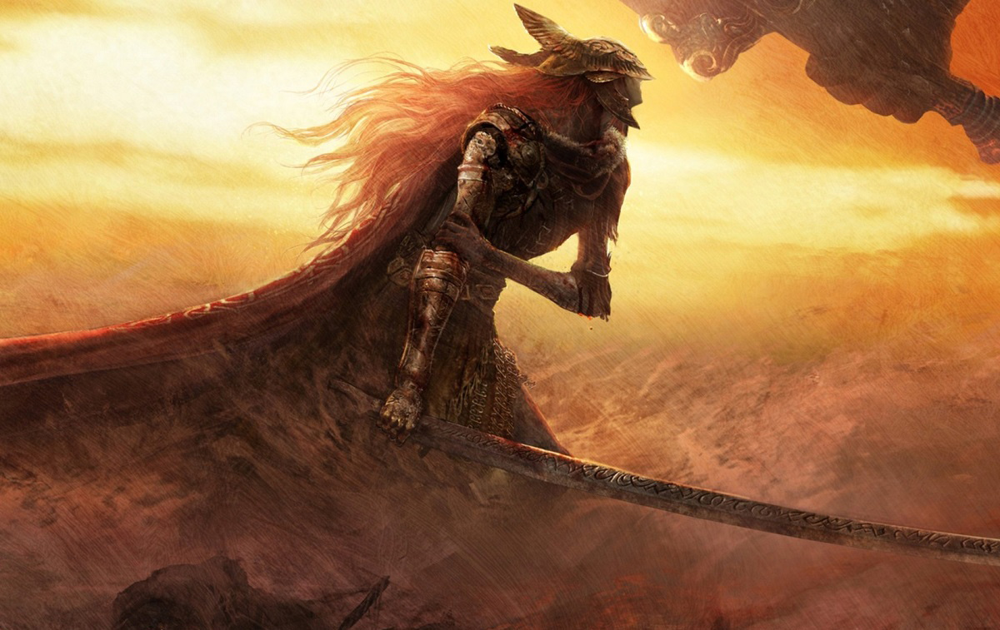

Malenia is the most difficult boss in **Elden Ring**, which makes her one of the hardest in gaming. She has killed my sorry ass at least **eighty times**, and considering how seldom I play, this meant months' worth of failed attempts.

Still, death after death, I could appreciate the progression. I started **reading** her moves and countering them. Suddenly, phase one became easy and phase two doable. We weren't fighting anymore. We were performing for an audience of one.

At some point, I had reduced her health to a rounding error, with mine still topped up. This was it. This was the victory lap! And while I was removing my t-shirt to throw it to the crowds, she thought well to execute her infamous **waterfowl dance**...

<ResponsiveEmbed ratio={"16:9"} src={"https://gfycat.com/ifr/EachDelayedLamb"}/>

...to which I couldn't help but die.

After the game over screen reminded me again how **pickled** my garbage was, I laid the controller on the side, stood up, opened the window and yelled:

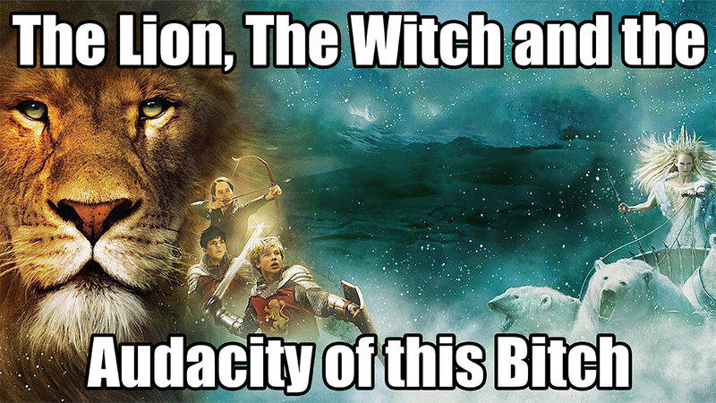

I decided that I was *donezo* with Malenia. I was the moral victor. Good job, me!

On the follow-up attempt, I summoned other players, because this bitch was gonna go down, she was gonna go down hard, and not by my hand!

Two randos came to my support: **Neytiri** and **Malenia's Ex**, who probably felt like he needed closure. This is what happened next...

<YouTube source={"RUwlhu5bcxU"}/>

I'll recap for those that don't click on YouTube embeds.

In phase one, the three of us **gang-banged** on Malenia real good, with Neytiri parrying her attacks -- I can't imagine how many hours it took to learn that -- and her ex being so aggressive that it made me feel uncomfortable.

In phase two, I took a more managerial approach, watching the fight from the sidelines and going all **Ted Lasso** on my team.

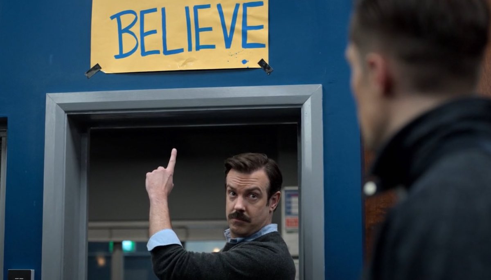

Eventually, **Malenia** killed her ex, and I mean, I get it. I'm more of a dead cat nailer kind of person, but I get it.

This compelled me to rejoin the fight to save Neytiri, who sorely didn't need it. Be it as it may, it was me that landed the final blow from **behind**, AS SHE LIKES IT.

But I digress again.

## Philosophy

I'm currently busy writing a post about Philosophy, or rather I should say **rewriting**, because I felt like the first draft was lacking insight due to me not knowing a single thing about Philosophy.

Now that I have closed the gap a bit, I can confidently announce that no one should **ever** read about this discipline, because philosophers are quite possibly the worst writers that ever walked the planet. It's like, bro, who **hurt** you? Why are you like this? Are you choosing the worst sentence structures, the longest streams of consciousness without a punctuation break, and the most **obscure** words to bemuse your readers enough that they will acquiesce in laying on the sack with you?

Don't we all.

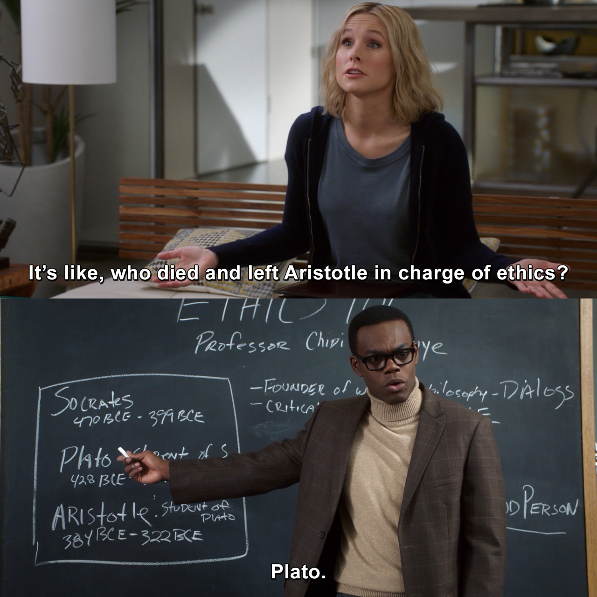

Unsurprisingly, the exceptions are those philosophers that are still alive. This is because they would not tolerate their writing to be ridiculed on the major social networks like **Instagram**, where Philosophy criticism is rampant.

The following are two examples.

## The big picture

In my objective opinion, **Sean Carroll** is the best Science and Philosophy communicator. He's just a pleasure to listen to. Of course, this is because Richard Feynman has passed away in 1988. So I'm curious about Sean's whereabouts on February 15th of that year.

Incidentally, do you think it's a coincidence that this post has been published exactly on the **35th anniversary** of Feynman's death? Because it totally is!

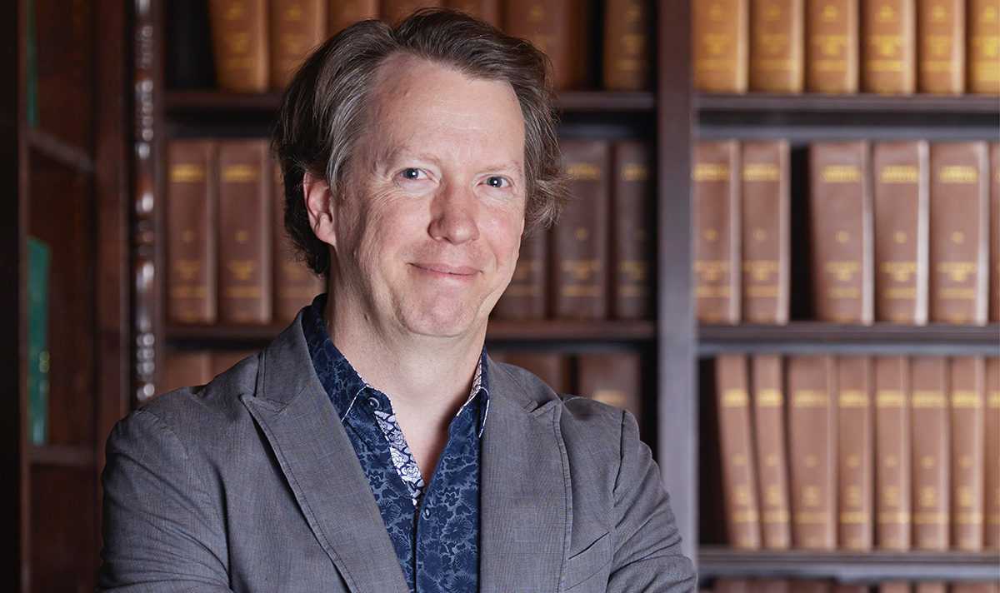

<FigureLabel>I also believe that <strong>Bill Nye</strong> and <strong>Neil Degrasse Tyson</strong> belong to prison.</FigureLabel>

Sean Carroll's **The big picture** is a book about Philosophy, and like all good Philosophy books, it begins from the subatomic, the quantum realm, and it builds its way up, up, and up until he reaches the point of asking what is the answer to life, the universe, and everything.

<small>If you are one of those people that reply 42, I hate you so freaking much.</small>

By the way, Carroll provides the best answer to the **trolley problem**. I will not spoil it here because it's going to go in the Philosophy post. Please wait until -- checks notes -- March.

## The fabric of Reality

**David Deutsch** is the smartest person alive, and please don't rebut with the name that is forming inside your head. Just don't. Let's be serious. And I'm saying this with no hate, as a happy and profitable Tesla shareholder.

Two years back, I have tried reading Deutsch's **The beginning of infinity** and felt like my brain was too tiny. So, to properly understand it, I will have to write a series of blog posts about it, and as [Trello](/trello) shows, my backlog is filled. So we are looking at October.

In the meantime, I have read **The fabric of Reality**, which is far more accessible.

In this work, Deutsch attempts at unifying four theories:
1. Quantum theory
2. The theory of evolution
3. Epistemology (theory of knowledge)
4. The theory of computation

In chapter 1, the Author establishes the **Multiverse** as an inevitability, and it's a wild ride up until the end, which I will not spoil, but it's not turtles.

## Comic strips

I think that web comic artists have figured out an excellent business model.

Every week or so, they publish a new strip on their website to keep **engagement** high. When they have collected enough material, they release it in a book that is in the price range to be the perfect gift that says "I like you, and I don't want to win you with money."

My favorites are Sarah Andersen's [Sarah's Scribbles](https://sarahcandersen.com/) and [False Knees](https://falseknees.com/432.html) by Joshua Barkman.

**Andersen**'s quirky and self-deprecating humor hits exactly in my soft spot.

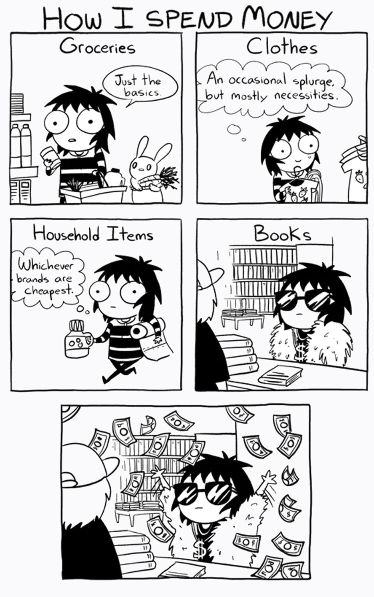

And **Barkman**'s comics feature birds!

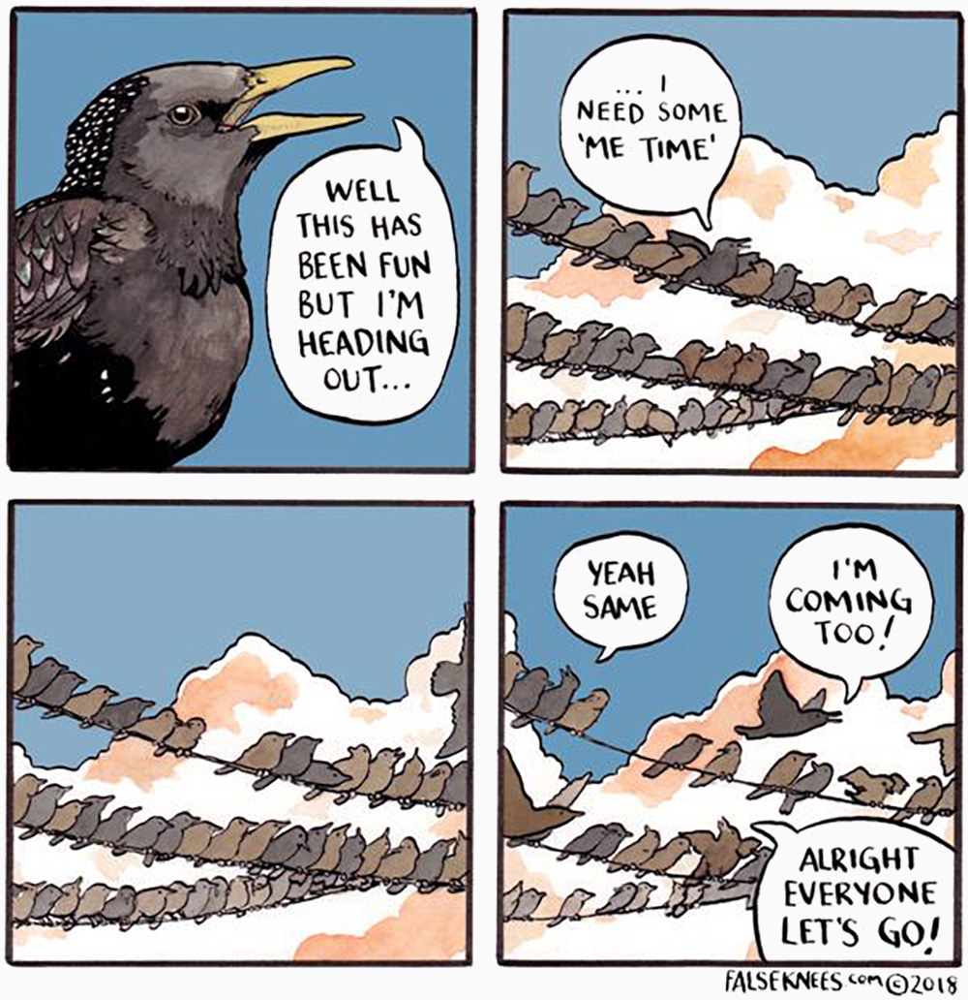

## Big books

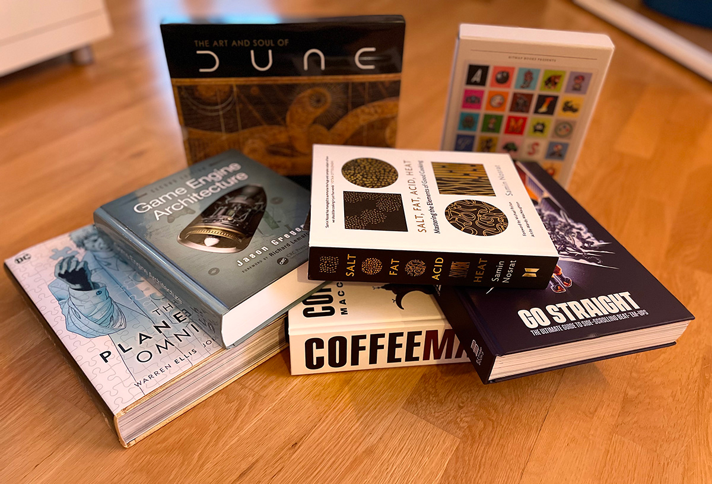

I've never been a **big books** kind of person. They are difficult to hold, they will fall apart as they get older, and if you bring them anywhere, people will stare at you.

This makes me more of an **average** book size lover, or even those tiny **athletic** books. They look cute!

But as already mentioned, at the beginning of last year I've had the chance of handling some **importantly** big books, and I admit that I have changed my mind. I believe that there is a place for big books in this Society, and from now on I will be their staunch defender. Plus, we all know that what really matters is the cup!

Wait, I don't understand what is happening here?--- Damn **autocorrect**!

<small>(I will not apologize for the juvenile humor. If anything, I think that we need more of it.)</small> 

## Why books?

This time, I really mean books.

Why should one read books in **2023**, instead of solving crimes partnering with a sports car? I'll give you three reasons that build upon each other.

### 1. We kinda suck

Sorry for the harshness. I need to provoke you to keep **engagement** high, or you will tune out.

But it's true. We do suck, and I'm tired of pretending that we don't. Let me prove it. How many **original thoughts** did you have last year?

Me, I'm not even sure that I've had one. Humans do not run on new ideas. We are mostly good at **mimicking** what is thrown our way. We are party parrots.

<iframe src="https://giphy.com/embed/l3q2zVr6cu95nF6O4" width="100%" height="100%" style="position:absolute" frameBorder="0" class="giphy-embed" allowFullScreen></iframe>

What we can do well is act as **filters**: syphon good ideas from the bad ones, merge them, season them with our backlog of experiences and, almost as a **side effect**, add a somewhat not too unoriginal spin.

This is not necessarily bad. **Quentin Tarantino** has built a whole career around it.

The implication is that we do not exist in a vacuum. We need to be exposed to as many concepts as possible because we are not going to **divine** them out of thin air.

Hence, books.

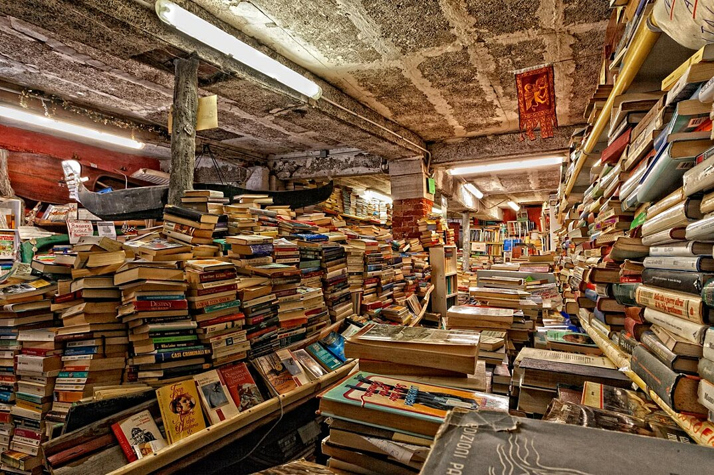

<FigureLabel>Acqua Alta book store in Venice.</FigureLabel>

This is, of course, derivative. It comes among others from **Rene' Girard** who, being a dead philosopher, writes like shit. Consider not reading him.

### 2. It changes our lives

Sorry about the hyperbole. I need to inspire you to keep **engagement** high, or you will tune out.

Absent any stimuli, we are going to stay well anchored to a **local minimum**. We'll cozy up in our personalized echo chambers, keeping us unchallenged, unprovoked, stagnating.

Reading awakens us. It pokes our **certainties**, which affects the thinking. Thinking changes our speaking. Speaking pilots our actions. Actions become habits. Habits are ultimately who we are.

(This comes from the **Talmud**. I'm not that deep.)

<iframe src='https://gfycat.com/ifr/PoisedTeemingBelugawhale' frameborder='0' scrolling='no' width='100%' height='100%' style='position:absolute;top:0;left:0;' allowfullscreen></iframe>

### 3. It's hard

Please, remain **engaged** for a little longer. We are almost done.

We are rapidly moving toward a Society where any form of **trivial thinking** will have a market value of *nil*. Artificial Intelligence will handle all non-challenging thoughts, and automate away most of the [Bullshit Jobs](https://www.bookdepository.com/Bullshit-Jobs-David-Graeber/9781501143335). Even solving crimes will be mainly delegated to sports cars.

And that's a good thing!

This is our grind as a species and why we no longer hunt for survival or work in one of those **Dickensian** factories in Victorian London.

It's great, but we need to keep at it, because it feels so good to **indulge** in the easy once we remove the current layer of complexity.

Watching **tik-toks** makes us worse by not making us better. This is not me throwing a shade at the content creators, because those videos require craft and talent to make.

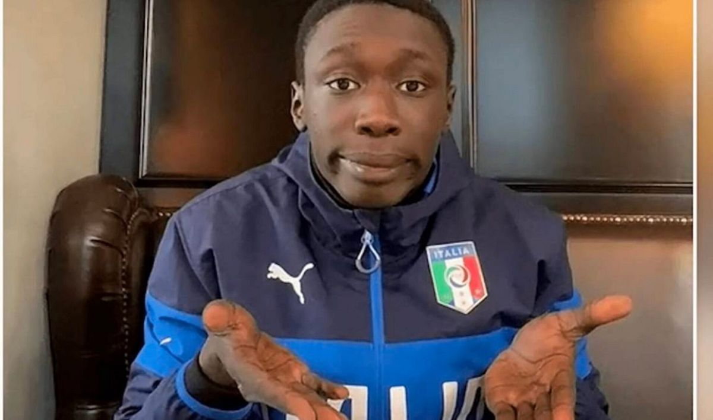

<FigureLabel>Except for this guy</FigureLabel>

It's consuming them that it's way too simple. It literally takes a finger!

We **need** the challenge of books. Reading is **difficult** because it requires undivided, prolonged attention. It wants us to be able to second guess ourselves, combine ideas, store them in our skulls to be accessed when opportunity calls, and use them to change the world.

As it turns out, we have all the tools for it. We are **capable** of so much more than what we are often resigned of doing. And since we can, we should.

Or not!

Alternatively, we could do none of it and keep watching **reality shows** with mildly famous people on an island starving themselves and pooping in the tall grass because sometimes we feel the need of shutting our brains off.

And to this, I say:

<Dialogue>Do you also want fries and a lobotomy with that? 🦄</Dialogue>

Finally, when things look bleak and you don't seem to progress as much as you would like, remember that you don't have to be perfect. It takes time to **git gud**. Try again at a later time, summon helpers, and remember that everyone is as pickled as you are. For instance, this is Elon Musk's build in **Elden Ring**...

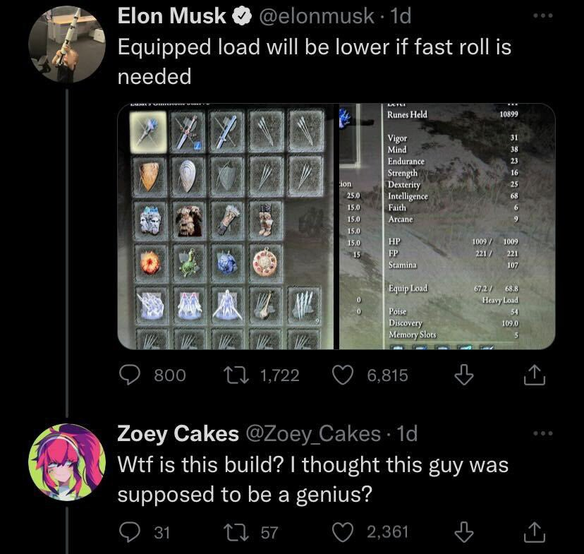

<FigureLabel>Well, he did assign 68 to intelligence</FigureLabel>

## Meta commentary

Holy guacamole. After last month's [habits](/habits) post, this was supposed to be a **palate cleanser**. Just a pinch of humble-brag to keep me out of bed. Instead, four thousand words in, I went somewhat culty on your collective asses.

But I'm happy with it! Did you notice that the post has the structure of a **tv-show**?

Like a good episode of **Seinfeld**, we have the **A Story** concerning books, the **B Story** about Elden Ring, and we intertwine them for the runtime. They seem unrelated, but are they? There are hints of convergence: reading books versus reading Malenia's moves; the two endeavors being hard; I also managed to guest star **Elon Musk** in both!

To complete the Seinfeld parallel, the two storylines should come **together** at the end. Will they? Won't they? Only one way to find out!

And I want to stress that, while nothing expressed in this article is **original**, hopefully I managed to convey it in a configuration that made it engaging, and I did it by adding from my background in meme culture, videogames, and juvenile humor.

And the **neural networking** that allowed me to achieve this is entirely thanks to **mushrooms**.

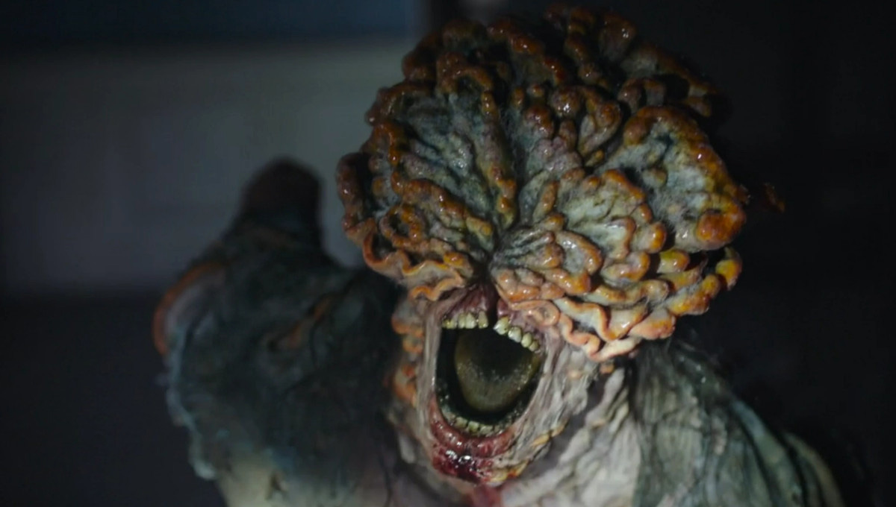

<FigureLabel>I know that you thought I was going to say books. But it's not books. It's mushrooms</FigureLabel>

## The End

After killing Malenia, I feel the urge of beating **Elden Ring**. After all, this is the other reason I **broke-up** 💔 from a relationship a few months back.

I head toward the end game area, kill a bunch of boomer bosses, and suddenly the final foe manifests itself...

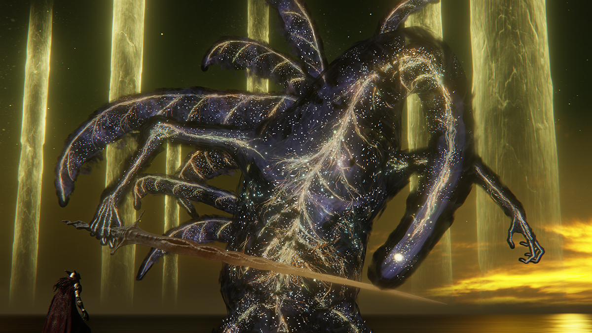

<FigureLabel>The Elden Beast is squishy at the touch</FigureLabel>

This is it.

This is book 52 completed on December 31st. This is parrying Malenia. This is coding spinning images. This is finishing a dead philosopher's tome. This is attaching giant rockets to the planet.

No matter how many times this creature will spread me like **nutella** on sliced bread, I know that to succeed I just have to put in the hours, and I will not give up unt-- wait a second did he just die at the first attempt? 😲

Well, such is the power of reading books!

Also, I was op af.
