import BlogImage from "../../../components/blog/BlogImage";
import YouTube from "../../../components/blog/YouTube";
import {ResponsiveEmbed} from "../../../components/blog/ResponsiveEmbed";
import {Dialogue, FigureLabel, Formula, Indented, Pony} from "../../../components/blog/Text";

Interior/Night. I'm on a date, and I'm asked what my **daily routine** is, because these are the kind of questions people ask on dates.

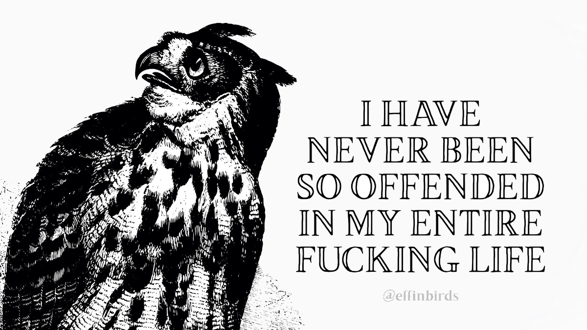

Against better judgement, I provide a detailed account of my typical day, which takes me a solid **seven minutes** to deliver. When I'm done, my date is holding her head with two hands, elbows firm on the table and an expression of **anguish**.

She takes a long sip, then asks:

<Dialogue>Where... where do you find the energy to do all that?</Dialogue>

I allow a beat of silence, for effect, and reply:

<Dialogue>Food 🦄</Dialogue>

And let me be clear, this is a **rude** answer that she doesn't deserve, being a cool, smart, vaccinated woman. Even if she asks way too personal questions.

Now, the reasons why I'm sabotaging my own dates are better discussed with a **professional** and are beside the point. The point is that, yes, I seem to be doing a great many things in a day that, may I remind you, only comprises 24 hours.

If my fridge is to be trusted, this is my standard month:

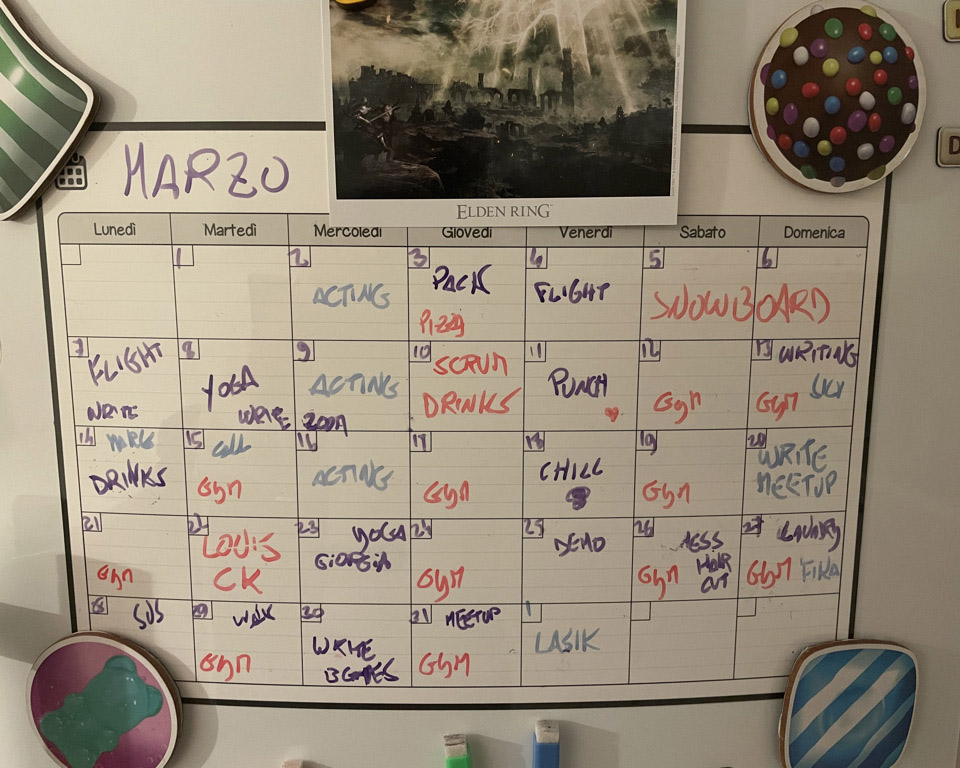

<FigureLabel>Yes, I have started writing this post a year ago 🙈</FigureLabel>

And this doesn't even include commuting to another country for work every day, reading a [book per week](/books-2021), and subjecting myself to dates.

Speaking of, she's now curious about what I'm typing on my laptop. I reply that I'm working at this **blog post**. Yes, this is all happening live. She sighs, then asks:

<Dialogue>Anyway, what's your secret? I could really use some motivation. </Dialogue>

To which I promptly respond:

<Dialogue>You do, if you are a freaking moron. 🦄</Dialogue>

And look, we have already established that my flirting skills need a tiny bit of **fine-tuning**, so no use lingering on it. Let's focus on the core message...

## Motivation is bad

There will come a time when things align perfectly in your life, making you feel highly **motivated**.

Could be due to scoring a **critical** on hormone levels, could be a relieving post-nut clarity, or maybe you read one of those **Tim Urban** posts saying that you have 4000 weeks in your life so, you know, better hurry.

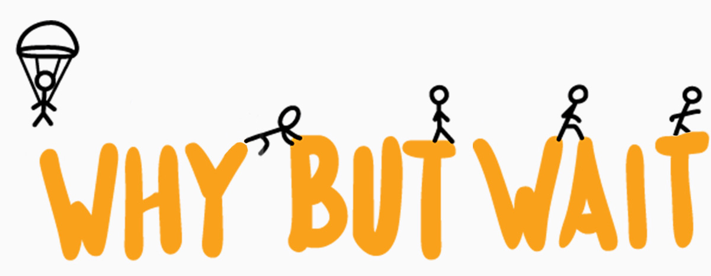

There even is an infamous day when motivations tend to coalesce. This day is **December 31st**, when human adults lie to themselves with insane prospects...

<Dialogue>
    That's it, come tomorrow, I will diet, I will exercise, I will finally start writing that novel about lesbian zombie nuns
</Dialogue>

This motivated version of you is an unreliable, noncommittal, outright toxic version of you. You should **never** trust this stranger with any decision. If possible, you should slap yourself out of this state.

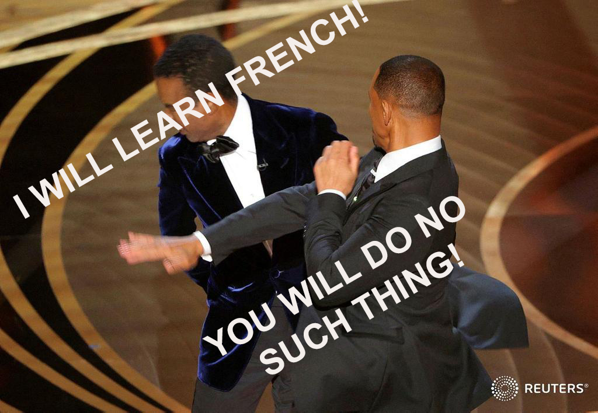

<FigureLabel>Early 2022 memes are a testament on how old this post is</FigureLabel>

And the **tomorrows** in these kind of vows are never 24 hours from now. Everything is closed on New Year's Day anyway!

No, those tomorrows are an abstract concept. The rug under which all aspirations are swept. The elephant cemetery of good intentions. **Parks & Recreation**'s March 31st.

<YouTube source="XhulR_kJf7Y"></YouTube>

## Why motivation is bad

When you let the best version of you take big decisions like losing weight, learning Javascript, beating **Elden Ring**, you are going to have an initial amazing experience. You will see those kilos, lines of code, lore bosses go down like the NASDAQ. It's galvanizing. You will feel **unstoppable**. For a bit.

But, eventually, shit will get real.

<ResponsiveEmbed ratio={"16:9"} src={"//coub.com/embed/4widc?muted=false&autostart=false&originalSize=false&startWithHD=true"}/>

The **unexpected** is bound to happen. It can be something as mundane as a tax audit, the text from an ex, or the threat of nuclear war, but it will be enough to break your streak.

As a result, the Universe will fight back like **Rocky** in act 3, reclaiming all the energy you shoved into it. The larger the progress you made, the bigger the downfall in accordance to Newton's **third law of motion**: something, something, action, reaction.

(What, I'm not a scholar.)

What's worse is that you will enter a **positive feedback loop**.

The thing you wanted to achieve seems now so unreachable that you'd rather sit on your butt and watch tv. This will make you feel **sluggish**, getting you to watch more tv because that's all the energy you can muster. Which leads to frustration. Frustration to anxiety. Anxiety to junk food. Junk food to obesity. Obesity to shame. Shame to the **dark side**.

<ResponsiveEmbed ratio="16:9" src="https://giphy.com/embed/nNOZe5giJhwsM"/>

<FigureLabel>Horny now</FigureLabel>

And all that you are left with is the feeling of:

<Dialogue>I would have reached my goal, had shit not gotten real</Dialogue>

## If not motivation, what then?

To avoid positive feedback loops, you need to make falling off the **bandwagon** a feature, and not a bug.

Admit that you are **pickled garbage**, and instead of striving for quantum leaps, focus on tiny, incremental changes, and let them sediment by means of habit formation.

<ResponsiveEmbed ratio={"16:9"} src={"https://baldereschi.it/sr/drug_regimen.gif"}/>

And this is a moment like another to disclose that I'm basing all of this on James Clear's [Atomic Habits](https://www.bookdepository.com/Atomic-Habits/9781847941831). I'd suggest you buy it, but why would you when you can read this post [for free](https://www.paypal.com/paypalme/gianlucabelvisi)?

## One percent better

Imagine yourself today. You woke up, had breakfast, hopefully showered, went to work, and kept at it until you passed out on the mezzanine. Let's put a value to this person. Let's give it a 1. Replace with 0.2 if you are from **Naples**.

Imagine being this very same person for the whole year. How much would that account for? Let's run the math:

<Formula>
    1365 = 1
</Formula>

Ok, cool!

Now, project improving a bit every day. Say 1% better. Not much, innit? Let's do the calculation again:

<Formula>
    1.01365 = 37.78
</Formula>

You will agree that 37.78 is, like, a thousand times larger than 1.

In only one year, you have turned your life around, and all it took was doing a **rounding error** more every day.

## Do you feel inspired?

Would you still feel inspired if I told you that this is a bold faced **lie**?

Thanks to **compounding**, one percent better is actually a lot! Improve your basketball fundamentals for that amount every day, and you'll be Michael Jordan by midsummer!

But don't blame me, this comes verbatim from the book!

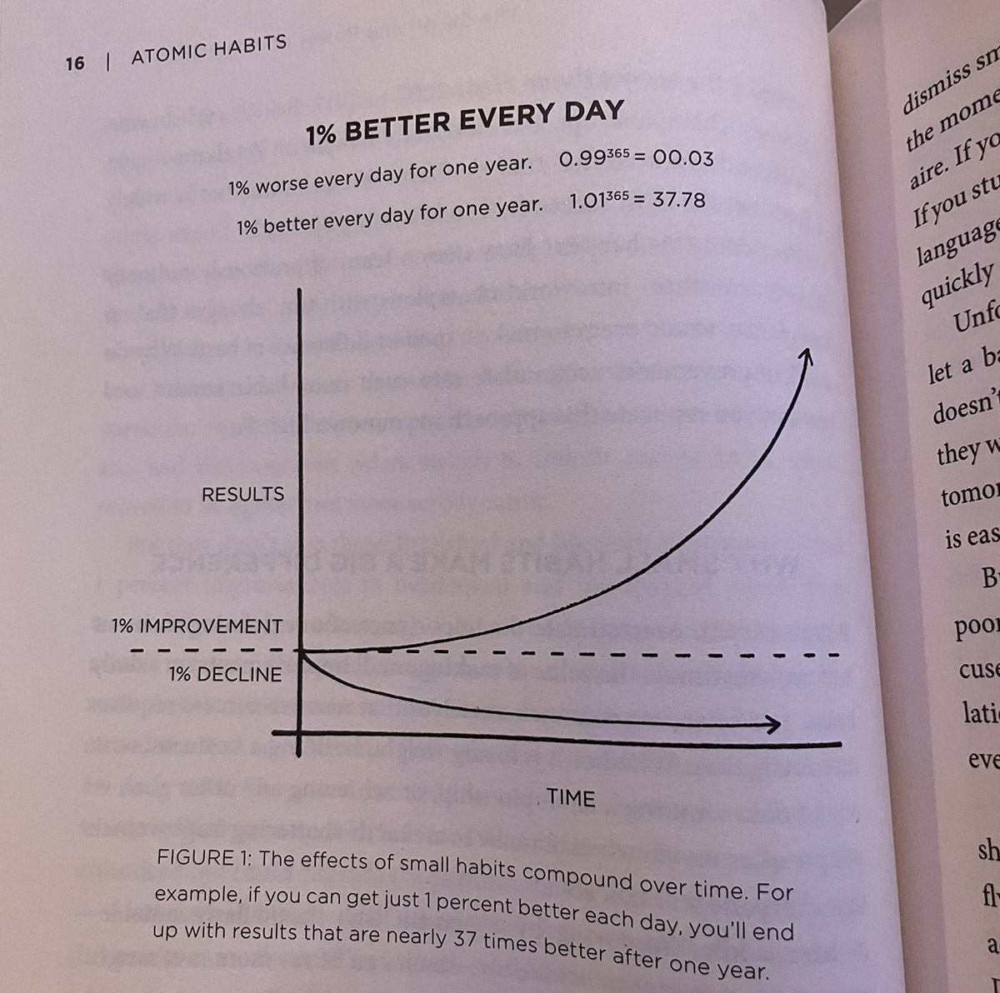

<FigureLabel>I kid you not. With the graph and all!</FigureLabel>

So, it appears that you have been **manipulated**. They could have used religion for that, or even worse self-help, but **cartesian math**? I'm disappointed and impressed at the same time!

Still, the point stands. This is not about doing more, but about doing more of the right things and less of the wrong ones, and turn it into a habit.

## I'll bite, what's a habit?

A habit is a behavior that is repeated so regularly that it occurs **effortlessly**, which makes it more difficult to change than a conscious action, for better or worse.

This is important, because consciousness is a huge **bottleneck**. We can only do one thing at a time, and the more we can delegate to the non-conscious self, the better.

<ResponsiveEmbed ratio="16:9" src="https://giphy.com/embed/Q1aRmd8e90WIw"/>

Habits divide into four phases

1. **Cue**: Your brain constantly mines the world for input, and some of these signals solicit automatic attention based on past events. Imagine walking around a town center on a Sunday morning, with cobblestones and parked bicycles, when suddenly you smell freshly baked croissants 🥐

2. **Craving**: Great, now all you can think of is croissants. Maybe you are also recalling that vacation in Paris: the tour Eiffel, the fancy vegetarian restaurant, the smell coming out of the bakeries while climbing Montmartre.

3. **Response**: You have created a problem, now you have to solve it. In this case by entering the shop, buying 12 croissants and putting them in your face in front of a teary eyed baker. These are the moments when he is reminded what he sacrificed his life for! Remember to pay.

4. **Reward**: Not only you feel satisfied for bringing balance to the Force, but now you have formed a stronger bond between the smell of pastry and this feeling of everything being just about right despite lots of French people. And it only cost you 4800 Calories!

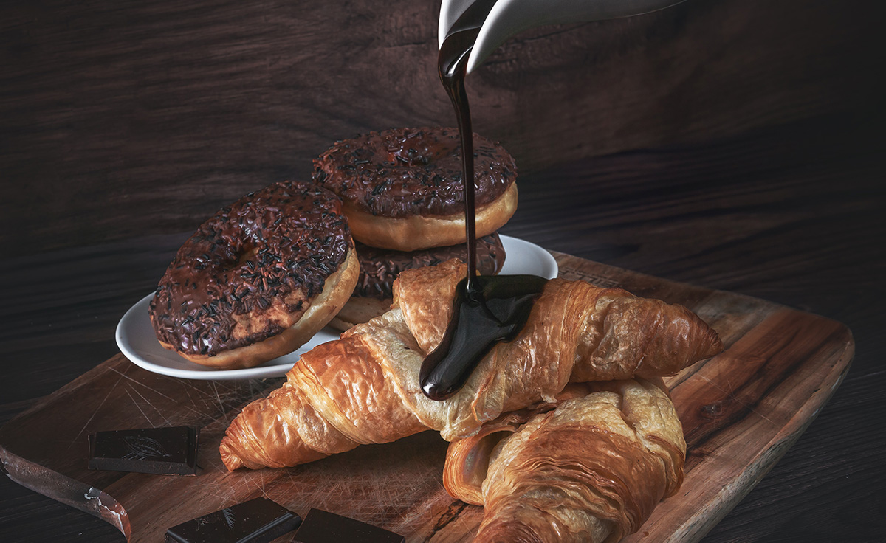

<FigureLabel>And wait, do I smell coffee?</FigureLabel>

Knowing the subatomic particles that form habits is the **lever** that you need to harness their power. This is extruded by the Author in the **four laws** of behavioral change, which we are very conveniently going to explore...

## 1. Make it obvious

Know this, no one has ever succeeded at introducing **significant** change in their existence by waking up one day and mumbling:

<Dialogue>I should improve my life somewhat</Dialogue>

You need to define measurable goals of what you want to achieve, so that you'll make it harder for the **worst** version of you to fool you into doing eff all instead.

For instance, you can make your intents **obvious** by filling in the blanks of the following statement:

<Indented>
    I will [ACTION] in [LOCATION] at [TIME] so that I will [RIDICULOUS EXCUSE].
</Indented>

I made one myself.

<Indented>
    I will work out in the gym at 6:30 AM every other day so that I can grow a six-pack or at least cancel out the effects of all the croissant eating, which has gotten out of hand, jfc.
</Indented>

To give you insight on the complexity of the goal, this is my route to the gym at that **inhospitable** time...

<FigureLabel>I have been attacked by wolves in three non consecutive occasions</FigureLabel>

Let me just say that I have failed **hard** at this for months, with me hearing the alarm and being like lmao, nope 🖕🏽🖕🏽

That is, until I have learned about **habit stacking**. This is a technique where you use the **reward** phase of a habit as **cue** for the next one.

The cue that lets me detach from the warm **embrace** of the bed is having the chance to make [killer espresso](https://gianlucabelvisi.com/9barista-2). It was one of my pandemic activities, and it's now become a wellness routine. Look.

<YouTube source="EbbzNFtRnZA"></YouTube>

Drinking the coffee at the end of the **ritual** rewards me with dopamine inducing flavour, but it also gives me the urge of working out, because that's how my brain is wired now.

Cue the gym in the wolves infested park.

Working out leaves me with a feeling of good **exhaustion** that is a reward in itself, but there is another cauldron of gold waiting at the end of the rainbow: I get to go into the sauna!

Now, are we talking about a [mixed naked sauna](https://gianlucabelvisi.com/naked-spa)? No 😢, but it's still a great treat, and the cue to my next habit: going to **Espresso House** -- where I have a Netflix type subscription -- and enjoy an air quotes free **cup of Joe**, which is my cue to go to Denmark.

And what is the reward for reaching the office? Amazing colleagues, an exciting project, yes, yes, sure, but I meant the coffee machine.

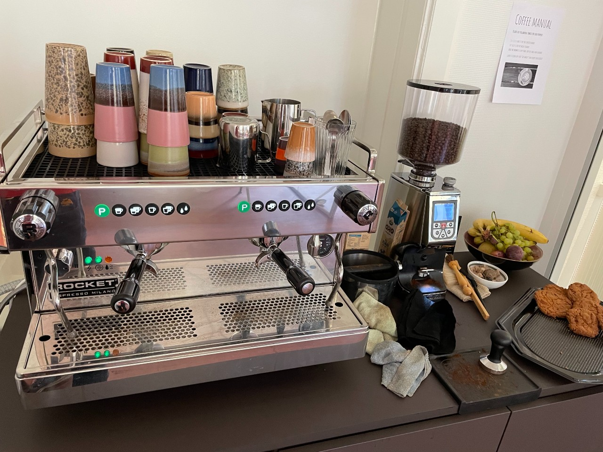

<FigureLabel>You will notice that I happen to like coffee.</FigureLabel>

## 2. Make it attractive

People that succeed at forming good habits and those that fail spectacularly have one thing in common. They shared a **goal**.

So, having a goal does not guarantee your success. You need to adopt **mental models** that focus on the person you want to become, instead of the objective on paper.

Suppose that you gave up smoking and someone offers you a cigarette, if you reply:

<Dialogue>No, thanks. I'm trying to quit.</Dialogue>

What you are doing is framing yourself by your **struggle**. You are laying the foundation for failure. Trying to quit, really? Another beer and you will crawl back asking for a smoke. Begging for a smoke. And I'll look down and whisper: "no".

Here is a better answer:

<Dialogue>No, thanks. I'm not a smoker.</Dialogue>

Now you made it about your identity. You have built a fortress all around you.

I personally like to go one step further and say:

<Dialogue>No, thanks. I'm not a piece of shit.</Dialogue>

Remove **need to do** from your vocabulary, as it takes away your agency and makes temptation a bigger obstacle. Use **want to do** instead. Don't you feel like a Giga Chad already?

<FigureLabel>Giga Chad</FigureLabel>

And let's be honest, you don't **need** to do anything. Just put 2000 calories (five croissants!) in your mouth every day. That's really all you need to do. And if you stay very still, it's even less!

<TextBox title={"Monkey sees monkey does"}>
    

        A great helper in making habits attractive is to create an <strong>environment</strong> that will help you notice the good habits and ignore the bad ones.
    

    

        If your goal is to read, use a dedicated area of your home as a reading zone.
    

    <BlogImage imageName={"reading"}/>
    <FigureLabel>Here's mine</FigureLabel>
    

        More than that. <strong>Disseminate</strong> books all over the furniture, the sofa, the fridge. A drawback is that your dates will think that you are a pretentious prick, so maybe don't play hard to catch.
    

    

        If your goal is to stop wasting time on <strong>social networks</strong>, remove the apps from your mobile so that you are forced to connect to them via the browser, which is unapologetically cringe.
    

    

        Depending on the level of your addiction, build a Faraday cage and go live inside it, so that <strong>tik-tok</strong> will never get you!
    

    

        (This should go without saying, but if you want to quit smoking, consider selling the cigarette shop.)
    

</TextBox>

## 3. Make it easy

Especially when a habit is being **tattooed** into your brain, you want to take all kinds of steps to simplify your life around it.

In my **workout** example, it means preparing the gym bag the night before, having the exercise plan figured out, and a recovery chicken burrito ready for ingestion. I also go to sleep wearing the bracelet that lets me into the building because, once, I was running five minutes late when I noticed that I wasn't even wearing the gym bracelet, and that was enough to send me back to bed.

Another way to make things easier is to **combine** a challenging habit with a pleasant one.

For instance, I think that Dan Carlin's [Hardcore History](https://www.dancarlin.com/hardcore-history-series/) podcasts are excellent. Every episode is a six hours **gripping** monologue about an event in history, with special focus on the human condition. What's it like to be a Roman citizen? I mean, back then. Now it sucks. What's it like to be an infantry assaulting **no man's land** in World War I, knowing that you were running towards certain death? Probably better than being a Roman citizen today.

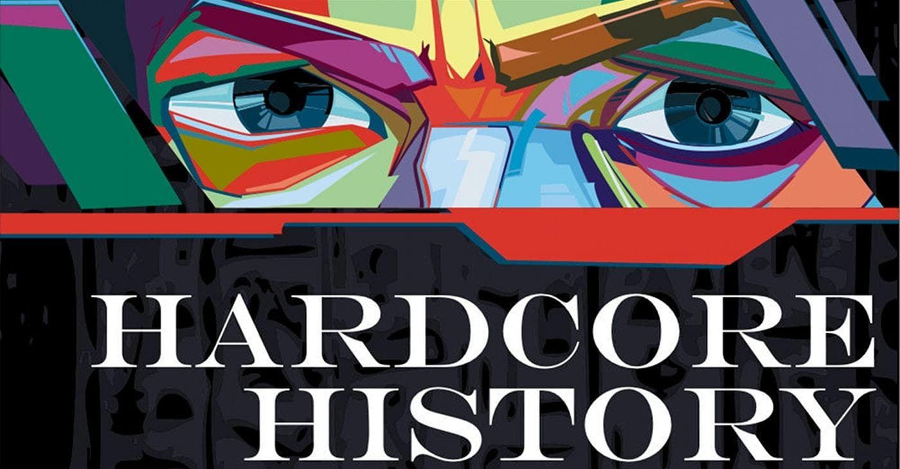

I love these podcasts, and I have associated listening to them to cleaning my apartment, which I find less enjoyable. So now I'm looking forward to doing a big home sweep every time a new **Hardcore History** comes out, which is every -- checks notes -- six to twelve months!

## 4. Make it satisfying

If you have made it your **identity** as previously suggested, chances are that you now belong to a **community** of like-minded gym or croissant enthusiasts that you have met along the way. You have a group chat. You share inside jokes about your niche. Whenever you meet a milestone, people comment with the praying emoji, which is in reality the high five 🙏🏼.

This is **heart-warming**, but you don't have to form connections with people that can evolve into beautiful friendships or dare I say Love. Instead, you can use post-its!

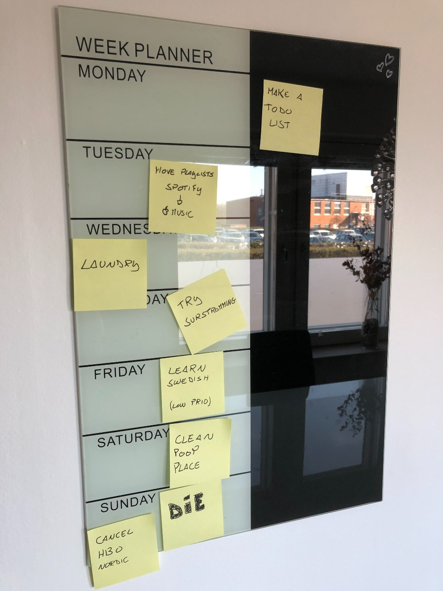

<FigureLabel>With 30% less heartbreak 😭</FigureLabel>

Or you could save the trees and get your dopamine spikes electronically -- as it's customary at the time -- via **Trello** or similar services. For instance, here is the task board for this very website...

<ResponsiveEmbed ratio={"4:7"} src={"https://trello.com/b/i59sE2uK.html"}/>

And speaking about **dopamine**, is there a more satisfying shape than this?

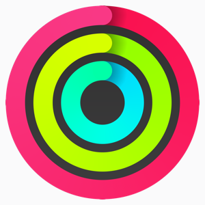

<FigureLabel>Maybe croissants?</FigureLabel>

## The end

Well, if it wasn't a wild ride!

This all started with you complaining about your **lazy ass**, and now look at those chiseled butt-cheeks!

You have turned your life around, you have done it without introducing **emotional debt** that would have sent you back to square one at the first gust of wind, and it cost you nothing!

[paypalme/gianlucabelvisi](https://www.paypal.com/paypalme/gianlucabelvisi)

Now I can only end this in the way a great many things will be ended in 2023. By asking [ChatGPT](https://chat.openai.com/)!

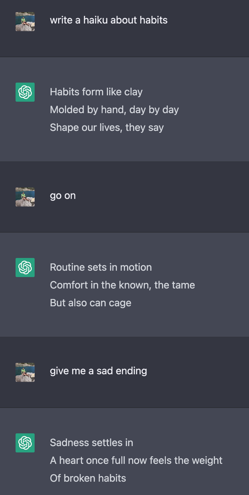

## Post credits

Oh, you are still here.

Are you feeling **dissatisfied** with what was communicated upstairs? That makes two of us. I have started writing this post twelve months ago, **motivated** by the whole new year thing. I know.

I was aware of how difficult this project was going to be, but I also knew based on experience that, no matter the complexity, if I put in the **hours**, I will rise to the occasion, and it will turn out good.

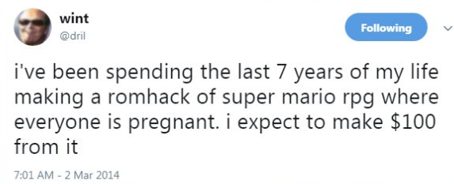

Well, I did put in the hours, and it wasn't turning good at all. What is this **sorcery**?!

Naturally, I sought **inspiration** along the avenues one has these days: books, videos, performance enhancing drugs. They all confirmed my conclusions, with the videos also reminding me to like and subscribe. But the more I was being reassured, the more I was left with a feeling of:

<Dialogue>What if this is all bullshit?</Dialogue>

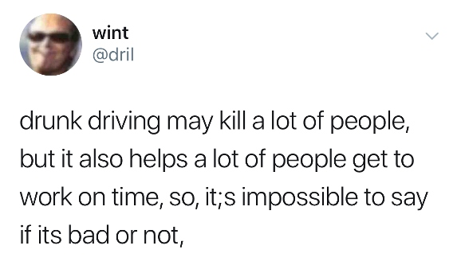

But it can't be, can it? It did work on me! Or did it? Maybe. At times. Somewhat.

I have **painted** this image of myself hopping from habit to habit like a **Jedi** kangaroo, and let me tell you: those were large strokes of brush that I used. For instance, I didn't mention all the saturdays spent in bed eating **mayonnaise**, because it would have contradicted the core message, which is kinda the problem.

I'm coming to the conclusion that there is a legion of **asshole** writers, youtubers, bloggers -- present company included -- that are portraying things a little too rose-tinted. Almost as if they wanted to create content out of it.

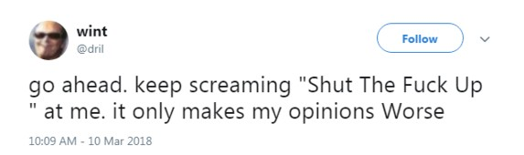

You open a guy's YouTube channel and you see him having it all figured out, sporting a **minimalistic** lifestyle, wearing the same clothes every day in order not to introduce the burden of choice, and systematically **telling you what to do** in 15 minutes long videos that end with an ad for [Squarespace](https://www.squarespace.com/).

What you don't see are all the collaborators that make the channel work, while said youtuber is having a panic attack over the color of the thumbnail.

Then, I stumbled upon now personal crush **Elizabeth Filips** voicing similar concerns, and she also made fun of the 1% thing! ❤️

<YouTube source={"A2sS00egAzg"} />

And I think she's right.

Different people are different people are different people are different people. What works on someone might not work on you. More so, what works today might only work temporarily, **accidentally** even.

<small>(I appreciate the irony of finding all this through a youtuber.)</small>

Maybe all you need to introduce **significant** change in your existence is to wake up one day and mumble:

<Dialogue>I should improve my life somewhat</Dialogue>

So, my personal conclusion of a **yearlong** exploration on the importance of developing habits is...

Now, if only I could end this date with the same message.

<TextBox title={"Wait, are you still on the date?"}>
    

        Well, yeah. Who do you think was I talking to all this time? Although, she said she was heading to the bathroom some time ago and hasn't come back since. When you have to go, you have to go.
    

    

        At any rate, I'm coming up with an excuse to leave because I noticed a giant <strong>red flag</strong>. I told her that I was considering getting a golden retriever, and she said:
    

    <Dialogue>
        Oh, but golden retrievers are such boring dogs.
    </Dialogue>
    

        I couldn't believe what I just heard. I had to reply:
    

    <Dialogue>
        You know who's a boring dog? Your mom. Because she's a whore.
    </Dialogue>
    

        And I know that that was <strong>wrong</strong>, I should have said "because she's a bitch"! I had the perfect comeback and I ruined it! If I had one chance to go back in time and fix things, I wouldn't even kill Hitler. I would go back to tonight and change my line.
    

    

        Now, if I had two shots at time travel, I would buy <strong>Apple</strong> stock directly from their garage.
    

    

        Three times? Totally Hitler. I don't care what you say, I will travel back to <strong>1945</strong> and murder the guy.
    

    

        Four times? I would liquidate <strong>August Zang</strong>, the inventor of the croissant.
    

    

        Five times? Has to be <strong>Jesus</strong>. He just rubs me the wrong way with his effortless abs.
    

    

        Six times or more? <strong>Dinosaurs</strong> all the way down.
    

</TextBox>
