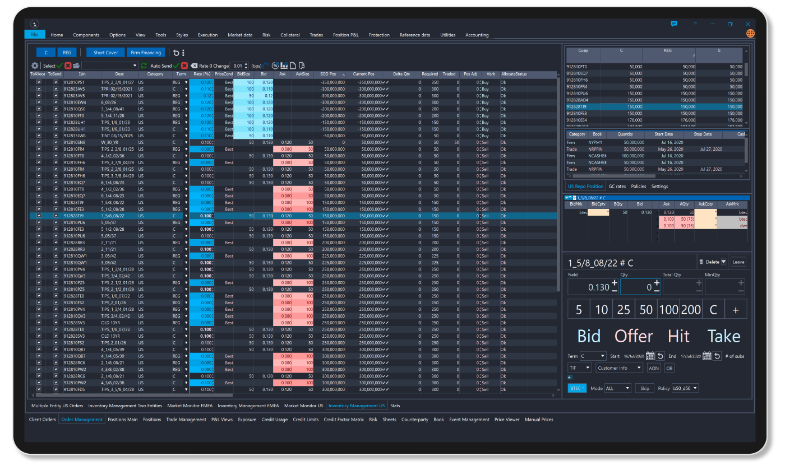
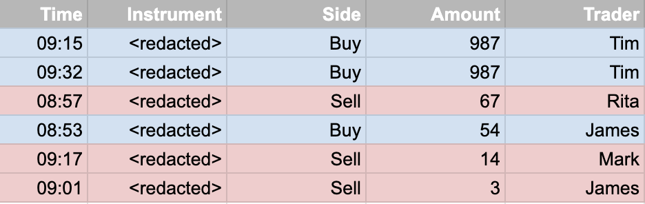
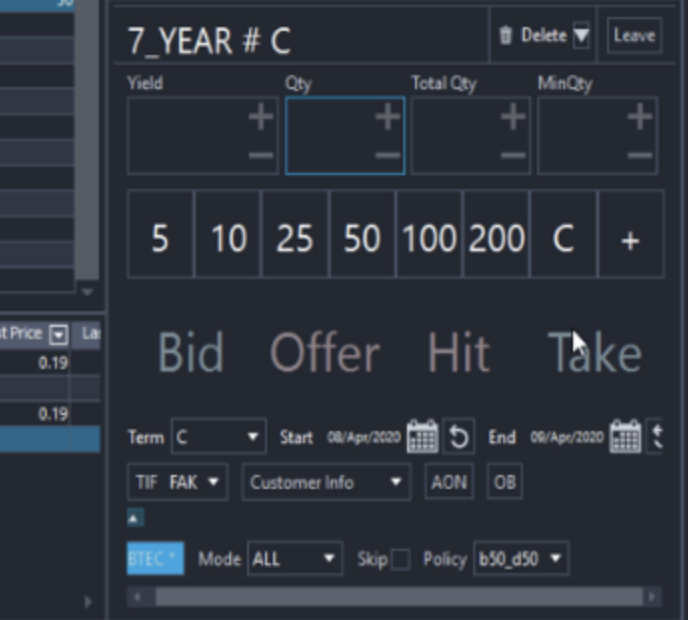
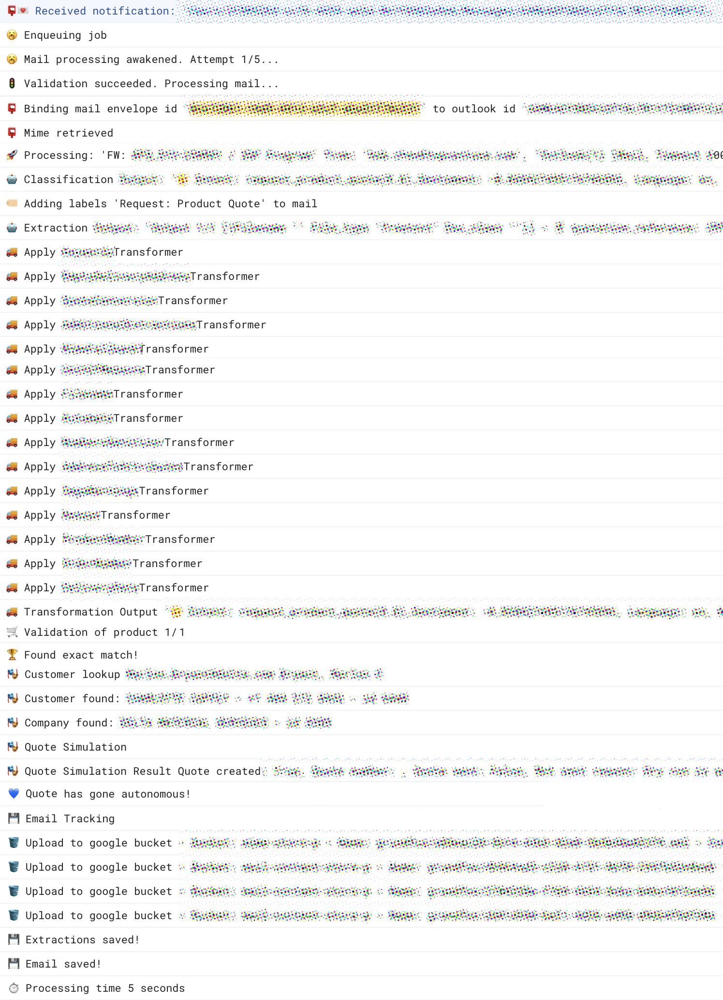

import {Dialogue, FigureLabel} from "../../../components/blog/Text";

Story time. Gather around, kids!

Once upon two professional lifetimes ago, I was employed at a company in Italy that developed software for trading in big financial institutions. The **too-big-to-fail** ones.

It’s 18:00 on a Friday and I’m prepping for the weekend. The proverbial foot outside the office and into a ~~bar~~ museum. On the other side of the Atlantic, **New York**, the city that never sleeps, is waking up.

That is when one of our excessively large customers there opens a high-priority incident against the software component I am responsible for. It seems like it made them purchase unwanted bonds for a total of **987 million dollars**, which at the time was a lot of money.



## The analysis

I recall my foot into the office and read the report. Surprisingly, I do not feel nervous. I suppose that when the stakes reach **preposterous** levels, they become abstract in one’s mind.

I get access to **gigabytes** of logs and, with command line skills I have since forgotten, grep the rows that recap a trade, regex a bunch of information, sort descending by amount, and redirect to a CSV.

Here is a recreation of the file…



And presto, there you have the **987 bangers** executed by one **Tim**, who instantly becomes my nemesis.

However, what’s weird is that the second row shows another order for the same amount, same financial instrument, same Tim. Classic Tim. 😡

Which feels strange. This looks like something that the customer would have mentioned in the report.

<Dialogue>
    Hey, you know what? We are already giving them a hard time with the first 987 million dollars. Let’s cut them some slack on the second 987 million dollars.
</Dialogue>

This seems unlikely, so my educated guess is that the first trade was executed on purpose.

I am then reminded that our order component has a feature that retains the previously inserted values. This is done to save traders a few **seconds** when time is of the essence. Or in Tim’s case, laziness.



But is the feature enabled? A glance at the logs results in a relieving yes. So I reply with my working theory that Tim is an **asshole**, the customer acknowledges that this is indeed the case, closes the incident, and wishes a great weekend. Likewise!

Then, with an anvil off my chest, I leave the office, meet with friends, and offer them ~~wine~~ valuable insights on the painting scene in the early Renaissance.


## What I’ve learned

Now, I want to be extremely clear. Am I saying that Tim here is single-handedly responsible for the **2008 financial crisis**? Yes, this is exactly what I’m saying.

Oh, I’m kidding! This is all in good fun. What happened was well within parameters, I remain friendly with Tim to this day, and I often visit him in prison.

But I like to talk about this story because it **leveled up** two attributes in my character sheet:

1. Incidents are no longer stressful to me because nothing can top the claimed loss of a few breadcrumbs shy of **1 Billion**, except maybe that time my deployment starved for database resources the servers of **Candy Crush Saga**, thereby impacting the world economy. Positively, I mean.

2. I appreciate the importance of clean, **meaningful** logs.

So, I’d like to share here my **five rules** for logging that might end up saving your Friday. You won’t believe what the last one is. It’s emojis.

## 1 - Add metadata

Reading log files is almost as dull as reading **Harry Potter**, so you want to spend the least amount of time on them and quickly isolate the lines that pertain to your analysis.

And being this the year 2023, you should not clutter your mind with the knowledge of **regular expressions**, which are significantly worse than Harry Potter or at least on par.

What you need instead is metadata injected into your traces. In **Google Cloud Platform**, this is as easy as appending a custom Json…

```json
{
  "request_id": "57f2d3d9-a6ee-4a1a-bd11-2b06541243bc",
  "customer": "redacted, inc",
  "thread_no": 233,
  "api_version": 1,
  "tags": ["orders", "graph", "summary", "important"]
}
```

Then, from the console on your vertical monitor, you can leverage Google’s capabilities at searching — which are kind of okay — and get a **vertical slice** of the tags you feel might help you, see how your app is behaving with a specific customer, or even reach the granularity of the single request.

Powerful stuff!

That said, you probably have Sentry, Grafana, and whatnot that notify you with end of world events, so you don’t need to keep an open stream to morbidly track the integrity of your business while chanting:

<Dialogue>My name is Ozymandias, dev of devs. Look on my logs, ye Mighty, and despair!</Dialogue>


So close that tab, put the monitor in landscape mode for chrissakes and do some work. Also because...

## 2 - Know your audience

Contrary to common belief, the audience for log files is not developers, it’s **people**.

You want your first-line support to be able to access logs and perform a **pre-analysis** of the problem. In many cases, that is all that is needed to figure out that Tim poured his Latte all over the keyboard and collapsed fixed-income markets.

But to make this workable, your logs need to be written in the **shared vocabulary** that you must cultivate within your organization so that people from different crafts can communicate with each other.


For instance, often features have an **internal** development name — usually an eye-rolling Star Wars reference — and an **external** one for marketing purposes. Usually just as eye-rolling.

In your logs, you need to use the latter.

I speak out of experience when I say that you don’t want to receive the following Slack message while you are watching ~~Barbie~~ Oppenheimer…


The best logs are those that you never get to read.

## 3 - Cut the fat

As Blaise Pascal famously said:

<Dialogue>I would have written shorter logs, but I did not have the time.</Dialogue>

Since you are going to spend 80% of your time reading 20% of the logs, would you not be better off pruning the remaining 80% of the logs so that you end up spending 100% of the time on… wait this is really confusing.

But the point stands. The absence of limits in log size is the biggest **limitation** for producing effective logs. Can you imagine reading gigabytes of Harry Potter stories?


The best strategy to cut extra fat is to write quality and DRY content. For instance, you don’t want to adopt this logging pattern:

* I am about to do 𝕒𝕔𝕥𝕚𝕠𝕟 with the following 𝕚𝕟𝕡𝕦𝕥 {...}.

* I am currently in the process of performing 𝕒𝕔𝕥𝕚𝕠𝕟. Let me repeat the 𝕚𝕟𝕡𝕦𝕥 {...} in case **Causality** just broke.

* I have completed 𝕒𝕔𝕥𝕚𝕠𝕟 with the following 𝕣𝕖𝕤𝕦𝕝𝕥. By the way, do you want to see the 𝕚𝕟𝕡𝕦𝕥 again? Don’t mention it, there you go {...}!


Resist the urge to report moment-to-moment activities as in an **Instagram** story. Instead, produce snapshots of the internal state at relevant moments of the execution, ensure that the **exceptions** to the standard flow are covered, and you are gucci.

Whenever you are unsure whether a logline is meaningful, remember the principle of YAGNI. You ain’t gonna need it.

## 4 - Format your ToStrings

**Lukewarm take**: The default ToString implementation of all major languages is criminal.

```csharp
int[] numbers = new int[] { 1, 2, 3 };
Console.WriteLine(numbers.ToString());
// Output: "System.Int32[]"
```

The people responsible for this should be in **prison**, albeit with a light sentence.


But where there is a challenge, therein lies the opportunity. Since you are forced to override those pesky ToStrings in your POJOs and POCHOs, you might as well do it by holding readability as a **prime directive**.

Remember, friends do not make other friends read JSON dumps of their data classes. Nor should you indulge in **non-curated** lists of {"propertyName”: propertyValue} because humans don’t work that way.

These are the rules I like to follow:

* Not all properties are born the same. If you feel like people are mostly interested in a subset of fields, write them first and show the **muggles** next.

* Try not to use brackets and quotation marks. Logs are not code. Commas, spaces, and full stops are more apt delimiters.

* Do not be afraid of going on a **new line**, especially when printing arrays of complex classes. This will keep you sane while trying to find product line 73 out of 136 in a purchase order.

* If a property is not set, do not print its name and an empty value. Just do not print it. Its absence speaks **volumes**.

* I should now suggest using emojis in your ToStrings, but there is a whole paragraph on that…

## 5 - Use emojis

Reading log files is boring. You know it. I know it. Is it **Goblet of Fire** levels of boring? No, but ballpark. So you need to spice them up, which is why I like to prefix all my lines with emojis.


Not only do they remove the dullness of it all, but they also add meaning in an efficient way because, if you think about it, emojis are **semiotically** dense.
As an example, this is one of the applications we have at [Go Autonomous](https://goautonomous.io)...



<FigureLabel>I know what you are thinking: what happens next?</FigureLabel>

In this snippet, we are notified of a new email from a customer inbox 📮 via Microsoft Graph Api. We enqueue it 🥱 for processing 🚀, validate it 🚦 and feed it to our powerful AI 🤖. Then, we tag 🏷 the email, perform digital transformations 🚚 on the extracted data, and verify that the products 🛒 exist in the catalog 🏆. If all is kosher, we act 🎭 upon the information we gathered by interrogating our customers’ ERP systems, and if everything is executed with no user intervention, we get a well-deserved 💙. Finally, we save the data via a symbol that the younger generation will never fully understand 💾.

(But why are we using a truck 🚚 to represent digital transformations? No reason.)


This might seem like a juvenile **gimmick**, but finding your way around in a layout like this is often a matter of seconds, and anyone with basic knowledge of the business can follow what is happening and draw some considerations.

With that in mind, remember that we are all adults here, so please refrain from using the following emojis: 🍆 🍑 🍌 🥦 ✂️ 🤌🏼

## Conclusions

Programming is a weird activity that lives entirely in the realm of the **abstract**. In this endeavor, bugs are not an aberration, but part of the discovery process that is leading you where you want to be.

You can and should **mitigate** bugs with manual and automated tests, but you won’t eradicate them all, so the next best option is to make it stupidly fast to troubleshoot them.

When **customer success** people reach my desk to talk about a problem in Production, I listen to them with one ear and at the same time open the log stream, start adding filters, adjust them as the explanation continues, and glance at the minimalistic but clear information rendering on screen. Sometimes, I am able to find the problem even before they are done talking. Like **motherfreaking** Dumbledore!


<FigureLabel>A wizard is never late, Frodo Baggins</FigureLabel>

All thanks to the strategies described above.

And when they ask me how I found the bug so quickly, I can reply with pride:

<Dialogue>It is the poop 💩 emoji, Harry, that shows where the problem is.</Dialogue>
