import TextBox from "../../../components/blog/Boxes";
import {BlogSubTitle, Dialogue, FigureLabel, MarginBottom, Pony} from "../../../components/blog/Text";
import PostFooter from "../../../components/PostFooter";

As [previously stated](/books-2022), I have been reading about Philosophy.

I find it **essential** to have at least some familiarity with Philosophy, but the main reason for me to tackle such a discipline at the age of ~~47~~ ~~35~~ ~~29~~ 16 is that I had started writing a blog post on the subject -- this one if you can believe it! -- and realized that I didn't know a **single thing** about it. So this is a chicken and egg kind of situation.

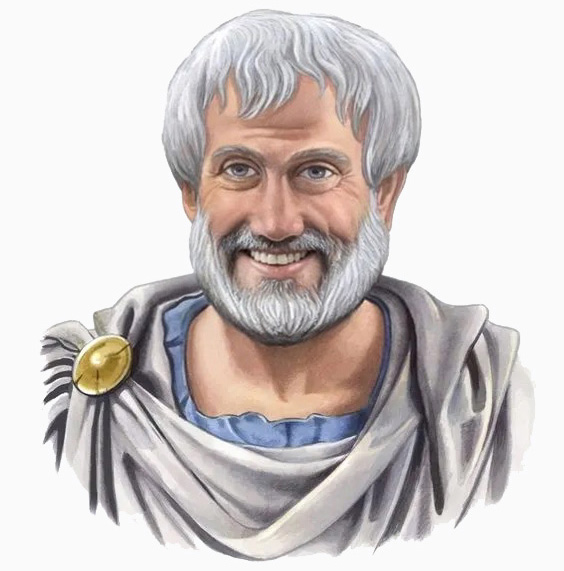

<FigureLabel>Aristotle. Strong pedo vibes.</FigureLabel>

Now that I have filled the gap, I can say with deserved objectivity that Philosophy is **giga boring**, knee-deep into naval gazing, written by keyboard warriors to maximize anguish, and hella focused on endless recursive but-whys.

As a result, no one should ever read about this **aberration** of a brain activity. I did it so that you wouldn't. Took one for the team.

And this is Philosophy in a nutshell.

This concludes the blog post. See you in a month. We are going to talk about **dogs**. Down with Logos, gimme doggos!

<MarginBottom size={"2rem"} />
<PostFooter path={"philosophy-fake"} author={"Gianluca Belvisi"}/>
<MarginBottom size={"4rem"} />

## April's fools!

It appears that you were the victim of a **practical joke**!

You thought that the post was over, but instead the real one starts now. **Hilarious**, right? It's for content like this that you keep coming back! And I'm well aware that probably only 1% of you are reading these lines, but I like the idea of cozying up with the best of you. The cream of the crop. The onepercenters. I'm sure that you are all subscribers.

**Update:** ok, who's the smartass that spam clicked the piece of shit 🦄 emoji? 😤

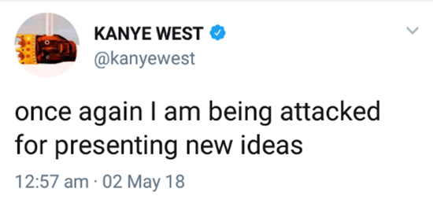

# On Philosophy
<MarginBottom size={"1rem"} />
<BlogSubTitle>For real this time.</BlogSubTitle>
<MarginBottom size={"1rem"} />

So, I have indeed been reading about Philosophy, and while I find it incessantly tedious, I do appreciate a subsection of it called **Ethics**. I believe that it is essential to have at least some familiarity with Ethics, because it helps me feel a better person than you.

Which is important to me.

Incidentally, it explains why I'm here on the pedestal of this manually coded blog communicating with you. Or should I say communicating **at** you?

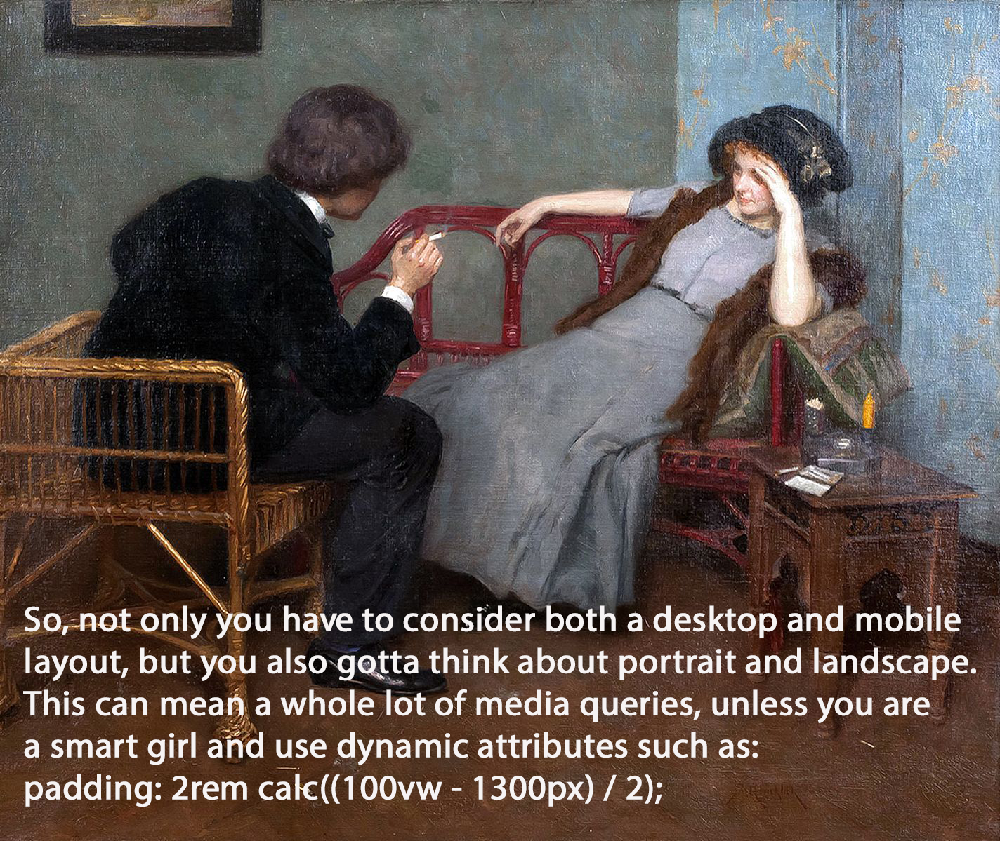

<FigureLabel>My flirting skills are 10/10</FigureLabel>

Because this is all we do. We communicate 🅰🆃 people.

We enjoy commenting about life from our perspective and our perspective only. We discuss things that inspire us, and we strongly feel should inspire you as well. When the other person is talking, we are just waiting for our turn to talk again.

And on top of all that, we judge your dates.

This is what people's minds are mostly occupied with: judging the person holding your arm while you are introducing them. It's why no one ever remembers your name when shaking hands. Too busy concluding that you could do so much **better**.

Which is a fruitless exercise, because you know it already. And more importantly, you know what you have to do.

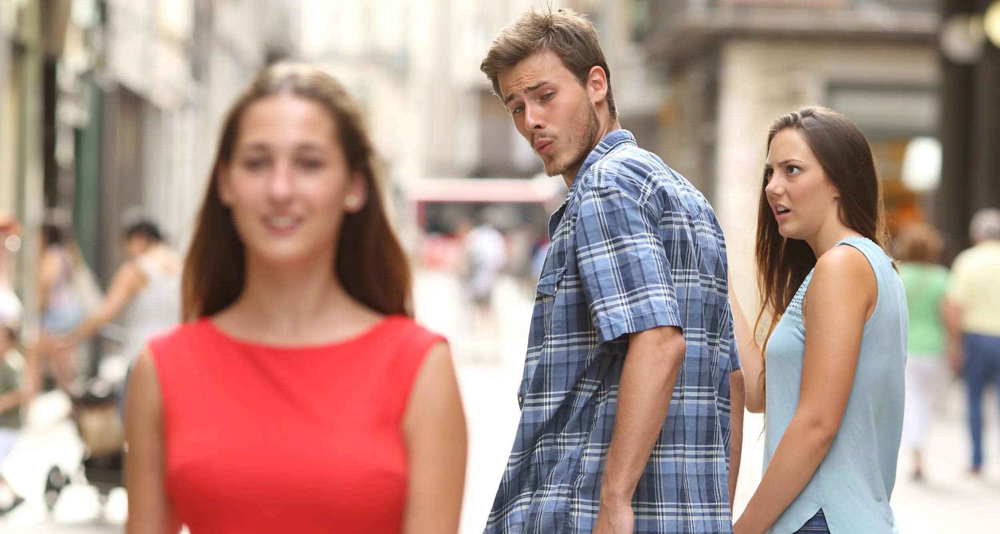

Now, I want to be super clear because this is a post about ~~Philosophy~~ Ethics, and it's easy to misunderstand written and clear sentences. What I am suggesting here is that you **break up** with your date because they are uglier than you.

## Breaking up

People say that there is no easy way to break up with someone. This is obvious **bullshit**. Of course, there is an easy way of breaking up with someone, which is blaming the other person for **everything**.

But -- you will ask -- what if they didn't do anything to warrant a break-up? Well, then **invent** something. Do some work!

For instance, suppose that I'm at a restaurant with a girlfriend I want to break up with. Suppose that I'm chewing my food loudly, and she says:

<Dialogue>Didn't your mom teach you good manners?</Dialogue>

This is a clear opening for my strike! I will be like:

<Dialogue withQuotesEnd={false}>
    No, my mother didn't teach me good manners. She just didn't have the time. Too busy being a <strong>prostitute</strong> in Hungary to feed her sixteen fatherless children, wasn't she?
</Dialogue>
<Dialogue withQuotesBegin={false} withQuotesEnd={false}>
    I guess she could have done more. I’d be happy to give her a call and ask about her shortcomings, but I can't, because she has died of <strong>Covid</strong>. And today, among all days, is the first anniversary of her death.
</Dialogue>
<Dialogue withQuotesBegin={false} withQuotesEnd={true}>
    You know what maybe we shouldn’t see each other anymore!
</Dialogue>

Then I break in **tears** and leave the restaurant without paying the bill.

Now, this strategy of blaming the other person for everything is very useful because, at any moment, I can change my mind. I can call her back and say:

<Dialogue>
    Hey real quick would you like to meet again? I’m... I guess I’m trying hard to <strong>forgive you.</strong>
</Dialogue>

Because, fun fact about people, they all want to be forgiven. Not being forgiven is like having an **open parenthesis** in your text. (. It wants to be closed so badly that both my editor and GitHub Co-pilot are going *mental* right now. There you go: ).

We all strive for forgiveness, and knowing it is important, because this is something that you can take advantage of, as **Jesus** did.

<FigureLabel>Lmao, busted!</FigureLabel>

So we date a few times more, but now at any moment I have an easy way **out** because I can say:

<Dialogue>
    Look, I’ve tried my best. You know I have. But every time I see your face, I think about the <strong>toxic</strong> comment that you made about my poor mom!
</Dialogue>

Then I break in tears and leave the restaurant without paying the bill.

But I was talking about Ethics.

## Ethics

Ethics addresses a question that is as old as people. How **ought** one live?

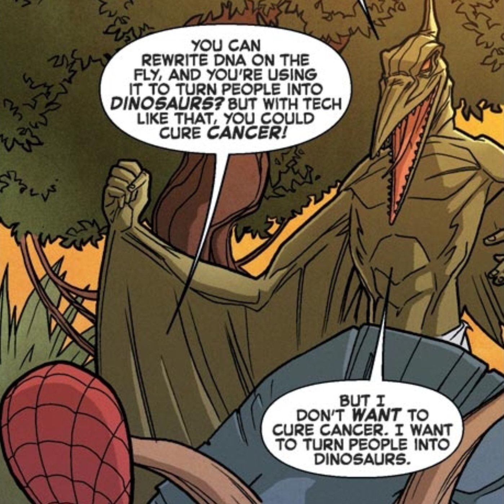

According to which moral values should we base our existence upon?

This is generally **not** defined via a bunch of rules such as don’t steal, don’t kill, don’t eat sugar after 3pm.

What happens instead is that you find your **morality** by pondering on how you would behave in a series of thought experiments, and among these, the most famous one is the **trolley problem**, which is not about whether you can bring said trolley with you in the plane cabin, because we all know that the answer is no, Vanessa. That shit is **huge**!

Also, not the best way of carrying your **labrador**.

<FigureLabel>Why u do this to dog?</FigureLabel>

Let me explain the trolley problem.

## The trolley problem

You are crossing a bridge over train tracks when you notice **five people** tied to the tracks. On the opposite side, an out of control trolley is approaching fast, so you don’t have the time to free them. Next to you, an **obese** person is there chilling. Eating a sandwich.

What do you do? You can either do nothing, and let five people die. Or you could gently but firmly push the person over the ledge and against the trolley, making it stop and saving five lives, but at the cost of killing the one guy, who at least died doing what he loved. Eating a sandwich.

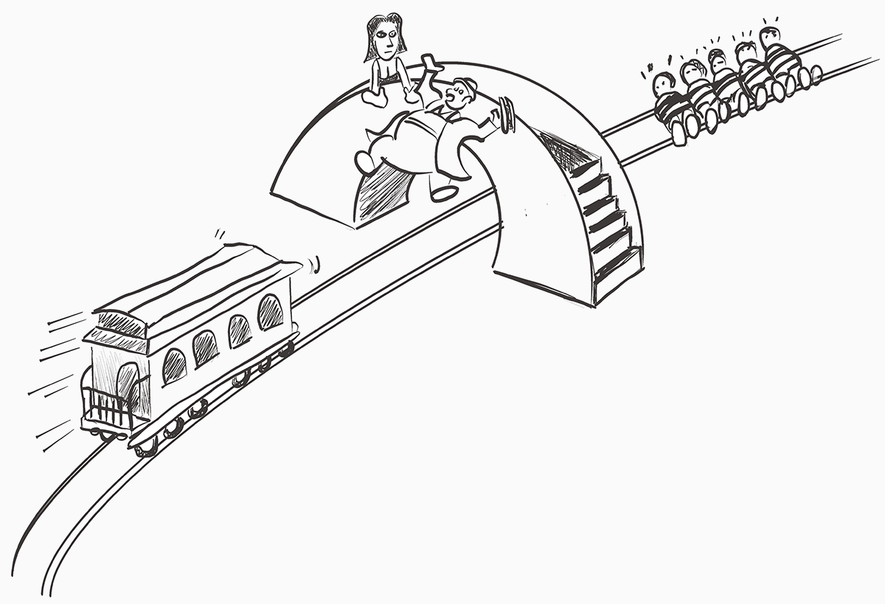

<FigureLabel>My recreation of the thought experiment. Look, drawing is difficult.</FigureLabel>

**Side note.** The person is not obese out of spite. It is required so that you won’t choose the so-called **Jesus** option:

<Pony>
    Oh, I would rather throw myself over the bridge, and save those five souls!
</Pony>

No, shut up Vanessa. You are not large enough to stop the trolley.

Also, no you wouldn't! You would never sacrifice yourself to save others. Actually, you would shoot a **Tik-Tok** of the trolley mowing down those people, and then count the views while drinking a comically filled-up glass of rosé.

## The choice

Let’s consider the choice. If you do nothing, it means that you believe that the act of killing a person is **wrong** no matter what the outcome is. This makes you a **Deontologist**, and you belong to the school of Immanuel Kant.

<TextBox title={"By the way"}>
    

        Can you imagine Immanuel Kant introducing himself to people?
    

    <Dialogue>
        Hi, my name is Immanuel... you know what let me write it down as the spelling is a bit peculiar.
    </Dialogue>
    

        Of course, little did he know that there was no need. Nobody would have noticed. Too busy judging his date!
    

</TextBox>

If instead you push the guy, you are a disciple of **Consequentialism**. You deem it moral to sacrifice a life if the benefit far outweighs the cost. This makes you belong to the school of Thanos.

<FigureLabel>Thanos' date is the human embodiment of Death, so you want to be careful there.</FigureLabel>

<Dialogue>
    So what’s your <strong>ethics</strong> platform like mister, uhm, Thanos?
</Dialogue>

<Dialogue>
    Thank you for asking. My entire moral foundation is about getting these <strong>six stones</strong>, fasten them on a winter glove, snap my fingers and as a result kill fifty percent of the people. This will solve any sorts of problems, really.
</Dialogue>

<Dialogue>
    Ok, let me get this straight. You want to bring the world population back to what it was in <strong>1974</strong>, and you believe that this will fix things forever?
</Dialogue>

<Dialogue>
    🤔 Hum... yes?
</Dialogue>

Seems like Consequentialism, in its purest essence, is bullshit.

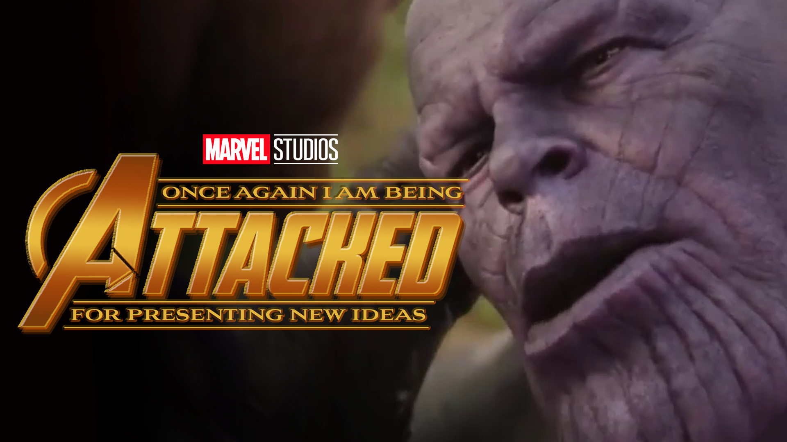

But what about Deontology?

Well, with Deontology you judge something not by the outcome, but by the act itself, which is either inherently good or bad. This is the **Categorical Imperative** by Immanuel Kant. Again, I'm happy that I'm writing this, instead of speaking it.

Let me give you an example: lying is inherently bad, so you must **never** lie. Makes sense, right? But does it though? Can we not think of an instance where it doesn't?

<Pony fontSize={"3rem"}>Dling Dlong!</Pony>

<Dialogue>
    Hello?
</Dialogue>

<Dialogue>
    Good morning ma'am. We are <strong>nazis</strong>, as you can infer from the uniforms and the... uh... swastikas. We were wondering, and feel free to say no, but are you by any chance hiding any jews?
</Dialogue>

<Dialogue>
    Ufffff. Well, yes. Since you are asking. There’s a whole family behind that fake wall. That’s too bad though because I was really fond of them, especially the little girl, always writing on her diary.
</Dialogue>

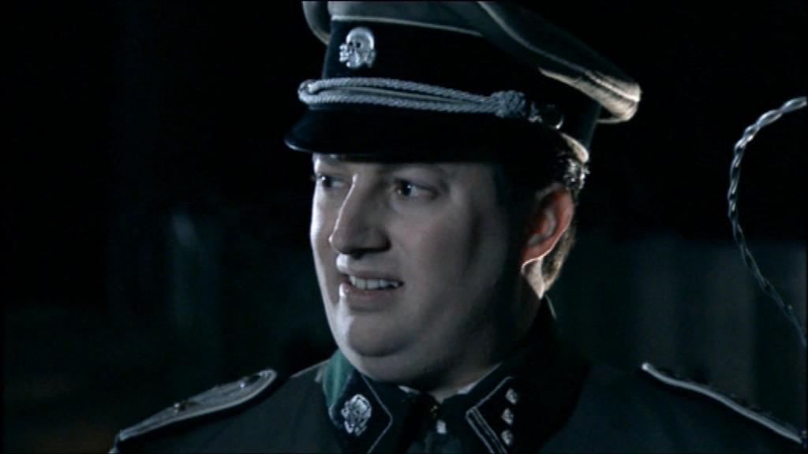

<Dialogue>
    Yeah, no, we understand. Do you mind if we get in and, you know, apprehend them?
</Dialogue>

<Dialogue>
    I mean, sure. Hey, if it’s not too much of a bother, do you mind leaving the diary behind? I was thinking maybe I can publish it. Make some money?
</Dialogue>

<Dialogue>
    Look, we really shouldn’t, but you know what? You can keep it. It’s our way of saying thank you for calling us.
</Dialogue>

<FigureLabel>Immanuel Kant. Strong pedo vibes.</FigureLabel>

## Conclusions

So, it sounds like that **Immanuel** person was also a bit of a cunt.

But it's not even his fault, because this shit is hard. Life is **freaking hard**! We all strive to get rules that simplify Life, so that we don’t have to think so much all the time.

We seek rules so desperately that we accept some that come from very dubious sources, like a YouTube video claiming that the moon is flat, your grandma asserting that mayonnaise is a valid cure for baldness, a flaming bush super opinionated on your sex life, a bearded middle eastern guy with strong pedAND LET ME BE CLEAR HERE I MEAN JESUS!

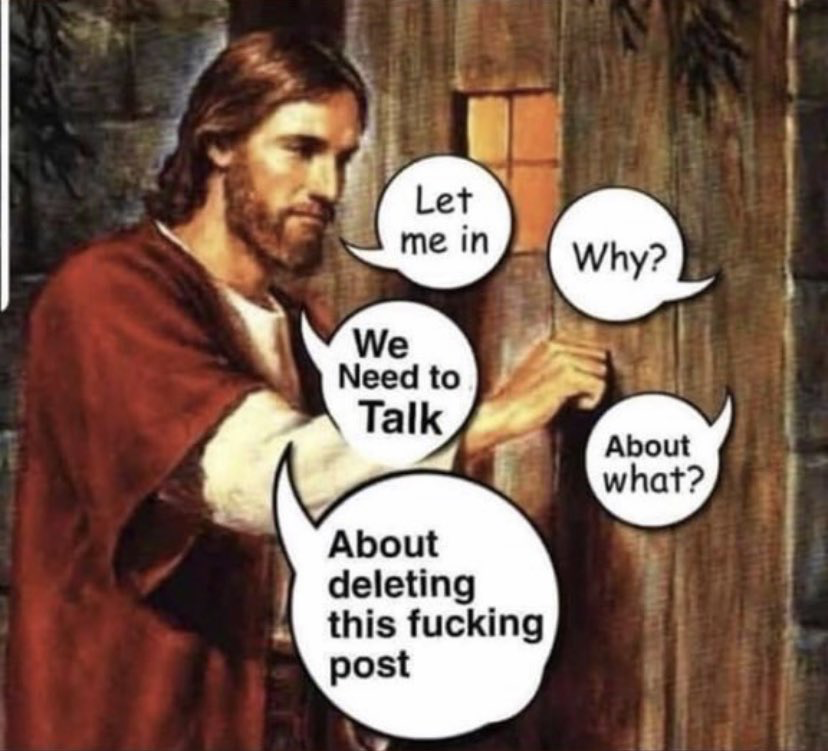

<FigureLabel>I guess happy Easter?</FigureLabel>

And here's the thing with rules. They are weird. They work proficiently until they don’t, and when they don’t, they fail so **spectacularly** that it becomes a whole thing!

* Sure, turning the other cheek is admirable, but what if I am the heavy-weight champion? There, you made me lose the fight. Thank you, **Jesus**!

* Of course, killing one person to save five seems **reasonable**, but what if that person is my mom, whom I love, which means that I don’t want her to die, or at least not yet?

* And finally, lying to break up with someone is deplorable, but what if I really want to eat at one of those **Michelin** restaurants and I don’t want to pay the bill?

It seems to me that Life is just a sequence of **shit choices**, with diminishing returns, a lack of three acts structure, and no happy ending, in both the literal and metaphorical senses.

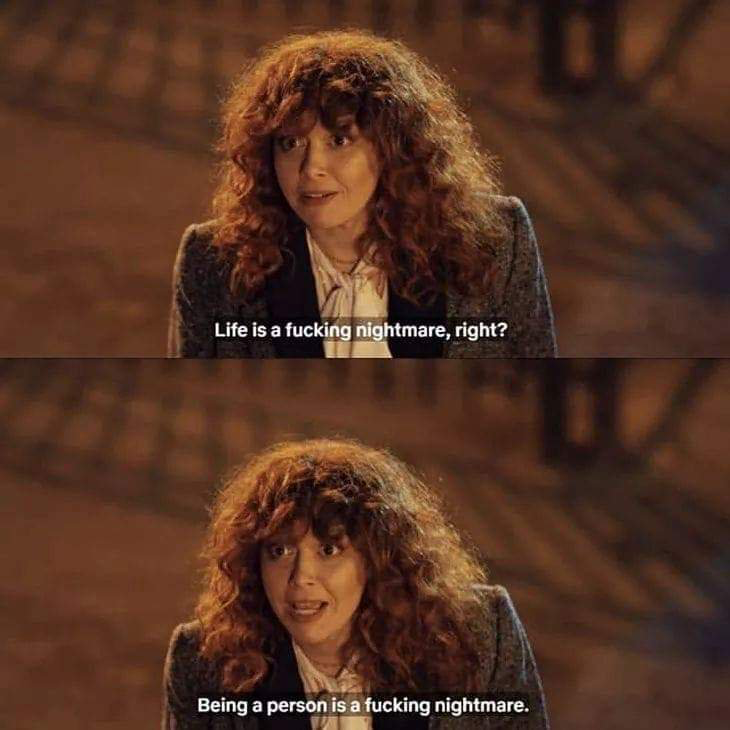

And you know what? That’s ok.

We are not supposed to **git gud** at Life. Where did we even get the idea, a Coca-Cola commercial? When did we accept advice from polar bears?

[Nowhere](/habits) is [written](/impostor-syndrome) that we need to become [Life experts](/naked-spa). We are only supposed to do Life for a bit.

If you think about it, there isn’t even much time to do anything anyway. So watch a movie, order pizza, go out for a walk, and then make yourself a favor and just die.

And this is **Philosophy** in a nutshell.

I leave you with my favorite philosopher solving the **trolley problem** in the only possible way...

<Quote from={"Sean Carroll"} title={"Quote"} bouncy ={true}>
    Choose either option based on your values, then live with the consequences.
</Quote>

Although, me personally? I would definitely push the guy. But that doesn't make me a consequentialist. I just happen to find murder hilarious!

<MarginBottom size={"2rem"} />
<PostFooter path={"philosophy-fake-2"} author={"Gianluca Belvisi"}/>
<MarginBottom size={"5rem"} />

## Lmao, got you again!

By the way, how did you like the cover image?

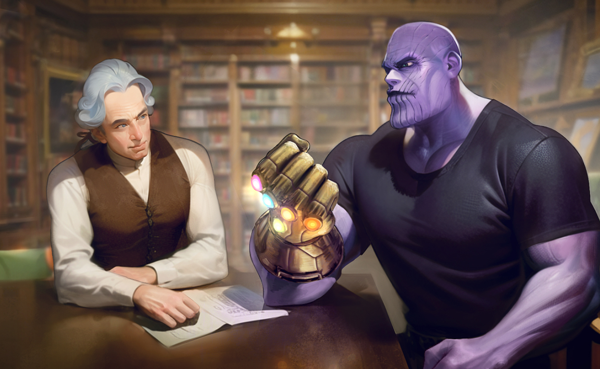

Would you believe it if I told you that it was drawn by an **AI**? You shouldn't, because it isn't.

This is a commission from extraordinarily talented [raitoarts](https://www.instagram.com/raitoarts/), whom I can't wait to work with again.

<Pony fontSize={"2rem"}>Kids, remember the importance of paying your local artists!</Pony>

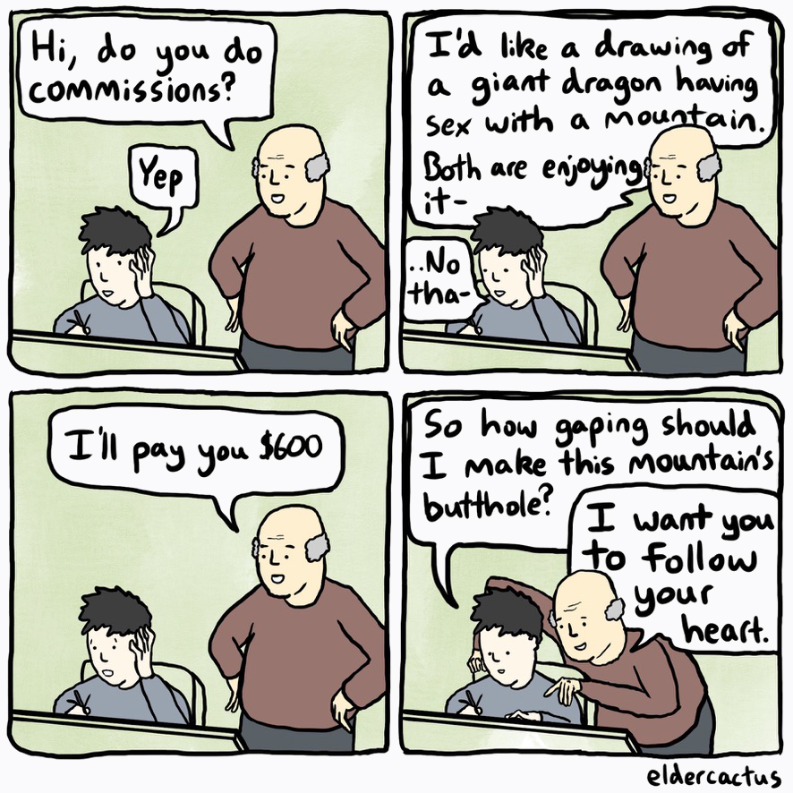

Driven by curiosity, I also inquired **Midjourney**, and in response got back these absolute turds.

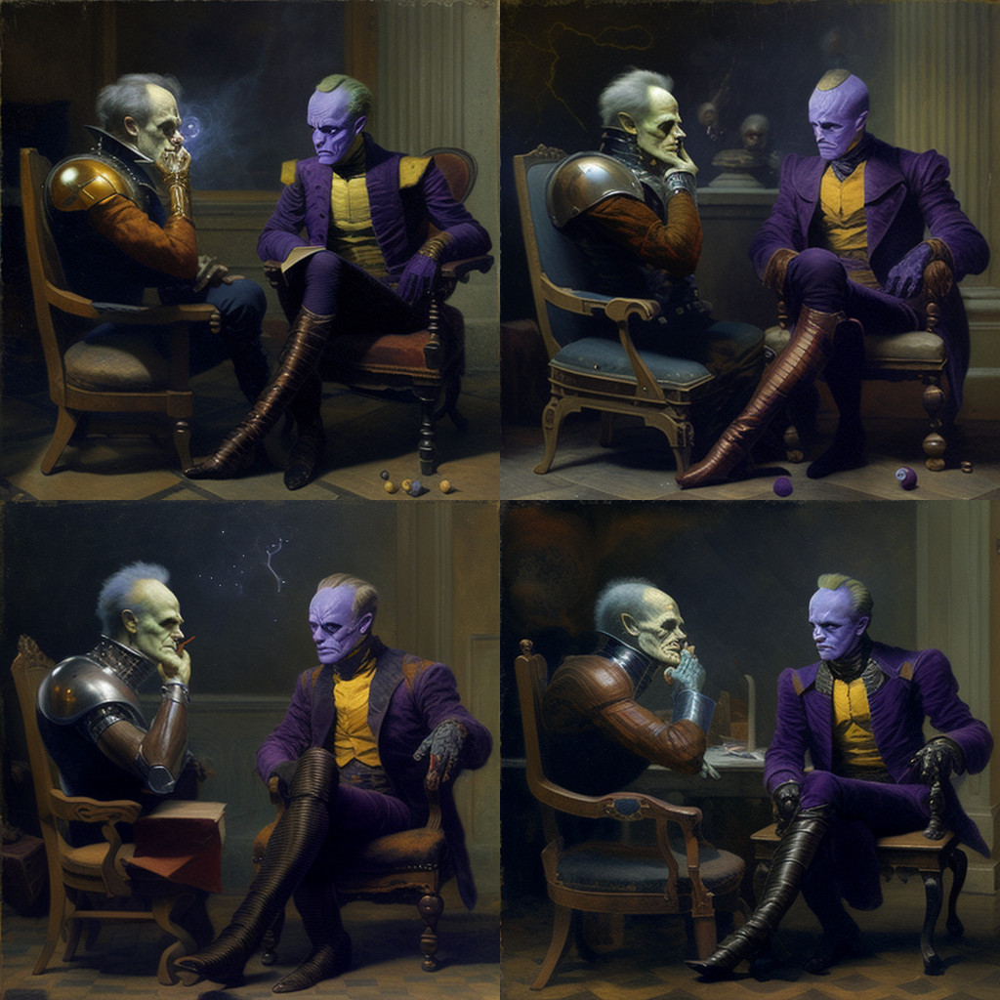

That said, the picture of the dog in the luggage was **AI generated**. You can tell because the wheels look like crap, but what can you do, in this blog we do not promote animal mistreatment.

See you in a month with a post where we will attempt at finding the fun in animal mistreatment!

