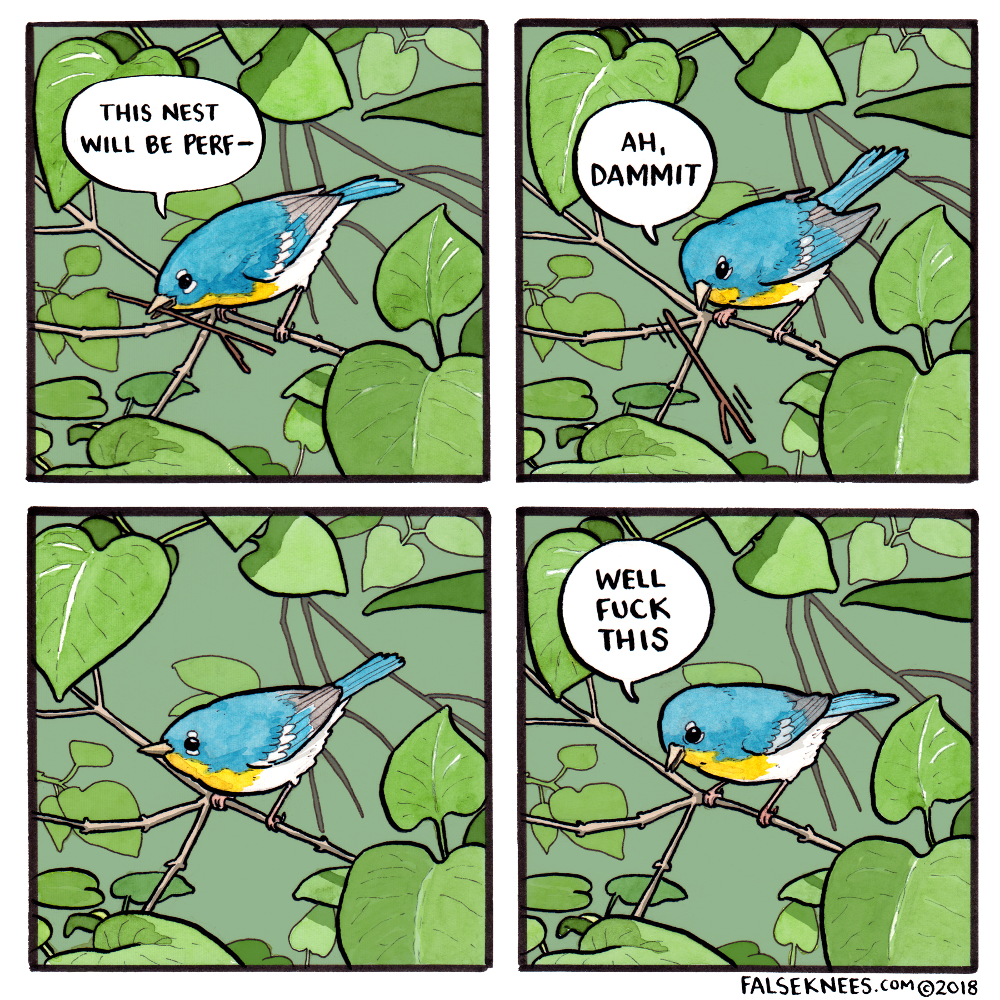
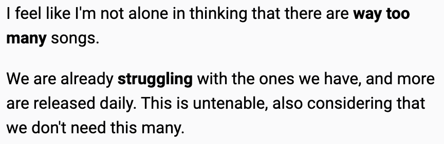
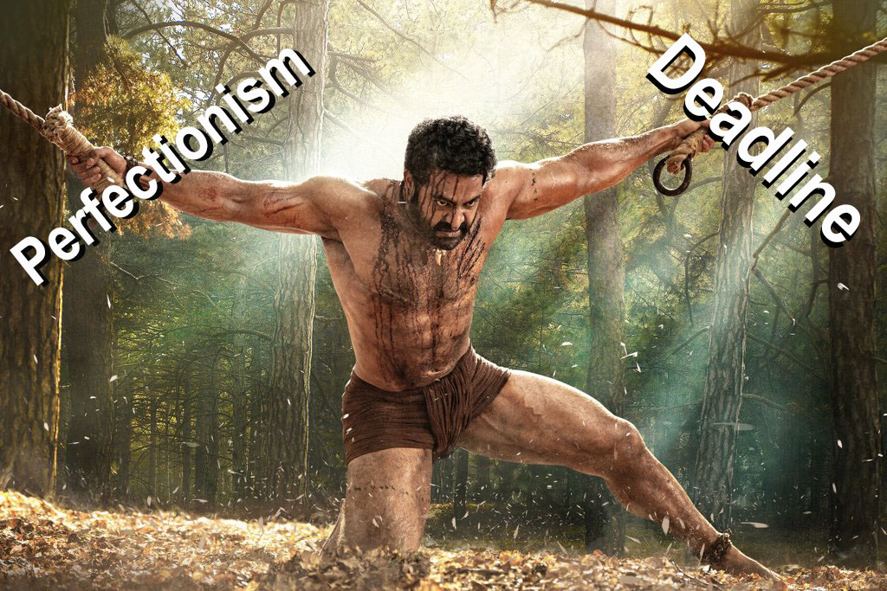

import {Dialogue} from "../../../components/blog/Text";
import Quote from "../../../components/blog/Quote";

I love writing.

It's been my **pandemic** activity together with baking pizza, which I'd rather not [talk about](/pizza).

I believe that writing is medicine for all sorts of afflictions, because it helps you understand the greatest mystery there is: the mystery of **yourself**. Plus, it can facilitate hookups.

    

Now, I’m not claiming to be a good writer. Far from it. All I’m saying is that writing is something that I do **daily**. Getting better at it and daily I think about how to get better at it. So, of course I have developed opinions on the craft. I actually had the time to have opinions, change my mind about them, and then get back to the original ones with a better grasp of them. It was a whole thing!

In this post, i will teach you all that I know about writing. It’s not going to take long!

## Why write?

Ok, cool, let's start with the one question that I can't answer for you.

You don't have to do anything. Just put 2000 calories in your face every day and you are going to be ok.

comms at work

In my work, I have been in communications with people from different crafts: developers, sales people, testers, data scientists, machine learning experts, artists, managers. It's important to find a shared language that anybody can understand while at the same time being detailed enough to lead to favourable outcomes.

Because we all have a subjective experience, also named **qualia**, and we cannot give our **qualia** to other people. It would actually be kinda gross. So we have to convert the qualia into words, which as lossy conversion. Then, words reach the other person

I love comedy especially of the written kind, as they allow for more possibilities and time to build up and digest a joke than a live show, where you have to be snappy, focused, and talented.

I understand things when i write about them
* I think I can explain interest rate manipulation and quantitative easing/tightening to a non financially savvy person
* I remember random stuff like the date of death of Lorenzo the Magnificent. 1492.
* I can build a good foundation to convince you to fast for a week

All skills that are really useful in the dating market.

## When to write?

Literally anytime anywhere. I write on the train, coffee places, the gym, during walks, while swimming, during yoga, hygge.

Writing vs typing

Allow yourself to forget about it. Funny thing about the brain. It doesn't forget shit. Everything will come back to you.

And here the fundamental difference. If you commit your writing to paper too soon, you won't be able to change much of it. It's like it takes a shape, and then you can only do so much to modify it.

But if you allow yourself the courage to forget about all of it, when it will come back to you, you will be able to shape it, to yes-and so many concept that the final work will be significantly different from the initial concept. Hopefully for the best.

## When to type?

Once you feel ready, it's good to type in your masterwork before a bus takes your life depriving us to such witty word plays.

Here is the thing. Blank pages are terrifying. I'd rather watch Better Call Saul than stare at a blank page.

But if there's a thing that the brain enjoys doing is fixing stuff. Error correcting.

So what I do is type in a rough draft of my work, and then I go back and fix the errors. Consider adding typos on purpose. Oh, the brain loves fixing that! You will find yourself compelled to that page until you are satisfied with the result, like moth to flame.

## What to write?

Whatever it is that you plan to write about, it has to be meaningfule

Back then, the alternative to reading your shit was staring at the fireplace, beating up the serfs and getting stds. So of course the retention for dull writing was higher.

Now, people have Tik-Tok. Waste 5 minutes of their life with a writing that goes nowhere and they will waste the rest of the afternoon looking at videos of kids dancing.

Text box

Yes, even if you are writing stories about space bounty hunters going on pew-pew with each others, you are still providing a bit of the answer to the Question.

The Question that all stories should try to provide is: what does it mean to be human? But this is a story for another post.

## How to write?

Let's now move out from the meta and talk shop instead

It has to be meaningful. Sometimes I read these longer Facebook posts where people try to express how they feel and I get angry at them.

### 1. Cut the fat

I see your Facebook posts. They contain so many useless words that they make me feel angry.

Most of what you write is useless. You are maybe trying to convey a thought, but you are using too many words I mean you don't need most of the words!

<Quote title={"Quote"} from={"Blaise Pascal"}>
    I would have written a shorter letter, but I did not have the time.
</Quote>

~~Learn how to~~ remove ~~all the~~ unnecessary words ~~that you don't need~~ in sentences ~~in order~~ to make a stronger point.

~~And, if you have a whole paragraph that doesn't add any information from the previous one, it has to go. It doesn't matter if it took you 30 minutes to write and it contains your favourite word, mayonnaise. You gotta kill your darlings.~~

Which leads us to...

### 2. DRY: Don't Repeat Yourself

Let's be self referential as fuck. In my [shower-thoughts](/shower-thoughts) post, I write this at the beginning of the second chapter...

This is not well written. In the first sentence, I am already saying that there are too many songs, so of course we need fewer, which means that the second paragraph is **unnecessary**.

This could be fixed by looking up the number of songs ever published and convey that information in the first paragraph. This way the second introduces the idea that they are too many. Afterward, we say that we need fewer, and finally we come up with a way of reducing them.

And this new approach is so much better in the context of the post as it adds a callback. You see, in the first chapter, I comment about the number of atoms in the universe, and I wonder if they are enough. So it's kinda cool that in this one I talk about the number of songs and say woah, that's too much, chief!

You know what, I'm gonna fix the [post](/shower-thoughts). Wait here!

Done! Speaking of which...

### 3. Use callbacks

I have done long form improvisational theater for around six years, and I can surely say that, while people enjoy funny, quirky characters, jokes, and crazy situations drawn out of thin air, what they most feel amazed from is callbacks.

Something that you set up on minute 10 that comes back at you at the end of the show and possibly resolves the situation, adds a twist. That's when people come backstage and want to know if the show was really improvised or it was written beforehand. Come on, tell me the truth!

These accusations of cheating are the best possible compliment an improviser can receive.

And callbacks are not really difficult. First, you don't have to program them beforehand. They will organically arise while you lay down the text. You just need to lean in and be receptive of mental links that are formed naturally.

Again, to naval gaze a little bit more, my previously mentioned [shower-thoughts](/shower-thoughts) was originally a completely detached collection of smaller pieces with no link whatsoever that I aggregated with an excuse because they felt too lightweight if proposed on their own.

between the tenuous excuse of the shower, which is not even true for some of them. But if you read the piece, you can notice that each paragraph has a connection with other bits int the post, and more importantly, the ending recalls the beginning.

Can you find all five callbacks in the post? The first person to do so will receive a gift directly at home.

### 4. Use better words

Adverbs are useful. But are they really?

<table>
    <thead>
    <tr>
        <th>Don't use</th>
        <th>Use instead</th>
    </tr>
    </thead>
    <tbody>
    <tr>
        <td>Very tired</td>
        <td>Exhausted</td>
    </tr>
    <tr>
        <td>Very angry</td>
        <td>Furious</td>
    </tr>
    <tr>
        <td>Very upset</td>
        <td>Distraught</td>
    </tr>
    <tr>
        <td>Very big</td>
        <td>Colossal</td>
    </tr>
    <tr>
        <td>Very ugly</td>
        <td>Hideous</td>
    </tr>
    <tr>
        <td>Very exciting</td>
        <td>Exhilarating</td>
    </tr>
    <tr>
        <td>Very busy</td>
        <td>Swamped</td>
    </tr>
    <tr>
        <td>Very confused</td>
        <td>Perplexed</td>
    </tr>
    <tr>
        <td>Very colorful</td>
        <td>Vibrant</td>
    </tr>
    <tr>
        <td>Very loud</td>
        <td>Italian</td>
    </tr>
    </tbody>
</table>

## When is it done?

While on a date, she said about her:

<Quote title={"Quote"} from={"Rosalie Maggio"}>
    In the eyes of those who anxiously seek perfection, a work is never truly completed, but abandoned. And this abandonment, of the book to the fire or to the public, whether due to weariness or to a need to deliver it for publication, is a sort of accident, comparable to the letting-go of an idea that has become so tiring or annoying that one has lost all interest in it.
</Quote>

