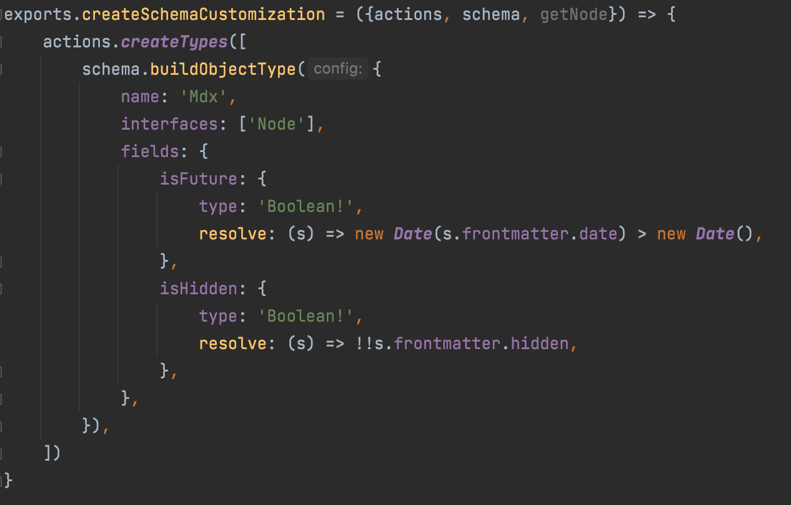

This website has release notes. It's a thing I do.

## How to read a version

A version comprises three numbers: major.minor.patch

* *Major*: used for big updates. Not necessarily breaking changes, but something that you should notice. A redesign. A new section, maybe.
* *Minor*: new features of medium importance
* *Patch*: bug fixes or minor improvements

## Version 2.1.0 - Swipe support
* Now you can swipe the Netflix content on mobile

## Version 2.0.0 - Netflix layout!

More information [here](/netflix)

## Version 1.5.0 - Poll system and reaction!
* Backend support for the win! We have a custom reaction component and...

* A component for polls

## Version 1.4.0 - View counter!
* Implemented a view counter via Firebase real time database

## Version 1.3.0 - Unlisted posts
* Blog post links no longer open in a new tab. That was more annoying than not
* Now posts can be unlisted from the main blog entries page. But they are still there

## Version 1.2.0 - Post scheduling
* Social share buttons! They are only visible in desktop mode, as from mobile you know your way around sharing posts. Also, there isn't enough real estate
* Possibility of publishing posts dated in the future that won't be shown until they reach publication date! This is possible thanks to the following:

## Version 1.1.0 - Hiding navbar!
* The navbar now hides when you scroll down for more than 100 pixels. Shows up again when you scroll up
* The 404 page is now working, albeit minimalistic AF
* Added link to more posts at the end of each post
* The YouTube embed component is now responsive, thanks to this [tutorial](https://avexdesigns.com/blog/responsive-youtube-embed)
* **Fixed** Giovannozzi bug in the social container when displayed on a shitty phone

## Version 1.0.0 - le comments!

I'd say we reached the first milestone thanks to Disqus comments being integrated in the blog posts!

And all it took was basically adding this piece of code.

I'm not crazy about the emoji reactions: too big, too dumb. So I'm thinking about reimplementing them on my own.